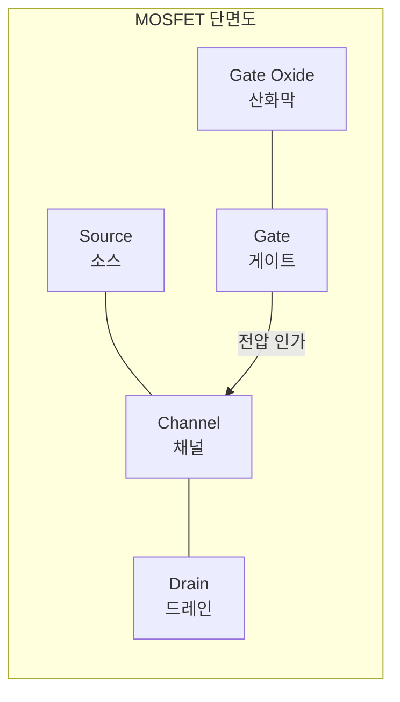
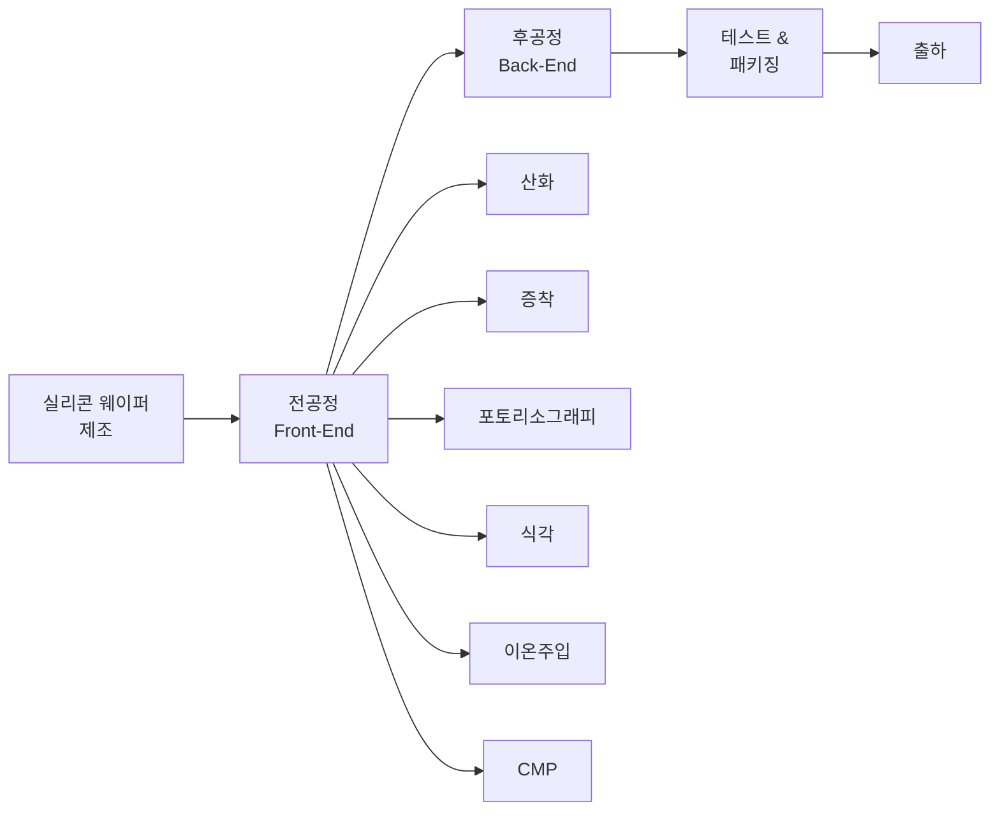

# 1.1 반도체란 무엇인가 — 트랜지스터에서 칩까지

## 이 챕터에서 배우는 것
- 반도체(Semiconductor)의 물리적 정의와 왜 그것이 중요한지
- 트랜지스터(Transistor)가 하는 일 — 디지털 세계의 최소 단위
- 트랜지스터에서 집적회로(IC), 그리고 완성된 칩까지의 여정
- CS/AI 엔지니어가 이 도메인을 이해해야 하는 이유

---

## 반도체란 무엇인가

"반도체"라는 단어를 처음 들었을 때 대부분의 CS 엔지니어는 "아, 칩 만드는 거"라고 생각한다. 틀린 건 아니지만, 정확하지도 않다. **반도체(Semiconductor)**는 말 그대로 **"반쯤 전기가 통하는 물질"**이다.

세상의 물질은 전기가 잘 통하는 **도체(Conductor)** — 구리, 알루미늄 같은 금속 — 와 전기가 안 통하는 **부도체(Insulator)** — 유리, 고무 — 로 나뉜다. 반도체는 그 사이에 있다. 순수한 실리콘(Silicon, Si)은 상온에서 거의 전기가 안 통하지만, 여기에 불순물을 조금 넣으면(이것을 **도핑, Doping**이라 한다) 전기를 흘릴 수도, 막을 수도 있게 된다.

프로그래머에게 익숙한 비유를 들자면, 반도체는 일종의 **하드웨어 레벨의 if문**이다. 조건(전압)에 따라 전류가 흐르거나(True) 흐르지 않거나(False). 이 단순한 스위칭이 모든 디지털 컴퓨팅의 기반이다.

### 왜 실리콘인가

주기율표에서 14족에 속하는 실리콘은 지구 지각에서 산소 다음으로 풍부한 원소다. 모래(SiO₂)에서 추출할 수 있으니 원료 걱정이 없다. 게르마늄(Germanium)이나 갈륨비소(GaAs) 같은 대체 재료도 있지만, 실리콘은 **안정적인 산화막(SiO₂)**을 자연스럽게 형성한다는 결정적 장점이 있다. 이 산화막이 나중에 트랜지스터의 절연체(게이트 산화막) 역할을 하기 때문에, 실리콘은 반도체 산업의 절대적 주인공이 되었다.

---

## 트랜지스터: 0과 1을 만드는 스위치

CS 전공자라면 논리 게이트(AND, OR, NOT)부터 배웠을 것이다. 그 논리 게이트를 물리적으로 구현하는 것이 바로 **트랜지스터(Transistor)**다.

### MOSFET의 구조

![[mosfet_cross_section.svg|MOSFET 단면 구조도]]

현대 반도체에서 사용하는 트랜지스터는 대부분 **MOSFET (Metal-Oxide-Semiconductor Field-Effect Transistor)**이다. 구조는 놀라울 정도로 단순하다:

- **소스(Source)**: 전류가 들어오는 곳
- **드레인(Drain)**: 전류가 나가는 곳
- **게이트(Gate)**: 전류의 흐름을 제어하는 "스위치"
- **채널(Channel)**: 소스와 드레인 사이에서 전류가 흐르는 통로
- **게이트 산화막(Gate Oxide)**: 게이트와 채널을 절연시키는 얇은 막

게이트에 전압을 걸면 채널에 전자가 모여들어 전류가 흐른다(ON = 1). 전압을 빼면 전류가 끊긴다(OFF = 0). 이것이 전부다. 컴퓨터 과학에서 배운 모든 것 — OS, 네트워크, 딥러닝 — 은 결국 이 스위치 수십억 개가 초당 수십억 번 켜지고 꺼지는 것 위에서 돌아간다.

### N형과 P형

도핑하는 불순물의 종류에 따라 반도체는 두 가지 타입으로 나뉜다:

- **N형(N-type)**: 인(Phosphorus, P)이나 비소(Arsenic, As)를 넣어 **전자(electron)**가 많은 상태. "Negative"의 N.
- **P형(P-type)**: 붕소(Boron, B)를 넣어 전자가 빠진 자리인 **정공(hole)**이 많은 상태. "Positive"의 P.

N형과 P형을 접합(Junction)하면 **다이오드(Diode)**가 되고, 이것을 더 조합하면 트랜지스터가 된다. CMOS(Complementary MOS) 기술은 N형 MOSFET(NMOS)과 P형 MOSFET(PMOS)을 **상보적(Complementary)**으로 조합하여 논리 게이트를 만든다. 이 방식이 전력 소비를 극적으로 줄여주기 때문에, 오늘날 거의 모든 디지털 칩이 CMOS 기반이다.

---

## 트랜지스터에서 칩까지: 집적의 여정

### 집적회로(IC)의 탄생

1958년, 텍사스 인스트루먼트의 잭 킬비(Jack Kilby)가 하나의 반도체 기판 위에 여러 소자를 연결한 **집적회로(Integrated Circuit, IC)**를 만들었다. 그 전까지는 트랜지스터, 저항, 커패시터를 각각 만들어 전선으로 연결했다. 집적회로는 이것을 하나의 칩 위에 "인쇄"하는 혁명이었다.

CS 비유로 설명하면, 개별 부품을 전선으로 연결하는 것은 **마이크로서비스 아키텍처에서 각 서비스를 네트워크로 연결하는 것**과 비슷하다. 집적회로는 이것을 **모놀리식(Monolithic) 아키텍처**로 바꾼 것이다 — 모든 것이 하나의 기판 위에서 돌아가니 통신 지연이 줄고, 크기가 작아지고, 신뢰성이 올라갔다.

### 집적도의 폭발적 성장

![[transistor_growth.png|트랜지스터 집적도의 성장]]

| 시기 | 칩 이름 (예시) | 트랜지스터 수 |
|:---|:---|:---|
| 1971 | Intel 4004 (최초 상용 CPU) | 약 2,300개 |
| 1989 | Intel 486 | 약 120만 개 |
| 2006 | Intel Core 2 Duo | 약 2.9억 개 |
| 2020 | Apple M1 | 약 160억 개 |
| 2024 | Apple M4 Max | 약 280억 개 |

50년 만에 트랜지스터 수가 **1,000만 배 이상** 증가했다. 이것이 가능했던 이유는 트랜지스터를 점점 더 작게 만드는 기술 — 바로 **포토리소그래피(Photolithography)** — 이 끊임없이 발전했기 때문이다. 이 핸드북의 핵심 주제다.

### 칩이 완성되기까지

![[silicon_wafer_chip.png|실리콘 웨이퍼와 칩]]

하나의 칩이 완성되려면 수백 개의 공정 단계를 거쳐야 한다. 크게 보면:

이 중에서 **포토리소그래피**는 회로 패턴을 웨이퍼 위에 "찍어내는" 공정으로, 전체 공정 비용의 약 30-35%를 차지하며, 공정 스텝 수로는 전체의 절반 이상을 차지하기도 한다. 최신 5nm급 칩 하나를 만드는 데 필요한 포토리소그래피 스텝은 **80회 이상**이다.

---

## AI 엔지니어에게 이것이 중요한 이유

"나는 소프트웨어 엔지니어인데, 왜 트랜지스터 구조까지 알아야 하지?"

합리적인 질문이다. 답은 이것이다: **반도체 제조 데이터를 다루려면, 그 데이터가 어디서 왜 생성되는지 알아야 한다.**

SMILE 플랫폼이 다루는 데이터는 포토리소그래피 공정에서 나온다. Overlay(층간 정렬 오차), CD(선폭), 결함(Defect) 데이터가 전부 이 공정의 산물이다. 이 데이터의 의미를 이해하지 못하면:

- 피처 엔지니어링에서 **물리적으로 말이 안 되는 조합**을 만들 수 있다
- 이상치(Outlier)가 **진짜 결함인지 측정 노이즈인지** 구분할 수 없다
- 모델이 높은 정확도를 보여도 **현장 엔지니어가 신뢰하지 않는** 결과를 낼 수 있다

도메인 지식은 AI 모델의 성능을 결정하는 것이 아니라, **AI 모델이 현장에서 쓰일 수 있는지 없는지**를 결정한다. 이 핸드북은 그 도메인 지식을 최단 경로로 전달하기 위해 만들었다.

---

## 핵심 정리

- **반도체**: 조건에 따라 전기가 통하기도, 안 통하기도 하는 물질. 하드웨어 레벨의 if문.
- **트랜지스터(MOSFET)**: 게이트 전압으로 ON/OFF를 제어하는 스위치. 모든 디지털 컴퓨팅의 기반.
- **CMOS**: NMOS + PMOS 조합. 저전력 디지털 회로의 표준.
- **집적회로(IC)**: 수십억 개의 트랜지스터를 하나의 칩에 집적한 것.
- **포토리소그래피**: 그 집적을 가능하게 하는 핵심 공정. 이 핸드북의 주인공.

---

*다음 챕터: 1.2 웨이퍼 제조 공정 개요 — 모래에서 실리콘 웨이퍼까지*
