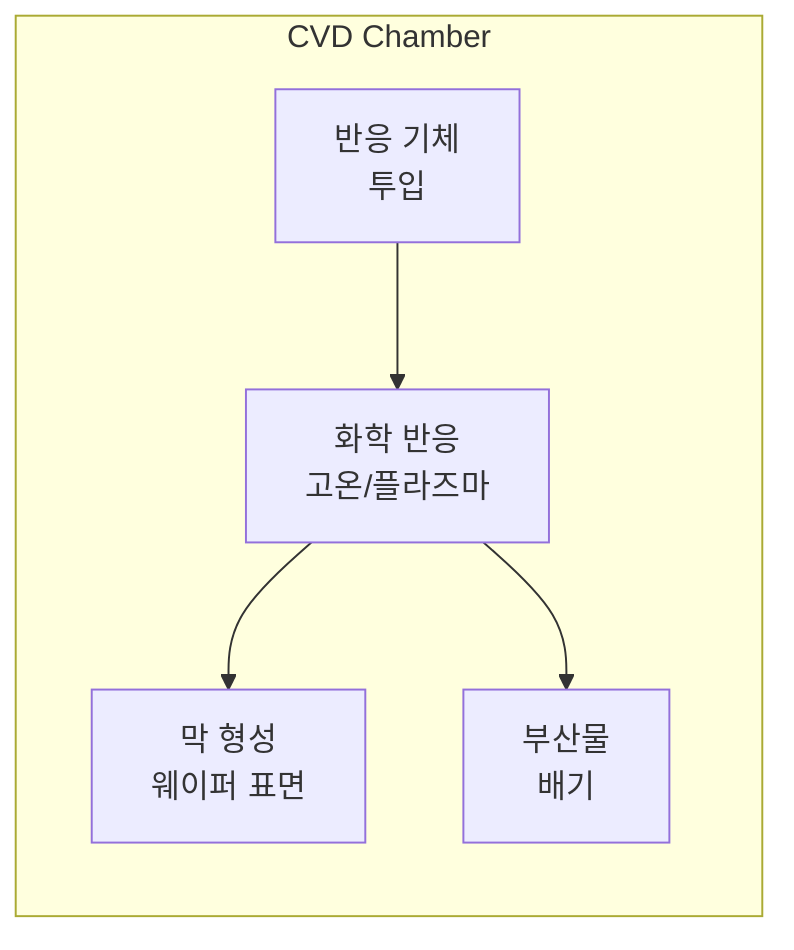
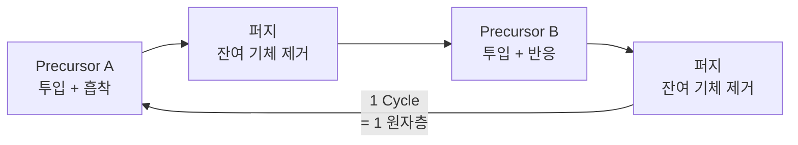

# 1.4 산화(Oxidation)와 증착(Deposition)

## 이 챕터에서 배우는 것
- 산화(Oxidation) 공정의 원리와 종류 — 왜 SiO₂가 그렇게 중요한지
- 증착(Deposition) 공정의 원리와 종류 — CVD, PVD, ALD의 차이
- 막(Film)의 품질을 결정하는 핵심 파라미터
- 각 공정에서 생성되는 데이터와 AI 활용 가능성

---

## 산화 (Oxidation): 실리콘의 천연 갑옷

### 왜 산화막(SiO₂)이 특별한가

이전 챕터에서 실리콘이 반도체의 왕좌를 차지한 이유 중 하나로 "안정적인 산화막"을 언급했다. 이제 그것이 실제로 무엇을 의미하는지 깊이 들어가 보겠다.

실리콘을 공기 중에 놓아두면 표면에 **이산화규소(SiO₂)** 막이 자연스럽게 형성된다. 사과를 잘라 공기 중에 놓으면 갈변하는 것처럼, 실리콘도 산소와 만나면 표면이 "산화"된다. 차이가 있다면, 사과의 갈변은 품질을 떨어뜨리지만 실리콘의 산화막은 **완벽한 절연체**가 된다는 것이다. 이 산화막은 실리콘 격자와의 계면(Interface)이 원자 수준으로 매끈하고, 전기적 결함(Interface Trap)이 극히 적으며, 고온에서도 안정적이다.

갈륨비소(GaAs)나 갈륨나이트라이드(GaN) 같은 다른 반도체 재료에서는 이렇게 깔끔한 산화막이 형성되지 않는다. GaAs를 산화시키면 갈륨 산화물과 비소 산화물이 뒤섞인 불균일한 막이 생기고, 계면 품질이 나빠 트랜지스터의 성능이 저하된다. 반도체 역사에서 실리콘이 수십 년간 독주할 수 있었던 것은 단순히 원료가 풍부해서가 아니라, **이 SiO₂라는 자연의 선물** 덕분이다.

산화막은 칩 안에서 여러 역할을 수행한다. 가장 핵심적인 것은 **게이트 산화막**이다. 1.1장에서 배운 MOSFET 구조를 떠올려 보자 — 게이트와 채널 사이에 있는 얇은 절연막이 바로 이것이다. 두께가 불과 1~2nm(원자 4~8개 층)인 이 극박막이 게이트의 전기장을 채널에 전달하면서도 전류는 차단한다. 이 막이 없으면 트랜지스터는 "스위치"가 아니라 "전선"이 되어 버린다. 게이트 산화막 외에도 산화막은 트랜지스터 간 전기적 격리(STI, Shallow Trench Isolation)의 충전재, 이후 공정에서 하부 구조를 보호하는 보호막(Passivation), 식각 공정에서 원치 않는 부분을 지키는 하드마스크 등 다양한 역할로 칩 전체에 걸쳐 사용된다.

### 열산화: 느린 것과 빠른 것의 트레이드오프


![[thermal_oxidation_furnace.svg|열산화 퍼니스 단면도]]

산화막을 형성하는 가장 기본적인 방법은 **열산화(Thermal Oxidation)** — 실리콘 웨이퍼를 고온(800~1,200°C)의 산화 분위기에 노출하는 것이다. 산화 분위기에 따라 두 가지로 나뉜다.

**건식 산화(Dry Oxidation)**는 순수한 산소(O₂) 가스를 사용한다.

```
Si + O₂ → SiO₂
```

성장 속도가 느리지만, 형성된 막의 밀도가 높고 절연 특성이 우수하다. 게이트 산화막처럼 **극한의 품질이 요구되는 극박막**에 사용된다. 반면 **습식 산화(Wet Oxidation)**는 수증기(H₂O)를 사용한다.

```
Si + 2H₂O → SiO₂ + 2H₂
```

수분자가 산화막을 훨씬 빠르게 투과하기 때문에 성장 속도가 건식의 5~10배에 달하지만, 막에 수소 결합이 남아 밀도와 절연 특성이 다소 떨어진다. 필드 산화막처럼 **두께가 중요하고 극한 품질은 불필요한** 경우에 사용된다.

여러분이 코드를 작성할 때도 비슷한 트레이드오프를 경험하지 않는가? 최적화에 시간을 들여 완성도 높은 코드를 쓸 것인가, 빠르게 작동하는 프로토타입을 먼저 만들 것인가. 건식 산화는 전자, 습식 산화는 후자에 해당한다. 반도체 공정에서도 **어디에 어떤 품질이 필요한지**에 따라 방법을 선택한다.

### Deal-Grove 모델: 산화막이 스스로의 성장을 방해한다


![[deal_grove_oxidation.png|Deal-Grove 모델: 산화막 성장 곡선]]

산화 공정을 제어하려면 "이 온도에서 이 시간만큼 산화하면 두께가 얼마나 될까?"를 예측할 수 있어야 한다. 1965년 Bruce Deal과 Andrew Grove(인텔의 공동 창업자이자 전설적 CEO인 바로 그 앤디 그로브다)가 제안한 **Deal-Grove 모델**이 이 예측을 가능하게 한다.

```
x² + Ax = B(t + τ)
```

여기서 x는 산화막 두께, t는 산화 시간, A와 B는 온도와 산화 방식(건식/습식)에 따른 상수, τ는 초기 산화막 보정값이다. 이 방정식이 말해주는 핵심 통찰은 이것이다 — **산화막이 두꺼워질수록 성장 속도가 느려진다.** 왜냐하면 산소 분자가 이미 형성된 산화막을 "뚫고" 지나가야 아래의 실리콘에 도달할 수 있기 때문이다. 산화막이 얇을 때는 산소가 쉽게 통과하여 선형(Linear)으로 빠르게 성장하지만, 두꺼워질수록 확산 거리가 길어져 포물선(Parabolic)으로 느려진다.

이것은 마치 눈이 쌓이는 것과 비슷하다. 처음에는 지면에 빠르게 쌓이지만, 눈이 쌓일수록 위에서 내리는 눈이 아래까지 도달하는 데 방해를 받는다 — 물론 물리적 메커니즘은 다르지만, "자기 자신이 성장을 억제한다"는 패턴은 동일하다.

AI 관점에서 Deal-Grove 모델은 **물리 기반 피처(Physics-informed Feature)**의 교과서적 사례다. 산화 시간과 온도를 순수한 데이터 기반 모델에 넣는 것보다, Deal-Grove 모델의 예측값을 피처로 추가하면 VM(Virtual Metrology) 모델의 정확도가 올라간다. 모델이 물리 법칙을 "처음부터 다시 학습"할 필요 없이, 이미 검증된 물리적 관계를 입력으로 받으니 더 효율적으로 학습하는 것이다.

---

## 증착 (Deposition): 세상 모든 막을 쌓는 기술

산화는 실리콘 자체를 산화시키는 — 실리콘을 "소모"하면서 막을 만드는 — 과정이다. 하지만 칩에는 SiO₂ 외에도 질화막(Si₃N₄), 텅스텐(W), 구리(Cu), 알루미늄(Al), High-K 유전체(HfO₂), 폴리실리콘 등 수십 가지 재료가 필요하다. 이 재료들을 **외부에서 가져와 웨이퍼 위에 정밀하게 쌓는** 것이 증착(Deposition)이다.

증착 기술은 크게 세 가지로 나뉘며, 각각 고유한 물리적 원리와 적용 영역을 갖는다.

### CVD (Chemical Vapor Deposition): 가장 범용적인 방법

CVD는 **기체 상태의 원료(Precursor)**를 반응 챔버에 넣고 화학 반응을 일으켜 웨이퍼 표면에 막을 형성하는 방법이다. 반도체 증착의 워크호스(workhorse)라 할 수 있다.



CVD에도 여러 변형이 있는데, 핵심적인 차이는 **에너지 공급 방식**이다. **LPCVD(Low Pressure CVD)**는 저압 환경에서 열에너지만으로 반응을 일으킨다. 반응이 균일하게 일어나므로 막의 두께 균일도가 우수하고, 폴리실리콘이나 질화막(Si₃N₄) 증착에 주로 쓰인다. 단점은 반응 온도가 높다는 것이다(600~800°C). **PECVD(Plasma Enhanced CVD)**는 플라즈마의 에너지를 빌려 반응 온도를 200~400°C로 대폭 낮춘다. 왜 온도를 낮춰야 하냐면, 금속 배선이 이미 형성된 후공정(BEOL) 단계에서는 고온이 금속을 손상시키기 때문이다. PECVD가 없으면 다층 배선 위에 보호막을 씌울 수 없다. **HDPCVD(High Density Plasma CVD)**는 높은 밀도의 플라즈마를 사용하여 좁은 틈(Gap)을 빈틈없이 채우는 데 특화되어 있다.

### PVD (Physical Vapor Deposition): 물리적으로 때려서 붙이다

PVD는 화학 반응 없이 **순수한 물리적 방법**으로 막을 형성한다. 가장 대표적인 방식이 **스퍼터링(Sputtering)**이다. 아르곤(Ar) 같은 비활성 기체를 이온화하여 고에너지로 가속한 뒤, **타겟(Target)**이라 불리는 원하는 재료(티타늄, 알루미늄, 구리 등)의 덩어리에 충돌시킨다. 충돌의 운동 에너지로 타겟 표면에서 원자가 튕겨져 나오고, 이 원자들이 맞은편 웨이퍼 표면에 날아가 달라붙는다. 당구에서 큐볼(Ar 이온)이 타겟 공(금속 원자)을 쳐서 원하는 위치(웨이퍼)로 보내는 것과 같은 원리다.

PVD는 주로 금속막 증착에 사용된다. 구리 배선의 씨앗층(Seed Layer), 접착층(Adhesion Layer)인 티타늄(Ti)이나 티타늄 질화물(TiN), 알루미늄 배선 등이 대표적이다. CVD와 비교하면 스텝 커버리지(Step Coverage) — 단차가 있는 곳에서의 피복 균일성 — 가 떨어지지만, 고순도 금속막을 빠르게 증착할 수 있다는 강점이 있다.

### ALD (Atomic Layer Deposition): 한 층씩, 원자의 세계에서


![[ald_vs_cvd_conformality.svg|ALD Conformal vs CVD Non-conformal 비교]]

ALD는 반도체 증착 기술의 **게임 체인저**다. 이 기술이 없었다면 20nm 이하의 미세 공정은 불가능했을 것이다.



ALD의 핵심은 **자기 제한 반응(Self-limiting Reaction)**이다. 원료 A를 챔버에 넣으면, 웨이퍼 표면에 정확히 **한 층(monolayer)**만 흡착되고 더 이상 반응하지 않는다. 이미 점유된 자리에는 새로운 분자가 앉을 수 없기 때문이다. 잔여 기체를 퍼지(purge)로 날린 후 원료 B를 넣으면, B가 흡착된 A와 반응하여 원하는 막을 형성한다. 이 사이클 한 번에 약 **0.1nm(1Å)** — 원자 하나 높이 — 만큼의 막이 쌓인다.

이 메커니즘이 왜 혁명적인지 생각해 보자. CVD나 PVD는 증착 시간이 길어지면 막이 계속 두꺼워진다. 기체 유량, 온도, 시간을 정밀하게 제어해야 원하는 두께를 맞출 수 있고, 균일도는 반응 조건의 공간적 변동에 좌우된다. 반면 ALD는 **사이클 수만 세면 두께가 결정된다.** 10nm 막이 필요하면 100사이클, 5nm면 50사이클. 오버플로우도, 언더플로우도 없다. 프로그래밍에서 **Iterator 패턴**이 정확히 하나의 원소만 처리하고 다음으로 넘어가는 것처럼, ALD의 각 사이클은 정확히 한 원자층만 처리하고 끝난다.

게다가 자기 제한 반응 덕분에 3D 구조의 모든 표면 — 좁은 홈의 바닥이든, 수직 벽면이든, 돌출부의 윗면이든 — 에 **완벽하게 균일한 두께(Conformal Coating)**로 증착된다. FinFET이나 GAA(Gate-All-Around) 같은 최신 트랜지스터 구조에서 게이트를 3차원으로 감싸야 할 때, 이 특성이 없으면 불가능하다.

ALD의 유일한 단점은 **느리다**는 것이다. 한 사이클에 수 초가 걸리므로 10nm 막 하나 증착하는 데 수십 분이 소요된다. CVD가 같은 두께를 수 분 만에 끝내는 것과 대조적이다. 하지만 최신 공정에서 ALD가 요구되는 곳은 대부분 극박막(수 nm)이므로, 속도 문제는 허용 가능한 범위다.

---

## 막 품질을 결정하는 핵심 파라미터

어떤 증착 방법을 쓰든 최종적으로 중요한 것은 **막(Film)의 품질**이다. 여러분이 수율 분석 모델을 만들 때 타겟 변수가 될 수 있는 것들이므로, 각각이 무엇을 의미하는지 정확히 알아두는 것이 좋다.

가장 기본적인 것은 **두께(Thickness)**다. 목표 두께에서 옹스트롬(Å) 단위로 벗어나면 소자 특성이 달라진다. 엘립소미터(Ellipsometer) — 편광된 빛을 막 표면에 쏘아 반사된 빛의 편광 변화로 두께를 추정하는 장비 — 나 XRR(X-Ray Reflectivity)로 비파괴 측정한다.

두께 못지않게 중요한 것이 **균일도(Uniformity)**다. 웨이퍼 중심부와 가장자리에서 두께가 얼마나 다른지를 나타낸다. 보통 웨이퍼 전면의 49개 또는 그 이상의 포인트를 측정하여 표준편차/평균(%)으로 표현한다. 균일도가 나쁘면 같은 웨이퍼 위의 칩이라도 어떤 것은 정상, 어떤 것은 불량이 된다. 이것은 수율 데이터에서 **웨이퍼 내 수율 변동(Within-Wafer Variation)**이라는 패턴으로 나타나며, 여러분의 AI 모델이 이 패턴을 설명할 수 있는지 없는지가 모델의 실용성을 결정한다.

그 외에도 **응력(Stress)**은 주의 깊게 봐야 할 파라미터다. 증착된 막이 인장(Tensile) 또는 압축(Compressive) 응력을 가지면 웨이퍼 전체가 휘어진다. 1.2장에서 웨이퍼의 휨(Warp)이 포토리소그래피의 Focus에 영향을 준다고 했는데, 그 휨의 상당 부분이 증착 공정의 응력에서 온다. 여러 층의 막이 각각 다른 방향의 응력을 가지면 서로 상쇄될 수도, 누적될 수도 있어서 공정 설계에서 응력 밸런스를 맞추는 것이 중요하다. 막의 화학적 **조성(Composition)**과 **밀도(Density)** 역시 전기적 특성과 직결되는 핵심 품질 지표다.

---

## AI 엔지니어에게 이것이 의미하는 것

산화와 증착 공정은 **Virtual Metrology(VM)**의 가장 대표적인 적용 대상이다. VM의 개념은 간단하다. 장비 센서 데이터(입력)만으로 계측 결과(출력 — 두께, 균일도 등)를 예측하는 것이다.

왜 이것이 필요한가? 계측은 시간이 오래 걸린다. 웨이퍼 한 장의 두께를 49포인트 측정하는 데 수 분이 소요되고, 그 동안 장비가 점유된다. 양산에서 모든 웨이퍼를 전수 측정하면 생산 속도가 크게 떨어진다. 현실적으로는 로트(Lot, 보통 25장) 중 몇 장만 샘플링하여 측정한다. VM은 측정하지 않은 웨이퍼의 품질을 센서 데이터로 **추정**하여, 샘플링 비율을 줄이면서도 품질 감시를 유지할 수 있게 해 준다.

증착 장비 한 대에 달린 센서는 수백 개다. 챔버 온도, 압력, 가스 유량, RF 파워, 진공도, 기판 회전 속도 등이 초당 수십~수백 회 기록된다. 이 시계열 데이터에서 **점진적 변화(Drift)**를 감지하면 장비가 고장나기 전에 예방 정비(Predictive Maintenance)를 수행할 수도 있다. 예를 들어, 챔버 벽면에 부산물이 쌓이면서 열 전달 특성이 서서히 바뀌면, 증착 두께가 조금씩 목표에서 벗어나기 시작한다. 이 트렌드를 센서 데이터에서 조기에 포착하면, 웨이퍼가 불량으로 나오기 전에 챔버를 클리닝할 수 있다.

여러분이 이 공정의 물리를 이해하고 있으면, 수백 개의 센서 변수 중 어떤 것이 두께와 인과적 관계가 있는지를 사전에 좁힐 수 있다. 블라인드 피처 셀렉션으로 상관관계만 찾는 것과, 물리적 인과 관계를 아는 상태에서 검증하는 것은 — 결과가 같더라도 — 모델의 **해석 가능성과 현장 신뢰도**에서 하늘과 땅 차이다.

---

## 핵심 정리

산화와 증착은 웨이퍼 위에 **막(Film)**을 형성하는 공정이다. 산화는 실리콘 자체를 SiO₂로 변환하는 과정으로, 건식(고품질/저속)과 습식(저품질/고속) 두 가지 방식이 있으며, Deal-Grove 모델로 성장 거동을 예측한다. 증착은 외부 재료를 가져와 쌓는 과정으로, CVD(화학 반응, 가장 범용), PVD(물리적 충격, 금속막), ALD(원자층 단위, 극박막 정밀 제어) 세 가지 방법이 핵심이다. 특히 ALD는 자기 제한 반응과 완벽한 피복성으로 FinFET/GAA 시대의 필수 기술이 되었다. AI 관점에서 이 공정들은 VM(Virtual Metrology)의 대표적 적용 대상이며, 센서 데이터 기반의 두께 예측, 이상 탐지, 예방 정비가 핵심 활용 사례다.

---

*다음 챕터: 1.5 식각(Etching)과 세정(Cleaning)*
