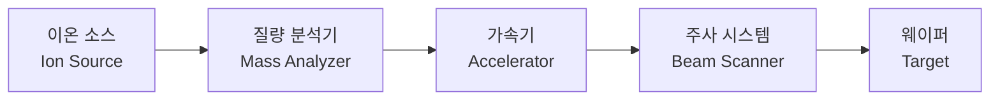

# 1.6 이온 주입(Ion Implantation)과 확산(Diffusion)

## 이 챕터에서 배우는 것
- 이온 주입(Ion Implantation)의 원리 — 왜 불순물을 "쏘아 박는지"
- 주입 에너지와 도즈(Dose)가 트랜지스터 특성에 미치는 영향
- 확산(Diffusion)과 어닐링(Annealing) — 주입 후 왜 열처리가 필요한지
- 채널링(Channeling) 효과와 대책
- AI 관점에서의 이온 주입 데이터 활용

---

## 이온 주입: 원자 총으로 반도체를 개조하다


![[doping_profile_energy.png|이온 주입 에너지별 도핑 프로파일]]

1.1장에서 반도체의 핵심이 **도핑(Doping)** — 순수한 실리콘에 불순물을 넣어 전기적 성질을 바꾸는 것 — 이라고 설명했다. N형으로 만들려면 인(P)이나 비소(As)를, P형으로 만들려면 붕소(B)를 넣는다. 이온 주입(Ion Implantation)은 이 도핑을 **가장 정밀하게** 수행하는 현대 기술이다.

원리는 직관적이다. 원하는 불순물 원자에서 전자를 떼어내 양이온으로 만들고(이온화), 전기장으로 원하는 에너지까지 가속한 뒤, 웨이퍼 표면에 쏘아 박는다. 말 그대로 **원자 총(Atomic Gun)**이다.

이온 주입이 없던 시절에는 고온 가스 속에 웨이퍼를 넣어 불순물을 자연스럽게 스며들게 하는 열확산(Thermal Diffusion) 방식을 사용했다. 하지만 열확산은 불순물이 사방으로 퍼지기 때문에 깊이와 농도를 정밀하게 제어하기 어려웠다. 여러분이 코드를 작성할 때로 비유하면, 열확산은 전역 변수를 선언하는 것과 같고, 이온 주입은 **특정 메모리 주소에 특정 값을 직접 쓰는 것**과 같다. 어디에 얼마나 넣을지를 프로그래머가(엔지니어가) 완벽히 통제할 수 있다.

### 이온 주입기: 소형 입자 가속기

이온 주입기의 구조는 CERN의 입자 가속기를 소형화한 것이라 해도 과언이 아니다. 실제로 동작 원리가 같다.



먼저 **이온 소스**에서 기체 상태의 원료(BF₃, PH₃, AsH₃ 등)에 전자를 충돌시켜 이온을 생성한다. 문제는 이 과정에서 원하는 이온만 깨끗하게 나오지 않는다는 것이다. BF₃를 이온화하면 B⁺, BF⁺, BF₂⁺, F⁺ 등 다양한 이온 종(Species)이 뒤섞여 나온다. 여기서 원하는 이온만 골라내는 것이 **질량 분석기**의 역할이다. 이온들을 자기장 속에 통과시키면, 질량/전하 비(m/q)에 따라 궤적이 달라진다 — 가벼운 이온은 크게 휘고, 무거운 이온은 적게 휜다. 원하는 이온의 궤적에 맞춰 슬릿(Slit)을 배치하면 나머지는 걸러진다. 이것은 본질적으로 **필터링** 연산이다.

선별된 이온은 **가속기**에서 전기장에 의해 원하는 에너지(수 keV~수 MeV)까지 가속된다. 가속된 이온 빔은 **주사 시스템**이 웨이퍼 전체에 균일하게 스캔하면서 표면에 박아넣는다. 프린터의 헤드가 종이 위를 왕복하며 잉크를 뿌리는 것처럼, 이온 빔이 웨이퍼 위를 훑으면서 불순물을 심는 것이다.

### 두 가지 핵심 파라미터: 깊이와 농도

이온 주입에서 엔지니어가 제어하는 것은 본질적으로 단 두 가지다. 이 두 파라미터의 조합이 트랜지스터의 전기적 성격을 결정한다.

첫째는 **에너지(Energy)** — "얼마나 깊이 박을 것인가"를 결정한다. 단위는 keV(킬로전자볼트)다. 에너지가 높을수록 이온이 실리콘 격자를 더 많이 관통하여 깊이 들어간다. 수 keV의 낮은 에너지로 주입하면 표면에서 불과 수 nm 깊이에 머물러 **초미세 접합(Ultra-shallow Junction)**을 만들 수 있고, 수백 keV에서 MeV 급의 높은 에너지로 주입하면 수 μm 깊이의 **웰(Well)** — 트랜지스터를 감싸는 넓은 도핑 영역 — 을 형성할 수 있다. 최신 공정에서 소스/드레인 접합 깊이는 10nm 이하를 목표로 하는데, 이것은 에너지를 극도로 낮게(수백 eV~수 keV) 유지하면서도 충분한 도즈를 주입해야 하는 모순적 요구여서 상당한 기술적 도전이다.

둘째는 **도즈(Dose)** — "얼마나 많이 박을 것인가"를 결정한다. 단위는 ions/cm²이며, 단위 면적당 주입되는 총 이온 수를 나타낸다. 10¹¹~10¹³ ions/cm²의 저농도 주입은 채널 도핑이나 임계전압(Vt) 미세 조정에 사용된다. 10¹⁴~10¹⁶ ions/cm²의 고농도 주입은 소스(Source)와 드레인(Drain) — 트랜지스터의 입구와 출구 — 을 형성하여 전류가 잘 흐르도록 만든다.

이 두 파라미터의 조합이 트랜지스터의 **임계전압(Threshold Voltage, Vt)**, **누설 전류(Leakage Current)**, **구동 전류(Drive Current)** 등 핵심 전기적 특성을 결정한다. 프로그래밍에서 함수의 인자(parameter) 두 개를 바꾸면 함수의 동작이 완전히 달라지듯, 에너지와 도즈를 바꾸면 같은 구조의 트랜지스터가 전혀 다른 전기적 성격을 갖게 된다.

### 주요 도핑 원소

| 원소 | 타입 | 용도 | 특징 |
|:---|:---|:---|:---|
| 붕소 (B) | P형 | PMOS S/D, P-well | 가벼워서 채널링 주의 |
| 인 (P) | N형 | N-well, 저농도 N형 | 확산 속도 빠름 |
| 비소 (As) | N형 | NMOS S/D | 무거워서 얕은 접합에 유리 |
| BF₂ | P형 | 초미세 P형 접합 | B보다 무거워 얕은 주입 가능 |

여기서 흥미로운 점이 있다. 같은 P형 도핑이라도 붕소(B)와 BF₂를 구분해서 사용하는 이유는 **질량** 때문이다. 붕소 원자(질량 11)는 가벼워서 같은 에너지에서 실리콘 격자를 깊이 관통하고, BF₂(질량 49)는 무거워서 표면 가까이에 머문다. 초미세 접합을 만들 때는 가벼운 붕소로는 에너지를 아무리 낮춰도 원하는 만큼 얕게 주입하기 어려운 경우가 있어서, 의도적으로 무거운 BF₂를 사용하여 같은 에너지에서 더 얕은 주입을 달성한다. 비소(As, 질량 75)가 NMOS 소스/드레인에 선호되는 것도 같은 이유다 — 무거우니까 얕게, 정밀하게 박을 수 있다.

---

## 채널링 (Channeling): 결정의 통로를 타고 깊이 파고드는 이온


![[channeling_effect.svg|채널링 현상 단면도]]

실리콘 단결정은 원자가 규칙적인 격자(Lattice)로 배열되어 있다. 이 격자를 특정 방향에서 들여다보면, 원자들 사이에 원자가 거의 없는 "빈 통로"가 보인다. 이온이 이 통로를 정면으로 향하게 되면, 격자 원자와의 충돌 없이 **예상보다 훨씬 깊이** 침투하는 현상이 발생한다. 이것이 **채널링(Channeling)**이다.

숲에 공을 던지는 것을 상상해 보자. 나무가 무작위로 심어진 숲에 공을 던지면 금방 나무에 부딪힌다. 하지만 가로수길 — 나무가 일렬로 정렬된 길 — 방향으로 던지면 나무 사이로 훨씬 멀리 날아간다. 채널링은 이와 같은 현상이 원자 수준에서 일어나는 것이다.

채널링이 왜 문제인가? 이온 주입의 핵심 가치가 "원하는 깊이에 원하는 만큼 넣는 정밀 제어"인데, 일부 이온이 채널링으로 예상보다 깊이 들어가면 그 정밀도가 무너진다. 접합 깊이(Junction Depth)가 설계보다 깊어지면 트랜지스터의 단채널 효과(Short Channel Effect)가 심해지고, 최악의 경우 인접 트랜지스터와 간섭이 발생한다.

대책은 여러 가지가 있다. 가장 일반적인 방법은 **틸트(Tilt) 주입**이다. 웨이퍼를 결정축에서 약 7° 정도 기울여서, 이온이 격자 통로를 정면으로 보지 못하게 한다. 비스듬히 들어오는 이온은 곧바로 격자 원자와 충돌하기 시작하므로 채널링이 억제된다. 또 다른 방법은 **사전 비정질화(Pre-Amorphization Implant, PAI)**다. 본 주입 전에 Si나 Ge 이온을 먼저 주입하여 표면 결정을 의도적으로 깨뜨려 놓으면, 이후 주입되는 불순물 이온이 "통로"를 찾을 수 없다. 얇은 산화막(스크린 산화막)을 통해 주입하여 이온의 방향을 무작위화하는 방법도 있다.

---

## 확산과 어닐링: 주입 후에 반드시 거쳐야 하는 과정


![[anneal_lattice_recovery.svg|어닐링 전후 격자 구조 비교]]

### 왜 열처리가 필요한가

이온 주입이 끝난 직후의 실리콘은 전쟁터와 같은 상태다. 두 가지 심각한 문제가 남아 있다.

첫째, **격자 손상**이다. 수 keV~MeV의 에너지로 가속된 이온이 실리콘 격자에 충돌하면서, 충돌 경로를 따라 수많은 격자 원자를 제자리에서 밀어낸다(Knock-on). 고농도 주입 후에는 표면 근처의 결정 구조가 완전히 파괴되어 **비정질(Amorphous)** 상태가 되기도 한다. 이 상태의 실리콘은 전기적으로 쓸 수 없다 — 결정 구조가 파괴되면 전자가 격자를 따라 깔끔하게 이동할 수 없기 때문이다.

둘째, **불순물의 비활성화**다. 주입된 불순물 원자가 전기적으로 기능하려면 실리콘 격자의 **치환 자리(Substitutional Site)** — 정상적인 실리콘 원자가 있어야 할 위치 — 에 앉아야 한다. 하지만 이온 주입 직후에는 상당수가 격자 사이의 빈 공간(Interstitial Site)에 끼어 있어 전기적으로 기여하지 못한다.

**어닐링(Annealing)**은 이 두 문제를 동시에 해결한다. 고온의 열에너지가 원자들에게 운동 에너지를 주고, 격자 원자들은 원래의 규칙적 위치로 돌아가면서 결정 구조가 복구된다(재결정화). 동시에 불순물 원자들도 격자의 치환 자리로 이동하면서 전기적으로 활성화된다.

### 어닐링 기술의 진화: 더 뜨겁게, 더 짧게

어닐링 기술의 역사는 흥미로운 최적화 이야기다. 풀어야 할 과제는 이것이다 — **격자를 복구하고 불순물을 활성화할 만큼 충분한 에너지를 주되, 불순물이 퍼지는(확산) 것은 최소화해야 한다.** 확산은 온도와 시간의 함수이므로, "더 높은 온도에서 더 짧은 시간"이라는 방향으로 기술이 진화해 왔다.

초기에는 **퍼니스 어닐링(Furnace Annealing)** — 800~1,000°C의 로(爐)에 웨이퍼를 넣고 30분에서 수 시간 가열 — 을 사용했다. 충분히 활성화는 되지만 불순물이 심하게 확산되어, 설계보다 넓고 깊은 접합이 형성된다. 미세 공정에서는 용납될 수 없다.

**RTA(Rapid Thermal Annealing)**는 할로겐 램프로 웨이퍼를 초당 수십~수백 °C 속도로 급가열하여 900~1,100°C에서 수 초~수십 초만 유지한 뒤 빠르게 냉각한다. 확산을 퍼니스 대비 수십 배 줄일 수 있어, 1990년대 이후 주류 기술이 되었다.

그래도 부족하다. 10nm 이하 접합을 만들려면 초 단위조차 너무 길다. **레이저 어닐링(Laser Annealing)**은 레이저로 웨이퍼 표면만을 나노초(ns)~마이크로초(μs) 동안 실리콘의 녹는점 직전까지 가열한다. 극표면만 초고온에 노출되고 벌크(Bulk)는 차가운 상태를 유지하므로, 확산이 사실상 0에 가깝다. **플래시 어닐링(Flash Annealing)**은 거대한 제논(Xe) 플래시 램프를 밀리초 단위로 점화하여 비슷한 효과를 달성한다.

이 진화 과정은 일종의 **최적화 문제의 역사**다. 목적 함수(활성화율 최대화)와 제약 조건(확산 최소화) 사이의 파레토 최적을 찾기 위해, 에너지 전달의 시간적·공간적 정밀도를 극한까지 끌어올린 것이다.

### 확산: 농도 기울기가 만드는 자연스러운 흐름

어닐링 과정에서 불가피하게 발생하는 것이 **확산(Diffusion)**이다. 불순물 원자는 열에너지를 받으면 농도가 높은 곳에서 낮은 곳으로 자연스럽게 이동하려 한다. 이것은 물리학의 기본 법칙 중 하나인 **피크의 법칙(Fick's Law)**으로 기술된다.

```
J = -D × (dC/dx)
```

여기서 J는 확산 플럭스(단위 시간·단위 면적당 이동하는 원자 수), D는 확산 계수(온도에 지수적으로 의존), dC/dx는 농도 기울기다. 확산 계수 D는 온도가 올라갈수록 지수적으로 증가하므로, 온도가 높을수록, 시간이 길수록 확산이 많이 일어난다. 앞서 어닐링 시간을 극도로 줄여야 하는 이유가 바로 이것이다.

CS/AI 분야에서 일하는 여러분에게 흥미로운 연결 고리가 있다. 피크의 확산 방정식과 **열 방정식(Heat Equation)**은 수학적으로 동일한 형태의 편미분 방정식이다. 그리고 최근 이미지 생성 분야를 석권한 **Diffusion Model**이 바로 이 물리 현상에서 이름을 따왔다. 이미지에 노이즈를 점진적으로 추가하는 과정(Forward Diffusion)을 학습한 뒤 역방향으로 노이즈를 제거하여 이미지를 생성하는 것 — 물리학의 확산과 그 역과정이 AI의 핵심 아키텍처가 된 것이다.

---

## AI 엔지니어에게 이것이 의미하는 것

이온 주입 공정은 AI 관점에서 특별한 위치를 차지한다. **트랜지스터의 전기적 특성을 직접 결정하는 공정**이기 때문이다.

입력 데이터는 풍부하다. 이온 종류, 에너지, 도즈, 틸트/트위스트 각도가 공정 레시피(Recipe)에서 오고, 장비 센서에서는 빔 전류(Beam Current), 도즈 모니터링(패러데이 컵), 웨이퍼 온도, 빔 균일도가 실시간으로 기록된다. 결과 측으로는 **시트 저항(Sheet Resistance, Rs)** — 4-점 프로브로 측정하는 면저항 — 이 대표적이며, 이 값이 곧 도핑 농도와 접합 깊이의 함수다.

AI 활용 시나리오는 여러 가지다. 주입 조건과 어닐링 조건으로부터 시트 저항을 예측하는 **VM(Virtual Metrology)**이 가능하다. 빔 전류가 시간에 따라 드리프트하거나 도즈 분포가 불균일해지는 것을 감지하는 **이상 탐지(Anomaly Detection)**도 적용할 수 있다. 더 나아가, 이온 주입 조건이 최종 트랜지스터의 임계전압(Vt)에 미치는 영향을 모델링하면 **설계-공정 연결(Design-Process Link)**의 핵심 피처가 된다.

한 가지 현장에서 중요한 점을 짚자면, 이온 주입 파라미터는 AI 모델의 **피처 중요도(Feature Importance)** 분석에서 높은 순위를 차지하는 경우가 많다. SHAP 분석에서 "Vt 예측에 가장 큰 영향을 미치는 피처가 이온 주입 도즈"라는 결과가 나오면, 현장 엔지니어는 즉각 납득한다. 왜냐하면 도즈가 도핑 농도를 직접 결정하고, 도핑 농도가 Vt를 직접 결정한다는 물리적 인과 관계가 명확하기 때문이다. 이런 "설명 가능한 결과"가 AI 모델을 현장에 도입하는 데 있어 가장 강력한 신뢰의 근거가 된다.

---

## 핵심 정리

이온 주입은 불순물 이온을 가속하여 웨이퍼의 원하는 깊이에 원하는 농도로 박아넣는 도핑 기술이다. **에너지**로 주입 깊이를, **도즈**로 주입량을 제어하며, 이 두 파라미터의 조합이 트랜지스터의 전기적 특성을 결정한다. 결정 격자의 빈 통로를 타고 이온이 깊이 침투하는 **채널링** 현상은 틸트 주입이나 사전 비정질화로 방지한다. 주입 후에는 반드시 **어닐링(열처리)**으로 격자 손상을 복구하고 불순물을 활성화해야 하며, 어닐링 기술은 확산을 최소화하기 위해 퍼니스 → RTA → 레이저/플래시로 "더 뜨겁게, 더 짧게"의 방향으로 진화해 왔다. AI 관점에서 이온 주입은 전기적 특성에 직접적 인과 관계를 갖는 몇 안 되는 공정이므로, 피처 중요도가 높고 모델의 설명력과 현장 신뢰도를 동시에 확보할 수 있는 전략적 데이터 소스다.

---

*다음 챕터: 1.7 CMP와 금속 배선(Metallization)*
