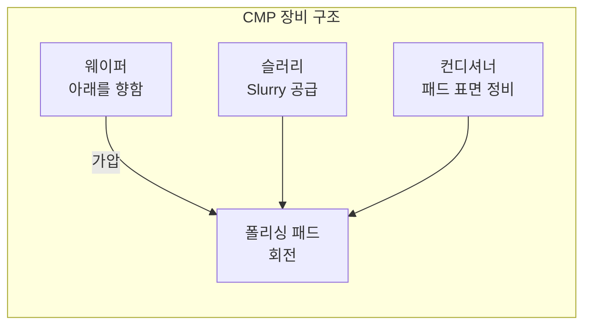
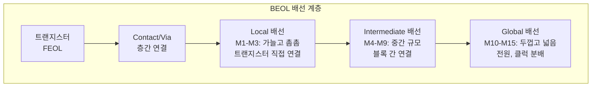

# 1.7 CMP와 금속 배선(Metallization)

## 이 챕터에서 배우는 것
- CMP(Chemical Mechanical Planarization)의 원리 — 왜 평탄화가 필수인지
- 구리 배선(Cu Metallization)의 다마신(Damascene) 공정
- 금속 배선 구조(BEOL)의 계층적 설계
- RC 지연 문제와 Low-k 유전체
- AI 관점에서의 CMP/배선 데이터 활용

---

## CMP: 다층 구조를 가능하게 하는 숨은 공신

### 왜 평탄화 없이는 칩을 만들 수 없는가

반도체 칩은 수십 층을 쌓아 올린 3차원 구조물이다. 각 층에서 트랜지스터를 만들고 배선을 깔면, 어떤 곳은 구조물이 솟아 있고 어떤 곳은 비어 있어서 **단차(Step Height)**가 생긴다. 이 울퉁불퉁한 표면을 그대로 두고 다음 층을 쌓으면 세 가지 치명적 문제가 발생한다.

첫째, **포토리소그래피가 실패한다.** 이전 챕터들에서 반복적으로 언급했듯, 최신 노광 장비의 초점 깊이(DOF, Depth of Focus)는 수백 nm에 불과하다. 표면 높낮이 차이가 이 범위를 넘어가면 일부 영역에서 초점이 맞지 않아 패턴이 흐려지거나 아예 형성되지 않는다. 둘째, **증착 균일도가 나빠진다.** 울퉁불퉁한 위에 막을 쌓으면 높은 곳과 낮은 곳에서 두께가 달라져, 같은 웨이퍼 위의 소자들이 서로 다른 전기적 특성을 갖게 된다. 셋째, **금속 배선이 끊어질 수 있다.** 급격한 단차를 넘어가는 배선은 모서리에서 얇아지거나 단선(Open)되기 쉽다.

요약하면, CMP 없이는 두 번째 층부터 정상적으로 공정을 진행할 수 없다. CMP는 눈에 띄는 공정은 아니지만, 다층 구조의 존재 자체를 가능하게 하는 **구조적 기반**이다. 소프트웨어로 비유하면, **가비지 컬렉션(GC)**과 닮아 있다. 프로그램이 돌아가면서 쌓이는 메모리 파편(단차)을 주기적으로 정리해서 다음 할당(다음 층)이 원활하게 돌아가도록 한다. GC 없이 계속 실행하면 결국 시스템이 크래시 나듯, CMP 없이 층을 쌓으면 결국 칩이 망가진다.

### CMP의 동작 원리: 화학과 기계의 협업

CMP의 동작은 의외로 직관적이다. 웨이퍼를 **뒤집어서**(패턴 면이 아래를 향하게) 회전하는 폴리싱 패드 위에 누른다. 이때 **슬러리(Slurry)** — 나노미터 크기의 연마 입자(보통 실리카 또는 세리아)와 화학 용액의 혼합물 — 를 패드 위에 계속 공급한다.

슬러리의 화학 성분이 웨이퍼 표면을 미세하게 연화(軟化)시키고, 동시에 연마 입자가 연화된 표면을 물리적으로 밀어낸다. 여기서 핵심은 **높은 부분이 패드와 더 강하게 접촉**한다는 것이다. 높은 곳은 압력을 많이 받아 빨리 깎이고, 낮은 곳은 압력이 약해 천천히 깎인다. 이 차등 제거가 반복되면서 표면이 평탄해진다.

"Chemical Mechanical"이라는 이름이 두 메커니즘의 시너지를 정확히 표현한다. 화학만으로는 모든 방향으로 동일하게 반응하여 평탄화가 안 된다(습식 식각과 같은 문제). 기계만으로는 순수 연마가 되어 심한 스크래치와 표면 손상이 생긴다. 둘을 합쳐야 **손상 없이 높은 곳만 선택적으로 제거하는** 정밀 평탄화가 가능하다. 1.5장의 RIE가 물리+화학의 시너지로 이방성 식각을 달성한 것과 같은 패턴이다.

### CMP의 난제: 디싱과 에로전

![[dishing_erosion.svg|CMP 디싱과 에로전 현상]]

CMP가 완벽하게 균일한 평탄화를 달성하면 좋겠지만, 현실에는 **패턴 의존적 불균일**이라는 근본적 도전이 있다.

**디싱(Dishing)**은 넓은 금속 영역(예: 전원 배선 패드)이 주변 절연체보다 오목하게 파이는 현상이다. 금속이 절연체보다 빨리 깎이기 때문에, 금속 면적이 넓을수록 더 많이 파인다. 디싱이 심하면 그 위에 올라갈 다음 층의 배선과의 접촉이 불량해지고, 배선 단면적이 줄어들어 저항이 증가한다.

**에로전(Erosion)**은 금속 패턴이 밀집된 영역에서 절연체까지 과도하게 깎이는 현상이다. 금속과 절연체가 빽빽하게 교차하는 곳에서는, 금속이 깎일 때 주변 절연체도 함께 끌려가듯 깎여서 전체적으로 가라앉는다.

디싱과 에로전은 모두 **패턴 밀도(Pattern Density)**에 의존한다. 이것은 칩 **설계(Layout)**와 **공정(Process)**이 만나는 교차점이다. 칩 설계자는 CMP 균일도를 고려하여 빈 영역에 전기적으로 의미 없는 **더미 패턴(Dummy Fill)**을 채워 넣고, 패턴 밀도를 인위적으로 균일하게 만든다. 설계가 공정의 한계를 보상하는 대표적 사례다.

---

## 금속 배선: 수십억 개의 트랜지스터를 연결하는 고속도로

### FEOL에서 BEOL로

![[beol_metal_layers.svg|BEOL 배선 계층 구조 (M1~M15)]]

지금까지 살펴본 공정들 — 산화, 증착, 리소, 식각, 이온주입 — 은 웨이퍼 위에 **트랜지스터를 만드는** 과정이었다. 이것을 **FEOL(Front-End of Line)**이라 한다. 하지만 트랜지스터가 아무리 많아도 서로 연결되지 않으면 무용지물이다. 수십억 개의 트랜지스터를 **설계대로 서로 연결하는 금속 배선**을 만드는 과정이 **BEOL(Back-End of Line)**이다.

현대 칩의 배선 구조는 놀라울 정도로 정교한 **계층적 아키텍처**를 갖고 있다. 10~15층의 금속 배선이 수직으로 쌓여 있으며, 아래쪽 층일수록 가늘고 촘촘하고, 위쪽 층일수록 두껍고 넓다.

가장 아래의 **로컬 배선(M1~M3)**은 폭이 약 20nm에 불과하며, 인접한 트랜지스터끼리를 직접 연결한다. 그 위의 **중간 배선(M4~M9)**은 기능 블록 간을 연결하는 중거리 도로다. 가장 위의 **글로벌 배선(M10~M15)**은 폭이 수 μm까지 두꺼워지며, 전원(VDD/VSS)과 클럭 신호를 칩 전체에 분배한다. 각 층을 수직으로 연결하는 **비아(Via)**는 건물의 엘리베이터와 같은 역할이다.

여러분에게 친숙한 비유를 들자면, 이 배선 계층은 **네트워크 아키텍처**와 놀랍도록 닮아 있다. 로컬 배선은 서버 내부의 버스(Bus), 중간 배선은 데이터센터 내 스위치 간 연결, 글로벌 배선은 데이터센터 간 백본이다. 각 계층의 대역폭(배선 두께)과 지연(배선 길이)이 다르고, 설계자는 신호의 중요도와 거리에 따라 어느 계층에 라우팅할지를 결정한다.

### 알루미늄에서 구리로: 1997년의 혁명

반도체 배선의 역사에서 가장 중요한 전환점은 1997년, IBM이 **구리(Cu) 배선**을 양산에 도입한 것이다. 그 전까지 30년 넘게 **알루미늄(Al)**이 배선 재료의 절대 강자였다. 알루미늄은 식각이 쉽고, 절연체(SiO₂)와의 접착성이 좋고, 가격도 저렴했다. 하지만 공정이 미세해지면서 알루미늄의 한계가 드러났다.

구리의 비저항(Resistivity)은 1.7 μΩ·cm로, 알루미늄의 2.7 μΩ·cm보다 **37% 낮다**. 같은 단면적의 배선이라면 구리가 전기를 훨씬 잘 통과시킨다. 배선이 가늘어질수록 저항은 올라가는데, 이때 37%의 차이는 칩 전체의 성능과 전력 소비에 결정적 영향을 미친다. 또한 구리는 **전기이동(Electromigration, EM)** 내성이 알루미늄보다 훨씬 높다. 전기이동이란, 높은 전류 밀도에서 전자의 운동량이 금속 원자를 밀어 이동시키는 현상으로, 시간이 지나면 배선의 일부가 비어(Void) 끊어지거나 다른 곳에 쌓여(Hillock) 단락을 일으킨다. 배선이 가늘수록 전류 밀도가 높아지므로, 미세 공정에서 EM 내성은 신뢰성의 핵심이다.

그런데 구리에는 치명적 문제가 하나 있었다. **식각이 안 된다.** 1.5장에서 설명했듯, 식각 부산물이 기체 상태여야 진공으로 배출할 수 있는데, 구리의 할로겐화물(CuCl₂ 등)은 상온에서 고체다. 알루미늄처럼 "증착 → 리소 → 식각"의 전통적 방법으로는 구리 배선을 만들 수 없었다. 이 문제를 해결한 것이 역발상의 공정 — **다마신(Damascene)**이다.

### 다마신 공정: 홈을 파고 채우는 역발상

![[damascene_process_steps.svg|다마신 공정 6단계 단면도]]

다마신 공정은 이름부터 흥미롭다. 시리아의 도시 다마스커스(Damascus)에서 유래한 금속 상감(Inlay) 기법 — 바탕재에 홈을 파고 금속을 채워 넣어 장식하는 — 에서 영감을 받았다.

전통적 배선이 "금속을 먼저 깔고 불필요한 부분을 깎아내는" 방식이라면, 다마신은 **정반대**다. 먼저 절연체(유전체)를 증착하고, 포토리소그래피와 식각으로 배선 형태의 **홈(Trench)**을 판다. 여기에 **배리어 메탈(TaN/Ta)** — 구리가 절연체 속으로 확산되는 것을 막는 얇은 차단층 — 을 ALD나 PVD로 증착하고, 그 위에 **Cu 씨앗층(Seed Layer)**을 PVD로 깔은 뒤, **전기도금(Electroplating)**으로 구리를 홈에 가득 채운다. 마지막으로 **CMP**로 홈 밖에 넘친 구리를 갈아내면, 홈 안에만 깔끔한 구리 배선이 남는다.

왜 배리어 메탈이 필요한가? 구리 원자는 SiO₂ 안으로 빠르게 확산되는 성질이 있다. 구리가 절연체를 오염시키면 누설전류가 발생하고, 실리콘 안으로까지 들어가면 트랜지스터를 죽인다. TaN/Ta 배리어는 이 확산을 차단하는 방화벽이다.

**듀얼 다마신(Dual Damascene)**은 비아(Via, 수직 연결)와 트렌치(Trench, 수평 배선)를 한 번의 금속 채움 공정으로 동시에 형성하는 방법이다. 공정 횟수를 크게 줄일 수 있어 현대 BEOL의 표준 공정이 되었다.

---

## RC 지연: 배선이 만드는 속도의 벽

![[rc_delay_vs_gate_delay.png|RC 지연 vs 게이트 지연 트렌드]]

트랜지스터는 공정이 미세해질수록 빨라진다. 게이트 길이가 짧아지면 전자가 소스에서 드레인까지 이동하는 시간이 줄어들기 때문이다. 그런데 배선은 반대다. 가늘어질수록 **느려진다.** 이것이 **RC 지연(RC Delay)** 문제다.

배선의 저항(R)은 단면적에 반비례하므로, 배선이 가늘어지면 저항이 올라간다. 동시에 배선 간 간격이 좁아지면서 인접 배선과의 커패시턴스(C)도 올라간다. 신호 전파 지연은 R×C에 비례하므로, 미세화가 진행될수록 배선 지연이 급격히 악화된다. 최신 칩에서는 트랜지스터 스위칭 지연(Gate Delay)보다 **배선 RC 지연이 전체 성능의 병목**이 되었다. 트랜지스터는 이미 충분히 빠른데, 그 신호를 전달하는 배선이 따라가지 못하는 역설적 상황이다.

R을 줄이기 위해 알루미늄에서 구리로 전환한 것이 첫 번째 대응이었다면, C를 줄이기 위한 전략이 **Low-k 유전체**의 도입이다. 배선 사이를 채우는 절연체의 유전율(k)이 낮을수록 커패시턴스가 줄어든다. 기존의 SiO₂는 k=3.9인데, 탄소가 도핑된 SiCOH 기반 재료는 k≈2.5~3.0, 내부에 미세 구멍을 뚫어 밀도를 낮춘 **다공성(Porous) Low-k** 재료는 k≈2.0~2.5까지 내려간다. 궁극의 목표는 배선 사이를 공기(k≈1.0)로 채우는 **에어 갭(Air Gap)**으로, 일부 최신 공정에서 실제로 적용되고 있다.

하지만 Low-k 재료에는 대가가 따른다. 유전율을 낮추기 위해 밀도를 떨어뜨리면 기계적 강도가 약해진다. CMP의 압력과 전단력을 견디지 못하고 깨지거나 벗겨질 수 있다. 이것이 Low-k CMP가 반도체 공정에서 가장 어려운 CMP 공정 중 하나인 이유이며, CMP 조건(압력, 슬러리 종류, 패드 경도)을 Low-k 재료에 맞춰 세밀하게 최적화해야 한다.

---

## AI 엔지니어에게 이것이 의미하는 것

CMP 장비는 센서 데이터의 보고(寶庫)다. 다운 포스(Down Force), 테이블/헤드 회전 속도, 슬러리 유량, 슬러리 온도, 패드 온도, 모터 전류 등이 실시간으로 기록된다. 종점 검출을 위한 **와전류(Eddy Current) 센서** — 금속 막 두께에 따라 와전류가 변하는 원리를 이용 — 나 광학 센서도 고해상도 시계열을 생성한다.

AI 활용 시나리오 중 가장 직접적인 것은 **연마 종점 예측**이다. 와전류 센서의 시계열에서 금속 막이 원하는 두께까지 깎인 시점을 정확히 감지하는 것이 수율에 직결된다. 연마가 부족하면 금속 잔류물이 단락을 일으키고, 과도하면 디싱이 커져 저항이 증가한다.

CMP AI 모델링에서 특히 흥미로운 도전은 **비정상성(Non-stationarity)**이다. 연마 패드는 웨이퍼를 처리할 때마다 표면이 미세하게 닳고, 슬러리의 화학적 성분도 시간에 따라 변한다. 패드 **컨디셔너(Conditioner)** — 다이아몬드가 박힌 디스크로 패드 표면을 주기적으로 거칠게 긁어주는 장치 — 가 이 문제를 완화하지만, 완전히 막지는 못한다. 따라서 센서 데이터의 통계적 특성이 지속적으로 드리프트하며, 한 번 학습한 모델의 예측 정확도가 시간이 지남에 따라 떨어진다. 이것은 4장에서 다룰 **적응형 모델링(Adaptive Modeling)** — 데이터 분포가 변하는 환경에서 모델을 지속적으로 업데이트하는 기법 — 의 대표적 적용 대상이다.

BEOL 배선 데이터 쪽에서는, 배선 저항(R)과 층간 절연 특성(C)의 전기 테스트(E-Test) 결과가 핵심이다. 이 값들은 CMP의 디싱/에로전, 증착의 두께 균일도, 식각의 프로파일 정밀도가 복합적으로 반영된 **통합 지표**다. AI 모델로 이 전기적 결과를 예측하려면 FEOL부터 BEOL까지의 공정 데이터를 종합적으로 활용해야 하며, 이것이 반도체 AI에서 가장 도전적이면서도 가치가 높은 **end-to-end 수율 예측** 문제다.

---

## 핵심 정리

CMP는 화학적 연화와 기계적 연마를 동시에 적용하여 웨이퍼 표면을 평탄화하는 공정으로, 다층 구조 제조의 필수 기반이다. 디싱과 에로전이라는 패턴 밀도 의존적 불균일이 핵심 도전 과제이며, 이를 보상하기 위해 칩 설계에서 더미 패턴을 삽입한다. 금속 배선(BEOL)은 10~15층의 계층적 구조로, 1997년 알루미늄에서 구리로의 전환과 함께 **다마신(Damascene) 공정** — 홈을 파고 구리를 채운 뒤 CMP로 마무리하는 역발상의 기법 — 이 표준이 되었다. 공정 미세화에 따른 RC 지연 악화는 배선이 칩 성능의 병목이 되게 만들었고, 이를 해결하기 위해 Low-k 유전체와 에어 갭이 도입되고 있다. AI 관점에서 CMP는 비정상 시계열 데이터를 다루는 적응형 모델링의 전형적 대상이며, BEOL 전기 테스트 결과 예측은 end-to-end 수율 모델의 핵심 출력이다.

---

*다음 챕터: 1.8 후공정 개요 — 패키징, 테스트, 출하*
