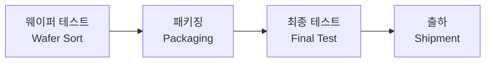

# 1.8 후공정 개요 — 패키징, 테스트, 출하

## 이 챕터에서 배우는 것
- 후공정(Back-End)의 전체 흐름 — 웨이퍼에서 완성 제품까지
- 웨이퍼 테스트(Wafer Sort)와 다이(Die)의 개념
- 패키징(Packaging)의 역할과 주요 방식
- 최종 테스트와 빈닝(Binning)
- 첨단 패키징 트렌드 — 칩렛, 2.5D/3D
- AI 관점에서의 후공정 데이터 활용

---

## 전공정이 끝나면: 아직 제품이 아니다

앞선 챕터들에서 우리는 산화, 증착, 포토리소그래피, 식각, 이온주입, CMP를 수백 번 반복하여 웨이퍼 위에 수십억 개의 트랜지스터와 10층 이상의 금속 배선을 완성했다. 2~3개월에 걸친 전공정(FEOL + BEOL)이 끝난 것이다. 하지만 이 상태의 웨이퍼는 **아직 제품이 아니다**. 둥근 웨이퍼 위에 수백~수천 개의 칩이 격자 형태로 반복되어 있을 뿐이다.

이 웨이퍼를 개별 칩으로 자르고, 외부 세계와 연결하고, 보호 케이스에 넣고, 동작을 검증해야 비로소 여러분의 컴퓨터에 들어가는 "제품"이 된다. 이 전체 과정을 **후공정(Back-End of Manufacturing)**이라 하며, 크게 세 단계로 구성된다.

---

## 1단계: 웨이퍼 테스트 — 잘라내기 전에 먼저 확인한다

### 다이(Die)란 무엇인가

웨이퍼 위에 반복되는 동일한 칩 패턴 하나하나를 **다이(Die)**라고 한다. 300mm 웨이퍼 1장에 몇 개의 다이가 들어가는지는 칩 크기에 따라 천차만별이다. 데이터센터용 대형 프로세서(다이 면적 ~400mm²)는 약 150~200개, 스마트폰 AP(~100mm²)는 약 500~600개, 소형 IoT 칩(~10mm²)은 5,000개 이상이 들어간다. 다이 하나하나가 독립된 칩이 될 후보다.

여기서 **수율(Yield)**이라는 개념이 처음으로 구체적 의미를 갖는다. 웨이퍼 위 300개의 다이 중 양품이 270개라면 수율은 90%다. 다이 면적이 클수록 하나의 결함이 그 다이에 포함될 확률이 높아지므로, 대형 칩일수록 수율이 떨어지는 경향이 있다. NVIDIA의 대형 GPU 다이(~800mm²)가 극도로 비싼 이유 중 하나가 바로 이 수율 문제다.

### 프로빙(Probing): 웨이퍼 위에서 칩을 시험한다

웨이퍼를 자르기 전에, 각 다이가 전기적으로 동작하는지 먼저 검사한다. **프로브 카드(Probe Card)**라 불리는 장치에 수천 개의 미세한 탐침(Probe Tip)이 달려 있어, 다이의 테스트 패드에 동시에 접촉하여 전기 신호를 인가하고 응답을 측정한다.

왜 자르기 전에 검사할까? 이유는 경제적이다. 불량 다이를 패키징하면 패키지 재료비, 공정비, 테스트 시간이 모두 낭비된다. 불량을 미리 걸러내면 이 비용을 절약할 수 있다. 소프트웨어에서 **유닛 테스트를 먼저 돌리고 나서 통합 테스트로 넘어가는 것**과 같은 논리다 — 작은 단위에서 문제를 빨리 잡을수록 전체 비용이 줄어든다.

웨이퍼 테스트 항목은 세 가지로 나뉜다. **파라메트릭 테스트(Parametric Test)**에서는 트랜지스터의 핵심 전기 특성 — 임계전압(Vt), 구동 전류(Ion), 누설 전류(Ioff), 배선 저항, 커패시턴스 — 을 개별적으로 측정한다. 이 데이터는 전공정의 품질을 가장 직접적으로 반영하는 지표이며, 이전 챕터들에서 설명한 모든 공정의 결과물이 여기에 집약된다. **기능 테스트(Functional Test)**에서는 기본적인 논리 동작(AND, OR, 메모리 읽기/쓰기 등)이 되는지 확인한다. **IDDQ 테스트**에서는 칩이 정지 상태일 때 흐르는 전류를 측정하여, 눈에 보이지 않는 미세 결함(게이트 산화막 핀홀, 배선 간 미세 단락 등)을 검출한다. 정상 칩은 정지 시 전류가 극히 낮지만, 결함이 있으면 누설 경로가 생겨 전류가 비정상적으로 높아진다.

불량으로 판정된 다이는 과거에는 잉크 도트를 찍어 표시했지만, 지금은 **전자적 웨이퍼 맵(E-Map)**에 기록한다. 이 웨이퍼 맵이 3장에서 다룰 수율 분석과 웨이퍼 맵 패턴 분류의 핵심 데이터가 된다.

---

## 2단계: 패키징 — 칩에 갑옷을 입히고 세상과 연결한다

### 패키징이 하는 네 가지 일

벌거벗은 실리콘 다이는 극도로 취약하다. 손가락으로 만져도 망가질 수 있다. 패키징은 이 연약한 다이를 세상과 연결하는 과정이며, 네 가지 핵심 기능을 수행한다.

첫째, **물리적 보호**다. 외부 충격, 습기, 화학적 오염으로부터 다이를 에폭시 수지(EMC, Epoxy Molding Compound)로 감싸 보호한다. 여러분이 보는 검은색 직사각형 IC 칩의 외형이 바로 이 몰딩(Molding)이다. 둘째, **전기적 연결**이다. 다이 위의 미세한 패드(수십 μm)를 외부 PCB의 핀이나 솔더볼(수백 μm~mm)에 연결한다. 스케일의 차이를 메우는 "브릿지" 역할이다. 셋째, **열 방출(Thermal Management)**이다. 동작 중 발생하는 열을 히트 스프레더(Heat Spreader)나 방열판으로 외부에 방출한다. 최신 프로세서의 발열은 100W를 넘기므로, 패키징의 열 설계가 칩의 성능 한계를 결정하기도 한다. 넷째, **표준화된 폼팩터**를 제공하여 다양한 크기의 다이를 PCB에 통일된 방식으로 실장할 수 있게 한다.

소프트웨어로 비유하면, 패키징은 **API 래퍼(Wrapper)**와 같다. 내부 구현(다이)의 복잡성을 감추고, 외부 시스템(PCB)에 표준화된 인터페이스(핀/볼)를 제공한다.

### 다이싱(Dicing)에서 패키지 완성까지

![[wire_bond_vs_flipchip.svg|와이어 본딩 vs 플립칩 단면 비교]]

먼저 **다이싱(Dicing)** — 다이아몬드 블레이드 또는 레이저로 웨이퍼를 개별 다이로 절단한다. 다이 사이의 빈 영역을 **스크라이브 레인(Scribe Lane)**이라 하는데, 여기에 전공정에서 사용된 테스트 패턴과 정렬 마크가 들어 있다. 절단 후 양품 다이만 골라내어(Pick) 기판에 부착하는(Place) **다이 어태치(Die Attach)** 공정을 거친다.

다음은 다이와 기판을 전기적으로 연결하는 단계다. 가장 전통적인 방식인 **와이어 본딩(Wire Bonding)**은 금(Au) 또는 구리(Cu)의 가느다란 와이어로 다이 패드와 리드프레임을 하나씩 연결한다. 저렴하고 유연하지만, 와이어의 길이가 길어 기생 인덕턴스(Parasitic Inductance)가 높고 고속 신호에는 불리하다. 현대 고성능 프로세서의 표준은 **플립칩(Flip Chip)** 방식이다. 다이를 뒤집어서(Flip) 다이 패드 위에 형성된 **범프(Bump, 솔더볼)**로 기판에 직접 연결한다. 와이어 없이 범프만으로 연결하므로 경로가 극도로 짧고, 다이 전면에 I/O를 배치할 수 있어 고밀도 연결이 가능하다.

스마트폰처럼 극도로 얇은 폼팩터가 요구되는 곳에서는 **팬아웃 WLP(Fan-Out Wafer Level Package)**가 사용된다. 다이를 웨이퍼 레벨에서 재배열하고, 다이 면적보다 넓은 영역에 재배선층(RDL)을 형성하여 I/O를 팬아웃(부채처럼 펼쳐)시킨다. 별도의 패키지 기판이 필요 없어 전체 두께를 극적으로 줄일 수 있다.

---

## 3단계: 최종 테스트와 빈닝 — 제품의 등급이 결정되는 순간

### 패키징 후 본격 테스트

패키징이 완료된 칩은 **최종 테스트(Final Test)**를 거친다. 웨이퍼 테스트가 "기본적으로 동작하는가?"를 확인하는 스크리닝이었다면, 최종 테스트는 **"얼마나 잘 동작하는가?"**를 정밀하게 측정한다.

모든 논리 기능이 정상인지 확인하는 **기능 테스트**, 최대 동작 주파수를 측정하는 **속도 테스트(Speed Test)**, 동작 및 대기 전력을 측정하는 **전력 테스트**, 오프 상태의 누설 전류를 확인하는 **누설 테스트**가 수행된다. 특히 **번인(Burn-in)** 테스트에서는 고온(125°C) 환경에서 수 시간~수십 시간 동안 동작시켜 **초기 불량(Infant Mortality)**을 선별한다. 제조 과정의 잠재 결함(게이트 산화막의 약점, 배선의 미세 균열 등)은 초기에 집중적으로 고장을 일으키는 경향이 있어, 이 시기를 강제로 앞당겨 통과시키는 것이다. 소프트웨어로 치면 **프로덕션 배포 전 스트레스 테스트**와 같은 개념이다.

### 빈닝(Binning): 같은 웨이퍼에서 태어난 형제가 다른 이름을 갖게 되는 이유

![[binning_distribution.png|빈닝 수율 분포 그래프]]

여러분이 인텔이나 AMD의 CPU 라인업을 보면, 같은 아키텍처에서 i9, i7, i5가 나오거나 Ryzen 9, 7, 5가 나온다. 이것들이 각각 다른 설계인 것은 아니다. 상당수가 **동일한 웨이퍼에서 나온 동일한 다이**이며, 최종 테스트에서 측정된 성능에 따라 **등급이 나뉜 것**이다. 이것이 **빈닝(Binning)**이다.

| Bin | 동작 주파수 | 전력 | 제품명 |
|:---|:---|:---|:---|
| Bin 1 | 5.0 GHz | 105W | Core i9 |
| Bin 2 | 4.5 GHz | 65W | Core i7 |
| Bin 3 | 4.0 GHz | 45W | Core i5 |
| Fail | 불량 | - | 폐기 |

동일한 공정으로 만들었는데 왜 성능이 다를까? 전공정에서 각 챕터마다 반복적으로 강조한 **공정 변동(Process Variation)** 때문이다. 이온주입 도즈의 미세한 차이, 산화막 두께의 웨이퍼 내 불균일, 식각 프로파일의 위치 의존적 편차 — 이 모든 것이 누적되어 같은 웨이퍼 위의 다이들 사이에서도 최대 동작 주파수와 누설 전류에 차이가 생긴다.

빈닝의 사업적 지혜는 이것이다 — 공정 변동을 "불량"이 아니라 **"제품 다양화"**로 활용하는 것. 최고 성능 칩은 프리미엄 가격으로, 약간 낮은 칩은 보급형 가격으로 판매하여 수율에 따른 매출 손실을 최소화한다. 프로그래밍에서 **로드밸런싱**이 성능이 다른 서버들을 각각의 능력에 맞는 워크로드에 배정하는 것처럼, 빈닝은 성능이 다른 칩들을 적절한 제품 세그먼트에 배정하는 전략이다.

---

## 첨단 패키징: 무어의 법칙 이후의 전장

트랜지스터 미세화가 물리적 한계에 접근하면서, **패키징**이 칩 성능 향상의 새로운 전장으로 떠올랐다. "더 작은 트랜지스터"가 아니라 "더 똑똑한 조합"으로 성능을 끌어올리는 시대다.

### 칩렛(Chiplet): 하나의 거대한 칩에서 여러 개의 작은 칩으로

과거에는 모든 기능을 하나의 거대한 다이에 집적하는 것이 목표였다(모놀리식 접근). 하지만 다이가 커질수록 수율이 떨어지고, 모든 부분을 최신 공정 노드로 만들면 비용이 천문학적으로 올라간다. **칩렛(Chiplet) 아키텍처**는 이 문제를 정면으로 해결한다.

CPU 코어, GPU 블록, I/O 컨트롤러, 메모리 인터페이스를 각각 독립된 작은 다이(칩렛)로 만들고, 이것들을 하나의 패키지 안에서 조합한다. 핵심 장점은 두 가지다. 첫째, 각 칩렛을 **최적의 공정 노드**로 제조할 수 있다. CPU 코어처럼 속도가 중요한 블록은 최신 3nm로, I/O 블록처럼 속도보다 안정성이 중요한 것은 성숙한 7nm로 만드는 식이다. 둘째, 작은 다이는 큰 다이보다 **수율이 압도적으로 높다**. 같은 결함 밀도에서 면적이 절반이면 수율은 제곱근 이상으로 개선된다. AMD의 EPYC 서버 프로세서와 Apple의 M-시리즈 Ultra(두 개의 M 다이를 연결)가 대표적인 칩렛 아키텍처 제품이다.

### 2.5D 패키징: 실리콘 인터포저 위의 공존

![[2_5d_3d_packaging.svg|2.5D/3D 패키징 구조 단면도]]

칩렛들이 서로 고속으로 통신하려면, 일반 PCB 기판의 배선으로는 대역폭과 에너지 효율이 부족하다. **2.5D 패키징**은 **실리콘 인터포저(Silicon Interposer)** — 미세 배선이 형성된 얇은 실리콘 판 — 위에 여러 칩렛을 나란히 배치한다. 인터포저의 배선은 PCB보다 훨씬 가늘고 촘촘하므로, 칩렛 간 고대역폭/저전력 통신이 가능하다.

TSMC의 **CoWoS(Chip on Wafer on Substrate)**가 이 분야의 대표 기술이다. NVIDIA의 A100/H100 GPU가 HBM(High Bandwidth Memory)을 연결하는 데 바로 이 CoWoS를 사용한다. AI 가속기 시대에 CoWoS의 생산 능력(Capa)이 칩 공급의 병목이 되고 있을 정도로, 2.5D 패키징은 AI 하드웨어의 핵심 인프라가 되었다.

### 3D 패키징: 수직으로 쌓는 극한의 집적

가장 공격적인 접근은 칩을 **수직으로 쌓아 올리는** 3D 패키징이다. 실리콘을 관통하는 수직 배선인 **TSV(Through-Silicon Via)** — 말 그대로 실리콘 다이에 구멍을 뚫어 위아래 층을 전기적으로 연결하는 기술 — 로 층간 통신을 달성한다.

가장 성공적인 3D 패키징 사례가 **HBM(High Bandwidth Memory)**이다. DRAM 다이를 4장(HBM2)에서 12장(HBM3E)까지 수직으로 적층하고, TSV로 연결하여 기존 DDR 메모리 대비 **수 배~수십 배의 메모리 대역폭**을 실현한다. 이 기술이 없었다면 현재의 대규모 AI 모델 학습은 메모리 대역폭 병목에 가로막혔을 것이다. 여러분이 PyTorch나 TensorFlow로 훈련하는 모델의 GPU가 제 성능을 발휘할 수 있는 것은, 이 HBM 패키징 기술 덕분이다.

---

## AI 엔지니어에게 이것이 의미하는 것

![[wafer_map_patterns.png|웨이퍼 맵 불량 패턴 4종 예시]]

후공정 데이터는 반도체 AI에서 독특한 위치를 차지한다. 전공정이 "공정 파라미터 → 물리적 결과"의 인과 체인이라면, 후공정은 **그 체인의 최종 결과**가 드러나는 곳이기 때문이다.

가장 활발하게 AI가 적용되는 영역은 **웨이퍼 맵(Wafer Map) 분석**이다. 웨이퍼 맵은 각 다이의 양품/불량 정보를 2D 이미지로 나타낸 것이다. 불량 다이가 무작위로 흩어져 있으면 랜덤 결함이지만, 특정 패턴 — 동심원(Ring), 대각선 스크래치, 가장자리 집중(Edge), 반점 클러스터 — 을 보이면 그 패턴 자체가 결함 원인의 단서가 된다. 예를 들어 링 패턴은 CMP의 불균일, 스크래치는 웨이퍼 핸들링 문제, 엣지 집중은 코팅이나 식각의 가장자리 효과를 시사한다. 이 패턴 분류는 CNN 기반 이미지 분류 문제로 자연스럽게 환원되며, 공개 데이터셋(WM-811K 등)이 있어 반도체 AI 입문에 가장 접근하기 좋은 주제 중 하나다. 3장에서 깊이 다룰 것이다.

또 하나 가치가 높은 AI 활용은 **빈닝 예측**이다. 전공정의 계측 데이터(CD, Overlay, 막 두께 등)와 파라메트릭 테스트 결과만으로 최종 테스트 결과 — 어떤 Bin에 들어갈지, 즉 칩의 성능 등급 — 을 조기에 예측할 수 있다면, 사업적 가치가 크다. 저성능 빈으로 떨어질 것이 예상되는 웨이퍼에 더 이상 고비용 후공정을 투자하지 않는 **조기 폐기(Early Kill)** 전략이나, 특정 빈에 수요가 집중될 때 공정 조건을 미세 조정하여 해당 빈의 비율을 높이는 **빈 최적화** 전략이 가능해진다.

---

## 핵심 정리

후공정은 완성된 웨이퍼를 제품으로 전환하는 과정이다. **웨이퍼 테스트(Wafer Sort)**에서 불량 다이를 미리 걸러내고, **패키징**에서 다이를 보호하고 외부와 연결하며(와이어본딩 → 플립칩 → 팬아웃 WLP로 진화), **최종 테스트와 빈닝**에서 칩의 성능 등급을 결정한다. 트랜지스터 미세화의 한계에 따라 **첨단 패키징** — 칩렛 아키텍처, 2.5D(CoWoS), 3D(TSV/HBM) — 이 성능 향상의 새로운 축이 되었으며, 특히 HBM은 AI 가속기의 메모리 대역폭 병목을 해결한 핵심 기술이다. AI 엔지니어에게 후공정 데이터 — 웨이퍼 맵 패턴 분류, 빈닝 예측, 조기 폐기 전략 — 는 전공정 데이터와 결합하여 end-to-end 수율 최적화를 실현하는 열쇠다.

---

*다음 챕터: 1.9 공정 노드와 무어의 법칙 — 7nm, 5nm, 3nm의 의미*
