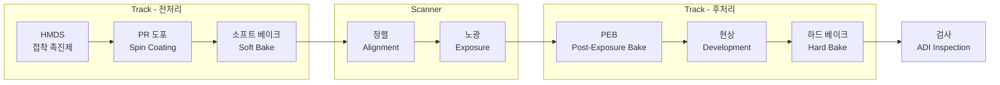
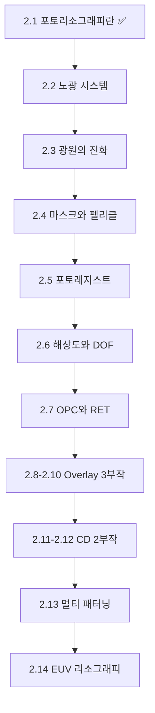

# 2.1 포토리소그래피란 — 빛으로 회로를 새기는 원리

## 이 챕터에서 배우는 것
- 포토리소그래피(Photolithography)의 기본 원리 — 사진 인화와의 유사성
- 포토리소그래피 공정의 전체 흐름 (Track + Scanner)
- 왜 이 공정이 반도체 제조에서 가장 중요하고 비싼지
- 포토리소그래피에서 생성되는 핵심 데이터
- Part 2 전체의 로드맵

---

## 사진을 찍듯이 회로를 새기다

![[photo_printing_vs_lithography.png|사진 인화 vs 포토리소그래피 시각 비교]]

Part 1에서 반도체 칩이 만들어지는 전체 여정을 조망했다. 이제 Part 2에서는 그 여정의 **심장부** — 포토리소그래피(Photolithography)에 본격적으로 들어간다.

포토리소그래피는 말 그대로 **"빛(Photo) + 돌(Litho) + 그리기(Graphy)"** — 빛으로 패턴을 새기는 기술이다. 1820년대 니세포르 니에프스(Nicéphore Niépce)가 감광성 화학 물질을 이용해 석판(Lithograph)에 이미지를 복제한 것이 어원인데, 200년 후 같은 원리가 나노미터 스케일의 반도체 회로를 만드는 데 쓰이고 있다.

원리는 여러분에게 익숙한 아날로그 사진 인화와 놀랍도록 비슷하다.

| 사진 인화 | 포토리소그래피 |
|:---|:---|
| 필름(네거티브) | 마스크(Reticle) |
| 인화지 | 웨이퍼 위의 포토레지스트 |
| 확대기(Enlarger) | 노광 장비(Scanner/Stepper) |
| 현상액(Developer) | 현상액(Developer) |
| 완성된 사진 | 패턴이 전사된 웨이퍼 |

차이점은 **스케일과 정밀도**다. 사진은 수 cm의 이미지를 만들고, 초점이 약간 어긋나도 "아트 감성"으로 넘어갈 수 있다. 포토리소그래피는 **수 nm의 패턴**을 만들고, 1nm의 오차가 수십억 원의 수율 손실로 직결된다. 같은 원리를 1,000만 배 작은 스케일에서, 1,000만 배 높은 정밀도로 실행하는 것이다.

---

## 포토리소그래피 공정 흐름: 두 시스템의 정밀한 협업

![[track_scanner_inline_system.png|Track + Scanner 인라인 시스템]]

포토리소그래피는 단독 장비가 아니라 **두 장비 시스템의 협업**으로 이루어진다. **트랙(Track, 또는 Coater-Developer)**이 포토레지스트 도포, 베이크, 현상 등 화학 처리를 담당하고, **스캐너(Scanner)**가 마스크 패턴을 빛으로 웨이퍼에 전사하는 노광을 담당한다. 이 두 시스템은 물리적으로는 별개의 장비이지만, 인라인(Inline)으로 직결되어 하나의 통합 시스템처럼 동작한다.

장비 제조사도 다르다. 트랙은 **Tokyo Electron(TEL)**이 전 세계 시장의 약 90%를 장악하고 있고, 스캐너는 **ASML**이 독보적 1위다. 반도체 산업에서 가장 중요한 공정이 단 두 회사의 장비로 돌아간다는 것은, 이 산업의 공급망이 얼마나 집중되어 있는지를 보여주는 또 하나의 사례다.

각 단계를 순서대로 따라가 보자. 한 단계라도 빠뜨리거나 조건이 틀어지면 패턴이 무너지므로, 전체 흐름을 이해하는 것이 중요하다.

### 1. HMDS 처리: 벽에 프라이머를 바르다

첫 번째 단계는 접착 촉진이다. **HMDS(Hexamethyldisilazane)**를 증기 형태로 웨이퍼 표면에 도포하여, 표면을 **소수성(Hydrophobic)**으로 바꾼다. 실리콘 웨이퍼의 자연 표면은 산화막(SiO₂) 때문에 친수성인데, 이 상태로 포토레지스트를 바르면 접착력이 약해 현상 과정에서 패턴이 들뜨거나 벗겨질 수 있다. HMDS가 표면의 OH기를 Si-CH₃로 치환하여 소수성으로 바꾸면, 역시 소수성인 포토레지스트와의 접착력이 비약적으로 올라간다.

벽에 페인트를 칠하기 전 프라이머를 바르는 것과 정확히 같은 원리다. 프라이머 없이 칠하면 시간이 지나면서 벗겨진다.

### 2. 포토레지스트 도포: 고속 회전으로 나노미터 균일 막을 만들다

![[spin_coating_cross_section.svg|스핀 코팅 원리 단면도]]

**포토레지스트(PR, Photoresist)** — 빛에 반응하여 화학적 성질이 변하는 감광 물질 — 를 웨이퍼 위에 균일하게 도포한다. 방법은 **스핀 코팅(Spin Coating)**이다. 웨이퍼 중심에 레지스트 용액을 떨어뜨린 후 3,000~5,000 rpm으로 고속 회전시키면, 원심력에 의해 용액이 바깥으로 퍼지면서 수십~수백 nm 두께의 **극도로 균일한 막**이 형성된다.

이 단계에서 두께 균일도가 극히 중요한 이유가 있다. 레지스트 두께가 불균일하면, 같은 노광 에너지를 받아도 두꺼운 곳은 에너지가 덜 전달되고 얇은 곳은 더 전달된다. 그 결과 **CD(선폭)가 위치마다 달라진다.** 웨이퍼 위의 수백 개 다이가 같은 CD를 가져야 하는데, 레지스트 두께 편차 때문에 가장자리 다이와 중심 다이의 CD가 다르면 수율이 떨어진다. 스핀 코팅의 회전 속도, 가속도, 레지스트 점도, 주변 온도/습도가 모두 두께에 영향을 미치며, 이 파라미터들이 AI 모델의 입력 피처가 된다.

### 3. 소프트 베이크: 용매를 날리다

도포된 레지스트에는 아직 용매(Solvent)가 상당량 남아 있다. **소프트 베이크(Soft Bake)** — 보통 90~110°C에서 60~90초 — 로 용매를 증발시켜 막을 고체화하고 안정화시킨다. 소프트 베이크 온도와 시간이 레지스트의 광감도(Sensitivity)와 현상 특성에 영향을 미치므로, ±0.1°C 수준의 정밀한 온도 제어가 요구된다.

### 4. 정렬: 나노미터 정밀도로 층을 맞추다

현대 칩은 수십 층을 순차적으로 쌓아 올린다. 각 층의 패턴이 이전 층의 패턴과 **정확히 맞아야** 트랜지스터와 배선이 설계대로 연결된다. 이 정렬(Alignment) 과정에서 웨이퍼 위에 미리 형성된 **정렬 마크(Alignment Mark)**와 현재 마스크의 마크를 광학적으로 일치시킨다.

이 정렬 정확도가 곧 **Overlay(층간 정렬 오차)**를 결정한다. 최신 공정에서 요구되는 Overlay 정확도는 **2nm 이하**다. 이것이 얼마나 극한적인 요구인지 체감해 보자 — 300mm(30cm) 웨이퍼 전체에 걸쳐, 모든 다이에서, 2nm 이내의 정렬 정밀도를 달성해야 한다. 비율로 따지면, 서울에서 부산까지의 거리(~400km)에서 오차가 **0.003mm(3μm) 이내**여야 하는 것과 같다. Overlay는 SMILE 플랫폼의 핵심 타겟 중 하나이며, 2.8~2.10장에서 3개 챕터에 걸쳐 깊이 다룬다.

### 5. 노광: 포토리소그래피의 심장

![[reduction_projection_optics.svg|노광 축소 투영 광학계 개념도]]

마스크를 통과한 빛이 고성능 렌즈 시스템을 거쳐 **웨이퍼 위의 포토레지스트에 패턴을 전사**한다. 이것이 포토리소그래피의 핵심 중의 핵심이다.

광원은 DUV(193nm ArF 레이저) 또는 EUV(13.5nm 극자외선)를 사용한다. 마스크는 회로 패턴이 크롬(Cr)으로 그려진 석영 유리판이며, 렌즈 시스템이 마스크 패턴을 **4:1로 축소** 투영한다. 마스크에서 40nm로 그려진 패턴이 웨이퍼 위에서는 10nm가 되는 것이다. 빛이 마스크의 투명 부분을 통과하면 레지스트의 화학 구조가 변하고, 이 "변한 부분"과 "변하지 않은 부분"의 차이가 패턴을 형성한다.

노광 과정에서 **Dose(노광 에너지량)**와 **Focus(초점 위치)**가 가장 중요한 두 파라미터다. Dose가 부족하면 패턴이 불완전하게 형성되고, 과하면 패턴이 넓어진다. Focus가 맞지 않으면 패턴이 흐려지거나 비대칭이 된다. 이 두 파라미터의 허용 범위 — **프로세스 윈도우(Process Window)**라 부른다 — 는 공정이 미세해질수록 점점 좁아져, 최신 공정에서는 사실상 칼날 위를 걷는 수준이다.

### 6. PEB (Post-Exposure Bake): 화학 반응을 증폭하다

노광 직후, 웨이퍼를 다시 열처리한다. 현대 포토리소그래피에서 사용하는 **화학증폭형 레지스트(CAR, Chemically Amplified Resist)**는 노광 시 직접적인 화학 변화가 일어나는 것이 아니라, 광산 발생제(PAG, Photo-Acid Generator)에서 소량의 산(Acid)이 생성된다. 이 산이 PEB 단계에서 열에너지를 받아 **촉매 반응(Catalytic Reaction)**으로 주변 레지스트를 연쇄적으로 분해한다. 하나의 광자가 만든 소량의 산이 수십~수백 배의 화학 변화를 유도하는 것으로, 이 "증폭"이 있어야 적은 노광 에너지로도 충분한 패턴 형성이 가능하다.

PEB 온도와 시간이 CD에 직접적인 영향을 미친다. 1°C만 달라져도 산의 확산 거리가 바뀌어 패턴 폭이 변한다. 이것이 PEB 온도 균일도를 ±0.1°C 이내로 제어해야 하는 이유이며, 이 온도 균일도 데이터가 AI 모델의 중요한 피처가 된다.

### 7. 현상: 패턴이 비로소 드러나다

**현상(Development)** — 현상액(보통 TMAH, 테트라메틸암모늄 히드록사이드 2.38% 수용액)으로 노광된 부분(또는 안 된 부분)을 선택적으로 용해 제거하여, 레지스트에 물리적 패턴을 만드는 과정이다.

레지스트에는 두 가지 타입이 있다. **포지티브 레지스트**는 빛을 받은 부분이 현상액에 녹아 제거된다 — 마스크의 투명 부분에 해당하는 곳이 없어지므로, 마스크와 **동일한** 패턴이 웨이퍼에 남는다. **네거티브 레지스트**는 반대로 빛을 받은 부분이 경화되어 남고 안 받은 부분이 제거되어, 마스크의 **반전** 패턴이 남는다. 현대 최첨단 DUV/EUV 공정에서는 해상도와 LWR(Line Width Roughness)이 더 우수한 포지티브 레지스트가 주류이지만, 특정 공정에서는 네거티브 톤 현상(NTD, Negative Tone Development)도 활용된다.

### 8. 하드 베이크와 검사: 마무리와 품질 확인

현상 후 남은 레지스트를 **하드 베이크(Hard Bake, 110~130°C)**로 열처리하여 **내식각성**을 강화한다. 이후 식각 공정에서 레지스트가 보호막 역할을 해야 하므로, 열과 화학 공격에 견딜 수 있게 만드는 것이다.

마지막으로 **ADI(After-Develop Inspection)** 검사에서 현상된 레지스트 패턴의 CD(선폭), Overlay(정렬), 결함 유무를 측정한다. 이 검사가 특별히 중요한 이유는, **여기서 문제를 발견하면 레지스트를 벗겨내고 처음부터 다시 할 수 있기 때문**이다. 이것을 **리워크(Rework)**라 하며, 식각까지 진행된 후에는 되돌릴 수 없으므로 ADI가 비용을 최소화할 수 있는 **마지막 기회**다.

---

## 왜 포토리소그래피가 반도체 제조의 왕인가

Part 1의 1.3장에서 포토리소그래피가 전체 공정 비용의 30~35%를 차지한다고 언급했다. 이제 그 숫자의 의미를 더 깊이 이해할 수 있을 것이다.

**비용** 면에서, 최신 High-NA EUV 스캐너 한 대의 가격은 약 **4억 달러(약 5,400억 원)**에 달한다. 팹 하나에 수십 대가 필요하니, 장비값만으로 팹 투자의 상당 부분을 차지한다. **빈도** 면에서, 최신 5nm 칩 하나를 만드는 데 **80회 이상의 리소 스텝**이 필요하며, 전체 공정 시간의 약 40~50%가 리소그래피 관련에 소요된다. **정밀도** 면에서, 칩의 모든 구조 — 트랜지스터, 배선, 비아 — 가 포토리소그래피로 정의되므로, 이 공정의 품질이 곧 칩의 품질이다.

가장 비싸고, 가장 자주 수행되고, 가장 정밀해야 하는 공정. **포토리소그래피를 잘 하는 것이 곧 반도체를 잘 만드는 것**이라는 말은, 과장이 아니라 산업의 현실이다.

---

## 포토리소그래피에서 생성되는 핵심 데이터

AI 엔지니어인 여러분에게 가장 중요한 부분이다. 포토리소그래피 공정에서 생성되는 데이터는 SMILE 플랫폼의 직접적인 입력이 된다.

| 데이터 | 설명 | 생성 시점 |
|:---|:---|:---|
| **CD (Critical Dimension)** | 패턴의 선폭. 목표값 대비 오차. | ADI, AEI |
| **Overlay** | 현재 층과 이전 층의 정렬 오차 (x, y 방향) | 노광 후 |
| **Focus** | 노광 시 초점 위치. DOF 내에 있어야 함. | 노광 중 |
| **Dose** | 노광 에너지량. CD에 직접 영향. | 노광 중 |
| **레지스트 두께** | 도포 후 막 두께. 균일도 중요. | 도포 후 |
| **결함 (Defect)** | 브릿지, 단선, 파티클 등 | ADI, AEI |

이 중 **CD와 Overlay**가 SMILE 플랫폼의 핵심 타겟이다. CD는 트랜지스터와 배선의 물리적 크기를 결정하고, Overlay는 층 간 연결의 정확도를 결정한다. 이 두 파라미터의 제어가 곧 수율 제어이며, Part 2의 나머지 챕터에서 각각의 물리적 의미, 측정 방법, AI 기반 최적화를 깊이 다룬다.

---

## Part 2 로드맵

Part 2 전체에서 다룰 내용을 미리 조망한다. 14개 챕터를 통해 포토리소그래피의 모든 측면을 파고들 것이다.

광원에서 시작하여, 마스크와 레지스트라는 재료를 거쳐, 해상도와 DOF의 물리적 한계를 이해하고, 그 한계를 넘기 위한 기법(OPC, RET, 멀티 패터닝)을 배운 뒤, 핵심 타겟인 Overlay와 CD를 심도 있게 분석하고, 마지막으로 EUV라는 최첨단 기술로 마무리하는 구성이다.

---

## 핵심 정리

포토리소그래피는 빛으로 마스크 패턴을 웨이퍼 위의 포토레지스트에 전사하는 공정으로, 원리는 사진 인화와 같되 스케일이 나노미터이고 정밀도가 극한적이다. 트랙(TEL)이 레지스트 도포/현상을, 스캐너(ASML)가 노광을 담당하며, HMDS → 도포 → 소프트 베이크 → 정렬 → 노광 → PEB → 현상 → 검사의 9단계 흐름으로 진행된다. 전체 공정 비용의 30~35%, 리소 스텝 80회 이상, 장비 1대 4억 달러 — 반도체 제조에서 가장 비싸고, 빈번하고, 정밀한 공정이다. AI 엔지니어에게 핵심 데이터는 **CD(선폭)와 Overlay(층간 정렬)**이며, Part 2의 나머지 13개 챕터에서 이 두 타겟의 물리, 측정, 최적화를 깊이 파고든다.

---

*다음 챕터: 2.2 노광 시스템(Exposure System) — 스테퍼와 스캐너*
