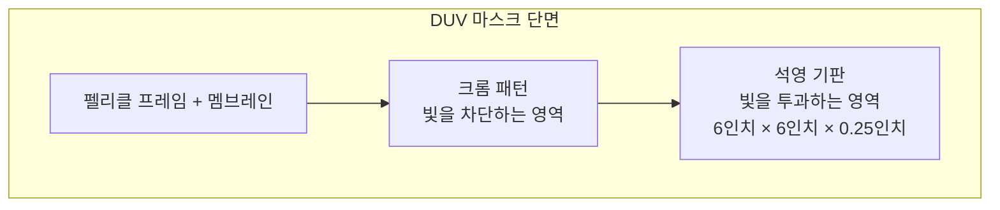

# 2.4 마스크(Reticle)와 펠리클(Pellicle)

## 이 챕터에서 배우는 것
- 마스크(Reticle)의 구조와 제작 과정
- 마스크 결함이 수율에 미치는 영향
- 펠리클(Pellicle)의 역할 — 마스크의 보호막
- DUV 마스크 vs EUV 마스크의 근본적 차이
- 마스크 관련 데이터와 AI 활용

---

## 마스크란: 반도체의 "원판"

이전 챕터들에서 광원과 노광 장비를 다뤘다. 빛이 있고 그 빛을 정밀하게 투사하는 렌즈가 있다면, 이제 **무엇을** 투사할지를 결정하는 것이 필요하다. 그것이 **마스크(Mask)**, 또는 **레티클(Reticle)**이다.

마스크는 회로 패턴이 새겨진 **석영 유리판**으로, 포토리소그래피에서 빛이 이 마스크를 통과(DUV) 또는 반사(EUV)하면서 패턴이 웨이퍼로 전사된다. 음악의 마스터 테이프, 인쇄의 원판처럼 — 마스크 하나가 수천~수만 장의 웨이퍼에 반복 사용되는 **원본(Master)**이다.

이 "원본" 성격 때문에 마스크 결함의 영향은 극대화된다. 마스크에 결함이 하나 있으면, 그 마스크로 찍어내는 **모든 웨이퍼의 모든 다이**에 동일한 결함이 전사된다. 웨이퍼 1만 장, 다이 500만 개에 같은 결함이 복제되는 것이다. 소프트웨어로 비유하면, 마스크는 **Docker Image**와 같다 — 이미지에 버그가 있으면 그것으로 생성되는 모든 컨테이너에 동일한 버그가 존재한다. 그래서 Docker Image의 품질 관리가 중요하듯, 마스크의 결함 관리는 반도체 제조에서 가장 엄격한 품질 관리 대상이다.

---

## DUV 마스크의 구조

DUV 마스크는 세 가지 핵심 요소로 구성된다.

가장 아래는 **석영 기판(Quartz Substrate)**이다. 크기는 6인치×6인치(152mm×152mm), 두께 약 6.35mm의 고순도 합성 석영으로, 193nm DUV 빛이 높은 투과율로 통과한다. 일반 유리가 아니라 불순물을 극한까지 제거한 합성 석영이어야 하는 이유는, 불순물이 있으면 DUV를 흡수하여 열이 발생하고 마스크가 변형되기 때문이다. 석영 기판의 **열팽창 계수**가 극히 낮아야 하는 것도 같은 이유다 — 노광 중 열에 의해 마스크가 미세하게 팽창하면 패턴 위치가 틀어져 Overlay 오차가 발생한다.

그 위에 빛을 차단해야 하는 영역에 **크롬(Cr) 박막**(두께 약 60~100nm)이 코팅되어 패턴을 형성한다. 크롬이 있는 곳은 빛이 차단되고, 크롬이 없는 곳은 빛이 석영을 투과한다. 이 밝고 어두운 영역의 패턴이 웨이퍼 위의 포토레지스트에 전사되는 것이다.

마스크의 패턴은 웨이퍼에 전사될 크기의 **4배**로 제작된다(4:1 축소 투영). 웨이퍼에서 10nm가 되어야 할 패턴은 마스크에서 40nm로 그려진다. 이 덕분에 마스크 제작의 해상도 부담이 줄어들고, 마스크 위의 결함도 웨이퍼에서 1/4로 축소된다. 그렇다 해도, 마스크 위의 100nm 결함은 웨이퍼에서 25nm 결함이 되며 — 3nm 공정에서 25nm는 치명적이다.

---

## 마스크 제작: 한 점씩 그리는 극한의 인내

### 전자빔 직접 묘화 (E-beam Direct Write)

마스크 패턴은 **전자빔(E-beam) 리소그래피**로 한 점씩 그린다. 광학 리소그래피는 마스크를 통해 수백 개 다이를 한 번에 노광하지만, 그 마스크 자체는 무엇으로 만드는가? 마스크의 마스크가 필요한 것은 아니다 — 전자빔이 마스크가 없이도 패턴을 직접 그릴 수 있기 때문이다.

전자의 드브로이 파장은 수 pm(피코미터)으로, 광자보다 수만 배 짧아서 원하는 해상도를 충분히 달성할 수 있다. 하지만 점을 하나하나 찍어가며 그리는 방식이므로 **극도로 느리다**. 한 장의 첨단 마스크를 쓰는 데 **10시간 이상**이 소요되기도 한다. 이 시간이 마스크 비용을 높이는 주요 원인 중 하나다.

마스크 제작 장비 시장은 일본의 NuFlare Technology가 지배하고 있으며, 최신 멀티빔 E-beam 기술로 쓰기 시간을 단축하려는 노력이 진행 중이다.

### 마스크 비용: 칩 하나에 200억 원의 원판

![[mask_set_cost_trend.png|공정 노드별 마스크 세트 비용 추이]]

칩 하나를 만들려면 수십~100개 이상의 리소 레이어가 필요하고, 각 레이어마다 마스크 1장이 필요하다. 이 전체 마스크 묶음을 **마스크 세트(Mask Set)**라 한다.

| 공정 노드 | 마스크 세트 비용 | 마스크 수 (레이어) |
|:---|:---|:---|
| 28nm | ~200만 달러 | ~40장 |
| 7nm (DUV+EUV) | ~1,000만 달러 | ~80장 |
| 3nm (EUV 주력) | ~2,000만 달러 이상 | ~100장 |

3nm 칩의 마스크 세트 전체 비용이 **200억 원 이상**이다. 이 비용은 칩 설계를 시작하기도 전에, 단 한 장의 웨이퍼를 찍기도 전에 지출해야 하는 고정 비용이다. 대량 양산(수백만~수천만 개 칩)으로 나눠야 칩 하나당 마스크 비용이 감당 가능해진다. 소량 생산이면 마스크 비용만으로도 적자가 되는 것이다.

이것이 첨단 공정에서 **팹리스 기업의 진입 장벽**이 높은 이유 중 하나다. 3nm 칩을 한 번 시험 제작(테이프아웃, Tape-out)하는 데 마스크 비용만 200억 원이 든다면, 실패하면 200억 원이 날아간다. 설계 검증 단계에서 시뮬레이션과 에뮬레이션의 정확도가 사업의 존망을 결정하는 이유다.

### 마스크 검사와 수리

제작된 마스크의 결함을 검사하는 것 자체가 고도의 기술이다. KLA의 마스크 검사 장비(Teron 시리즈 등)가 nm 수준의 결함을 탐지한다. 발견된 결함은 **집속 이온빔(FIB, Focused Ion Beam)**이나 나노초 레이저로 **수리**할 수 있다 — 불필요한 크롬을 제거하거나, 빠진 크롬을 추가 증착하는 방식이다. 마스크 한 장이 수천만 원이니, 결함 하나 때문에 마스크 전체를 다시 만드는 것보다 수리하는 편이 경제적이다.

---

## 위상 반전 마스크 (Phase-Shift Mask, PSM)

![[phase_shift_mask_interference.png|위상 반전 마스크(PSM) 간섭 원리]]

일반 이진 마스크(Binary Mask)는 빛을 차단하거나 통과시키는 두 가지 상태만 있다. 크롬이 있으면 0(어둡다), 없으면 1(밝다). 하지만 이 단순한 방식으로는 해상도에 한계가 있었다.

**위상 반전 마스크(PSM)**는 빛의 **위상(Phase)**이라는 추가 자유도를 활용한다. 특정 투과 영역의 석영 두께를 조절하여 빛의 위상을 180° 변화시키면, 인접한 투과 영역(위상 0°)과의 경계에서 빛이 **상쇄 간섭(Destructive Interference)**을 일으킨다. 양쪽 빛이 경계에서 서로 상쇄되어 0이 되므로, 패턴 경계가 극도로 선명해진다. 같은 파장과 NA에서 **해상도를 크게 향상**시킬 수 있는 기법으로, 2.7장에서 다룰 RET(Resolution Enhancement Technique)의 대표적 사례다.

주요 종류는 두 가지다. **교대형 PSM(Alternating PSM)**은 인접 패턴에 0°와 180° 위상을 교대로 배치하여 해상도 향상이 최대이지만, 모든 패턴에 교대 배치가 가능하지 않은 설계 제약이 크다. **감쇠형 PSM(Attenuated PSM, AttPSM)**은 차단 영역이 완전 차단이 아니라 약 6%의 빛을 투과시키면서 동시에 180° 위상 변화를 적용하는 방식이다. 교대형만큼 극적인 해상도 향상은 아니지만, 설계 제약이 적어 범용적으로 사용할 수 있으므로 **현재 가장 널리 사용되는 마스크 타입**이다.

---

## 펠리클 (Pellicle): 마스크의 방탄 유리

### 보이지 않는 위협 — 파티클

클린룸의 청정도는 ISO Class 1~3 수준으로, 입방미터당 10nm 이상 파티클이 수십 개 이하다. 하지만 **제로는 아니다.** 그리고 마스크 표면에 떨어진 파티클 하나는, 그 마스크로 노광하는 수천 장의 웨이퍼 모든 다이에 결함을 만든다.

**펠리클(Pellicle)**은 이 문제의 우아한 해결책이다. 마스크 패턴 표면에서 약 **6mm 떨어진 위치**에 매우 얇은 투명 막을 프레임으로 고정하여 설치한다.

원리는 놀라울 정도로 단순하다. 파티클이 마스크 표면이 아니라 **펠리클 위**에 떨어지게 된다. 펠리클은 마스크 패턴면(즉 투영 렌즈의 초점면)에서 6mm 떨어져 있으므로, 펠리클 위의 파티클은 **초점이 맞지 않아** 웨이퍼에 선명하게 전사되지 않는다. 여러분이 카메라 렌즈 앞에 손가락을 1cm 거리에 두면 사진에 흐릿하게 나오거나 아예 안 보이는 것과 같은 원리다.

### DUV 펠리클: 성숙한 기술

DUV 펠리클은 불소 수지 계열(예: 니트로셀룰로오스, 에틸셀룰로오스)의 초박막으로, 두께 약 800nm이다. 193nm 빛에 대해 투과율이 약 99%에 달하여 노광 성능에 거의 영향을 미치지 않는다. 수십 년간 성숙한 기술로, 현재 DUV 양산에서 안정적으로 사용되고 있다.

### EUV 펠리클: 반도체 제조의 가장 어려운 문제 중 하나

EUV(13.5nm)에서 펠리클은 **아직 해결되지 않은 최대 난제 중 하나**다. 문제의 근본은 2.3장에서 설명한 EUV의 특성 — 거의 모든 물질이 13.5nm 빛을 흡수한다 — 에 있다.

펠리클이 EUV를 흡수하지 않으려면 극도로 얇아야 한다. 현재 가장 유망한 소재는 **다결정 실리콘(poly-Si)**을 약 **50nm 두께**로 만든 막이다. 하지만 이 극박막의 EUV 투과율은 약 88~90%로, 빛의 10% 이상이 손실된다. 이 손실은 곧 Dose 손실이며, 처리량(throughput) 감소로 직결된다. EUV 스캐너 한 대가 4억 달러인데, 그 처리량이 10% 줄어든다면 경제적 영향은 상당하다.

더 심각한 문제는 열이다. 흡수된 EUV 에너지가 펠리클의 온도를 수백 °C까지 올릴 수 있고, 이 열로 인해 50nm 두께의 막이 변형되거나 파손될 위험이 있다. 이런 이유로 현재 EUV 양산에서는 **펠리클 없이(Pellicle-free)** 운영하는 경우가 상당수다. 대신 마스크를 훨씬 자주 검사하고 세정해야 하며, 장비 내부의 청정도 관리가 극도로 중요해진다. ASML, Mitsui Chemicals, 삼성 등이 EUV 펠리클 개발에 집중 투자하고 있지만, 완벽한 솔루션은 아직 양산 단계에 도달하지 못한 상태다.

---

## EUV 마스크: 근본적으로 다른 구조

![[euv_reflective_mask_cross_section.svg|EUV 반사형 마스크 단면도]]

DUV 마스크가 빛이 **통과**하는 투과형이라면, EUV 마스크는 빛이 **반사**되는 반사형이다.

| 특성 | DUV 마스크 | EUV 마스크 |
|:---|:---|:---|
| 동작 방식 | 투과형 (빛이 통과) | **반사형** (빛이 반사) |
| 기판 | 석영 (투명) | 초저열팽창 유리 + **Mo/Si 다층 반사경** |
| 차단 재료 | 크롬 (Cr) | **탄탈륨 기반** (TaBN 등) |
| 반사율 | N/A | ~67% (다층 반사경) |
| 평탄도 요구 | 높음 | **극한** (< 50pm RMS) |

EUV 마스크의 기판 위에는 **Mo/Si 다층 반사경(Multilayer Mirror)** — 몰리브덴(Mo)과 실리콘(Si) 박막을 약 **40쌍** 교대로 쌓은 구조 — 가 형성된다. 각 쌍의 두께가 정확히 EUV 반파장(약 6.9nm)이어야 **보강 간섭(Constructive Interference)**에 의해 EUV가 효율적으로 반사된다. 이 다층 구조 위에 탄탈륨 기반 흡수체(TaBN 등, 두께 약 60nm)로 패턴을 형성한다. 흡수체가 있는 곳은 EUV가 흡수되어 어둡고, 없는 곳은 다층 반사경에서 반사되어 밝다.

다층 반사경의 반사율은 약 67%에 불과하다. EUV 스캐너에는 이런 반사 거울이 광원에서 웨이퍼까지 **11개 이상** 있으므로, 광원에서 나온 빛의 대부분(~98%)이 경로 중에 손실된다. EUV 광원 출력이 극도로 중요한 이유가 여기에 있다.

### 마스크 3D 효과: EUV만의 새로운 도전

EUV 마스크는 반사형이므로 빛이 **수직이 아니라 6° 경사**로 입사한다. 이때 흡수체의 두께(~60nm)가 무시할 수 없는 영향을 미친다. 빛이 흡수체의 측벽에서 부분적으로 반사되거나, 흡수체의 그림자(Shadowing)가 비대칭적으로 형성되어, 패턴이 설계 의도와 다르게 전사되는 현상이 발생한다. 이것을 **마스크 3D 효과(Mask 3D Effect)**라 하며, 패턴의 방향과 위치에 따라 CD 편차와 패턴 배치 오차(Pattern Placement Error)를 유발한다.

마스크 3D 효과는 DUV 시대에는 무시할 수 있었지만, EUV에서는 Overlay와 CD 균일도에 유의미한 영향을 미치므로 **전용 보정 알고리즘**이 필요하다. 이것은 AI 기반 OPC(Optical Proximity Correction)에서 새롭게 고려해야 할 인자가 된다.

---

## AI 엔지니어에게 이것이 의미하는 것

마스크 관련 데이터는 세 가지로 나뉜다. **마스크 CD 측정 데이터** — 설계값 대비 실제 제작된 마스크 패턴의 선폭 오차. **마스크 결함 검사 데이터** — 결함의 위치, 크기, 종류(여분 크롬, 크롬 부족, 파티클 등). **마스크 투과율/반사율 맵** — 마스크 영역별 광학 특성의 공간적 불균일.

AI 활용 관점에서, 마스크 CD 오차가 웨이퍼 CD에 미치는 영향을 모델링하여 스캐너의 Dose를 보정하는 것이 기본이다. 마스크의 CD가 목표보다 5% 넓으면, 노광 Dose를 줄여 웨이퍼에서 보상하는 식이다. EUV에서는 마스크 3D 효과에 의한 패턴 왜곡을 예측하고 OPC에 반영하는 것이 필수적이며, 펠리클 없이 운영하는 경우 마스크 오염 모니터링 주기를 AI로 최적화하는 것도 중요한 과제다.

마스크 데이터의 특별한 점이 하나 있다. 마스크 1장은 수천~수만 장의 웨이퍼에 반복 사용되므로, 마스크의 특성은 모든 웨이퍼에 **동일하게 작용하는 고정 효과(Fixed Effect)**다. 이것은 통계적으로 매우 유용하다. AI 모델에서 마스크 ID를 범주형 피처(categorical feature)로 포함시키면, 마스크 고유의 CD 편차와 결함 패턴을 모델이 학습하여 예측 정확도가 크게 향상되는 경우가 많다. 여러 마스크를 사용하는 공정에서 마스크 간 CD 차이를 포착하는 것만으로도 웨이퍼 간 CD 변동의 상당 부분을 설명할 수 있다.

---

## 핵심 정리

마스크(레티클)는 회로 패턴의 원본으로, 4:1 축소 투영을 위해 웨이퍼 패턴의 4배 크기로 전자빔 직접 묘화(E-beam)로 제작되며, 3nm 공정의 마스크 세트 비용은 **200억 원 이상**에 달한다. 위상 반전 마스크(PSM)는 빛의 위상을 활용하여 같은 파장에서 해상도를 향상시키며, 감쇠형 PSM이 현재의 주류다. 펠리클은 마스크 표면을 파티클로부터 보호하는 투명 막으로, DUV에서는 성숙한 기술이나 EUV에서는 투과율 손실과 열 관리 문제로 아직 해결되지 않은 난제다. EUV 마스크는 DUV와 근본적으로 다른 **반사형** 구조이며, Mo/Si 다층 반사경과 탄탈륨 흡수체로 구성된다. AI 엔지니어에게 마스크 데이터는 **고정 효과(Fixed Effect)**로 작용하여, 마스크 ID만으로도 웨이퍼 간 CD 변동의 상당 부분을 설명할 수 있는 강력한 피처다.

---

*다음 챕터: 2.5 포토레지스트(PR) — 도포, 노광, 현상*
