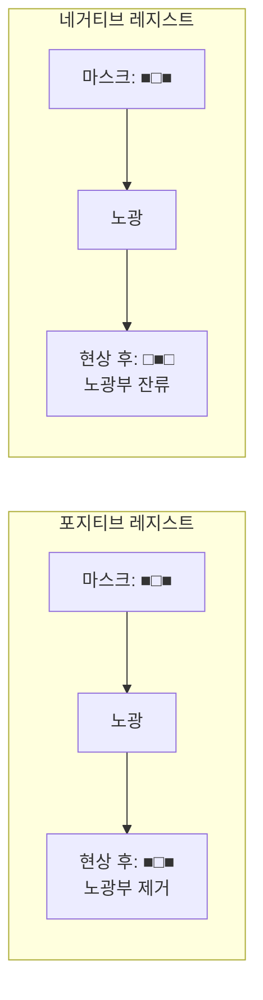

# 2.5 포토레지스트(PR) — 도포, 노광, 현상

## 이 챕터에서 배우는 것
- 포토레지스트의 역할과 구성 성분
- 포지티브 vs 네거티브 레지스트
- 화학증폭형 레지스트(CAR)의 동작 원리
- 도포(Coating), 노광(Exposure), 현상(Development) 각 단계의 상세
- EUV 레지스트의 새로운 도전 — RLS 트릴레마
- AI 관점에서의 레지스트 데이터 활용

---

## 포토레지스트: 빛에 반응하는 잉크

이전 챕터들에서 광원(2.3장), 스캐너(2.2장), 마스크(2.4장)를 다뤘다. 빛이 있고, 빛을 투사하는 장비가 있고, 투사할 패턴이 있다. 이제 그 빛을 받아 화학적으로 반응하여 패턴을 **기록**하는 재료가 필요하다. 그것이 **포토레지스트(Photoresist, PR)**다.

포토레지스트는 빛(자외선)에 노출되면 화학적 성질이 변하는 **감광성 고분자 재료**로, 포토리소그래피의 "잉크"이자 "인화지" 역할을 한다. 카메라 필름이 빛을 받은 곳의 은 입자가 환원되어 상(像)을 기록하는 것처럼, 포토레지스트는 빛을 받은 곳의 고분자 구조가 변하여 회로 패턴을 기록한다.

포토레지스트는 세 가지 핵심 성분으로 구성된다. **수지(Resin/Polymer)**는 막의 골격으로, 현상 후에도 형태를 유지하고 이후 식각에서 보호막 역할을 하는 구조체다. **감광제(PAC 또는 PAG)**는 빛에 반응하여 수지의 용해도를 변화시키는 핵심 화학 성분으로, 마치 전기 스위치처럼 빛이 닿으면 ON/OFF가 바뀌는 역할이다. **용매(Solvent)**는 수지와 감광제를 균일하게 용해시켜 액체 상태로 만들어 도포를 가능하게 하며, 도포 후 소프트 베이크에서 증발하여 고체 막만 남긴다.

---

## 포지티브 vs 네거티브: 빛을 받은 곳이 남는가, 사라지는가

포토레지스트는 빛에 노출된 부분의 운명에 따라 두 종류로 나뉜다.

**포지티브 레지스트(Positive Resist)**에서는 빛을 받은 부분의 용해도가 증가하여 현상에서 **제거**된다. 마스크의 투명 부분(빛이 통과하는 곳)이 웨이퍼에서 레지스트가 없어지는 곳이 되므로, **마스크와 동일한 패턴**이 웨이퍼에 남는다. 직관적이고, 해상도가 우수하며, 패턴 가장자리의 선명도가 높아 **현대 반도체의 절대적 주류**다.

**네거티브 레지스트(Negative Resist)**에서는 빛을 받은 부분이 **경화(Cross-linking)**되어 현상에서 잔류한다. 빛을 받지 않은 부분이 용해되어 제거되므로, **마스크의 반전 패턴**이 웨이퍼에 남는다. 빛에 의한 경화 과정에서 팽윤(Swelling) — 현상액을 흡수하여 부풀어 오르는 현상 — 이 발생하여 미세 패턴의 해상도가 떨어지는 단점이 있다. 다만 특정 공정(후공정 패키징, 일부 MEMS)에서는 두꺼운 레지스트와 높은 접착력이 필요한 경우가 있어 네거티브가 여전히 사용된다.

한 가지 흥미로운 점은, 최근 EUV 공정에서 **NTD(Negative Tone Development)**라는 기법이 주목받고 있다는 것이다. 포지티브 CAR을 사용하되 현상을 유기 용매(n-butyl acetate 등)로 수행하여, 노광되지 않은 부분을 용해시키는 방식이다. 레지스트 자체는 포지티브이지만 현상 결과는 네거티브처럼 동작한다. 특정 패턴 구조(라인/스페이스에서 좁은 라인을 남기는 경우 등)에서 해상도와 프로파일 면에서 유리하기 때문이다.

---

## 화학증폭형 레지스트 (CAR): 적은 빛으로 큰 반응을

### 왜 증폭이 필요했는가

KrF(248nm) 이전의 레지스트는 **비증폭형**이었다. 빛이 직접 감광제를 분해하고, 분해된 양에 비례하여 용해도가 변하는 단순한 메커니즘이다. 하지만 파장이 짧아질수록 문제가 생겼다. 광자 에너지가 높아지면서 동일한 화학 변화를 일으키는 데 필요한 광자 수는 줄어들지만, 광원 출력의 한계와 레지스트의 흡수 특성 때문에 필요한 **Dose(노광 에너지, mJ/cm²)**가 증가하는 경향이 있었다. Dose가 올라가면 노광 시간이 길어지고, 처리량(throughput)이 떨어지며, 장비의 경제성이 악화된다.

1980년대 IBM의 이토 히로시(Hiroshi Ito)와 그랜트 윌슨(C. Grant Willson)이 개발한 **화학증폭형 레지스트(CAR, Chemically Amplified Resist)**는 이 문제를 우아하게 해결했다. 적은 빛으로 큰 화학적 변화를 만드는 "증폭" 메커니즘을 도입한 것이다. 이 혁신으로 두 사람은 후에 미국 국가 기술 메달을 수상했다.

### CAR의 동작 원리: 세 막의 드라마

CAR의 동작은 세 단계로 나뉜다. 각 단계가 별도의 시간과 장소에서 일어나며, 이 분리가 CAR의 특성과 AI 모델링의 핵심을 결정한다.

**제1막: 노광(Exposure)** — 스캐너에서. 마스크를 통과한 빛이 레지스트에 도달하면, 레지스트 안에 분산된 **PAG(Photo-Acid Generator, 광산발생제)** 분자가 빛을 흡수하여 **산(Acid, H⁺)**을 생성한다. 이 단계에서 생성되는 산의 양은 적다 — 광자 하나가 PAG 하나를 분해하여 산 하나를 만들 뿐이다.

**제2막: PEB(Post-Exposure Bake)** — 트랙의 핫플레이트에서. 노광 후 웨이퍼가 트랙으로 돌아와 열처리를 받는다. 여기서 **증폭의 마법**이 일어난다. 열에 의해 산이 확산하면서, 주변 수지의 **보호기(Protection Group)**를 떼어내는 촉매(Catalyst) 반응을 일으킨다. 핵심은 산이 보호기를 하나 떼어내도 자기 자신은 소모되지 않고 재생된다는 것이다. **하나의 산 분자가 수십~수백 개의 보호기를 연쇄적으로 제거**한다. 이것이 "화학 증폭"의 본질이다.

**제3막: 현상(Development)** — 트랙의 현상 모듈에서. 보호기가 제거된 수지는 극성이 바뀌어(소수성 → 친수성) TMAH 현상액에 녹는다. 보호기가 그대로인 수지는 녹지 않는다. 이 용해도 차이가 패턴을 형성한다.

소프트웨어로 비유하면, CAR은 **이벤트 드리븐 아키텍처**다. 광자 하나가 트리거(이벤트)가 되어 소량의 산을 생성하고, 이 산이 PEB라는 처리 단계에서 **연쇄 반응(Chain Reaction)** 핸들러를 실행한다. 적은 입력(광자)으로 큰 출력(대량의 화학 변화)을 만드는 비동기 증폭 패턴이다.

### PEB가 CD를 지배한다

![[peb_temp_vs_cd.png|PEB 온도 vs CD 변화 그래프]]

CAR에서 패턴의 실질적 형성은 노광이 아니라 **PEB 단계**에서 일어난다는 점이 AI 모델링에서 매우 중요하다. PEB 온도가 산의 확산 속도(Arrhenius 관계)를 결정하고, 확산 거리가 반응 영역의 크기를 결정하며, 그것이 곧 **CD(선폭)**를 결정한다.

수치로 말하면, PEB 온도가 1°C 변하면 CD가 약 **1~2nm** 변한다. 최신 3nm 공정에서 CD 허용 오차가 ±1nm라면, PEB 온도 균일도는 ±0.5°C 이내, 이상적으로는 ±0.1°C 이내여야 한다. 트랙 장비의 핫플레이트에 내장된 수십 개의 열전대(Thermocouple)가 실시간으로 온도를 모니터링하며, 이 온도 데이터가 AI 기반 VM(Virtual Metrology)의 가장 강력한 피처 중 하나다.

---

## 도포 (Spin Coating): 회전이 균일성을 만든다

### 도포 과정

![[spin_coating_3step.svg|스핀 코팅 과정 단면도]]

2.1장에서 간략히 소개한 스핀 코팅의 세부를 살펴보자. 웨이퍼를 진공 척(Vacuum Chuck)에 고정한 후, 노즐에서 레지스트 용액을 웨이퍼 중앙에 **디스펜스(Dispense)**한다. 디스펜스량은 보통 1~2mL로, 300mm 웨이퍼 전체를 덮기에는 턱없이 부족한 양이다. 하지만 웨이퍼가 3,000~5,000 rpm으로 고속 회전하면 원심력에 의해 용액이 바깥으로 퍼지면서 균일한 박막이 형성된다. 여분의 용액은 웨이퍼 가장자리에서 날아가고, 마지막으로 가장자리에 두껍게 쌓이는 비드(Edge Bead)를 용매로 제거(EBR, Edge Bead Removal)한다.

### 막 두께를 결정하는 것들

스핀 코팅에서 막 두께는 놀라울 정도로 단순한 관계를 따른다 — **회전 속도의 제곱근에 반비례**한다(두께 ∝ 1/√rpm). 회전이 빠를수록 막이 얇아지고, 레지스트 점도(Viscosity)가 높을수록 두꺼워진다. 최신 ArF 레지스트의 두께는 약 80~150nm, EUV 레지스트는 **30~50nm**로 매우 얇다. EUV 레지스트가 얇아야 하는 이유는, 두꺼우면 패턴의 종횡비(Aspect Ratio)가 높아져 패턴이 쓰러지기(Collapse) 때문이다.

### 균일도가 왜 CD를 결정하는가

레지스트 두께가 불균일하면, 같은 Dose를 받아도 두꺼운 곳은 레지스트 밑바닥까지 충분히 반응하지 않고, 얇은 곳은 과도하게 반응한다. 결과적으로 CD가 위치마다 달라진다. 목표 균일도는 300mm 웨이퍼 전체에서 **±1nm 이내** — 평균 두께 100nm 대비 1%의 균일도다. 이 균일도를 달성하기 위해 디스펜스 위치, 회전 프로파일(가속→정속→감속), 주변 온도/습도, 용매 증발 조건이 모두 정밀하게 제어된다.

---

## 현상 (Development): 패턴이 드러나는 순간

### 현상액과 현상 방식

업계 표준 현상액은 **TMAH(Tetramethylammonium Hydroxide, 테트라메틸암모늄 히드록사이드)** 2.38% 수용액이다. 이 농도가 사실상 글로벌 표준으로 고정되어 있어, 레지스트 제조사가 다르더라도 현상 조건이 호환된다.

가장 보편적인 현상 방식은 **퍼들 현상(Puddle Development)**이다. 현상액을 웨이퍼 위에 균일하게 올려 "웅덩이(Puddle)"를 형성하고, 정해진 시간(보통 30~60초) 동안 화학 반응을 진행시킨 후, 순수(DI Water)로 린스하여 반응을 정지시킨다. 균일도가 특히 중요한 경우 현상액을 스프레이로 분사하는 방식도 사용된다.

### 현상 후 무엇이 잘못될 수 있는가

![[pr_profile_defects.svg|현상 후 프로파일 이상 비교]]

이상적인 레지스트 패턴의 단면은 수직 벽면(90° Sidewall)이다. 하지만 현실에서는 다양한 프로파일 이상이 발생한다.

**T-topping** — 패턴 상단이 양 옆으로 튀어나와 T자 형태가 되는 현상이다. 원인은 대기 중 아민(Amine)이 레지스트 표면의 산을 중화시켜, 표면의 보호기가 제거되지 않아 녹지 않는 것이다. **풋팅(Footing)** — 패턴 하단이 넓어지는 현상이다. 기판(질화물 등)에서 방출되는 아민이 레지스트 바닥의 산을 중화시켜 발생한다. **라운딩(Rounding)** — 패턴 상단 모서리가 둥글어지는 현상이다. 이런 프로파일 이상은 이후 식각에서 패턴 전사 오차로 이어지므로, CD-SEM이나 단면 TEM으로 모니터링된다.

---

## EUV 레지스트의 도전: RLS 트릴레마

![[rls_trilemma.svg|RLS 트릴레마 삼각형]]

EUV 리소그래피에서 레지스트는 근본적으로 새로운 딜레마에 직면한다 — **RLS 트릴레마(RLS Trade-off)**다.

세 가지 성능 지표가 있다. **R(Resolution)** — 미세한 패턴을 구현하는 능력, **L(LER/LWR)** — 패턴 가장자리의 거칠기(Line Edge/Width Roughness), **S(Sensitivity)** — 적은 Dose로도 반응하는 능력(곧 처리량). 문제는 **세 가지를 동시에 만족시킬 수 없다**는 것이다.

왜 동시에 안 되는가? 물리적 근원은 **광자 통계(Photon Statistics)**에 있다. 2.3장에서 설명한 것처럼, EUV 광자의 에너지는 DUV보다 14배 높다. 같은 Dose(에너지/면적)에서 광자 수는 1/14로 줄어든다. 광자 수가 적으면 포아송 분포(Poisson Distribution)에 의한 **Shot Noise**가 상대적으로 커지고, 이것이 레지스트 반응의 공간적 불균일 — 즉 LER — 로 나타난다.

감도(S)를 높여 적은 Dose로 동작하게 하면? 광자 수가 더 줄어 LER이 악화된다. 해상도(R)를 높이기 위해 레지스트를 얇게 하면? 패턴의 종횡비가 올라가 붕괴 위험이 증가하고, 흡수되는 광자 수도 줄어 LER이 악화된다. LER을 줄이려면? 더 많은 Dose를 쏟아부어야 하니 처리량이 떨어지고, EUV 스캐너의 운영 비용이 치솟는다.

이 트릴레마는 물리적 한계에서 비롯되므로, 기존 CAR의 화학을 아무리 최적화해도 근본적 해결은 어렵다. **재료 혁신**이 필요한 영역이다.

### 차세대 레지스트: 금속 산화물과 드라이 프로세스

가장 유망한 후보는 **금속 산화물 레지스트(Metal Oxide Resist, MOR)**다. 주석(Sn), 하프늄(Hf), 지르코늄(Zr) 등의 금속을 기반으로 한 나노클러스터 구조로, EUV 흡수율이 기존 CAR보다 훨씬 높다. 흡수율이 높다는 것은 같은 Dose에서 더 많은 광자를 흡수하여 효과적으로 활용한다는 뜻이므로, RLS 트릴레마의 한계를 밀어올릴 수 있다. Inpria(2023년 JSR에 인수)가 이 분야를 선도하고 있으며, TSMC와 삼성이 차세대 EUV 공정에 적용을 검토 중이다.

또 다른 방향은 **드라이 레지스트(Dry Resist)**다. 스핀 코팅(습식) 대신 CVD나 ALD(원자층 증착)로 레지스트 막을 형성하는 방식으로, 용매 없이 진공에서 직접 증착하므로 두께 균일도를 극대화할 수 있다. Lam Research의 "Dry Resist" 플랫폼이 대표적이다.

---

## AI 엔지니어에게 이것이 의미하는 것

트랙 장비에서 생성되는 데이터는 AI 기반 VM(Virtual Metrology)의 핵심 입력이다. 도포 모듈에서는 회전 속도, 가속도, 디스펜스 양, 챔버 온도/습도가 기록된다. PEB 모듈에서는 핫플레이트의 수십 개 열전대 온도, 베이크 시간, 챔버 분위기가 기록된다. 현상 모듈에서는 현상액 온도, 디스펜스 양, 현상 시간, 린스 조건이 기록된다.

이 중 AI 모델에서 가장 강력한 피처는 단연 **PEB 온도**다. CAR의 물리적 특성상 PEB 온도와 CD 사이에 거의 선형에 가까운 관계가 있으므로, PEB 온도 데이터만으로도 CD의 상당 부분을 예측할 수 있다. 기본적인 선형 회귀로도 높은 정확도를 달성하는 드문 영역이다. 여기에 레지스트 두께, Dose, Focus 등을 추가하면 비선형 효과까지 포착할 수 있다.

실용적으로 중요한 또 다른 과제는 **장비 매칭(Tool Matching)**이다. 팹에는 트랙이 수십 대, 스캐너가 수십 대 있으며, 웨이퍼가 어떤 트랙-스캐너 조합을 거치느냐에 따라 CD가 미세하게 달라진다. 이 장비 간 차이를 AI로 보정하여, 어떤 조합을 거치더라도 결과가 동일하도록 만드는 것이 매칭 문제이며, 팹 운영 효율에 직접적으로 영향을 미친다.

---

## 핵심 정리

포토레지스트는 빛에 반응하여 화학적 성질이 변하는 감광성 고분자로, 수지(골격) + 감광제(스위치) + 용매의 세 성분으로 구성된다. 포지티브 레지스트(노광부 제거)가 현대 반도체의 주류이며, **CAR(화학증폭형 레지스트)**은 광산발생제(PAG)에서 생성된 산이 PEB 단계에서 촉매 연쇄반응을 일으켜 적은 Dose로도 충분한 패턴을 형성한다. 이 메커니즘 때문에 **PEB 온도가 CD를 지배**하며(1°C → ~1-2nm CD 변화), AI 모델의 가장 강력한 피처다. 스핀 코팅의 두께 균일도(±1nm)와 현상 조건의 안정성이 CD 균일도를 좌우하며, EUV에서는 **RLS 트릴레마** — 해상도, 거칠기(LER), 감도를 동시에 최적화할 수 없는 물리적 한계 — 가 근본적 도전이다. 금속 산화물 레지스트와 드라이 레지스트가 이 한계를 넘기 위한 차세대 후보로 개발 중이다.

---

*다음 챕터: 2.6 해상도와 DOF — Rayleigh 방정식*
