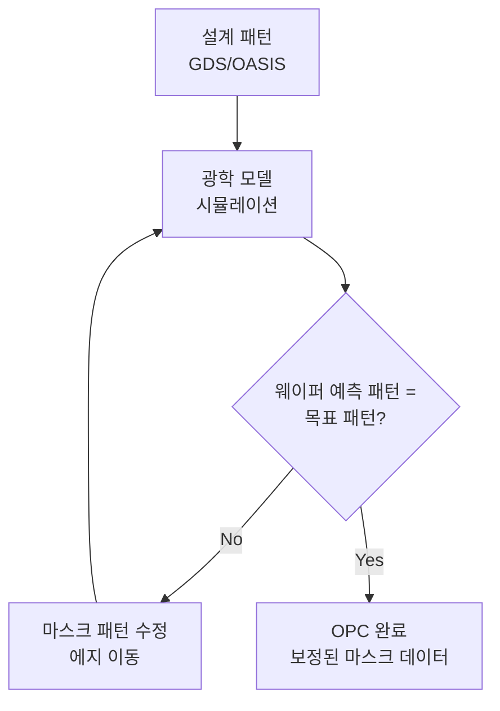

# 2.7 OPC와 RET — 광근접 효과 보정

## 이 챕터에서 배우는 것
- 광근접 효과(OPE)란 — 왜 마스크대로 찍히지 않는지
- OPC(Optical Proximity Correction)의 원리와 방법
- RET(Resolution Enhancement Technique)의 종류
- 소스-마스크 최적화(SMO)와 역설계 리소(ILT)
- 계산 리소그래피(Computational Lithography)와 AI의 접점

---

## 광근접 효과: 보낸 것과 받은 것이 다르다

지금까지 우리는 빛이 마스크를 통과하여 웨이퍼에 패턴을 전사하는 과정을 배웠다. 하지만 여기서 한 가지 불편한 진실을 마주해야 한다 — 마스크에 그린 패턴이 웨이퍼에 **그대로 찍히지 않는다**.

마스크에 깔끔한 직사각형 패턴을 그려도, 웨이퍼에 전사된 실제 패턴은 직사각형이 아니다. 모서리는 둥글어지고, 선폭은 주변 패턴의 밀도에 따라 달라지며, 선의 끝은 예상보다 짧아진다. 이것이 **광근접 효과(OPE, Optical Proximity Effect)**다.

왜 이런 일이 일어나는가? 2.6장에서 배운 **회절(Diffraction)** 때문이다. 마스크를 통과한 빛은 직진하지 않고 퍼진다. 패턴의 크기가 빛의 파장에 가까워질수록 회절이 심해지고, 인접 패턴의 회절광이 서로 간섭하여 빛의 강도 분포가 왜곡된다. 그 결과 레지스트에 도달하는 빛의 패턴이 마스크의 패턴과 달라지는 것이다.

주요 현상을 구체적으로 보면 — **코너 라운딩(Corner Rounding)**은 직각 모서리가 둥글게 변형되는 것으로, 광학 시스템이 직각이라는 "급격한 변화"를 전달할 수 있는 공간 주파수 대역폭이 부족하기 때문이다(저역 통과 필터처럼 동작). **라인엔드 숏트닝(Line-End Shortening)**은 선의 끝이 예상보다 짧아지는 현상으로, 선 끝에서는 빛이 세 방향으로 회절하여 빛 강도가 집중적으로 약해진다. **ISO-Dense Bias**는 고립(Isolated) 패턴과 밀집(Dense) 패턴의 선폭이 달라지는 것으로, 밀집 패턴에서는 인접 패턴의 회절광이 서로 간섭하여 빛의 분포가 고립 패턴과 다르기 때문이다.

소프트웨어 엔지니어에게 비유하면, OPE는 **네트워크 전송에서의 신호 왜곡**과 같다. 송신(마스크)한 데이터와 수신(웨이퍼)한 데이터가 채널(광학 시스템)의 특성 때문에 달라진다. 이 "전송 왜곡"을 알고 있다면, 송신 측에서 미리 **반대로 왜곡**해두면 수신 측에서 원래 의도한 데이터를 복원할 수 있다. 이것이 바로 OPC의 핵심 아이디어다.

---

## OPC: 미리 왜곡하여 정확히 찍기

### 아이디어의 단순함

**OPC(Optical Proximity Correction, 광근접 효과 보정)**의 핵심 아이디어는 놀라울 정도로 단순하다. 웨이퍼에서 모서리가 둥글어질 것을 알고 있으니, **마스크에서 모서리를 반대로 뾰족하게(Serif 추가)** 만든다. 선 끝이 짧아질 것을 알고 있으니, **마스크에서 선 끝을 미리 길게(Hammer-Head 추가)** 만든다. 고립 패턴이 밀집 패턴보다 넓게 찍힐 것을 알고 있으니, **마스크에서 고립 패턴을 미리 좁게** 만든다.

왜곡을 예측하고, 그 반대의 왜곡을 마스크에 적용하면, 두 왜곡이 상쇄되어 웨이퍼에서 원래 의도한 패턴에 가까운 결과를 얻는다. 이것이 OPC의 전부다.

### Rule-Based OPC에서 Model-Based OPC로

초기(1990년대) OPC는 **규칙 기반(Rule-Based)**이었다. "패턴 끝에 20nm 세리프를 추가하라", "고립 선폭은 5nm 넓히고 밀집 선폭은 3nm 좁혀라" 같은 사전 정의된 규칙표를 적용했다. 단순하고 빠르지만, 현대의 수십억 개 패턴에 적용하려면 규칙이 폭발적으로 증가하고, 규칙 간 충돌이 발생하며, 패턴의 복잡한 상호작용을 포착하지 못한다.

현재 주류는 **모델 기반(Model-Based) OPC**다. 빛의 회절과 레지스트의 화학 반응을 **물리적으로 시뮬레이션**하여, 마스크 패턴을 반복적으로 보정한다.

이 루프를 풀어쓰면 — 현재 마스크 패턴으로 웨이퍼 전사 결과를 시뮬레이션하고, 목표 패턴과 비교한다. 차이가 있으면 마스크의 에지(Edge)를 nm 단위로 이동시킨다. 수정된 마스크로 다시 시뮬레이션하여 비교한다. 이것을 **수렴할 때까지(보통 10~50회 반복)** 계속한다. 경사 하강법(Gradient Descent)으로 손실 함수를 최소화하는 머신러닝의 학습 루프와 구조적으로 동일하다.

문제는 **계산량**이다. 현대 칩 하나의 설계 파일(GDS/OASIS)은 수 TB에 달하고, 그 안의 패턴 에지는 수십억~수백억 개다. 각 에지마다 광학 시뮬레이션을 돌리고, 10~50회 반복해야 하니, 하나의 칩 레이어의 OPC에 수천~수만 CPU 코어로 **수 시간에서 수일**이 소요된다. EDA 업계에서 가장 계산 집약적인 작업 중 하나이며, 이것이 AI 가속의 기회가 되는 이유다.

---

## RET: 해상도를 한계 너머로 밀어붙이는 종합 도구 상자

OPC는 **RET(Resolution Enhancement Technique, 해상도 향상 기법)**의 한 종류다. RET는 Rayleigh 방정식의 k₁을 줄여 해상도를 향상시키는 모든 기술을 포괄하는 상위 개념이다.

### Off-Axis Illumination (OAI, 비축 조명)

2.2장에서 스캐너의 조명 시스템이 빛의 형태를 조절할 수 있다고 했다. 전통적인 수직 조명(Conventional Illumination) 대신 **경사진 각도**로 빛을 입사시키면, 패턴에 의한 회절광 중 렌즈에 들어오는 차수(Order)가 달라져 해상도와 DOF가 향상된다.

구체적으로 어떻게 작동하는가? 2.6장의 k₁ = 0.25 한계를 떠올려 보자. 0차와 ±1차 회절광이 모두 렌즈에 들어와야 패턴이 형성되는데, 수직 조명에서는 1차 회절광의 각도가 렌즈의 NA를 넘어가면 포착되지 않는다. OAI에서는 조명을 기울여 0차 회절광과 한쪽 1차 회절광이 **모두 렌즈 안에 들어오도록** 조정한다. 이로써 같은 NA에서도 더 미세한 패턴을 해상할 수 있다.

주요 조명 형태는 네 가지다. **Annular(고리형)**는 링 형태로 다방향 패턴에 범용적이며, **Dipole(양극)**은 두 개의 극으로 한 방향(수직 또는 수평) 패턴에 최적이다. **Quadrupole(사극)**은 네 개의 극으로 수직+수평 패턴에 효과적이고, **Freeform(자유 형태)**은 SMO(후술)로 최적화된 임의 형태의 조명이다.

### SRAF (Sub-Resolution Assist Feature)

실제 웨이퍼에 전사되지 않을 정도로 작은 **보조 패턴**을 메인 패턴 옆에 배치하는 기법이다. 이 보조 패턴은 너무 작아서 웨이퍼에는 나타나지 않지만, 광학적으로는 존재하여 메인 패턴 주변의 **회절 환경을 변화**시킨다.

왜 이것이 유용한가? 고립 패턴은 밀집 패턴과 다른 회절 조건에 놓여 CD가 달라진다(ISO-Dense Bias). 고립 패턴 옆에 SRAF를 놓으면, 광학적으로 마치 밀집 패턴처럼 회절이 일어나 ISO-Dense Bias가 줄어들고, 공정 윈도우가 넓어진다. SRAF의 위치, 크기, 개수를 최적화하는 것 자체가 복잡한 최적화 문제이며, OPC와 함께 수행된다.

---

## SMO와 ILT: 계산 리소그래피의 최전선

### SMO (Source-Mask Optimization): 조명과 마스크를 동시에 최적화

기존 접근은 조명 형태를 먼저 정하고(엔지니어의 경험으로), 그 다음 OPC를 수행하는 순차적 방식이었다. **SMO(Source-Mask Optimization)**는 이 둘을 **동시에 최적화**한다. 설계 패턴과 공정 요구 사항(CD 허용 범위, 공정 윈도우 목표 등)을 입력으로 받아, 최적의 조명 형태(Source)와 보정된 마스크 패턴(Mask)을 함께 산출한다.

SMO의 결과로 나오는 조명 형태는 인간 엔지니어가 직관적으로 선택하기 어려운 복잡한 Freeform인 경우가 많다. 최적화 공간이 OPC보다 훨씬 넓으므로(조명 + 마스크) 계산량도 더 무겁지만, 전체 공정 윈도우를 OPC 단독보다 유의미하게 넓힐 수 있다.

### ILT (Inverse Lithography Technology): 역으로 풀다

가장 진보된 OPC 기법인 **ILT(Inverse Lithography Technology, 역설계 리소그래피)**는 문제를 완전히 뒤집는다.

기존 OPC의 접근: "마스크를 조금씩 수정 → 시뮬레이션 → 비교 → 수정" (Forward 문제를 반복으로 해결)
ILT의 접근: "원하는 웨이퍼 패턴에서 **역산**하여 최적의 마스크 패턴을 직접 계산" (Inverse Problem)

이것은 머신러닝에서 **정방향 추론(Forward Inference)**과 **역문제(Inverse Problem)**의 차이와 같다. 정방향은 "입력 → 모델 → 출력"이고, 역문제는 "원하는 출력에서 역산하여 최적의 입력을 찾는" 것이다.

ILT로 생성된 마스크 패턴은 인간이 보기에 **극도로 비직관적**이다. 곡선, 비정형 형태, 불규칙한 돌기가 가득하다. 인간 엔지니어라면 절대 그리지 않을 형태다. 하지만 광학적으로는 최적화된 결과물이며, 웨이퍼에서의 패턴 충실도가 기존 Model-Based OPC보다 우수하다.

ILT의 문제는 **계산량**이다. 단일 칩 레이어 전체에 적용하면 계산 시간이 천문학적으로 늘어난다. 현재는 **핫스팟(Hot Spot)** — 공정 윈도우가 가장 좁아 리소 실패 위험이 높은 영역 — 에만 선택적으로 적용하고, 나머지는 기존 Model-Based OPC로 처리하는 하이브리드 방식이 주류다.

---

## 계산 리소그래피(Computational Lithography)와 AI의 만남

OPC, SMO, ILT는 본질적으로 **대규모 최적화 문제**다. 수십억 개의 변수(에지 위치)를 수십 회 반복 최적화하는 것은, AI/ML이 가장 잘 하는 일과 정확히 겹친다. 여기에 AI가 점점 깊이 파고들고 있다.

**OPC 가속** — 가장 임팩트가 큰 영역이다. 물리 기반 광학 시뮬레이션(Maxwell 방정식의 근사 해법)을 **신경망(Neural Network)으로 대체**하면, 정확도를 유지하면서 100~1000배 빠른 시뮬레이션이 가능하다. NVIDIA가 2023년에 발표한 **cuLitho**가 대표 사례다. GPU 가속 + AI를 OPC/ILT에 적용하여, TSMC, Synopsys, ASML과 협력하여 OPC 계산 시간을 **최대 40배 단축**했다. 수일 걸리던 작업이 수 시간으로 줄어든 것이다. 이것은 반도체 공정에서 AI가 가장 직접적으로 비용 절감을 달성한 사례 중 하나다.

**핫스팟 탐지** — 설계 패턴의 2D 이미지를 CNN에 입력하여 리소그래피 실패 가능성이 높은 영역을 사전에 탐지한다. 전체 시뮬레이션(수일) 없이 위험 영역을 수 분 안에 식별할 수 있어, 설계 검증 시간을 극적으로 단축한다.

**ILT 마스크 생성 가속** — GAN이나 Diffusion Model로 ILT 마스크 패턴을 반복 최적화 없이 **한 번의 추론(One-Shot)**으로 근사하는 연구가 활발하다. 정확도는 기존 ILT에 미치지 못하지만, 초기 솔루션(Warm Start)으로 사용하여 후속 최적화의 수렴을 가속시키는 방식으로 실용화되고 있다.

**시뮬레이션-실측 갭 모델링** — OPC 모델의 시뮬레이션 예측과 실제 CD-SEM 측정 결과의 차이(Model-to-Silicon Gap)를 ML로 학습하여, OPC 모델의 정확도를 지속적으로 보정한다. 양산 데이터가 쌓일수록 모델이 개선되는 **자기 개선 루프**를 구현하는 것이다.

---

## AI 엔지니어에게 이것이 의미하는 것

OPC/RET 영역은 반도체 AI에서 **가장 큰 비즈니스 임팩트**를 낼 수 있는 분야 중 하나다. 그 이유는 세 가지다.

첫째, 계산 비용이 거대하다. 3nm 칩 하나의 OPC에 수천 CPU 코어가 수일 동작한다. 이 비용을 10배 줄이면 칩 설계 비용이 의미 있게 감소한다.

둘째, 데이터가 풍부하다. 설계 데이터(GDS/OASIS), OPC 후 마스크 데이터, 시뮬레이션 결과, 실측 CD-SEM 데이터가 모두 존재하며, 이들 사이의 매핑을 학습하는 것은 지도 학습의 이상적 설정이다.

셋째, 물리 모델과 데이터 모델의 결합(Physics-Informed ML)이 자연스럽다. 빛의 회절, 레지스트의 화학 반응은 물리적으로 잘 알려져 있으므로, 순수 블랙박스 ML보다 물리 법칙을 사전 지식으로 주입한 모델이 더 적은 데이터로 더 높은 정확도를 달성한다.

다만 이 영역에서의 AI 활용은 주로 EDA 기업(Synopsys, Cadence)과 장비 기업(ASML)이 주도하고 있으며, 팹 내부의 APC/VM과는 다른 기술 스택과 도메인 지식이 필요하다. SMILE 플랫폼은 팹 내부의 APC/VM에 집중하지만, OPC와의 인터페이스 — 예를 들어 양산 피드백으로 OPC 모델을 보정하는 루프 — 는 점점 중요해지고 있다.

---

## 핵심 정리

광근접 효과(OPE)는 빛의 회절로 인해 마스크 패턴과 웨이퍼 패턴이 달라지는 현상으로, 코너 라운딩, 라인엔드 숏트닝, ISO-Dense Bias 등이 대표적이다. **OPC(Optical Proximity Correction)**는 이 왜곡을 미리 예측하여 마스크에 반대 보정을 적용하는 기술이며, 현재 Model-Based OPC(물리 시뮬레이션 + 반복 최적화)가 주류다. RET는 OPC를 포함하여 Off-Axis 조명(OAI), PSM, SRAF 등 해상도를 k₁ 한계까지 밀어붙이는 모든 기술의 총칭이다. **SMO**는 조명과 마스크를 동시에 최적화하고, **ILT**는 원하는 웨이퍼 패턴에서 역산하여 최적 마스크를 계산하는 가장 진보된 기법이다. AI는 **OPC 시뮬레이션 가속(cuLitho, 40배 단축)**, 핫스팟 탐지, ILT 마스크 생성, 시뮬레이션-실측 갭 보정에 활발히 적용되고 있으며, 계산 리소그래피는 반도체 AI에서 가장 큰 비즈니스 임팩트를 낼 수 있는 분야 중 하나다.

---

*다음 챕터: 2.8 Overlay란 — 층간 정렬의 중요성*
