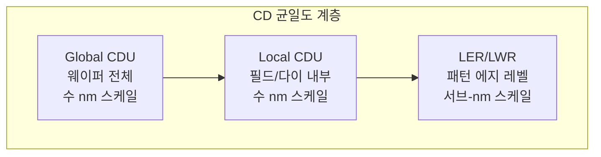
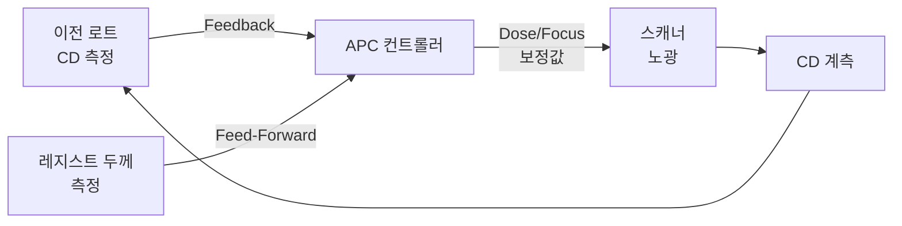

# 2.11 CD(Critical Dimension) — 선폭 제어의 핵심

## 이 챕터에서 배우는 것
- CD(Critical Dimension)의 정의와 중요성
- CD가 칩 성능과 수율에 미치는 영향
- CD 균일도(CDU)의 종류 — Global, Local, LER/LWR
- CD에 영향을 미치는 공정 변수
- CD 제어 전략 — Dose Mapper, APC
- AI 관점에서의 CD 데이터 활용

---

## CD란: 나노미터 단위의 선폭이 모든 것을 결정한다

Overlay 3부작을 마쳤다. 이제 SMILE 플랫폼의 다른 핵심 타겟인 **CD(Critical Dimension)**로 넘어간다.

**CD(Critical Dimension)**는 반도체 패턴에서 가장 중요한 **최소 선폭(또는 공간 폭)**을 말한다. 포토리소그래피에서 만들어진 패턴의 폭이 설계값과 얼마나 정확히 일치하는지를 나타내는 핵심 지표다. 설계에서 20nm 폭의 선(Line)을 의도했는데 실제로 22nm가 찍혔다면, CD 오차는 +2nm이다.

Overlay가 "층과 층이 정확히 맞는가?"(x, y 위치의 정확도)를 묻는다면, CD는 "패턴의 크기가 정확한가?"(폭의 정확도)를 묻는다. 둘 다 나노미터 단위의 정밀도가 요구되며, 둘 중 하나라도 규격을 벗어나면 칩은 동작하지 않거나 성능이 저하된다.

여러분에게 익숙한 비유를 들자면, CD는 문서의 **글꼴 크기(Font Size)**와 같다. 본문을 12pt로 설정했는데 실제 인쇄가 13pt로 나오면 레이아웃이 틀어지고, 글꼴 크기가 페이지마다 달라지면 문서 전체가 엉망이 된다. 반도체에서는 이 "글꼴 크기 변동"이 트랜지스터의 전기적 성능을 직접 바꾼다.

---

## CD가 트랜지스터와 수율을 지배하는 메커니즘

### 1nm의 차이가 만드는 것

트랜지스터의 **게이트 길이(Gate Length)** — 소스와 드레인 사이 채널의 물리적 길이 — 가 포토리소그래피의 CD로 직접 결정된다. 1.1장에서 트랜지스터를 "나노미터 스케일의 수도꼭지"라고 비유했다. CD는 이 수도꼭지의 "손잡이 크기"에 해당한다.

CD가 설계보다 **작으면**(게이트가 짧으면), 채널이 짧아져 전자가 빨리 이동하므로 구동 전류(Ion)가 증가한다 — 트랜지스터가 빨라진다. 하지만 동시에 게이트의 채널 제어력이 약해져 **누설 전류(Ioff)가 급증**한다. 스위치를 꺼도 전류가 흐르는 것이다. 반대로 CD가 설계보다 **크면**(게이트가 길면), 누설 전류는 줄지만 트랜지스터가 **느려진다**.

최신 3nm 공정에서 CD 1nm 변화는 트랜지스터의 **임계전압(Vt)을 수 mV** 변화시킨다. 이것이 개별 트랜지스터에서는 작게 보일 수 있지만, 칩 하나에 수십억 개의 트랜지스터가 있고 그 중 가장 느린 트랜지스터(가장 큰 CD)가 칩 전체의 최대 동작 주파수를 결정하므로, **CD의 변동(Variation)은 칩 전체의 성능을 지배**한다.

### CD 변동이 수율에 미치는 경로

CD가 규격(Spec) 범위를 벗어나면 해당 다이는 직접적으로 불량 처리된다. 하지만 규격 내에 있더라도, CD 균일도(CDU)가 나쁘면 — 즉 같은 칩 안에서 빠른 트랜지스터(작은 CD)와 느린 트랜지스터(큰 CD)가 혼재하면 — **타이밍 마진(Timing Margin)**이 줄어들어 특정 동작 조건에서 기능 불량이 발생한다. 1.8장에서 다룬 빈닝(Binning) 관점에서도, CD 변동이 크면 고성능 Bin(높은 클럭 주파수)에 들어가는 칩의 비율이 줄어들어 매출에 직접 타격을 준다.

---

## CD 균일도의 세 가지 스케일

CD 변동은 세 가지 공간 스케일에서 발생하며, 각 스케일의 원인과 대책이 다르다. 이 계층적 분해가 CD 엔지니어링의 기본 프레임워크다.



### Global CDU (웨이퍼 레벨)


웨이퍼 **전체**에 걸친 CD의 공간적 변동이다. 보통 느리게 변하는 **저주파(Low-Frequency) 패턴**으로 나타나며 — 전형적으로 "센터-엣지(Center-Edge)" 프로파일이다. 웨이퍼 중심과 가장자리에서 CD가 다르고, 그 차이가 1~3nm 수준이다.

원인은 다양하다. 2.5장에서 설명한 **스핀 코팅의 가장자리 효과**에 의한 레지스트 두께 불균일이 대표적이다 — 가장자리에서 레지스트가 약간 두꺼워지면 빛 흡수가 달라져 CD가 변한다. **PEB 온도의 웨이퍼 내 불균일**도 강력한 요인이다 — 핫플레이트의 중심과 가장자리에 0.5°C 차이가 있으면 CD가 ~1nm 변한다. 스캐너의 **Dose 균일도** 편차, 그리고 식각 장비의 **플라즈마 밀도 분포**도 기여한다.

Global CDU는 원인이 비교적 잘 알려져 있고, 변동이 느리고 연속적이므로 **보정하기 가장 쉬운** 스케일이다. Dose Mapper(후술)로 효과적으로 줄일 수 있다.

### Local CDU (필드/다이 레벨)

하나의 **노광 필드(26×33mm) 내부**에서의 CD 변동이다. 필드 중심과 가장자리의 광학 특성 차이(렌즈 수차), 마스크 CD의 공간적 불균일, 슬릿 조명의 강도 분포, 스캐닝 중의 미세 진동 등이 원인이다. 일반적으로 필드 내 1~2nm 수준의 변동이 있으며, 이 변동은 모든 필드에서 **반복적으로** 나타나는 특성이 있다(같은 렌즈와 마스크를 사용하므로).

Local CDU는 렌즈 조정, 마스크 CD 보정, 스캔 방향별 Dose 프로파일 조정 등으로 줄일 수 있지만, Global CDU보다 보정이 어렵다.

### LER/LWR (에지 레벨): 물리적 한계


**LER(Line Edge Roughness)**는 패턴 한쪽 에지의 거칠기 — 이상적으로는 매끄러운 직선이어야 할 에지가 실제로는 울퉁불퉁한 것이다. **LWR(Line Width Roughness)**는 선폭 자체의 변동으로, 양쪽 에지의 거칠기가 합쳐진 효과다.

```
설계:  |████████████████|  (매끄러운 직선)
실제:  |▓█▓▓█▓███▓█▓██▓|  (울퉁불퉁한 에지)
```

LER/LWR의 원인은 본질적으로 **확률적(Stochastic)**이다. 2.3장과 2.5장에서 설명한 **광자 통계(Shot Noise)** — 특히 EUV에서 광자 수가 적어 통계적 변동이 커지는 것 — 가 지배적 원인이다. CAR에서 산의 확산 거리가 확률적으로 변동하는 것, 고분자 수지의 분자 크기가 유한하여 에지가 분자 단위로 이산화되는 것도 기여한다. 일반적 크기는 1~3nm(3σ)이며, 패턴 폭이 20nm인 상황에서 LWR 3nm은 **15%의 변동**에 해당한다.

LER/LWR이 현대 공정에서 특별히 중요한 이유는, Global과 Local CDU는 Dose/Focus 보정으로 줄일 수 있지만, LER/LWR은 **물리적 한계(재료 특성, 광자 통계)**에 의한 것이므로 보정이 근본적으로 어렵다는 점이다. 2.5장의 RLS 트릴레마가 바로 이 문제를 다룬 것이다. 최신 공정에서 LER/LWR은 **CD 변동의 지배적 요인**이 되고 있으며, 이를 줄이려면 차세대 레지스트(금속 산화물 등)나 후처리 기법이 필요하다.

---

## CD에 영향을 미치는 공정 변수: 무엇이 선폭을 바꾸는가

포토리소그래피 관점에서 CD를 결정하는 주요 변수들의 민감도를 정리하면 다음과 같다.

| 변수 | CD에 미치는 영향 | 민감도 (대략) |
|:---|:---|:---|
| **Dose (노광 에너지)** | Dose ↑ → CD ↓ (포지티브 PR) | ~1nm per 1% Dose |
| **Focus (초점 위치)** | 디포커스 → CD 변화 (비선형) | ~1nm per 20nm Focus |
| **PEB 온도** | 온도 ↑ → CD ↓ (산 확산 증가) | ~1nm per 0.1°C |
| **레지스트 두께** | 두께 변화 → 빛 흡수 변화 → CD 변화 | ~0.5nm per 1nm 두께 |
| **마스크 CD** | 마스크 CD 오차 × MEEF | MEEF 의존적 |

이 중 **Dose**가 가장 직접적이고 조절하기 쉬운 CD 제어 변수다. Dose를 1% 올리면 CD가 약 1nm 줄어드는(포지티브 레지스트 기준) 거의 선형에 가까운 관계가 있어, Dose 조정이 CD 보정의 **1차 도구**가 된다. **PEB 온도**는 2.5장에서 상세히 다뤘듯이 CAR의 산 확산을 지배하므로 CD에 강력한 영향을 미친다. **Focus**는 2.6장의 Bossung 곡선에서 봤듯이 CD에 비선형적 영향을 미치며, Dose와 교락되어 있어 분리가 중요하다.

### MEEF: 마스크 오차가 증폭되는 현상


**MEEF(Mask Error Enhancement Factor)**는 마스크의 CD 오차가 웨이퍼에서 **증폭**되는 비율이다.

```
ΔCD_wafer = MEEF × ΔCD_mask / M
```
(M: 축소 배율, 보통 4)

이상적으로 MEEF = 1이면 마스크 오차가 축소비만큼(1/4) 줄어들어 그대로 전사된다. 하지만 k₁이 낮은(Rayleigh 해상도 한계에 가까운) 패턴에서는 **MEEF > 1** — 마스크의 작은 CD 오차가 웨이퍼에서 증폭된다. EUV의 가장 미세한 패턴에서 MEEF가 2~4에 달하기도 하는데, 이것은 마스크의 1nm CD 오차가 웨이퍼에서 2~4nm 오차로 나타난다는 뜻이다. MEEF가 높은 패턴일수록 마스크 CD 관리가 극도로 중요해지며, 2.4장에서 마스크 비용이 천문학적인 이유 중 하나가 바로 이 MEEF 때문이다.

---

## CD 제어 전략: Dose Mapper와 APC

### Dose Mapper: 웨이퍼 위치마다 다른 에너지를 쏜다

**Dose Mapper**는 웨이퍼 위치에 따라 **노광 Dose를 미세 조정**하여 Global CDU를 보정하는 기술이다. 아이디어는 직관적이다 — 레지스트가 두꺼운 곳(CD가 클 것으로 예상)에는 Dose를 더 주어 CD를 줄이고, 얇은 곳에는 Dose를 줄여 CD가 과도하게 작아지는 것을 방지한다.

보정의 입력은 여러 소스에서 올 수 있다. 레지스트 두께 측정(엘립소미터)으로부터의 두께 맵, 이전 로트의 CD 측정 결과로부터의 CD 편차 맵, 또는 AI 모델이 예측한 CD 분포 맵이 사용된다. 보정 단위는 **필드별(Per-Field)**부터 **스캔 내(Intra-Scan)**까지 가능하며, ASML의 FlexDose가 대표적 구현이다.

### APC: CD의 자동 피드백 루프

CD도 Overlay와 마찬가지로 **APC(Advanced Process Control)**의 Feed-Forward와 Feedback 루프로 자동 보정된다.



**Feed-Forward**: 레지스트 두께 맵이나 웨이퍼 형상 데이터를 노광 전에 측정하여, CD 편차를 사전에 예측하고 Dose를 선제적으로 조정한다. **Feedback**: 이전 로트(또는 이전 웨이퍼)의 CD 측정 결과에서 체계적 드리프트를 파악하고, 다음 로트의 Dose/Focus 기준값을 업데이트한다. 이 루프가 자동으로 돌아가면서 CD를 목표값 근처에 유지한다.

---

## AI 엔지니어에게 이것이 의미하는 것

CD 데이터의 구조는 Overlay와 유사하다.

```
(Wafer_ID, Field_X, Field_Y, Site_X, Site_Y, CD_target, CD_measured, CD_error)
```

AI 활용에서 가장 임팩트가 큰 것은 **CD 예측(Virtual Metrology, VM)**이다. 모든 다이의 CD를 직접 측정하는 것은 시간적/비용적으로 불가능하므로, 스캐너 로그(Dose, Focus, 정렬 데이터)와 트랙 데이터(PEB 온도, 레지스트 두께)를 입력으로 CD를 **예측**한다. 예측값이 충분히 정확하면 실제 측정을 줄이거나 대체할 수 있어, 계측 장비의 병목을 완화하고 전수 관리에 가까운 품질 관리를 실현한다. 이것이 3장과 4장에서 깊이 다룰 VM의 핵심이다.

**Dose 최적화** — 웨이퍼별 레지스트 두께 맵과 이전 층 CD 데이터를 기반으로, 다이별 최적 Dose 맵을 AI로 계산하여 Dose Mapper에 제공한다. **Root Cause 분석** — CD 이상이 발생했을 때, 다변량 데이터(트랙 센서, 스캐너 로그, 식각 데이터)를 분석하여 원인이 트랙인지 스캐너인지 식각인지를 자동 추정한다. **CDU 분해(Decomposition)** — 측정된 CD 변동을 Global/Local/LER 성분으로 수학적으로 분해하여, 어느 성분이 지배적인지, 어디에 개선 리소스를 집중해야 하는지를 파악한다.

중요한 것은 **CD와 Overlay가 독립이 아니라는 점**이다. 같은 스캐너의 Dose/Focus 조건이 CD와 Overlay **모두에** 영향을 미친다. Dose를 올려 CD를 줄이면 레지스트 프로파일이 바뀌어 Overlay 측정에 영향을 줄 수 있고, Focus를 조정하면 CD와 Overlay가 동시에 변한다. AI 모델에서 CD와 Overlay를 **동시에 최적화(Multi-Objective Optimization)**하는 것이 고급 과제이며, 이것은 4장에서 다룬다.

---

## 핵심 정리

CD(Critical Dimension)는 패턴의 최소 선폭으로, 트랜지스터의 게이트 길이를 직접 결정하며 1nm의 CD 변화가 임계전압과 누설 전류를 유의미하게 바꾼다. CD 균일도(CDU)는 **Global(웨이퍼 레벨)**, **Local(필드 레벨)**, **LER/LWR(에지 레벨)**의 세 가지 스케일로 분해되며, Global과 Local은 Dose/Focus 보정으로 줄일 수 있으나 LER/LWR은 광자 통계에 의한 물리적 한계로 보정이 근본적으로 어렵다. CD에 가장 큰 영향을 미치는 변수는 **Dose(~1nm/1%)**, **PEB 온도(~1nm/0.1°C)**, **Focus**이며, MEEF > 1인 패턴에서는 마스크 CD 오차가 웨이퍼에서 증폭된다. **Dose Mapper**와 **APC Feed-Forward/Feedback 루프**가 CD 제어의 핵심 도구이며, AI 기반 VM(Virtual Metrology)으로 전수 CD 관리에 접근하는 것이 SMILE 플랫폼의 중요한 가치 제안이다.

---

*다음 챕터: 2.12 CD 측정 — CD-SEM, Scatterometry(OCD)*
