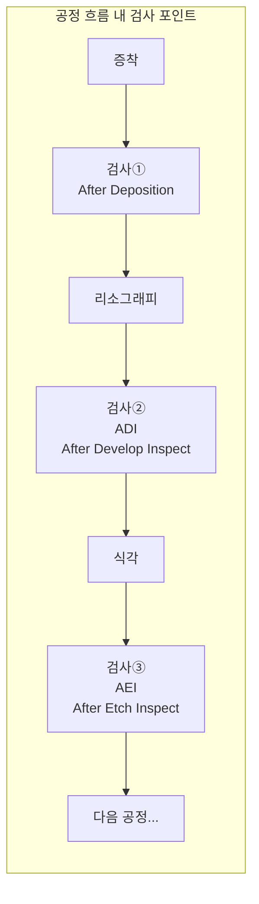
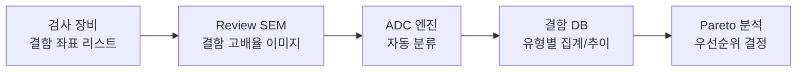

# 3.2 결함 검사(Defect Inspection)와 분류

## 이 챕터에서 배우는 것
- 결함 검사(Inspection)의 목적과 종류
- 광학 검사 vs 전자빔 검사의 원리와 차이
- 결함 분류(Defect Classification)의 방법론
- ADC(Automatic Defect Classification) — 자동 분류 시스템
- 결함 소스 분석(Defect Source Analysis)
- AI/딥러닝이 결함 검사를 혁신하는 방법

---

## 결함 검사의 목적: 적을 알아야 이길 수 있다

이전 챕터에서 수율을 결정하는 핵심 변수가 **결함 밀도(D₀)**라는 것을 배웠다. 그렇다면 다음 질문은 자연스럽다 — 결함을 어떻게 **찾고**, 어떤 **종류**인지 판별하며, 그 **원인**을 어떻게 추적하는가?

결함 검사(Defect Inspection)는 이 세 가지에 답하는 기술이다. 목적은 네 단계로 나뉜다. 웨이퍼 위의 결함을 찾아내는 **탐지(Detection)**, 찾아낸 결함의 종류를 식별하는 **분류(Classification)**, 어느 장비/공정에서 발생했는지 파악하는 **원인 추적(Source Analysis)**, 이 결함이 실제로 다이를 죽이는 Killer인지 무해한 Non-Killer인지 판별하는 **수율 영향 평가(Kill Probability)**.

여러분에게 익숙한 비유를 들자면, 결함 검사는 소프트웨어의 **테스트/QA 파이프라인**이다. 버그를 찾고(Unit Test = 탐지), 분류하고(Severity/Priority = 분류), 원인을 추적하고(Git Blame + Stack Trace = 소스 분석), 비즈니스 영향도를 평가한다(Impact Analysis = Killer 판별). 반도체의 "버그"가 물리적 결함이라는 점만 다르다.

---

## 검사 시점: 공정 흐름 속의 체크포인트

결함 검사는 공정의 특정 시점에 삽입된다. 모든 단계마다 검사할 수는 없으므로(검사 장비가 병목이 된다), 전략적으로 배치한다.



가장 중요한 두 시점이 있다. **ADI(After Develop Inspection)**는 레지스트 현상 직후, 식각 전에 수행하는 검사다. 이 시점이 특별한 이유는, 레지스트 패턴에 문제가 있으면 **Rework(재작업)**이 가능한 마지막 기회이기 때문이다. 레지스트를 벗기고 다시 코팅→노광→현상을 할 수 있다. 식각 후에는 되돌릴 수 없다. **AEI(After Etch Inspection)**는 식각 후 최종 패턴을 검사한다. Rework은 불가능하지만, 결함의 최종 형태를 확인하고, 식각 공정 자체의 문제를 탐지하는 데 필수적이다.

양산에서의 현실적 운영은 **샘플링 기반**이다. 모든 웨이퍼를 매 단계마다 검사하면 검사 장비가 병목이 되어 생산이 멈추므로, 보통 로트당 1~3장의 웨이퍼만, 주요 크리티컬 레이어만 검사한다. 이 샘플링의 한계 — 검사하지 않은 웨이퍼의 결함은 놓친다 — 가 Virtual Inspection(AI 기반 가상 검사)이 필요한 근본적 이유다.

---

## 광학 검사: 빛으로 빠르게 훑는다

### 원리와 두 가지 모드


![[bf_vs_df_inspection.svg|Bright Field vs Dark Field 검사 원리 비교]]

광학 검사는 **광학 현미경**으로 웨이퍼 표면을 고속 스캔하여, 정상 패턴과 다른 부분을 결함 후보로 탐지한다. 핵심은 **비교(Comparison)**다.

**Die-to-Die 비교**가 가장 보편적인 방법이다. 인접한 두 다이의 이미지를 픽셀 단위로 비교하여, 차이가 발생하는 부분을 결함 후보로 탐지한다. 전제 조건은 동일한 패턴이 반복되는 다이 구조여야 한다는 것이다. 설계가 동일하므로 두 다이의 이미지는 본래 같아야 하고, 차이가 있다면 그것은 결함이다. 소프트웨어에서 **Diff 도구**로 두 버전의 코드를 비교하는 것과 정확히 같은 원리다.

**Die-to-Database 비교**는 실제 이미지를 설계 데이터(GDS/OASIS)와 비교하는 방식이다. 비반복 패턴(스크라이브 레인, 특수 구조)도 검사할 수 있지만, 설계 데이터를 렌더링하여 비교하므로 계산 부하가 높다.

광학 검사에는 두 가지 조명 모드가 있다. **Bright Field(BF, 밝은 필드)**는 정반사광을 관찰하여 패턴 결함 탐지에 우수하고, **Dark Field(DF, 어두운 필드)**는 산란광만 관찰하여 파티클 탐지에 우수하다. BF에서는 정상 표면이 밝고 결함이 어두운 점으로 나타나며, DF에서는 정상 표면이 어둡고 결함(파티클)이 밝은 점으로 빛난다.

### KLA의 독점적 위치

광학 검사 장비 시장은 **KLA**가 약 80%의 점유율로 사실상 독점하고 있다. KLA의 29xx/39xx 시리즈가 BF와 DF를 모두 지원하며, 양산 팹의 표준 장비로 자리잡았다. 이 독점적 위치는 수십 년간의 광학 설계 노하우와 알고리즘 축적에서 비롯된 것으로, 반도체 장비 산업의 또 다른 "ASML 같은" 현상이다.

### 광학 검사의 한계: 패턴이 빛보다 작아지면

광학 검사도 빛의 파장에 의한 해상도 한계를 받는다. 광원 파장이 약 193~266nm이므로 이론적 해상도는 약 100nm이고, 고급 알고리즘을 동원해도 실제 탐지 한계는 약 20~30nm다. 여기서 역설이 발생한다 — 첨단 공정의 패턴은 20nm 이하이므로, **만들어진 패턴보다 검사의 해상도가 낮은** 상황이 된다. 특히 2.14장에서 다룬 EUV의 확률적 결함(Micro-Bridge, Line Break)은 크기가 수 nm에 불과하여 광학 검사로 잡기 어려운 경우가 많다. 이 갭을 메우는 것이 e-beam 검사의 역할이다.

---

## 전자빔 검사: 느리지만 확실하게

### 원리

e-beam 검사는 2.12장의 CD-SEM과 유사한 원리로, **전자빔**으로 웨이퍼를 스캔하여 nm 수준의 해상도로 결함을 탐지한다. 광학의 해상도 한계를 넘어 **더 작은 결함**을 잡을 수 있고, 전자의 물질 투과력을 이용하여 표면 아래의 **매몰 결함(Buried Defect)**도 탐지할 수 있다.

### Voltage Contrast: e-beam만의 킬러 기능


![[voltage_contrast_principle.png|Voltage Contrast 원리 — 정상 연결 vs 단선(Open)]]

e-beam 검사의 가장 강력한 고유 기능은 **Voltage Contrast(전압 대비)**다. 패턴에 전자빔을 조사하면 이차전자가 방출되는데, 패턴의 **전기적 연결 상태**에 따라 이차전자의 방출 강도가 달라진다.

정상적으로 접지(Ground)에 연결된 패턴은 주입된 전자가 빠져나가므로 전하가 축적되지 않고, 이차전자가 정상적으로 방출되어 **밝게** 보인다. 반면 단선(Open)되어 접지에서 분리된 패턴은 전자가 빠져나갈 수 없어 전하가 축적되고, 축적된 음전하가 이차전자의 방출을 억제하여 **어둡게** 보인다.

이 밝기 차이(Contrast)로 **전기적 단선/단락을 시각적으로 구분**할 수 있다. 패턴을 물리적으로 파괴하지 않고 전기적 연결 상태를 확인하는 사실상 유일한 비파괴 방법이며, 특히 비아(Via)의 단선(Open Via) 탐지에 결정적이다.

### e-beam 검사의 한계와 사용 패턴

최대 약점은 **속도**다. 광학 검사 대비 100~1,000배 느려 전체 웨이퍼 검사는 현실적으로 불가능하다. 따라서 양산에서는 결함이 발생하기 쉬운 **핫스팟(Hot Spot)**만 선택적으로 검사하거나, 광학 검사에서 탐지된 결함의 위치로 이동하여 고배율 이미지를 촬영하는 **Defect Review** 용도로 사용한다.

여기서 2.7장의 OPC/RET와 연결된다 — OPC 시뮬레이션이나 AI 핫스팟 예측으로 결함 위험이 높은 패턴을 사전에 식별하고, 그 패턴만 e-beam으로 검사하면 검사 효율을 극대화할 수 있다.

---

## 결함 분류: 적의 정체를 밝히다

### 왜 분류가 필요한가

검사 장비가 탐지하는 결함 수는 웨이퍼당 수백~수천 개에 달할 수 있다. 하지만 이 모든 결함이 다이를 죽이는 Killer는 아니다. 작은 파티클이 비활성 영역(패드 위, 더미 패턴)에 떨어지면 전혀 영향이 없고, 결함 크기가 극히 작으면 전기적 영향이 미미할 수도 있다. 결함의 **종류를 분류**해야 원인을 추적하고, 어떤 결함부터 대응할지 우선순위를 정할 수 있다.

주요 결함 유형은 이물질이 부착된 **파티클(Particle)**, 인접 패턴이 연결되거나 끊어지는 **패턴 결함(Pattern Defect — Bridge, Break, Missing Hole)**, CMP나 핸들링에 의한 **스크래치(Scratch)**, 세정 불량으로 남은 **잔류물(Residue)**, 증착 불량에 의한 **막 결함(Film Defect — Pinhole, Delamination)** 등이 있다.

### ADC: 결함 분류의 자동화


![[defect_sem_types.png|결함 유형별 SEM 이미지 — 브릿지, 파티클, 미오픈]]

검사 장비가 결함의 좌표를 추출하면, **Defect Review SEM**이 해당 위치로 이동하여 고배율 이미지를 촬영하고, **ADC(Automatic Defect Classification)** 소프트웨어가 이미지에서 결함 유형을 자동 분류한다.



ADC의 진화가 AI의 반도체 진입을 상징적으로 보여준다. 초기 ADC는 **Rule-Based** — "크기가 X 이상이고 형태가 원형이면 파티클" 같은 수동 규칙을 적용했다. 정확도는 약 70~80% 수준이었다. 다음 세대는 **전통 ML**(SVM, Random Forest)로, 이미지에서 수동으로 추출한 특징(면적, 종횡비, 밝기 분포 등)을 입력으로 분류했다. 현재는 **CNN/딥러닝** 기반 ADC가 주류로, SEM 이미지를 직접 입력하여 특징 추출과 분류를 동시에 학습한다. 분류 정확도가 **~95% 이상**으로 향상되었고, 새로운 결함 유형이 등장해도 이미지 데이터를 추가하여 재학습하면 된다.

---

## 결함 소스 분석: 범인을 찾아라

### Defect Pareto: 가장 많은 적부터 제거한다

결함을 유형별로 집계하여 **발생 빈도 순으로 정렬**한 것이 Defect Pareto(파레토)다. 파레토 법칙 — 상위 20%의 원인이 80%의 결함을 만든다 — 이 반도체 결함에도 놀라울 정도로 잘 적용된다.

```
브릿지 결함:     ████████████████████  45%
파티클:          ██████████████       30%
미오픈 홀:       █████████            15%
스크래치:        ████                  8%
기타:            █                     2%
```

파레토 분석의 실전적 의미 — 브릿지 결함을 해결하면 전체 결함의 45%가 사라진다. 제한된 엔지니어링 리소스를 **가장 큰 적부터** 집중하는 것이 수율 램프업의 기본 전략이다.

### 장비-결함 상관관계: 어느 장비가 범인인가

수율 엔지니어의 핵심 질문 — "이 결함은 어느 장비에서 발생하는가?" 같은 유형의 결함이 **특정 장비를 거친 웨이퍼에서만** 높은 빈도로 나타난다면, 그 장비가 원인일 가능성이 높다. 식각 챔버 A를 거친 웨이퍼에서 브릿지 결함이 급증하면 챔버 A를 점검하고, 특정 트랙 모듈에서 파티클이 늘면 해당 모듈을 세정한다. 이 장비-결함 상관분석이 3.3장의 SPC, 3.4장의 FDC와 직결되며, AI가 다변량 분석으로 복잡한 상관관계를 자동 탐지하는 것이 핵심 가치다.

---

## AI/딥러닝이 결함 검사를 혁신하는 방법

AI는 결함 검사의 거의 모든 단계를 변화시키고 있다.

**CNN 기반 ADC**가 가장 성숙한 활용이다. SEM 이미지를 CNN(ResNet, EfficientNet 등)으로 분류하여 기존 Rule-Based의 약 80% 정확도를 **95% 이상**으로 끌어올렸다. 특히 형태가 유사한 결함 유형(브릿지 vs. 잔류물 등)의 구분에서 인간 전문가와 동등하거나 우수한 성능을 보인다.

**노이즈 필터링(Nuisance Filtering)**은 광학 검사의 실전적 난제를 해결한다. 광학 검사에서 탐지된 "결함" 중 상당수(때로는 50% 이상)는 정상적인 패턴 변동, 색상/그레인 차이, 측정 노이즈에 의한 **오탐지(False Positive)**다. 딥러닝으로 진짜 결함과 노이즈를 구분하면, 엔지니어가 수동으로 검토해야 하는 결함 수가 대폭 줄어들어 생산성이 향상된다. 이것은 이메일 스팸 필터와 같은 문제 구조다.

**Virtual Inspection (가상 검사)**은 가장 야심찬 활용이다. 장비 센서 데이터(FDC)만으로 결함 발생을 **예측**하여, 실제 검사 장비를 거치지 않고도 결함 위험 웨이퍼를 사전 식별한다. 검사 장비의 병목을 해소하고, 샘플링이 아닌 **전수 모니터링**에 접근할 수 있다.

**결함-수율 상관 모델**은 어떤 결함이 실제로 수율에 영향을 미치는지를 학습한다. 결함의 위치(활성 영역 vs. 비활성 영역), 크기, 유형과 최종 전기적 테스트의 Pass/Fail 결과를 매칭하여 각 결함 유형의 **Killer Ratio(치명률)**를 산출한다. Killer Ratio가 높은 결함에 집중하고 낮은 결함은 무시함으로써, 엔지니어링 리소스의 효율을 극대화한다.

---

## AI 엔지니어가 알아야 할 것

결함 데이터의 구조는 다음과 같다.

```
(Wafer_ID, Defect_ID, X, Y, Size, Intensity, Class, Kill_Prob,
 Process_Step, Equipment_ID, SEM_Image_Path)
```

이 데이터에는 고유한 ML 도전이 있다. 결함 유형별 발생 빈도가 극도로 불균형하여(파티클 수천 개 vs. 희귀 결함 수 개) **클래스 불균형** 문제가 심각하다 — Oversampling, Focal Loss, 계층적 분류 등이 필요하다. SEM 이미지의 수동 라벨링에 전문 엔지니어의 시간이 필요하여 **레이블링 비용**이 높으므로 Semi-Supervised Learning이나 Active Learning이 유효하다. 공정이나 장비가 바뀌면 결함의 형태도 변하는 **도메인 전이(Domain Shift)** 문제에는 Transfer Learning이나 Domain Adaptation으로 대응한다. 그리고 검사 결과가 수 분 내에 나와야 공정 피드백이 가능한 **실시간 요구**는 모델의 추론 속도에 제약을 건다.

---

## 핵심 정리

결함 검사는 **탐지→분류→원인 추적→수율 영향 평가**의 네 단계로 구성된다. **광학 검사**는 Die-to-Die 비교로 고속 스캔하며 KLA가 약 80% 시장 점유율을 가진 표준 장비이나, 패턴이 20nm 이하로 미세해지면 탐지 감도에 한계가 있다. **e-beam 검사**는 nm 수준 해상도와 **Voltage Contrast**(비파괴 전기적 연결 확인)가 강점이나 속도가 100~1,000배 느려 핫스팟 검사와 Defect Review에 사용된다. **ADC**는 CNN 기반으로 진화하여 결함 분류 정확도가 95% 이상에 도달했으며, **Defect Pareto**와 장비-결함 상관분석으로 원인을 추적한다. AI의 최전선은 노이즈 필터링, Virtual Inspection(FDC 기반 결함 예측), 결함-수율 Killer Ratio 학습이다.

---

*다음 챕터: 3.3 SPC(통계적 공정 관리) — 공정 안정성의 파수꾼*
