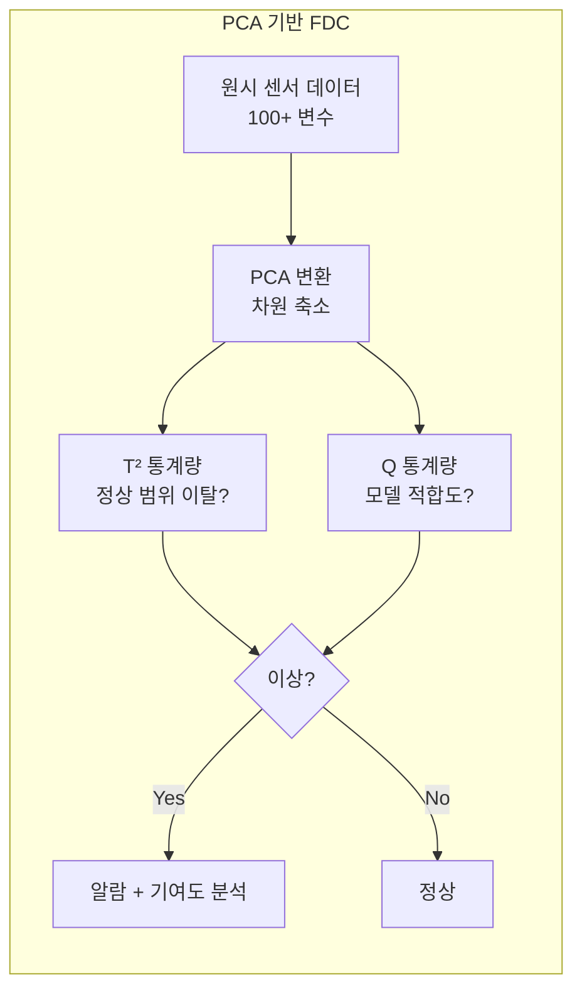

# 3.4 FDC(결함 탐지와 분류) — 장비 레벨 감시

## 이 챕터에서 배우는 것
- FDC(Fault Detection and Classification)의 개념과 SPC와의 차이
- 장비 센서 데이터의 종류와 특성
- Trace 데이터 — 시계열 장비 신호
- FDC 알고리즘 — 통계 기반과 ML 기반
- Predictive Maintenance와 PM 최적화
- AI 기반 FDC의 실전 적용

---

## FDC란: 장비의 맥박을 실시간으로 듣는다


이전 챕터의 SPC는 공정의 **결과**(CD, Overlay, 결함 수)를 모니터링하여 이상을 감지했다. 하지만 SPC에는 근본적 한계가 있다 — 결과를 보려면 웨이퍼가 이미 가공되어야 한다. 이상을 감지했을 때는 이미 불량 웨이퍼가 만들어진 **후**다. 결과를 보기 전에, 가공하는 **도중에** 장비 이상을 감지할 수는 없는가?

**FDC(Fault Detection and Classification)**가 이 질문에 답한다. FDC는 반도체 장비의 **센서 데이터를 실시간으로 감시**하여 장비 이상(Fault)을 가공 도중에 탐지하고, 이상의 유형을 분류하는 시스템이다.

SPC와 FDC의 차이를 명확히 이해하는 것이 중요하다.

| | SPC | FDC |
|:---|:---|:---|
| **감시 대상** | 공정 결과 (CD, OVL, 결함 수) | 장비 센서 (압력, 온도, 가스 유량) |
| **감시 시점** | 공정 후 (계측 결과) | 공정 중 (실시간) |
| **데이터 빈도** | 로트당 수 개 포인트 | 초당 수백~수천 포인트 |
| **목적** | 공정 결과 이탈 감지 | 장비 이상 조기 감지 |

SPC가 **건강검진 결과를 보고 이상을 발견하는 것**이라면, FDC는 **실시간 심전도 모니터를 부착하고 맥박의 이상을 즉시 감지하는 것**이다. 건강검진은 주기적으로만 수행되지만, 심전도 모니터는 24시간 작동한다. 이상을 더 빨리 감지할수록 불량 웨이퍼를 더 적게 만든다.

소프트웨어에 비유하면, SPC가 **배치 테스트(CI/CD 파이프라인의 테스트 스테이지)**라면, FDC는 **런타임 메트릭 모니터링(APM — Application Performance Monitoring)**이다. 배치 테스트는 코드가 병합된 후 실행되지만, APM은 프로덕션에서 실시간으로 지표를 수집하여 이상을 즉시 감지한다.

---

## 장비 센서 데이터: 팹의 숨겨진 빅데이터

### 센서의 세계

반도체 장비 하나에는 **수십~수백 개의 센서**가 장착되어 있다. 식각 장비를 예로 들면 — RF 전력(플라즈마 에너지), 챔버 압력, 각종 가스 유량(CF₄, O₂, Ar 등), 정전척(ESC) 온도, 웨이퍼 후면 헬륨 압력, OES(Optical Emission Spectroscopy) 신호, 플라즈마 전압(Vpp, Vdc) 등이 초당 1~100회 샘플링된다.

리소 트랙에서는 스핀 속도(RPM), 레지스트 디스펜스 양, 핫플레이트 온도(PEB), 현상 시간, 린스 유량 등이, 스캐너에서는 Dose 설정/실측, Focus 설정/실측, 정렬 오차, 스테이지 위치, 렌즈 온도 등이 수집된다.

### 데이터 볼륨: 팹의 가장 큰 데이터 소스

한 장비에서 센서 100개가 초당 10포인트씩 데이터를 생성하면, 웨이퍼 하나를 처리하는 동안(수 분) 수만~수십만 개의 데이터 포인트가 생성된다. 하루에 수백 장을 처리하면 장비 1대에서 **일당 수 GB**의 데이터가 쌓인다.

팹 전체로 확장하면 — 장비 수백~수천 대 × 일당 수 GB = **일당 수 TB에서 수십 TB**의 센서 데이터다. 이것은 계측 데이터(CD, Overlay 등)보다 **수백~수천 배** 많다. FDC 데이터는 팹에서 가장 큰 데이터 소스이며, 이 방대한 데이터에서 의미 있는 신호를 추출하는 것이 AI의 도전이자 기회다.

---

## Trace 데이터: 장비의 시계열 지문

### Trace란 무엇인가

장비가 웨이퍼 하나를 처리하는 동안 수집한 **시계열(Time-Series) 센서 신호의 집합**을 **Trace**라 한다. Trace는 FDC의 가장 풍부한 데이터 소스이며, AI/ML의 핵심 입력이다.

```
시간(s):  0    10    20    30    40    50    60    70
RF Power: 0    0    500   500   500   500    0     0
Pressure: 100  50    20    20    20    20    50   100
Gas Flow: 0    0     50    50    50    50     0     0
         │ 안정화 │     메인 식각      │ 퍼지  │
```

Trace는 공정 단계(Step)별로 다른 패턴을 보인다. 가스 주입과 압력이 안정화되는 **Stabilization**, 실제 식각이 수행되는 **Main Etch**, 잔류 가스를 제거하는 **Purge** — 각 단계에서 센서들의 프로파일이 특징적인 형태를 보인다. 정상적인 공정이라면 이 Trace의 형태가 웨이퍼마다 거의 동일해야 한다. 형태가 변하면 장비에 무언가가 달라진 것이다.

### Summary vs Trace: 요약과 원본


FDC 데이터는 두 가지 형태로 저장된다. **Summary**는 각 공정 단계에서의 센서 통계값(평균, 최대, 최소, 표준편차 등)으로 웨이퍼당 수백 개 값이며, 용량이 작아 장기 보관이 용이하다. **Trace**는 시간별 원시 신호 전체로 웨이퍼당 수만~수십만 개 값이며, 용량이 커서 보통 수 주~수 개월만 보관한다.

Summary는 "이 웨이퍼를 처리하는 동안 RF Power의 **평균**은 500W였다"고 알려주지만, "중간에 0.5초 동안 480W로 떨어졌다가 복귀했다"는 정보는 사라진다. Trace에만 이 순간적 이상(Transient)이 남아 있다. Summary만으로는 잡지 못하는 이상이 Trace 분석에서 드러나는 경우가 많으며, 이것이 AI 기반 Trace 분석의 가치다.

---

## FDC 알고리즘: 단순에서 지능으로

### 1단계: 단변량 한계 검사 (Univariate Limit Check)

가장 단순한 FDC다. 각 센서의 Summary 값에 상/하한을 설정하고, 이탈 시 알람을 발생시킨다. "RF Power 평균이 495~505W 범위를 벗어나면 이상" 같은 규칙이다. 직관적이고 구현이 쉽지만, **센서 간 상관관계를 반영하지 못한다**. RF Power가 정상인데 Pressure도 정상인데, 둘의 조합이 비정상인 경우를 놓친다. 또한 센서 수가 많으면 한계를 일일이 설정하고 관리하는 것이 부담이 되며, False Alarm이 과다해진다.

### 2단계: 다변량 분석 (PCA 기반)

**PCA(Principal Component Analysis)**로 수백 개 센서를 소수의 주성분(PC)으로 차원 축소하고, 두 가지 통계량으로 이상을 탐지한다.



**T² 통계량**(Hotelling's T²)은 데이터가 정상 범위의 **중심에서 얼마나 멀리** 있는지를 나타낸다. 주성분 공간에서의 마할라노비스 거리(Mahalanobis Distance)와 본질적으로 같다. T²가 높으면 센서 조합이 평소와 다른 영역에 있다는 뜻이다.

**Q 통계량**(SPE, Squared Prediction Error)은 PCA 모델이 **설명하지 못하는 잔차의 크기**다. 정상 데이터는 주성분들로 잘 설명되므로 Q가 작고, 새로운 유형의 이상이 발생하면 기존 주성분 구조에 맞지 않아 Q가 커진다.

이 둘을 결합하면 단변량으로는 잡지 못하는 **다변량 이상**을 탐지할 수 있다. 이상이 탐지되면 **기여도 분석(Contribution Analysis)** — 어떤 원래 센서가 T²나 Q의 증가에 가장 크게 기여했는지 — 을 수행하여 원인 추정의 출발점을 제공한다.

### 3단계: Trace 패턴 매칭

Trace 데이터의 **시간적 형상(Shape)**을 분석하는 방법이다. 정상 웨이퍼의 Trace를 **Golden Trace(기준 파형)**로 설정하고, 새 웨이퍼의 Trace를 Golden과 비교하여 유사도를 측정한다. **DTW(Dynamic Time Warping)**는 시간축의 왜곡(약간의 속도 차이)을 허용하면서 유사도를 측정하는 기법으로, 단순 유클리드 거리보다 시계열 비교에 로버스트하다.

---

## FDC와 장비 유지보수: Predictive Maintenance

### 시간 기반에서 상태 기반으로

기존의 장비 유지보수(PM, Preventive Maintenance)는 **시간 기반**이다. "1,000 웨이퍼마다 챔버 세정", "3개월마다 부품 교체" 같은 고정 주기를 따른다. 이 방식의 문제는 — 장비가 아직 건강한데 불필요한 PM을 하면 가동률이 떨어지고, 장비가 이미 열화되었는데 아직 주기가 안 됐다고 방치하면 불량 웨이퍼가 나온다.

FDC 데이터의 **추세(Trend)**를 분석하면 **상태 기반(Condition-based) PM**으로 진화할 수 있다. 이것이 **Predictive Maintenance(예측 유지보수)**다. 증착 두께의 변동 추세로 챔버 세정 최적 시점을 예측하고, RF Generator 출력의 점진적 변화로 부품 수명을 예측하며, 배기 시간의 증가 추세로 진공 펌프 열화를 감지한다.

### PM 최적화의 경제적 가치

PM 주기 최적화는 양날의 검이다. PM을 너무 자주 하면 장비 가동률이 떨어져 생산량이 감소하고, 너무 늦게 하면 불량 웨이퍼가 발생하여 수율이 하락한다. AI 기반 Predictive Maintenance는 **정확한 시점**에 PM을 수행하여 가동률과 수율을 동시에 최대화한다.

구체적 예 — EUV 스캐너(2.14장)에서 Collector Mirror의 반사율이 서서히 저하되는데, AI가 반사율 추이에서 교체 필요 시점을 2일 전에 예측하면, 계획에 없는 장비 정지(Unplanned Down)를 계획된 정지(Planned Down)로 전환할 수 있다. Unplanned Down은 생산 계획을 혼란시키지만, Planned Down은 야간이나 저부하 시간에 배치할 수 있다.

---

## Chamber Matching: 동일 장비도 같지 않다

동일한 레시피를 실행하는 **여러 챔버 간의 성능 차이**는 양산에서 중요한 문제다. 식각 장비에 챔버 A, B, C가 있을 때, 이론적으로 같은 레시피이므로 같은 결과가 나와야 하지만, 실제로는 챔버마다 미세한 차이(벽면 상태, 소모품 마모 정도, 가스 배관 길이 차이 등)에 의해 CD나 식각률이 다르다.

FDC 데이터로 챔버 간 센서 프로파일을 비교하면, 이 차이의 **원인**을 특정하고 보정할 수 있다. 챔버 A의 RF Power가 챔버 B보다 평균 2W 높다면, 이것이 CD 차이의 원인인지 확인하고 보정값을 조정할 수 있다. 또한 PM 후 챔버 상태가 정상으로 복귀했는지를 FDC 데이터로 **즉시 확인**할 수 있어, PM 후 검증(Qualification) 시간을 단축한다.

---

## AI 기반 FDC: 세 가지 혁신


**Autoencoder 기반 이상 탐지** — 정상 Trace 데이터로 Autoencoder를 학습한다. Autoencoder는 정상 데이터를 잘 압축하고 복원하도록 학습되므로, 이상 데이터가 입력되면 **복원 오차(Reconstruction Error)**가 커진다. 이 복원 오차를 이상 점수(Anomaly Score)로 사용한다. 가장 큰 장점은 이상 패턴을 미리 정의할 필요가 없다는 것(Unsupervised Learning)이다 — 학습 시점에 존재하지 않았던 **새로운 유형의 이상도 탐지**할 수 있다.

**CNN/LSTM for Trace Classification** — Trace의 시간적 패턴을 학습하여 이상 유형을 분류한다. CNN은 Trace를 2D 이미지처럼 처리(시간 × 센서 행렬)하여 공간-시간 패턴을 동시에 포착하고, LSTM은 긴 시계열 의존성을 학습하여 장시간 공정(증착 등)에서의 순차적 변화를 포착한다. 출력은 "정상", "RF Arcing", "Gas Leak", "Particle Event" 등의 이상 유형 분류다.

**Transfer Learning across Chambers** — 챔버 A에서 학습한 FDC 모델을 챔버 B, C, D에 전이(Transfer)한다. 챔버마다 데이터를 새로 수집하고 라벨링하여 처음부터 모델을 학습하는 것은 비현실적이므로, 공통 구조를 Transfer Learning으로 전이하고 챔버 간 차이를 Fine-tuning으로 보정하는 접근이 실용적이다.

---

## AI 엔지니어에게 이것이 의미하는 것

FDC 데이터 구조는 두 층위다.

```
Summary: (Wafer_ID, Equipment_ID, Chamber_ID, Step_ID,
          Sensor_Name, Mean, Std, Min, Max, ...)
Trace:   (Wafer_ID, Equipment_ID, Chamber_ID, Step_ID,
          Timestamp, Sensor_1, Sensor_2, ..., Sensor_N)
```

핵심 도전은 네 가지다. **데이터 볼륨** — 일당 수 TB의 Trace 데이터를 효율적으로 저장하고 처리하는 파이프라인(Kafka/Spark/TimescaleDB 등)이 필수적이다. **레이블 부족** — 대부분 정상 데이터이고 이상 데이터는 희귀하므로(1% 미만), Semi-supervised/Unsupervised 접근이 핵심이다. **실시간 요구** — 웨이퍼 처리 중(수 분) 수 초 내에 판단이 나와야 해당 웨이퍼를 정지하거나 다음 공정으로 보내는 결정을 할 수 있다. Edge Computing으로 장비 근처에서 추론하는 아키텍처가 필요하다. **Concept Drift** — PM이나 부품 교체 후 "정상"의 정의가 바뀐다. 모델이 이 변화를 인식하고 적응(또는 재학습 트리거)해야 한다.

---

## 핵심 정리

FDC(Fault Detection and Classification)는 장비 센서 데이터를 **실시간으로 감시**하여 장비 이상을 공정 도중에 탐지하는 시스템이며, SPC(공정 결과 사후 감시)보다 빠른 대응이 가능하다. **Trace**는 웨이퍼 처리 중 수집되는 시계열 센서 신호의 집합으로, Summary보다 풍부한 정보를 담고 있으며 AI의 핵심 입력이다. **PCA 기반 다변량 분석**(T²/Q 통계량 + 기여도 분석)이 단변량 한계 검사의 한계를 넘으며, **Predictive Maintenance**는 FDC 추세 분석으로 시간 기반 PM을 상태 기반 PM으로 진화시켜 가동률과 수율을 동시에 최적화한다. AI 혁신의 최전선은 **Autoencoder 기반 비지도 이상 탐지**, **CNN/LSTM Trace 분류**, **Transfer Learning across Chambers**다.

---

*다음 챕터: 3.5 APC(Advanced Process Control) — 공정 자동 제어*
