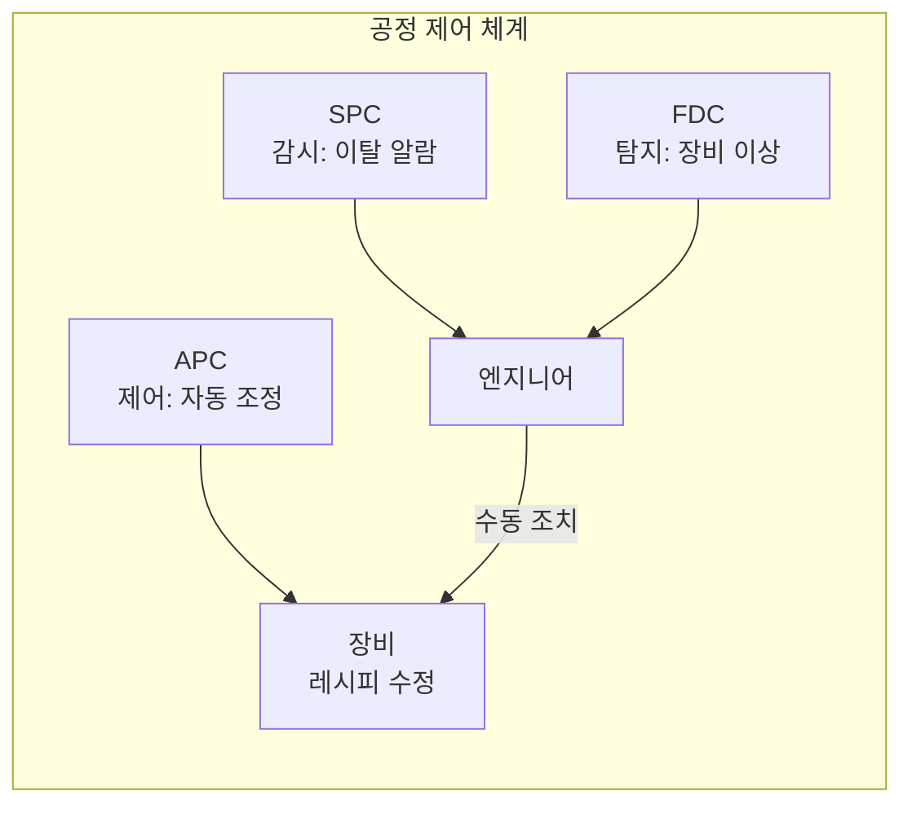
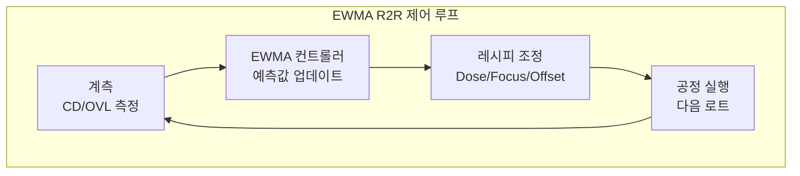

# 3.5 APC(Advanced Process Control) — 공정 자동 제어

## 이 챕터에서 배우는 것
- APC의 개념과 SPC/FDC와의 관계
- R2R(Run-to-Run) 제어의 원리 — EWMA 컨트롤러
- Feedback vs Feed-Forward 제어
- Overlay APC와 CD APC의 실전 구현
- APC의 성능 지표와 트레이드오프
- AI/ML이 APC를 어떻게 진화시키는지

---

## APC란: 감시를 넘어 제어로

지금까지 SPC(3.3장)는 "공정에 이상이 있는가?"를 **감시**했고, FDC(3.4장)는 "장비에 문제가 있는가?"를 **탐지**했다. 둘 다 문제를 **알려주는** 시스템이다. 하지만 알려주는 것만으로는 문제가 해결되지 않는다 — 누군가가 공정 조건을 **실제로 조정**해야 한다.

**APC(Advanced Process Control)**는 이 조정을 **자동으로** 수행한다. 계측 데이터와 장비 센서 데이터를 기반으로, **공정 조건(레시피 파라미터)을 자동으로 조정**하여 CD와 Overlay를 목표값에 유지하는 시스템이다.



SPC/FDC가 "문제를 알려주는" 시스템이라면, APC는 **"문제를 스스로 고치는" 시스템**이다. 이것은 소프트웨어에서 **Auto-Scaling**과 같은 개념이다. CPU 사용률이 높으면 인스턴스를 자동으로 추가하고, 트래픽이 줄면 자동으로 축소하는 것 — 모니터링 알람을 보고 사람이 수동으로 조치하는 것이 아니라, 시스템이 스스로 대응한다. APC는 이것의 제조 공정 버전이다.

2.10장의 Overlay 에러 모델과 2.11장의 CD 제어에서 APC를 미리 언급했다. 이 챕터에서는 APC의 **내부 구조와 알고리즘**을 깊이 다룬다.

---

## R2R 제어: APC의 기본 엔진

### Run-to-Run의 의미

**R2R(Run-to-Run) 제어**는 APC의 가장 기본적인 형태다. "Run"은 공정의 단위 실행 — 보통 하나의 로트(25장 웨이퍼)나 하나의 웨이퍼를 의미한다. 이전 Run의 결과를 보고, 다음 Run의 공정 조건을 조정한다.

간단한 예로 이해해 보자. CD 목표가 20nm인데, 로트 N의 측정 결과가 21nm(+1nm 초과)다. APC는 다음 로트 N+1에서 Dose를 약간 올려(포지티브 레지스트에서 Dose↑ → CD↓ 관계를 이용) CD를 20nm에 가깝게 맞춘다. 로트 N+1의 측정 결과가 19.8nm(-0.2nm)이면, 다음 로트 N+2에서 Dose를 살짝 줄인다. 이렇게 매 Run의 결과를 보고 다음 Run을 조정하는 반복이 R2R 제어다.

### EWMA 컨트롤러: 업계 표준

실무에서 가장 널리 사용되는 R2R 컨트롤러는 **EWMA(Exponentially Weighted Moving Average)**다.

```
예측값(n+1) = λ × 실측값(n) + (1-λ) × 예측값(n)
```

λ(Lambda)는 가중치 파라미터(0 < λ < 1)로, 가장 최근 측정값과 이전 예측값에 얼마나 비중을 둘지 결정한다.

λ의 의미를 직관적으로 이해하자. λ = 1이면 가장 최근 측정값만 반영한다 — 변화에 민감하게 반응하지만, 측정 노이즈에도 민감하여 보정값이 요동친다. λ → 0이면 과거 이력을 많이 반영한다 — 안정적이지만 공정의 실제 변화에 느리게 반응한다. 실무에서는 보통 λ ≈ 0.3~0.5를 사용하며, 이 값은 공정의 **Drift 속도**(얼마나 빨리 변하는가)와 **측정 노이즈**(측정의 불확실성)에 따라 튜닝한다.



EWMA는 본질적으로 **1차 지수 평활(Exponential Smoothing)**이다. 시계열 예측에서 가장 기본적인 방법이며, ML의 정교한 알고리즘에 비하면 단순하지만, 구현이 쉽고 안정적이며 해석이 투명하다는 장점 때문에 수십 년간 업계 표준으로 자리잡았다. AI 기반 APC가 EWMA를 대체하기 위해서는 이 세 가지(안정성, 해석성, 단순성) 모두에서 최소한 동등해야 한다.

---

## Feedback vs Feed-Forward: 두 가지 보정 전략


![[ff_fb_combined_correction.svg|Feed-Forward + Feedback 결합 보정 개념도]]

### Feedback: 지나간 것에서 배운다

**Feedback(피드백) 보정**은 이전 Run의 계측 결과를 바탕으로 다음 Run의 공정 조건을 조정한다. "로트 N의 CD가 목표보다 1nm 컸으니, 로트 N+1에서 Dose를 올리자"는 식이다.

Feedback의 핵심 한계는 **시간 지연(Delay)**이다. 로트 N을 가공하고 → 계측 장비로 옮기고 → CD를 측정하고 → 결과를 분석하면, 이미 로트 N+1은 가공 중이고 로트 N+2도 대기 중이다. 보정이 반영되는 것은 로트 N+3 이후가 된다. 이 사이의 로트 N+1, N+2는 보정 없이 가공된다. 빠르게 변하는 공정 Drift에서 이 지연은 치명적이다.

### Feed-Forward: 현재를 보고 선제 대응한다

**Feed-Forward(전방 보정)**는 현재 웨이퍼의 상태를 **공정 전에** 측정하여 공정 조건을 사전 조정한다. 2.10장에서 설명한 웨이퍼 정렬(Alignment)이 대표적인 Feed-Forward다 — 노광 전에 정렬 마크를 읽어 웨이퍼의 변형 상태를 파악하고, Overlay 보정값을 즉시 적용한다.

Feed-Forward의 강점은 **시간 지연이 없다**는 것이다. 현재 웨이퍼의 상태를 현재 웨이퍼에 즉시 반영하므로, 웨이퍼 간 변동(Wafer-to-Wafer variation)에 효과적으로 대응한다. 하지만 Feed-Forward에는 "무엇을 사전에 측정할 수 있는가?"라는 제약이 있다. 레지스트 두께나 웨이퍼 정렬 상태는 노광 전에 측정 가능하지만, 예를 들어 식각 결과는 식각 전에 알 수 없다.

### 실전: 둘을 결합한다

최적의 APC는 Feedback과 Feed-Forward를 **결합**한다.

```
보정값 = Feed-Forward 성분 (현재 웨이퍼 고유 상태)
       + Feedback 성분 (이전 로트들의 추세/드리프트)
       + 고정 오프셋 (장비/챔버 고유 특성)
```

Feed-Forward가 웨이퍼별 개별 변동을 잡고, Feedback이 장기적 Drift를 추적하며, 고정 오프셋이 장비 간 차이를 보정한다. 이 세 성분의 합이 최종 보정값이 된다.

---

## Overlay APC 실전: 2.10장의 모델이 여기서 실행된다

2.10장에서 배운 Overlay 에러 모델(Translation, Rotation, Magnification, HOWA, CPE)이 APC를 통해 실제로 **실행**된다.

스캐너에서 조정 가능한 Overlay 보정 파라미터는 계층적이다. **Translation(Tx, Ty)**과 **Rotation(Rx)**, **Magnification(Mx, My)**이 기본 6파라미터이고, **HOWA(Higher-Order Wafer Alignment)**가 고차 다항식 보정을, **CPE(Corrections Per Exposure)**가 필드별 독립 보정을 제공한다.

Overlay APC의 실제 흐름은 이렇다. 웨이퍼가 스캐너에 로딩되면, 정렬 스테이지에서 다수의 정렬 마크를 읽어 웨이퍼의 변형 상태를 파악한다(**Feed-Forward**). 동시에 EWMA 모델이 이전 로트들의 Overlay 계측 결과에서 장비 Drift를 추출하여 보정값을 계산한다(**Feedback**). 이 둘과 장비 고유 오프셋을 합산하여 스캐너에 전달하면, 스캐너가 각 필드를 노광할 때 이 보정값을 적용한다. 노광 후 Overlay를 계측하면, 그 결과가 EWMA 모델을 업데이트하여 다음 로트의 Feedback에 반영된다.

보정 단위가 세밀할수록 Overlay가 좋아진다. **로트 단위**는 25장 웨이퍼에 동일 보정값을 적용하는 가장 기본적인 방식이고, **웨이퍼 단위**는 각 웨이퍼의 정렬 결과를 개별 반영한다. **필드 단위(CPE)**가 가장 정밀하여 각 다이마다 독립 보정이 가능하지만, 모든 필드의 Overlay 정보가 필요하므로 측정/계산 부담이 크다. SMILE 플랫폼의 AI 모델이 이 CPE 보정값의 정확도를 높이는 것이 핵심 기여 영역이다.

---

## CD APC 실전: Dose와 Focus의 제어


![[apc_cd_before_after.png|APC 보정 전/후 CD 분포 비교]]

CD APC의 1차 도구는 **Dose 조정**이다. 2.11장에서 Dose가 CD에 가장 직접적인 영향을 미친다고 배웠다(~1nm per 1% Dose).

```
보정 Dose = 기본 Dose + ΔDose
ΔDose = f(이전 로트 CD 오차, 레지스트 두께, PEB 온도 변동, ...)
```

**Dose Mapper**는 웨이퍼 내 위치별로 Dose를 미세 조정하는 기법이다. Feed-Forward로는 레지스트 두께 맵(엘립소미터 측정)을 활용하여 두꺼운 곳에 Dose를 증가시키고, Feedback으로는 이전 로트의 CD 맵을 활용하여 CD가 큰 영역의 Dose를 증가시킨다. ASML의 FlexDose가 이것의 대표적 구현이다.

**Focus 보정**은 레벨링 센서 데이터(Feed-Forward)를 기반으로 웨이퍼 표면의 높낮이에 맞춰 노광 중 실시간으로 Focus를 조정한다. 2.6장에서 Focus가 CD에 비선형적 영향을 미친다고 배웠는데, Focus 보정은 이 영향을 최소화하여 공정 윈도우를 확보하는 역할이다.

---

## APC 성능 지표: 얼마나 잘 제어하고 있는가

APC의 효과를 정량화하는 핵심 지표는 **Correction Efficiency(보정 효율)**다.

```
Correction Efficiency = (Raw σ - Residual σ) / Raw σ × 100%
```

Raw σ는 APC 보정 전의 변동(공정의 자연 변동), Residual σ는 보정 후에도 남는 잔차 변동이다. 목표는 Correction Efficiency **> 70%** — APC가 전체 변동의 70% 이상을 제거하는 것이다. 2.10장에서 "Correctables과 Residuals"의 분리를 배웠는데, APC의 Correction Efficiency는 바로 이 분리의 실전적 성과 지표다.

**Stability vs Responsiveness 트레이드오프**도 중요하다. EWMA의 λ를 크게 하면 변화에 빠르게 반응(Responsive)하지만 측정 노이즈에도 민감하여 보정값이 요동친다. λ를 작게 하면 안정적(Stable)이지만 실제 Drift에 느리게 반응한다. 이 트레이드오프는 ML에서 **Bias-Variance Tradeoff**와 정확히 같은 구조다. 공정의 Drift 속도와 측정 노이즈 크기에 맞춰 최적 λ를 찾아야 하며, 이 튜닝 자체를 AI로 자동화하는 것이 Self-Tuning APC의 영역이다.

---

## AI가 APC를 진화시키는 네 가지 방향


![[cross_layer_apc.svg|Cross-Layer APC 개념 — 다층 통합 최적화]]

**1. 다변량 ML 기반 예측** — EWMA는 단일 변수(CD 또는 Overlay)의 시계열 추세만 반영한다. ML 기반 APC는 CD, 레지스트 두께, PEB 온도, 장비 센서, 이전 층 CD, 클린룸 온습도 등 **수십~수백 변수를 동시에** 입력으로 받아 비선형 상호작용을 학습하고, 최적 보정값을 산출한다. EWMA보다 예측 정확도가 높지만, 모델의 해석성(Interpretability)과 안정성 확보가 도전이다.

**2. 웨이퍼별 맞춤 보정(Per-Wafer Optimization)** — 기존 Feedback은 로트 단위(25장에 동일 보정)가 기본이다. AI 모델은 각 웨이퍼의 고유 특성(정렬 마크 데이터, 이전 층 결과, FDC 센서 데이터)을 반영하여 **웨이퍼마다 다른 보정값**을 산출한다. 이것은 2.10장에서 언급한 "비선형 Overlay 잔차를 AI로 줄이는" SMILE의 핵심 접근과 직접 연결된다.

**3. Cross-Layer APC** — 기존에는 각 레이어의 APC를 독립적으로 운영한다. Layer 5의 Overlay를 보정할 때 Layer 5만 본다. 하지만 실제로는 Layer 3의 보정이 Layer 5에 영향을 미칠 수 있다(공유 정렬 마크, 누적 변형 등). AI는 다수 레이어를 통합 관리하여, Layer N의 보정이 Layer N+1, N+2에 미치는 영향까지 고려한 **전체 최적화(Global Optimization)**를 수행한다.

**4. Self-Tuning APC** — EWMA의 λ를 공정 상태에 따라 자동 조정한다. Drift가 빨라지면 λ를 높이고, 안정적이면 낮춘다. 새 제품/레시피가 도입되면 모델을 자동 적응시킨다. 궁극적으로는 Reinforcement Learning 기반으로 보정 전략 자체를 학습하는 것이 연구 방향이다.

---

## AI 엔지니어가 알아야 할 것

APC에서 AI 엔지니어가 특히 주의해야 할 세 가지가 있다.

**인과관계 vs 상관관계** — APC 모델은 상관관계가 아닌 **인과관계**에 기반해야 한다. "변수 X가 CD와 높은 상관이 있다"고 해서 X를 보정에 사용하면, X와 CD가 공통 원인(Confounding Variable)에 의해 함께 변한 것일 때 **역효과**가 발생한다. Dose → CD는 물리적 인과관계이므로 안전하지만, 클린룸 습도 → CD는 인과인지 상관인지 검증이 필요하다.

**Safety Guard(안전 가드)** — ML 모델의 보정값이 비정상적으로 클 때(예: Dose 보정이 정상 범위의 10배), 이를 제한(Clamping)하는 안전 장치가 **반드시** 구현되어야 한다. 모델이 드물게 오류를 내더라도, 안전 가드가 대규모 불량을 방지한다.

**A/B 테스트** — 새 APC 모델을 도입할 때, 전체 로트에 즉시 적용하면 위험하다. 일부 로트에만 적용하고(Treatment Group) 나머지는 기존 방식을 유지하여(Control Group), 효과를 통계적으로 검증한 후 전면 배포해야 한다.

---

## 핵심 정리

APC(Advanced Process Control)는 계측 데이터를 기반으로 **공정 조건을 자동 조정**하는 시스템이며, SPC(감시)와 FDC(탐지)를 넘어 **제어(Control)**를 수행한다. **R2R + EWMA**(λ로 민감도 조절)가 업계 표준이며, **Feedback**(이전 결과 추세 추적)과 **Feed-Forward**(현재 웨이퍼 상태 반영)의 결합이 최적이다. Overlay APC는 2.10장의 선형/고차 모델을, CD APC는 Dose/Focus 조정과 Dose Mapper를 실행한다. **Correction Efficiency > 70%**가 목표이며, **λ 튜닝은 Bias-Variance Tradeoff**와 같은 구조다. AI는 다변량 ML 예측, 웨이퍼별 맞춤 보정, Cross-Layer 최적화, Self-Tuning으로 APC를 진화시키되, **인과관계 기반, Safety Guard, A/B 테스트**의 안전 원칙을 반드시 준수해야 한다.

---

*다음 챕터: 3.6 VM(Virtual Metrology) — 측정 없이 예측하기*
