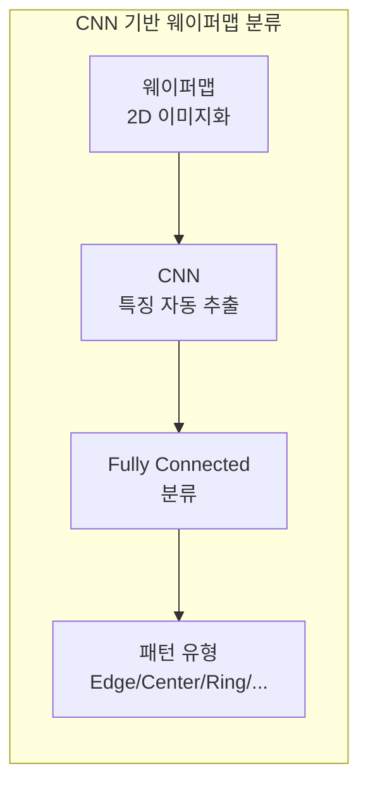
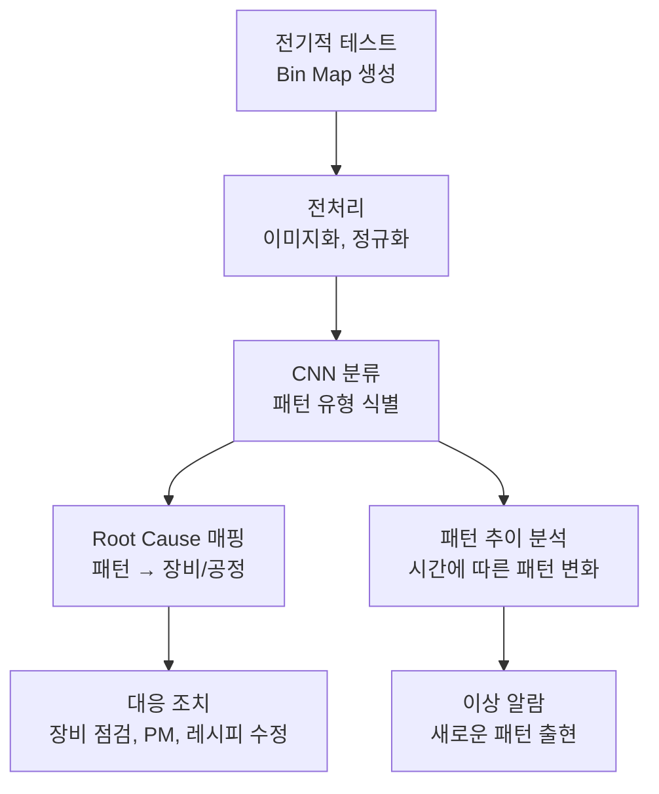

# 3.7 웨이퍼맵 분석 — 공간 패턴에서 원인을 읽다

## 이 챕터에서 배우는 것
- 웨이퍼맵(Wafer Map)의 종류와 데이터 구조
- 불량 패턴의 유형과 각각의 근본 원인
- 전통적 패턴 분류 방법 — 규칙 기반, 통계 기반
- CNN 기반 웨이퍼맵 패턴 분류 — 딥러닝 혁신
- 혼합 패턴(Mixed Pattern) 문제
- 웨이퍼맵 분석의 실전 파이프라인

---

## 웨이퍼맵이란: 반도체의 X-ray 사진

지금까지 우리는 수율을 숫자로(3.1장), 결함을 개별로(3.2장), 공정을 시계열로(3.3~3.6장) 분석하는 방법을 배웠다. 이 챕터에서는 완전히 다른 관점 — **공간적 패턴** — 을 다룬다.

**웨이퍼맵(Wafer Map)**은 웨이퍼 위의 각 다이를 2D 좌표에 매핑하고, 각 다이의 검사 결과(Pass/Fail, Bin 코드, 계측값 등)를 시각화한 것이다. 의사에게 X-ray 사진이 환자의 내부를 보여주듯, 엔지니어에게 웨이퍼맵은 공정의 내부 상태를 보여준다. 수율이 88%라는 숫자만으로는 **왜** 12%가 불량인지 알 수 없지만, 웨이퍼맵에서 불량이 가장자리에 집중되어 있는 것을 보면 "에지 공정 문제"라는 **방향**이 즉시 나온다.

여러분에게 익숙한 비유를 들자면, 웨이퍼맵 분석은 **히트맵 기반 UX 분석**과 같다. 웹사이트의 사용자 클릭을 2D 히트맵으로 시각화하면, 어디에서 사용자가 이탈하는지, 어떤 영역이 무시되는지가 공간적 패턴으로 드러난다. 웨이퍼맵에서 불량 다이의 공간 패턴이 원인을 드러내는 것과 정확히 같은 원리다.

### 웨이퍼맵의 세 가지 종류

**Bin Map**은 각 다이의 전기적 테스트 결과를 색상으로 표시한 것이다. Pass는 초록, Fail은 빨강, Fail의 세부 유형(Bin 코드)별로 다른 색상을 사용한다. 가장 기본적인 웨이퍼맵이며, 이 챕터의 주요 대상이다.

**Defect Map**은 3.2장의 결함 검사에서 발견된 결함의 위치를 점으로 표시한 것이다. 결함의 공간 분포에서 파티클 소스, 장비 오염 위치 등을 추정한다.

**Parametric Map**은 CD, Overlay, 막 두께 등 계측값의 공간 분포를 히트맵(연속 색상)으로 표시한 것이다. 2.11장에서 CD 균일도를 논의할 때 "Center-high, Edge-low" 같은 표현을 사용했는데, 이것이 Parametric Map의 패턴이다.

---

## 불량 패턴의 유형과 원인: 패턴이 범인을 가리킨다


웨이퍼맵의 핵심 가치는 — 불량의 **공간적 패턴**이 **원인의 물리적 특성**을 반영한다는 것이다. 원형(Ring)은 회전 공정(스핀 코팅, CMP)의 문제를 시사하고, 직선(Scratch)은 기계적 접촉 문제를 시사한다. 패턴을 읽으면 원인의 후보 범위가 대폭 좁아진다.

**Random (랜덤)** — 불량 다이가 웨이퍼 전체에 특별한 패턴 없이 흩어져 있다. 파티클이나 랜덤 결함이 원인이며, 3.1장의 D₀와 직접 연결된다. 이 패턴은 "정상적인" 불량이다 — 어떤 팹에서든 일정 수준의 랜덤 결함은 존재하며, D₀를 줄이는 것(클린룸 관리, 장비 세정)이 유일한 대책이다.

**Edge (에지)** — 웨이퍼 가장자리(외곽 5~10mm)에 불량이 집중된다. 반도체 공정의 많은 단계가 에지에서 불균일하다 — 스핀 코팅의 에지 비드(두꺼워짐), 식각과 CMP의 에지 효과, 웨이퍼 핸들링 시 로봇암이 접촉하는 영역. 가장 흔한 패턴 중 하나이며, Edge Exclusion(에지 제외 영역) 조정이나 코팅/식각 레시피 최적화로 대응한다.

**Center (중심)** — 웨이퍼 중심에 불량이 집중된다. 스핀 코팅에서 중심부의 레지스트 두께 이상, CMP에서 중심 과연마(Over-polish), 가스 흐름이 중심에 집중되는 현상이 원인이다.

**Cluster (클러스터)** — 웨이퍼의 특정 영역에 불량이 뭉쳐 나타난다. 국부적 오염(파티클 소스가 특정 위치에 있음), 척(Chuck)의 물리적 손상, 화학물질 얼룩 등이 원인이며, 클러스터의 위치가 장비 내부의 오염 소스 위치와 대응하는 경우가 많다.

**Scratch (스크래치)** — 직선 또는 곡선의 선형 불량 패턴이다. CMP의 슬러리에 큰 파티클이 섞이면 웨이퍼 표면을 긁으며 직선 스크래치가 발생하고, 웨이퍼 이송 중 로봇암이나 카세트에 의한 긁힘, 핸들링 장비의 기계적 이상도 원인이다.

**Ring (링)** — 동심원 형태의 패턴이다. **회전 공정**(스핀 코팅, CMP)의 특성을 직접 반영한다. 스핀 코팅 시 레지스트의 건조 속도가 반경에 따라 다르면 특정 반경에서 두께 이상이 발생하고, 핫플레이트의 온도가 동심원적으로 불균일하면 PEB 온도 차이에 의한 CD 변동이 Ring으로 나타난다.

**Zone (존)** — 웨이퍼의 반쪽이나 사분면에 불량이 집중된다. 챔버 내 가스 흐름의 비대칭, 장비 내부의 한쪽 벽면 오염, 노치(Notch) 방향과 관련된 정렬 이상 등이 원인이다.

**Repeat (반복)** — 가장 독특한 패턴이다. 모든 노광 필드(Shot)의 **동일한 위치**에 불량이 반복된다. 원인은 거의 확실하게 **마스크 결함**이다 — 마스크의 특정 위치에 결함이 있으면, 그 결함이 매 노광 필드마다 웨이퍼에 전사되어 모든 다이의 같은 위치에 불량이 나타난다. 마스크 검사 및 교체가 유일한 해결책이다.

---

## 전통적 패턴 분류: 수동에서 자동으로의 여정

### 수동 분류의 시대

가장 오래된 방법은 엔지니어가 웨이퍼맵을 **눈으로 보고** 패턴을 판단하는 것이다. 경험 많은 엔지니어는 한 눈에 "이건 Edge", "이건 Ring"이라고 식별한다. 정확도는 높지만, 하루에 수백~수천 장의 웨이퍼맵을 처리하는 것은 불가능하고, 엔지니어마다 판단이 다를 수 있는 주관성 문제도 있다.

### 규칙 기반 분류

"에지 5mm 이내 불량 비율 > 40%면 Edge 패턴", "불량 다이 좌표의 분산이 작고 한 곳에 밀집하면 Cluster" 같은 규칙을 미리 정의하여 자동 분류하는 방법이다. 단순한 패턴에는 효과적이지만, 규칙을 설계하는 것 자체가 전문 지식을 요구하며, 복잡하거나 모호한 패턴에는 대응하기 어렵다.

### 통계적 특징 + 전통 ML

웨이퍼맵에서 통계적 특징(Feature)을 추출하여 ML 분류기에 입력하는 방법이다. 불량 다이의 무게중심(x̄, ȳ), 분포의 분산/왜도/첨도, 반경별 불량 밀도 프로파일, Radon Transform 계수 등을 피처로 추출하고 SVM이나 Random Forest로 분류한다. 규칙 기반보다 유연하지만, **피처 설계가 핵심 병목**이다 — 어떤 통계량을 추출하느냐에 따라 성능이 크게 달라지며, 새로운 패턴 유형에 대한 피처를 새로 설계해야 한다.

---

## CNN 기반 웨이퍼맵 분류: 이미지로 보면 된다

### 패러다임의 전환

2015년 이후 **CNN(Convolutional Neural Network)**이 웨이퍼맵 분류에 도입되면서 성능이 극적으로 향상되었다. 핵심 아이디어는 놀랍도록 단순하다 — 웨이퍼맵을 **이미지**로 취급하고, 이미지 분류에 이미 검증된 CNN 아키텍처(VGG, ResNet, EfficientNet 등)를 적용하는 것이다.



피처 엔지니어링이 필요 없다. CNN이 웨이퍼맵 이미지에서 패턴 인식에 필요한 특징을 **자동으로 학습**한다. 에지의 곡률, 클러스터의 밀도, 링의 반경 — 이 모든 것을 CNN의 Convolutional Filter가 스스로 추출한다. 이것이 전통 ML 대비 CNN의 근본적 우위다.

### 데이터 전처리

원형 웨이퍼맵을 CNN에 입력하려면 전처리가 필요하다. 웨이퍼의 다이 좌표를 정사각형 그리드의 픽셀에 매핑하는 **이미지화**, 제품마다 다른 웨이퍼 크기와 다이 수를 고정 해상도(예: 64×64, 128×128)로 통일하는 **정규화**, Pass=0/Fail=1의 이진 인코딩 또는 Bin 코드별 다른 채널로 변환하는 **인코딩**을 수행한다.

### 성능: 규칙 기반과 비교할 수 없는 수준

| 방법 | 분류 정확도 |
|:---|:---|
| 규칙 기반 | ~60~70% |
| 통계 특징 + SVM | ~80~85% |
| CNN (VGG/ResNet) | **~95~98%** |

가장 널리 사용되는 벤치마크 데이터셋은 삼성이 공개한 **WM-811K** — 811,457개의 웨이퍼맵에 8가지 패턴 레이블이 부여된 대규모 데이터셋이다. 이 데이터셋에서 CNN 기반 방법들이 일관되게 95% 이상의 정확도를 달성하며, 반도체 AI 연구의 표준 벤치마크로 자리잡았다.

---

## 혼합 패턴: 현실은 교과서보다 복잡하다


### 문제의 본질

실제 양산에서는 하나의 웨이퍼에 **여러 패턴이 동시에** 나타나는 경우가 많다. Edge + Random, Ring + Cluster, Scratch + Edge 같은 **혼합 패턴(Mixed Pattern)**이 전체의 30~50%에 달한다는 보고도 있다. 이것은 단순한 Single-Label 분류(하나의 웨이퍼맵 → 하나의 패턴 레이블)로는 대응할 수 없다.

### 해결 접근

**Multi-Label Classification** — 하나의 웨이퍼맵에 여러 레이블을 동시에 할당한다. 출력층의 Softmax를 **Sigmoid**로 바꾸어 각 패턴의 존재 확률을 독립적으로 출력하면, "Edge: 0.92, Random: 0.78, Ring: 0.03"처럼 여러 패턴이 동시에 검출된다.

**패턴 분해(Decomposition)** — 혼합된 웨이퍼맵을 개별 패턴 성분으로 분해한다. "이 웨이퍼의 Edge 성분은 코팅 문제, Random 성분은 파티클 문제"처럼 각 성분의 원인을 독립적으로 추적할 수 있어 Root Cause 분석에 유리하다.

**Attention Mechanism** — Attention Map으로 CNN이 웨이퍼맵의 **어느 영역**을 보고 각 패턴을 판단했는지 시각화한다. "에지 부분을 보고 Edge를 판단하고, 중앙의 클러스터를 보고 Cluster를 판단했다"는 해석이 가능해져 엔지니어의 신뢰를 높인다.

---

## Parametric 웨이퍼맵 분석: Bin Map을 넘어서

Bin Map(Pass/Fail)뿐 아니라 **계측값 히트맵**도 동일한 공간 패턴 분석 기법이 적용된다.

**CD 맵**은 웨이퍼 전체의 CD 분포를 히트맵으로 시각화한다. "Center-high, Edge-low"는 스핀 코팅의 두께 변동을 시사하고, "Left-Right 비대칭"은 스캐너의 슬릿 균일도 문제를 시사한다.

**Overlay 맵**은 각 측정 포인트의 Overlay 벡터(방향 + 크기)를 화살표로 표시한다. 2.10장에서 배운 Rotation, Magnification, 고차 왜곡 패턴이 시각적으로 드러난다.

이 맵들의 공간 패턴을 **수학적으로 분해**하면 더 정량적인 분석이 가능하다. **Zernike Polynomial 분해**는 광학에서 온 기법으로, 웨이퍼 위의 연속 분포를 직교 다항식(Tilt, Defocus, Astigmatism, Coma, Spherical 등)으로 분해하여 각 성분을 독립적으로 정량화한다. **PCA 분해**는 다수 웨이퍼의 맵 데이터에서 주요 변동 패턴을 추출하고, 그 패턴과 장비/공정 조건을 매칭하여 변동의 근본 원인을 추적한다. 이것이 SMILE 플랫폼의 Overlay 분석 엔진에서 실제로 수행하는 핵심 연산이다.

---

## 실전 파이프라인: 패턴에서 조치까지



이 파이프라인의 핵심은 **패턴→원인→대응 매핑 데이터베이스(Knowledge Base)**의 축적이다. "Edge 패턴 + 식각 장비 A를 거친 로트 → 챔버 A의 에지 가스 유량 점검 → 가스 유량 보정 후 Edge 패턴 해소"라는 과거 사례가 DB에 축적되면, 다음에 같은 패턴이 나타났을 때 AI가 자동으로 원인 후보를 제시하고 대응 절차를 추천한다. 이 Knowledge Base의 크기와 품질이 AI 기반 Root Cause 분석의 정확도를 결정한다.

**패턴 추이 분석**도 중요하다. Edge 패턴의 발생 빈도가 시간에 따라 증가하면 에지 관련 장비의 점진적 열화를, 새로운 유형의 패턴이 갑자기 출현하면 이전에 없던 문제가 발생했음을 의미한다. CNN이 "None of the above(기존 패턴에 해당하지 않음)"로 분류하는 빈도가 높아지면, 새로운 패턴 클래스를 정의하고 모델을 업데이트해야 하는 신호다.

---

## AI 엔지니어가 알아야 할 것

웨이퍼맵 데이터 구조는 다음과 같다.

```
(Wafer_ID, Die_X, Die_Y, Bin_Code, Pass_Fail,
 CD_value, OVL_X, OVL_Y, ...)
```

핵심 ML 도전은 다섯 가지다. 대부분이 양품이어서 불량 패턴 웨이퍼가 전체의 5~20%에 불과한 **클래스 불균형** — Data Augmentation(회전, 반전)과 Focal Loss로 대응한다. 수동 분류 레이블이 부족한 **레이블 부족** — Semi-supervised Learning(VAE + Classifier)이나 Self-supervised Pretraining이 유효하다. 현실에서 30~50%를 차지하는 **혼합 패턴** — Multi-label 분류와 패턴 분해로 접근한다. 테스트 직후 즉각 대응을 위한 **실시간 추론**(1초 미만) — 경량화된 CNN(MobileNet 등)이 필요하다. 제품마다 다른 웨이퍼 크기와 다이 배치에 대한 **Domain Adaptation** — Transfer Learning과 정규화된 입력 표현이 답이다.

---

## 핵심 정리

웨이퍼맵(Wafer Map)은 다이별 검사 결과의 **2D 시각화**로, 불량의 공간 패턴에서 원인을 추정하는 핵심 도구다. **8대 불량 패턴**(Random, Edge, Center, Cluster, Scratch, Ring, Zone, Repeat)은 각각 다른 물리적 원인과 대응하며, 패턴을 읽으면 원인의 후보 범위가 대폭 좁아진다. **CNN** 도입으로 분류 정확도가 규칙 기반의 60~70%에서 **95~98%**로 도약했으며, **WM-811K**(삼성 공개, 81만 개 웨이퍼맵)이 표준 벤치마크다. 현실의 **혼합 패턴**(30~50%)에는 Multi-label Classification과 패턴 분해로 대응하며, Parametric Map(CD/OVL 히트맵)에도 **Zernike/PCA 분해**를 적용하여 SMILE 플랫폼의 Overlay 분석에 직접 활용한다.

---

*다음 챕터: 3.8 데이터 인프라 — 반도체 빅데이터 시스템*
