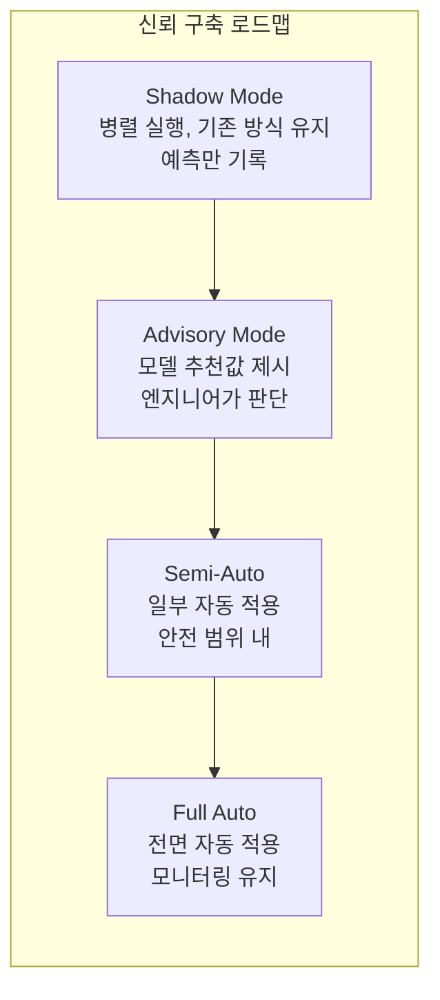

# 4.4 모델 해석과 신뢰 — SHAP, 물리 정합성

## 이 챕터에서 배우는 것
- 왜 반도체 AI에서 모델 해석이 필수인지
- Feature Importance의 종류와 한계
- SHAP(SHapley Additive exPlanations) — 개별 예측의 해석
- 물리 정합성 검증 — 모델이 물리 법칙에 부합하는가
- 신뢰 구축 전략 — 엔지니어를 설득하는 방법
- 해석 가능성과 성능의 트레이드오프

---

## 해석이 없으면 채택도 없다: 반도체 AI의 현실

이전 챕터에서 모델을 학습하고 검증하는 방법을 배웠다. Time-Based Split으로 정직하게 평가하여 R²=0.85를 달성했다고 하자. 이 모델을 현장 엔지니어에게 보여주면 어떤 반응이 올까?

"R²가 0.85라고? 그래서 **왜** 이 웨이퍼의 CD가 높다는 거야?"
"이 보정값을 적용했다가 로트 전체가 불량나면 **누가 책임져**?"
"이전에도 AI가 좋다고 해서 적용했는데 한 달 만에 **성능이 떨어졌어**."

이 질문들에 답할 수 없으면, 아무리 정확한 모델이라도 **사용되지 않는다**. 반도체 현장에서 AI 모델이 채택되려면 정확도만으로는 부족하다 — 엔지니어가 **왜 그런 예측을 하는지 이해**해야 모델을 신뢰하고 행동에 반영한다.

이것은 소프트웨어 개발에서도 마찬가지다. 코드 리뷰 없이 "이 코드가 더 빠르다"고 주장하면 팀이 신뢰하지 않는다 — **왜** 빠른지, **어떤 원리**로 동작하는지 설명해야 머지된다. ML 모델도 "코드 리뷰"가 필요하다. 그 리뷰 도구가 해석 기법(Interpretability)이다.

---

## Feature Importance: 전체적인 그림

### Global vs Local Importance

**Global Feature Importance**는 모델 **전체**에서 각 피처가 얼마나 중요한지를 순위화한다. "이 모델에서 가장 중요한 피처는 PEB_온도다"라는 식의 정보다. Tree 모델의 Gini/Split Importance, 모든 모델에 적용 가능한 Permutation Importance, 선형 모델의 계수 크기(Coefficient Magnitude) 등이 있다.

**Local Feature Importance**는 **개별 예측 하나**에서 각 피처가 어떤 방향으로 얼마나 기여했는지를 보여준다. "**이 웨이퍼**의 CD가 높은 이유는 PEB_온도가 높았기 때문이다"라는 식의 정보다. SHAP이 대표적이며, LIME(Local Interpretable Model-agnostic Explanations)도 사용된다.

### Global Importance의 한계

Global Importance는 유용하지만 세 가지 한계가 있다. 두 피처가 높은 상관관계를 가지면 중요도가 **분산**되어 둘 다 낮게 나올 수 있다(다중공선성 문제). 단독으로는 영향이 없지만 다른 피처와 조합하면 중요한 **비선형 상호작용**을 놓친다. 그리고 모든 데이터에 대한 **평균**이므로, "PEB 온도가 높을 때만 중요하다"는 조건부 중요도를 반영하지 못한다.

이 한계를 극복하는 것이 SHAP이다.

---

## SHAP: 개별 예측을 분해한다

### SHAP의 핵심 아이디어

**SHAP(SHapley Additive exPlanations)**은 게임 이론의 **Shapley Value**를 ML에 적용한 해석 기법이다. Shapley Value의 원래 질문은 "팀의 성과에 각 플레이어가 얼마나 기여했는가?"였고, SHAP의 질문은 "모델의 예측에 각 피처가 얼마나 기여했는가?"다.

핵심 수식 — 예측값을 "기본값(전체 데이터의 평균 예측)"에서 시작하여 각 피처의 기여분을 더하거나 빼서 최종 예측에 도달한다.

```
예측값 = 기본값 + SHAP(피처1) + SHAP(피처2) + ... + SHAP(피처N)
```

### 구체적 예시: CD 예측


```
기본 CD (전체 평균): 20.0nm

웨이퍼 A의 예측:
  기본값:           20.0nm
  + PEB 온도 높음:  +0.8nm   ← 가장 큰 양의 기여
  + Dose 낮음:      +0.5nm
  + 레지스트 두꺼움: +0.3nm
  - 장비B 사용:     -0.2nm
  - Focus 양호:     -0.1nm
  ─────────────────────────
  최종 예측 CD:      21.3nm
```

이제 엔지니어에게 "이 웨이퍼의 CD가 1.3nm 높은 이유는 **PEB 온도가 높고(+0.8nm) Dose가 낮았기(+0.5nm) 때문**"이라고 구체적으로 설명할 수 있다. 엔지니어는 이 설명이 자신의 경험과 일치하는지 확인할 수 있고, 일치하면 모델을 **신뢰**하게 된다.

### SHAP의 네 가지 시각화


**Waterfall Plot** — 개별 예측 하나의 피처별 기여를 막대그래프로 보여준다. 위의 웨이퍼 A 예시를 시각화한 것이다.

**Beeswarm Plot** — 전체 데이터에서 각 피처의 SHAP 분포를 보여준다. 각 점이 하나의 샘플이고, 색상이 피처 값(빨강=높음, 파랑=낮음), x축이 SHAP 값이다. 가장 중요한 피처가 위에, SHAP 분포가 넓은 피처가 영향력이 큰 피처다.

**Dependence Plot** — 특정 피처 값(x축)과 SHAP 값(y축)의 관계를 보여준다. Dose와 CD의 관계가 선형인지 비선형인지, 어느 범위에서 영향이 큰지가 직관적으로 드러난다. **물리 정합성 검증의 핵심 도구**다.

**Force Plot** — 개별 예측의 기여를 힘의 방향(빨강: 양의 기여, 파랑: 음의 기여)으로 시각적으로 표현한다.

---

## 물리 정합성 검증: 모델이 물리 법칙을 위반하지 않는가

### 왜 이것이 치명적인가

ML 모델은 데이터의 **통계적 패턴**을 학습한다. 하지만 이 패턴이 **물리적으로 타당한지**는 보장하지 않는다. 모델이 "Dose↑ → CD↑"로 학습했다면, 이것은 포지티브 레지스트에서 물리적으로 **반대**다(Dose↑ → 더 많은 노광 → CD↓). 원인은 교란 변수(Confounder) — Dose가 높을 때 다른 조건(PEB 온도, 레지스트 두께)도 동시에 변했고, 모델이 이 혼재된 효과를 잘못 학습한 것이다.

이런 모델을 APC에 사용하면 **보정 방향이 반대**가 되어 수율을 악화시킨다. 물리 정합성 검증은 선택이 아니라 **필수**다.

### 물리 정합성 체크리스트

**부호(Sign)** — SHAP Dependence Plot으로 주요 피처의 영향 방향이 물리와 일치하는지 확인한다. Dose↑이면 CD가 감소하는 방향(포지티브 PR)이어야 한다.

**크기(Magnitude)** — Dose 1% 변화에 대한 CD 변화량이 경험적으로 알려진 값(~0.5~1nm)과 크기가 일치하는지 확인한다. 10nm 변한다면 모델이 잘못된 것이다.

**단조성(Monotonicity)** — PEB 온도와 CD의 관계가 물리적으로 단조(온도↑ → CD↓)여야 하는데, Partial Dependence Plot에서 비단조적(오르락내리락)이면 의심한다.

**포화(Saturation)** — Focus 오차가 커질수록 CD 영향이 증가하다가 포화하는(2차 함수) 물리적 관계가 모델에 반영되었는지 확인한다.

### Physics-Informed ML: 물리를 모델에 통합한다


물리 지식을 모델에 **직접 통합**하는 접근이 가장 안전하고 효과적이다.

**물리 기반 피처** — 4.2장에서 다룬 Focus², Dose×두께 등이 이미 물리 관계를 인코딩하고 있다.

**물리 제약 손실(Physics-Constrained Loss)** — 학습 시 물리 법칙 위반에 페널티를 부과한다.

```
Loss = MSE(y, ŷ) + λ × Physics_Violation_Penalty
```

예: "Dose 증가 시 CD가 감소해야 한다"는 제약을 위반하면 페널티 → 모델이 올바른 방향을 학습하도록 유도한다.

**하이브리드 모델** — 가장 권장되는 접근이다.

```
ŷ = Physics_Model(X) + ML_Residual(X)
```

물리 모델(Overlay 선형 모델, Dose-CD 관계 등)이 대략적인 관계를 잡고, ML이 물리 모델의 **잔차만** 학습한다. 이것이 SMILE 플랫폼의 핵심 아키텍처이기도 하다 — 물리 모델로 Correctables를 잡고, ML로 Residuals의 패턴을 학습한다.

---

## 신뢰 구축 전략: Shadow에서 Full Auto까지

### 점진적 도입 로드맵

모델의 현장 도입은 한 번에 이루어지지 않는다. 신뢰를 **단계적으로** 쌓아가야 한다.



**Shadow Mode**(1~2개월) — 모델을 실행하되 결과를 적용하지 않는다. 기존 방식은 그대로 유지하면서, 모델의 예측을 기록하여 사후에 "모델을 적용했더라면 어떤 결과가 나왔을까?"를 분석한다. 리스크 제로로 모델의 실전 성능을 검증한다.

**Advisory Mode**(2~3개월) — 모델의 추천값을 엔지니어에게 제시하되, 최종 결정은 **인간이** 한다. 엔지니어가 모델의 추천을 보면서 자신의 판단과 비교하고, 모델이 맞는 경우가 많아질수록 신뢰가 쌓인다.

**Semi-Auto**(3~6개월) — 안전 범위 내(Safety Guard 통과)의 보정은 자동 적용하고, 범위 밖의 큰 보정은 인간이 확인한다. 대부분의 루틴 보정은 자동화되어 엔지니어의 부담이 줄어들고, 예외적 상황에서만 인간이 개입한다.

**Full Auto** — 전면 자동화하되, 모니터링과 Fallback 메커니즘을 반드시 유지한다. 모델 성능이 열화하면 자동으로 이전 방식(EWMA 등)으로 되돌리는 Fallback이 필수적이다.

각 단계에서 다음 단계로 넘어가는 기준은 **성능 메트릭 + 엔지니어 합의**다. 성능이 좋아도 엔지니어가 동의하지 않으면 넘어가지 않는다.

---

## 해석성과 성능의 트레이드오프

| 모델 | 해석성 | 성능 | 반도체 적합성 |
|:---|:---|:---|:---|
| Linear Regression | ★★★★★ | ★★ | 초기 베이스라인, 피처 관계 파악 |
| PLS | ★★★★ | ★★★ | VM 전통 표준 |
| XGBoost | ★★★ | ★★★★★ | **실전 최강** — SHAP과 결합 |
| Neural Network | ★ | ★★★★★ | Trace/이미지 전용 |

**실전 권장: XGBoost + SHAP**. 높은 예측 성능과 충분한 해석성의 최적 조합이다. SHAP이 XGBoost의 "블랙박스 정도"를 충분히 열어주어 엔지니어가 납득할 수 있는 수준의 해석을 제공하며, TreeSHAP 알고리즘으로 계산도 빠르다.

딥러닝은 Trace 데이터의 End-to-End 학습이나 웨이퍼맵 이미지 분류처럼, **XGBoost로 풀 수 없는 문제**에서만 사용한다. 딥러닝을 사용할 때는 SHAP 외에 Grad-CAM(이미지), Attention Visualization(시계열) 등 모달리티에 맞는 해석 기법을 반드시 함께 적용한다.

---

## 핵심 정리

반도체 AI에서 **모델 해석은 채택의 전제 조건**이다 — 정확도만으로는 현장 엔지니어의 신뢰를 얻을 수 없다. **SHAP**은 개별 예측의 피처별 기여를 정량화하여 "이 웨이퍼의 CD가 높은 이유는 PEB 온도가 높고 Dose가 낮았기 때문"이라는 구체적 설명을 제공한다. **물리 정합성 검증**은 필수이며, 모델이 Dose↑→CD↓ 등 알려진 물리 관계를 올바르게 학습했는지 부호/크기/단조성/포화를 체크한다. **Physics-Informed ML**(물리 모델 + ML 잔차)이 가장 안전하고 효과적인 아키텍처이며 SMILE의 핵심 접근이다. 현장 도입은 **Shadow → Advisory → Semi-Auto → Full Auto**의 4단계로 신뢰를 쌓아가며, **XGBoost + SHAP**이 성능과 해석성의 최적 조합이다.

---

*다음 챕터: 4.5 MLOps — 반도체 AI의 배포와 운영*
