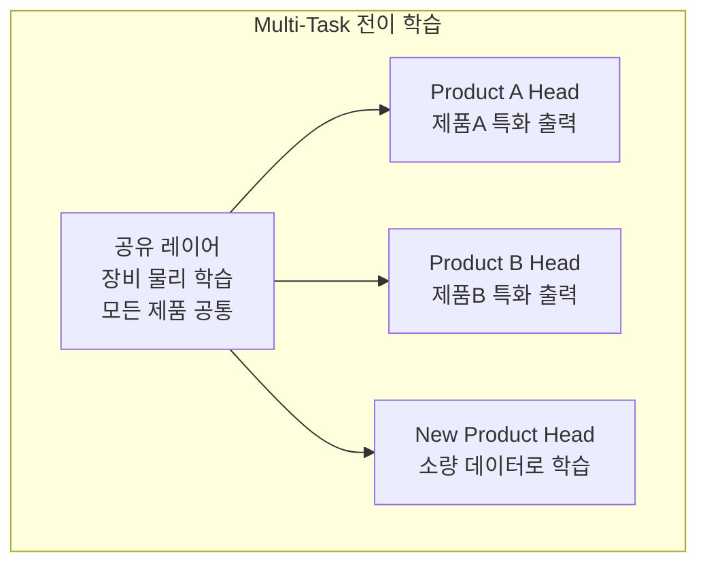

# 4.7 전이 학습과 도메인 적응 — 공정/장비 간 모델 이식

## 이 챕터에서 배우는 것
- 반도체에서 전이 학습이 필수적인 이유
- 장비 간 전이 — Chamber Matching의 ML 버전
- 제품 간 전이 — 새 제품에 기존 모델 활용
- 팹 간 전이 — 다른 팹으로의 모델 이식
- Domain Adaptation 기법 — 분포 차이 극복
- Few-Shot Learning — 극소량 데이터로 모델 구축

---

## 왜 전이 학습이 필수인가: 반도체 AI의 근본적 딜레마

이전 챕터들에서 모델을 학습하고(4.3), 해석하고(4.4), 배포/운영하는(4.5) 방법을 배웠다. 이 모든 것은 **데이터가 충분할 때**의 이야기다. 현실에서 직면하는 근본적 딜레마는 이것이다.

**모델을 처음부터 학습하려면 대량의 레이블 데이터가 필요하다.** 하지만 —

**새 제품**은 양산 초기에 데이터가 수십~수백 웨이퍼뿐이다. 수천 웨이퍼가 쌓이기까지 수 주~수 개월이 걸리고, 그 동안 AI 없이 운영하면 수율 손실이 발생한다.

**새 장비/챔버**는 PM 후나 부품 교체 후에 이전 데이터가 유효하지 않다(3.6장의 Model Degradation). 장비 상태가 바뀌었으므로 이전 모델을 그대로 쓸 수 없지만, 새 데이터는 아직 충분하지 않다.

**새 팹**은 해외 확장 시 초기 데이터가 전무하다. TSMC가 애리조나에 새 팹을 짓는다면, 대만 팹의 수년간 데이터는 있지만 애리조나 팹의 데이터는 0이다.

매번 처음부터 모델을 만들면 **스케일이 불가능**하다. **전이 학습(Transfer Learning)**은 기존 모델의 지식을 새 환경에 이식하여, 적은 데이터로 빠르게 유용한 모델을 구축하는 해법이다.

---

## 전이 시나리오: 난이도가 다르다


| 시나리오 | 도메인 차이 원인 | 난이도 | 필요 데이터 |
|:---|:---|:---|:---|
| **PM 전후** | 부품 상태 변화, 센서 오프셋 | ★☆☆ | 수십 웨이퍼 |
| **장비 간** | 장비 개체 차이, 센서 교정 | ★★☆ | 수십~수백 |
| **제품 간** | 패턴, 레시피, 공정 조건 전부 다름 | ★★★ | 수백 |
| **팹 간** | 장비+소재+환경+운영 모두 다름 | ★★★★ | 수백~수천 |

난이도가 낮을수록 단순한 전이 방법으로 충분하고, 높을수록 정교한 기법이 필요하다.

---

## 장비 간 전이: Chamber Matching의 ML 버전

### 문제

동일 레시피를 실행하는 Chamber A와 B에서도 CD가 다르다. 센서 교정 차이(같은 온도여도 측정값이 다름), 챔버 상태 차이(코팅 두께, 부품 마모 정도), 기계적 개체 차이(조립 공차)가 원인이다. 이것은 2.12장에서 다룬 **Matching** 문제의 ML 버전이다.

### 접근법 1: 오프셋 보정 (Simple Offset) — 가장 단순, 가장 먼저

Chamber A 모델의 예측에 **상수 오프셋**만 추가한다.

```
CD_pred_B = Model_A(X_B) + Offset_B
Offset_B = mean(CD_actual_B - Model_A(X_B))  ← 수십 웨이퍼로 계산
```

수십 웨이퍼만으로도 계산 가능하고, 장비 간 차이가 **평행 이동(Bias)**이 주된 경우 효과적이다. 비선형 차이는 포착하지 못하지만, 놀라울 정도로 많은 경우에 이것만으로 충분하다.

### 접근법 2: Fine-Tuning — 비선형 차이까지 포착

Chamber A로 학습한 모델의 가중치를 **초기값**으로, Chamber B 데이터로 재학습한다. Neural Network라면 마지막 몇 층만 Fine-Tune하고 앞쪽 층(일반적 물리 관계를 학습한)은 동결(Freeze)한다. Tree 모델(XGBoost)이라면 기존 모델에 새 트리를 추가하는 Warm Start를 사용한다. 수백 웨이퍼면 충분하다.

### 접근법 3: Feature Alignment — 피처 분포를 맞춘다

Chamber A와 B의 센서 분포가 다르면(A의 온도는 150~155°C, B는 148~153°C), Z-score 정규화로 각 챔버의 피처를 표준화하여 분포를 맞춘다. 모델이 절대값이 아닌 **상대적 변동**에 반응하도록 하는 것이다.

**실전 권장: 가장 단순한 방법부터 시도한다.** 오프셋 보정으로 충분하면 Fine-Tuning은 불필요하다. 복잡한 방법이 항상 좋은 것은 아니다.

---

## 제품 간 전이: 가장 빈번한 시나리오

### 문제

제품이 다르면 레시피(Dose, Focus, 가스 유량 등), 패턴 밀도/형태(CD 민감도 차이), 타겟 CD/Overlay 규격이 모두 다르다. 장비 간 전이보다 차이가 크지만, **장비 물리는 동일**하다 — 같은 스캐너에서 다른 제품을 가공할 뿐이다.

### Multi-Task Learning + Product Head



**공유 레이어**는 "장비 센서의 변동이 CD에 미치는 일반적 관계"를 학습한다 — 이것은 제품과 무관한 물리적 관계다. **제품별 헤드**는 각 제품의 특화된 관계(Dose 민감도, 타겟 CD 등)를 학습한다.

새 제품이 도입되면, 공유 레이어는 **동결(Freeze)**하고 새 제품 헤드만 소량 데이터로 학습한다. 공유 레이어가 이미 장비 물리를 이해하고 있으므로, 새 헤드는 "이 제품에서 Dose가 1% 변하면 CD가 얼마나 변하는가?"만 학습하면 되어 적은 데이터로 충분하다.

### Meta-Learning: "학습하는 법을 학습하다"

**MAML(Model-Agnostic Meta-Learning)**은 한 단계 더 나아간 접근이다. 여러 제품의 데이터로 **"새 제품에 빠르게 적응하는 능력"** 자체를 학습한다.

```
Meta-Train: 제품 A, B, C, D의 데이터로 "빠른 적응 능력" 학습
Meta-Test:  제품 E의 50 웨이퍼로 Fine-Tune → 바로 사용 가능한 모델
```

이것은 "물고기를 주는 것(Fine-Tuning)"과 "물고기 잡는 법을 가르치는 것(Meta-Learning)"의 차이다. MAML로 학습된 모델은 **어떤 새 제품이든** 수십 웨이퍼만으로 빠르게 적응할 수 있어, 제품 다양성이 높은 파운드리 환경에서 특히 유용하다.

---

## 팹 간 전이: 가장 어렵고 가장 가치 있는 전이

### 거의 모든 것이 다르다

팹이 다르면 장비 세대/벤더, 소재(레지스트, 가스) 공급업체, 클린룸 환경(온도, 습도, 기압, 심지어 해발 고도), 운영 관행(PM 주기, 세정 빈도, 레시피 미세 조정) 등이 모두 달라진다. 센서 데이터의 분포가 완전히 다를 수 있다.

### 핵심 통찰: 물리 법칙은 팹과 무관하다

```
CD ∝ f(Dose, Focus, PEB_temp, Resist_thickness, ...)
```

이 물리적 관계는 대만에서도 애리조나에서도 **동일**하다. 차이는 관계의 **계수(파라미터)**에서 발생한다 — Dose 1mJ/cm²당 CD가 1.2nm 변하는지 0.9nm 변하는지는 팹마다 다르지만, "Dose가 증가하면 CD가 감소한다"는 **방향**은 동일하다.

전략은 세 단계다. 센서 원시값 대신 4.2장의 **물리 기반 피처**(Focus², Dose×두께 등)를 사용하여 팹 간 센서 차이를 흡수하고, 물리 모델(Rayleigh, Overlay 선형 모델)을 **공통 골격**으로 삼으며, 골격의 **계수만 새 팹의 소량 데이터로 캘리브레이션**한다. 이것이 Physics-Informed ML(4.4장)의 또 다른 가치다 — 팹 간 전이에서 물리 모델이 **공통 언어** 역할을 한다.

### Federated Learning: 데이터 없이 지식만 공유


반도체 데이터는 극도로 민감하여 팹 간 데이터 공유가 사실상 불가능하다. **Federated Learning(연합 학습)**은 이 제약을 우회한다.

```
Fab A: 로컬 학습 → 모델 가중치만 전송 →
Fab B: 로컬 학습 → 모델 가중치만 전송 → 중앙 서버: 가중치 평균화
Fab C: 로컬 학습 → 모델 가중치만 전송 →
                                        → 통합 모델 → 각 팹 배포
```

원시 데이터는 각 팹을 절대 떠나지 않고, **모델 파라미터(가중치)**만 공유한다. 여러 팹의 경험이 통합된 모델은 어느 한 팹의 데이터만으로 학습한 모델보다 일반화 성능이 좋다. 데이터 프라이버시와 규모의 경제를 동시에 달성하는 우아한 접근이며, 반도체 업계의 극도로 민감한 보안 정책에 부합한다.

---

## Domain Adaptation: 분포 차이를 정면으로 극복한다

### Distribution Alignment

소스 도메인(기존 장비/제품)과 타겟 도메인(새 장비/제품)의 피처 분포가 다를 때, 분포를 **정렬**하여 모델이 도메인에 불변(Invariant)하도록 학습하는 기법이다.

**MMD(Maximum Mean Discrepancy)** — 두 분포 간 "거리"를 측정하여, 피처 추출기가 두 도메인의 분포 거리를 최소화하도록 학습한다.

**CORAL(Correlation Alignment)** — 두 도메인의 공분산 행렬을 정렬하여, 피처 간 상관 구조를 맞춘다.

**Adversarial Adaptation(DANN)** — Discriminator가 "이 데이터가 소스인지 타겟인지" 구분하려 하고, Feature Extractor가 "구분할 수 없도록" 피처를 학습한다. GAN의 Adversarial 원리와 동일하다.

실전에서는 예측 오차와 도메인 정렬 손실을 **동시에 최적화**한다.

```python
Loss = Prediction_Loss(source_data) + λ × Domain_Alignment_Loss(source, target)
```

소스 데이터(레이블 있음)에서 예측을 학습하면서, 소스와 타겟의 피처 분포를 정렬하여 타겟에서도 유사한 예측 성능을 기대한다.

---

## Few-Shot과 Zero-Shot: 데이터가 거의 없을 때


### 극소량 데이터 상황의 전략

| 방법 | 필요 데이터 | 성능 | 적용 상황 |
|:---|:---|:---|:---|
| 처음부터 학습 | 수천 웨이퍼 | ★★★★ | 양산 안정 후 |
| Fine-Tuning | 수백 웨이퍼 | ★★★ | 양산 초기 |
| Few-Shot (MAML) | 수십 웨이퍼 | ★★~★★★ | 신제품 파일럿 |
| Zero-Shot (물리 모델만) | 0 웨이퍼 | ★~★★ | 최초 셋업 |

### Zero-Shot: 데이터 없이 시작하는 법

데이터가 전혀 없는 극한 상황에서는 **물리 모델만으로 시작**한다. Rayleigh 방정식으로 Dose-CD 관계를 설정하고, Overlay 선형 모델(2.10장)로 보정을 시작하며, 데이터가 쌓이면 점진적으로 ML을 추가한다. 이것이 **Physics-Informed ML의 근본적 가치**다 — 데이터가 0이어도 물리가 초기 모델을 제공하며, 데이터가 쌓이면서 ML이 물리 모델의 잔차를 학습하여 성능이 점진적으로 향상된다.

---

## 전이 학습 실전 체크리스트

- [ ] 소스와 타겟의 **도메인 차이 크기** 평가 (PSI, KS Test로 피처 분포 비교)
- [ ] **가장 단순한 방법**(오프셋 보정)부터 시도 — 복잡한 방법이 항상 좋지 않다
- [ ] Fine-Tuning 시 **과적합 주의** — 타겟 데이터가 적으므로 Early Stopping, Dropout 적극 활용
- [ ] 전이 후 **물리 정합성 재검증** — Dose↑→CD↓ 관계가 유지되는지 확인
- [ ] 전이 모델의 **신뢰도(RI) 모니터링 강화** — 전이 초기에는 신뢰도가 낮을 수 있음
- [ ] 타겟 데이터가 충분히 쌓이면 **자체 모델로 점진적 전환** 검토

---

## 핵심 정리

반도체 AI에서 **전이 학습은 스케일의 전제 조건**이다 — 새 장비/제품/팹마다 처음부터 모델을 만들면 확장이 불가능하다. **장비 간 전이**는 오프셋 보정 → Fine-Tuning → Feature Alignment 순으로 단순한 방법부터 시도한다. **제품 간 전이**는 Multi-Task Learning으로 물리를 공유하고 제품별 헤드를 분리하며, MAML로 "빠른 적응 능력" 자체를 학습한다. **팹 간 전이**는 물리 법칙을 공통 골격으로 삼고 계수만 캘리브레이션하며, Federated Learning으로 데이터 프라이버시를 보장한다. 데이터가 0일 때는 **물리 모델로 Zero-Shot 시작**, 데이터가 쌓이면 점진적으로 ML을 추가하는 것이 Physics-Informed ML의 근본적 가치다.

---

*다음 챕터: 4.8 강화 학습과 최적화 — 스마트 레시피 탐색*
