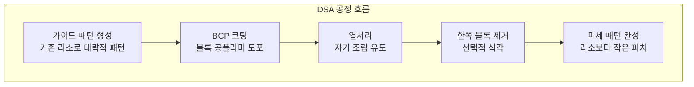

# 5.1 차세대 리소그래피 기술 — High-NA EUV, DSA, NIL

## 이 챕터에서 배우는 것
- High-NA EUV — 0.55 NA로 가는 길
- Anamorphic Optics와 새로운 도전
- DSA (Directed Self-Assembly) — 분자가 스스로 패턴을 만든다
- NIL (Nanoimprint Lithography) — 나노 도장 기술
- 차세대 기술이 AI에 미치는 영향
- 각 기술의 현실적 타임라인

---

## Part 5에 진입한다: 미래를 본다

Part 1에서 반도체 공정의 전체 흐름을, Part 2에서 포토리소그래피의 심화 기술을, Part 3에서 수율과 공정 제어 체계를, Part 4에서 AI/ML 실전을 다뤘다. Part 5에서는 **미래**를 본다 — 차세대 리소그래피 기술, 자율 팹, 그리고 반도체와 AI의 공진화.

미래를 이야기하기 전에 현재의 한계를 직시해야 한다. 현재 EUV(NA=0.33)는 단일 노광 해상도가 약 13nm로, 2nm 이하 노드에서 부족하다. SADP/SAQP 멀티패터닝(2.8장)으로 보완하지만 공정 복잡도와 비용이 폭발적으로 증가한다. EUV 광원 출력 한계로 스루풋이 제약되고, 2.4장에서 배운 펠리클 문제도 여전하다.

반도체 로드맵(IRDS)은 **2nm → 1.4nm → 1nm → 0.7nm**의 축소를 요구한다. 이 로드맵을 실현할 차세대 기술들을 하나씩 살펴본다.

---

## High-NA EUV: Rayleigh 방정식의 정면 돌파

### NA를 0.33에서 0.55로

2.6장에서 Rayleigh 방정식 **R = k₁ × λ/NA**를 배웠다. 해상도(R)를 높이는 세 가지 방법은 λ를 줄이거나(EUV 13.5nm로 이미 극단적), k₁을 줄이거나(물리적 한계 ~0.25), **NA를 높이는** 것이었다. High-NA EUV는 세 번째 방법을 택했다.

NA를 0.33에서 0.55로 높이면 해상도가 약 40% 향상된다.

```
현재 EUV:    R ≈ k₁ × 13.5/0.33 ≈ 13nm  (k₁=0.33)
High-NA EUV: R ≈ k₁ × 13.5/0.55 ≈ 8nm   (k₁=0.33)
```

단일 노광으로 8nm — 멀티패터닝 없이 — 를 달성할 수 있다는 뜻이다. 이것이 왜 혁명적인지는 2.8장에서 멀티패터닝의 복잡성을 배운 여러분이 가장 잘 이해할 것이다.

### ASML EXE:5000 — 세계에서 가장 비싼 기계

ASML이 개발 중인 EXE:5000(코드명 Hyper-NA)은 NA 0.55, 파장 13.5nm(동일), 해상도 약 8nm(단일 노광)의 스펙을 가진다. 가격은 현재 EUV(NXE:3800, ~2억 달러)의 약 2배인 **~4억 달러** — 한 대가 약 5,000억 원이다. 2025년 첫 출하 후 2026~2027년 양산 적용이 예정되어 있다.

### Anamorphic Optics: NA를 높이면 생기는 도전


NA를 높이면 렌즈 크기가 커지고 마스크에 대한 시야각이 커진다. 시야각이 커지면 마스크에서 반사되는 EUV 빔의 그림자(Shadowing) 효과가 심해져, 기존 4:1 등방 축소로는 물리적으로 불가능하다. 해법이 **비등방 광학계(Anamorphic Optics)** — X축과 Y축의 축소 배율을 다르게 하는 것이다.

```
기존 EUV:    마스크 4× → 웨이퍼 1× (X: 4:1, Y: 4:1 동일)
High-NA EUV: 마스크 4×8× → 웨이퍼 1× (X: 4:1, Y: 8:1)
```

스캔 방향(Y)을 8:1로 축소하여 시야각 문제를 해결하지만, 그 대가로 세 가지 새로운 도전이 발생한다.

**마스크 면적 2배** — Y 방향이 8배로 커지므로 마스크가 2배 넓어진다. 마스크 비용이 증가하고, 기존 마스크 인프라(검사, 보관, 세정)를 업그레이드해야 한다.

**노광 필드 축소** — 마스크가 커지는 대신 웨이퍼 위 노광 필드가 절반으로 줄어든다(스캔 방향). 기존 26mm × 33mm에서 약 26mm × 16.5mm로. 큰 칩(예: GPU)은 하나의 필드에 담기지 않아 **2회 스티칭(Stitching)** — 두 번 노광하여 이어 붙이기 — 이 필요할 수 있다.

**스티칭 Overlay** — 두 필드를 이어 붙이는 경계에서 나노미터 정밀도의 정렬이 필요하다. 2.10장의 Overlay 문제가 한 차원 더 어려워진다.

### AI 임팩트: 새로운 ML 문제의 폭발

High-NA EUV는 AI 수요를 폭발적으로 증가시킨다. 스티칭 경계의 Overlay 제어에 기존보다 정교한 **APC 모델**이 필요하고, 8:1 비등방 축소에 맞는 **새로운 OPC/ILT** 알고리즘이 필요하며(4.6장의 cuLitho 확장), 더 큰 마스크의 **결함 검사 자동화**에 CNN의 역할이 커진다. SMILE 같은 플랫폼이 High-NA에 적응하려면 4.7장의 전이 학습이 핵심이 된다 — 기존 EUV 모델의 물리적 공통점은 유지하면서 비등방 축소의 차이만 학습하는 것이다.

---

## DSA: 분자가 스스로 패턴을 만든다

### 원리: 자연의 나노 패브리케이션

**DSA(Directed Self-Assembly)**는 리소그래피의 패러다임을 뒤집는 기술이다. 기존 리소그래피가 "빛으로 패턴을 그리는" **Top-Down** 방식이라면, DSA는 "분자가 스스로 정렬하는" **Bottom-Up** 방식이다.

**블록 공폴리머(Block Copolymer, BCP)**는 두 종류의 폴리머(예: PS와 PMMA)가 결합된 분자다. 물과 기름이 자연스럽게 분리되듯, 열을 가하면 두 블록이 자발적으로 분리되어 **규칙적인 나노 패턴**(라멜라, 실린더 등)을 형성한다. 이 패턴의 주기(Pitch)는 폴리머의 분자량으로 결정되며, 5nm 이하까지 가능하다.



"가이드 패턴"이 핵심이다 — 기존 리소그래피로 대략적인 패턴(예: 20nm 피치)을 만들면, BCP가 이 가이드 안에서 자기 조립하여 4배 작은 피치(5nm)의 패턴을 형성한다. 기존 리소그래피의 해상도를 **증폭**하는 것이다.

### 장점과 한계

장점은 분명하다 — 멀티패터닝 대비 공정 단계가 감소하여 **비용이 절감**되고, 열역학적 평형에 의해 이론적으로 **결함 밀도가 매우 낮다**.

하지만 한계도 뚜렷하다. 주기적 패턴(Line/Space, Contact Hole 배열)만 가능하고 **임의 패턴은 불가능**하다 — CPU의 복잡한 로직 회로에는 적용하기 어렵다. 전위(Dislocation)와 브릿지 결함이 아직 양산 요구 수준(< 10⁻⁸/cm²)에 미달이며, 열처리 온도/시간/막 두께의 **공정 윈도우가 좁다**. 양산 적용은 2028년 이후(낙관적 전망)로 예상되며, 주기적 배열에 적합한 Contact Hole 축소 응용이 가장 유망하다.

---

## NIL: 나노 도장 기술

### 원리: 빛 없이 패턴을 만든다


**NIL(Nanoimprint Lithography)**은 개념이 놀랍도록 단순하다. 나노 패턴이 새겨진 **몰드(Template)**를 액상 레지스트에 물리적으로 눌러서 패턴을 전사한다. 도장을 찍듯이. 광학 시스템이 전혀 필요 없으므로 Rayleigh 방정식의 해상도 한계에 제약받지 않는다 — 몰드의 정밀도가 곧 해상도다.

### 장점: 비용 혁명

NIL의 가장 큰 장점은 **비용**이다. EUV 스캐너 한 대가 2억 달러, High-NA가 4억 달러인 반면, NIL 장비는 약 1/10 수준이다. 광원, 렌즈, 반사경 등 복잡한 광학 시스템이 없기 때문이다. 단일 스텝으로 복잡한 3D 구조(다층 패턴)도 가능하여 공정 단순화에도 기여한다.

### 한계: 접촉의 대가

물리적 접촉이 강점이자 약점이다. 몰드를 하나씩 찍으므로 **스루풋이 낮고**, 접촉 시 파티클 결함과 몰드 수명 문제가 있으며, 기계적 정렬이므로 광학 대비 **Overlay 정밀도가 낮다**. 그리고 결함 없는 원본 몰드를 제작하는 것 자체가 EUV/E-beam에 의존하는 난제다.

### Canon FPA-1200NZ2C와 NAND Flash

Canon의 NIL 장비가 **NAND Flash 메모리**에서 양산 적용을 시작했다(SK하이닉스 등). NAND는 동일 패턴의 반복이므로 NIL의 주기적 패턴 강점과 잘 맞고, 스루풋 요구가 로직 대비 느슨하며, 극한 해상도(14nm 이하)가 비용 효율적으로 달성된다. 메모리의 비용 경쟁에서 NIL은 **게임 체인저**가 될 수 있다.

---

## 기술 비교: 경쟁이 아닌 공존


| 기술 | 해상도 | 스루풋 | 비용 | 패턴 자유도 | 양산 시점 |
|:---|:---|:---|:---|:---|:---|
| **EUV (현재)** | ~13nm | ~200 WPH | 높음 | 자유 | 양산 중 |
| **High-NA EUV** | ~8nm | ~185 WPH | 매우 높음 | 자유 | 2026~27 |
| **DSA** | ~5nm | 높음 (잠재적) | 낮음 | 제한적 | 2028+ |
| **NIL** | <14nm | 낮음 | 낮음 | 자유 (몰드 의존) | NAND 양산 중 |

이 기술들은 **경쟁이 아닌 공존** 관계다. **High-NA EUV**가 로직 최첨단 노드(1nm 이하)의 주력이 되고, **DSA**가 Contact Hole이나 Fin 구조 같은 주기적 패턴을 보조하며, **NIL**이 메모리(NAND) 대량 생산에서 비용 혁신을 가져온다. 각 기술이 가장 적합한 영역에서 활용되는 **공존의 미래**다.

---

## AI 엔지니어에게 주는 시사점

차세대 기술은 AI 엔지니어에게 **새로운 문제의 폭발**을 의미한다.

**새 기술 = 새 데이터 = 새 ML 문제** — High-NA의 비등방(Anamorphic) 데이터, DSA의 분자 시뮬레이션 데이터, NIL의 접촉 역학 데이터는 기존 EUV 데이터와 근본적으로 다르며, 새로운 피처 엔지니어링(4.2장)과 모델 설계가 필요하다.

**전이 학습 수요 급증** — 기존 EUV 모델을 High-NA에 이식(4.7장)하는 수요가 폭발한다. 물리적 공통점(Rayleigh 방정식)은 유지하면서 비등방 광학의 차이만 학습하는 것이 전략이다.

**시뮬레이션 가속** — 더 복잡한 물리를 다루는 차세대 공정에서, ML Surrogate(4.6장의 cuLitho 같은)의 가치가 더욱 커진다.

**멀티모달 통합** — 다양한 기술을 동시에 사용하는 팹에서, 이질적인 데이터를 통합 분석하는 멀티모달 AI 플랫폼이 필수가 된다.

---

## 핵심 정리

차세대 리소그래피 기술은 **공존의 미래**를 향한다. **High-NA EUV**(NA 0.55, ~8nm 해상도)는 Anamorphic 광학으로 스티칭/마스크의 새로운 도전을 가져오며 2026~27년 양산이 예정되어 있다. **DSA**는 블록 공폴리머의 자기 조립으로 해상도를 증폭하지만 주기적 패턴에 한정되며 연구 단계다. **NIL**은 나노 몰드 임프린트로 광학 없이 패턴을 전사하며 NAND에서 비용 혁신을 가져온다. AI 엔지니어에게 이 기술들은 새로운 데이터, 새로운 ML 문제, 전이 학습 수요, 시뮬레이션 가속 수요를 의미한다.

---

*다음 챕터: 5.2 반도체 AI의 미래 트렌드 — 디지털 트윈, 자율 팹*
