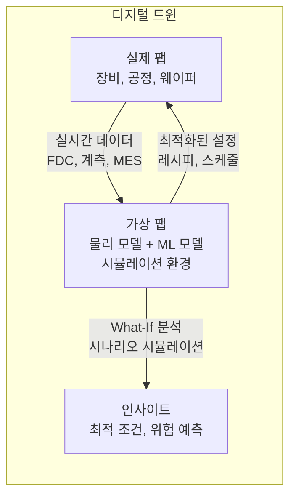
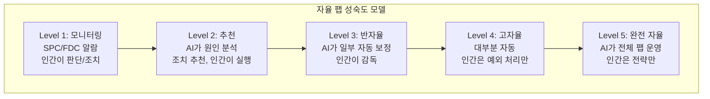

# 5.2 반도체 AI의 미래 트렌드 — 디지털 트윈, 자율 팹

## 이 챕터에서 배우는 것
- 디지털 트윈(Digital Twin) — 팹의 가상 복제
- 자율 팹(Autonomous Fab) — 인간 개입 최소화
- Foundation Model for Semiconductor — 반도체 기반 모델
- Edge AI와 In-Situ 센싱 — 장비 내 AI
- Quantum Computing과 반도체 AI
- 향후 5~10년의 로드맵

---

## 미래를 그리기 전에: 왜 이것이 중요한가

이 책은 현재 기술을 깊이 다루었다. Part 1~4에서 배운 공정 지식, 리소그래피 기술, 수율 제어, AI/ML 실전은 **지금 팹에서 작동하는** 기술이다. 하지만 AI 엔지니어는 현재에만 머물면 안 된다 — 2~3년 후에 필요한 기술을 **지금** 준비해야 하기 때문이다.

이 챕터에서 다루는 미래 트렌드들은 "먼 미래의 꿈"이 아니라, 선도 기업에서 **이미 개발이 시작된** 기술들이다. 5년 후에 이 기술들이 보편화되었을 때, 준비된 팀과 준비되지 않은 팀의 격차는 극적일 것이다.

---

## 디지털 트윈: 팹을 통째로 복제한다

### 개념

**디지털 트윈(Digital Twin)**은 실제 팹/장비의 **가상 복제본**이다. 실시간 데이터와 동기화되어 실제 시스템의 상태를 거울처럼 반영하고, 그 위에서 시뮬레이션과 최적화를 수행한다.



"Dose를 0.5% 올리면 CD가 얼마나 변할까?" — 이 질문에 답하려면 실제로 웨이퍼를 가공해야 한다(수만 달러). 디지털 트윈이 있으면 가상 환경에서 **무한히 실험**할 수 있다. 4.8장에서 RL의 실전 어려움으로 "시뮬레이터 부재"를 꼽았는데, 디지털 트윈이 바로 그 시뮬레이터다.

### 디지털 트윈의 세 가지 계층

**장비 트윈** — 단일 장비(스캐너, 식각기)의 가상 복제. PM 예측, 레시피 최적화, 이상 시뮬레이션에 활용한다. 가장 먼저 실현되는 수준이다.

**공정 트윈** — 공정 흐름 전체의 가상 복제. Cross-Layer 영향 시뮬레이션(3.9장), 수율 예측에 활용한다. 여러 장비 트윈을 연결해야 하므로 더 복잡하다.

**팹 트윈** — 팹 전체(장비 + 물류 + 인력)의 가상 복제. 디스패칭 최적화, 병목 분석, 용량 계획에 활용한다. 가장 상위 수준이며 가장 복잡하다.

### 장비 디지털 트윈의 구체적 모습

스캐너의 디지털 트윈을 예로 들면 — 현재 렌즈 가열 상태, 정렬 이력, PM 이후 시간, 웨이퍼 특성을 입력으로, **물리 모델**(렌즈 열팽창 → Overlay/Focus 영향 계산)과 **ML 모델**(물리로 설명 안 되는 잔차 보정)을 결합하여, 다음 웨이퍼의 예상 CD/Overlay를 출력한다. 이것은 4.4장의 **Physics-Informed ML 하이브리드**(ŷ = Physics_Model + ML_Residual)가 디지털 트윈으로 확장된 형태다.

NVIDIA가 이 영역에 적극 투자하고 있다. **cuLitho**로 GPU 기반 OPC/리소 시뮬레이션을 40배 가속하고, **Omniverse** 플랫폼으로 팹 레이아웃과 물류의 3D 시뮬레이션을 지원하며, TSMC, ASML 등과 협업 중이다.

---

## 자율 팹: 자율 주행의 반도체 버전

### 자율 주행과의 비유

자율 주행에 Level 0(인간 운전)부터 Level 5(완전 자율)까지의 성숙도 모델이 있듯이, 팹 자율화에도 동일한 프레임워크를 적용할 수 있다.



### 현재 위치: Level 2~3


![[autonomous_fab_maturity.svg|자율 팹 성숙도 모델 (Level 1~5)]]

현재 팹은 영역에 따라 다른 수준에 있다. **SPC/FDC**는 Level 1~2로 알람은 자동이지만 판단은 인간이 한다. **APC**는 Level 3으로 Safety Guard 내에서 반자율 보정이 이루어진다(3.5장). **디스패칭**은 Level 2로 AI가 추천하되 인간이 승인한다. **PM 스케줄링**은 Level 1~2로 규칙 기반에 예측 보조가 추가되는 수준이다.

### Level 4~5로 가는 다섯 가지 도전

**신뢰성** — 0.01%의 실수가 수백만 달러 손실을 의미한다. AI의 의사결정 정확도가 99.99% 이상이어야 한다. 자율 주행에서 "1만 번에 1번 실수"가 허용되지 않듯이.

**예외 처리** — 학습 데이터에 없는 새로운 결함 유형, 처음 보는 장비 고장 모드. AI가 "모르는 것을 모른다고 인식"하는 능력(4.3장의 RI 개념 확장)이 필수다.

**책임 소재** — AI가 잘못된 보정을 내려 불량이 발생하면 누구의 책임인가? 모델 개발자? 팹 오퍼레이터? AI 벤더? 법적/조직적 프레임워크가 아직 미성숙하다.

**규제** — 자동차/항공 반도체(IATF 16949)는 인간 검증을 의무화하고 있어, 완전 자율이 규제적으로 허용되지 않을 수 있다.

**엔지니어 역할 변화** — 직접 조작에서 AI 감독/전략 수립으로의 역할 전환. 조직적, 문화적 변화가 수반되어야 한다.

### 현실적 경로: 인간-AI 협업

완전 자율(Level 5)보다 **"인간-AI 협업"** 모델이 더 현실적이고 바람직하다. AI가 95%의 루틴 의사결정(매 웨이퍼의 Dose 보정, 정상/이상 판별)을 자동 처리하고, 엔지니어가 5%의 예외적/전략적 결정(새 제품 도입, 대규모 레시피 변경, 고객 특이 요구)에 집중한다. 4.4장의 "Shadow → Advisory → Semi-Auto → Full Auto" 로드맵이 팹 전체로 확장된 것이다.

---

## Foundation Model for Semiconductor

### 거대 사전학습 모델의 반도체 버전


![[foundation_model_architecture.svg|반도체 Foundation Model 아키텍처]]

NLP에서 GPT가 대규모 텍스트를 사전학습한 후 특정 과제에 Fine-Tuning하듯, **반도체 Foundation Model**은 대규모 공정 데이터를 사전학습한 후 특정 팹/장비/제품에 소량 데이터로 적응한다.

```
사전 학습: 수십 개 팹 × 수년 × 수백 장비의 FDC/계측/MES 데이터
    ↓
Foundation Model: 반도체 공정의 일반적 물리/패턴을 이해
    ↓
Fine-Tuning: 특정 팹/장비/제품에 소량 데이터로 적응
```

기대 효과는 강력하다. 새 제품/장비에 수십 웨이퍼만으로 모델을 구축하는 **Few-Shot 적응**(4.7장의 극단적 확장). 식각에서 학습한 지식이 증착 모델에도 전이되는 **Cross-Process 이해**. "정상"의 일반적 표현을 학습하여 다양한 이상을 감지하는 **이상 탐지 범용화**.

### 현실적 도전

하지만 두 가지 근본적 도전이 있다. 팹 데이터가 극도로 비공개여서 여러 팹의 데이터를 모으기 어려운 **데이터 접근** 문제와, 장비 벤더/센서 구성/데이터 형식이 팹마다 달라 하나의 모델로 통합하기 어려운 **데이터 이질성** 문제다. 4.7장의 **Federated Learning**이 현실적 대안이다 — 데이터를 모으지 않고 모델 파라미터만 공유하여 프라이버시를 보장하면서 대규모 학습의 이점을 얻는다.

타임라인 — 현재(2026)는 학계와 Applied Materials, Siemens EDA 등에서 초기 연구 중이며, 2027~2030년에 단일 기업 내 Cross-Fab 모델이 등장할 수 있고, 2030년 이후에 Federated 기반의 업계 공통 Foundation Model이 예상된다.

---

## Edge AI와 In-Situ 센싱: 장비 자체가 지능을 갖는다


![[edge_ai_latency_comparison.png|Edge AI vs 서버 AI 레이턴시 비교]]

### 현재 vs 미래

현재의 데이터 흐름은 장비 → 데이터 수집 → 서버 전송 → 분석 → 보정값 계산 → 서버에서 전송 → 장비 적용으로, 수 초~수 분이 소요된다. 미래에는 **장비 자체에 AI 칩이 탑재**되어 데이터 수집과 추론이 장비 내에서 완결된다.

**레이턴시**가 밀리초 단위로 줄어 웨이퍼 내(Intra-Wafer) 실시간 보정이 가능해지고, 모든 데이터를 서버로 보내지 않아도 되어 **대역폭이 절약**되며, 데이터가 장비 밖으로 나가지 않아 **프라이버시도 보장**된다.

### In-Situ 계측: 공정 '중에' 측정한다

현재의 계측은 공정 **후에** 별도 장비에서 수행한다(Ex-Situ). **In-Situ 계측**은 공정 **중에** 실시간으로 측정하는 센서다. 식각 중 OES(Optical Emission Spectroscopy)로 엔드포인트를 감지하고, 증착 중 Ellipsometry로 실시간 두께를 측정하며, 리소 노광 중 센서로 실시간 Focus/Dose를 측정한다.

In-Situ 센서 + Edge AI의 결합은 **공정 중 실시간 보정**을 가능하게 한다 — 웨이퍼 하나 안에서도 필드별로 다른 보정을 적용하는 것이다. 이것은 4.5장의 Edge 레이어가 극단적으로 진화한 형태다.

---

## 향후 5~10년 로드맵


![[semiconductor_ai_roadmap_timeline.svg|반도체 AI 5~10년 로드맵 타임라인]]

```
2026: High-NA EUV 양산 시작, MLOps 표준화
      AI-assisted APC 보편화 (Level 3)

2027: 디지털 트윈 단일 장비 상용화
      LLM 기반 엔지니어 어시스턴트 팹 도입
      Cross-Fab 전이 학습 모델

2028: DSA 파일럿 양산, NIL NAND 확대
      반자율 팹 (Level 3~4) 선도 팹에서 시작
      Foundation Model 초기 버전

2029-2030: High-NA EUV 2세대
           디지털 트윈 팹 레벨 상용화
           자율 팹 Level 4 선도 기업

2030+: 0.7nm 노드
       Foundation Model 업계 표준
       양자 컴퓨팅 초기 적용
```

---

## AI 엔지니어에게 주는 시사점

**지금 시작하라** — 디지털 트윈과 Foundation Model은 "미래"지만, 그 기반인 ML 파이프라인, MLOps, 전이 학습은 **지금 필요**한 기술이다. Part 4에서 배운 것들이 미래의 기반이다.

**물리를 배워라** — 차세대 기술일수록 Physics-Informed ML의 가치가 커진다. AI 엔지니어가 Rayleigh 방정식을 이해하고 있으면 High-NA EUV의 새로운 ML 문제를 훨씬 빠르게 정의할 수 있다.

**스케일을 생각하라** — 장비 1대가 아닌 팹 전체, 팹 1개가 아닌 글로벌 팹 네트워크를 위한 AI를 설계해야 한다. 4.7장의 전이 학습과 Federated Learning이 스케일의 핵심이다.

**인간-AI 협업을 설계하라** — 완전 자율보다 **인간-AI 협업 인터페이스** 설계가 더 시급하고 가치 있다. 4.9장의 AI 에이전트와 LLM 인터페이스가 이 방향의 첫 걸음이다.

---

## 핵심 정리

반도체 AI의 미래는 다섯 가지 트렌드로 수렴한다. **디지털 트윈**은 실제 팹의 가상 복제로 What-If 분석과 최적화를 가능하게 하며, Physics+ML 하이브리드가 핵심이다. **자율 팹**은 Level 1(모니터링)에서 Level 5(완전 자율)로 진화하며, 현재 Level 2~3이고 인간-AI 협업이 현실적 경로다. **Foundation Model**은 여러 팹의 데이터로 사전학습하여 Few-Shot 적응을 가능하게 하며, Federated Learning이 현실적 대안이다. **Edge AI + In-Situ 센싱**은 장비 내 밀리초 단위 실시간 보정을 실현한다. 이 모든 트렌드의 기반은 Part 4에서 배운 **ML 파이프라인, MLOps, 전이 학습, Physics-Informed ML**이며, 지금 시작해야 한다.

---

*다음 챕터: 5.3 반도체 AI 엔지니어의 커리어 패스*
