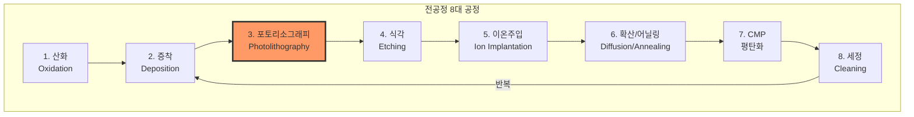
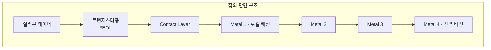

# 1.3 팹(Fab) 공정 흐름 — 전공정 8대 공정 요약

## 이 챕터에서 배우는 것
- 반도체 팹(Fab)이란 무엇이며, 왜 그렇게 비싼지
- 전공정(Front-End)의 8대 핵심 공정과 각각의 역할
- 공정 흐름의 전체 그림 — 어떤 순서로, 왜 반복되는지
- 각 공정에서 생성되는 데이터의 종류
- AI 엔지니어가 공정 흐름을 이해해야 하는 이유

---

## 팹(Fab)이란

이전 챕터에서 우리는 모래를 거울처럼 매끈한 실리콘 웨이퍼로 가공하는 과정을 봤다. 이제 그 웨이퍼 위에 트랜지스터와 회로를 만들 차례다. 이 작업이 이루어지는 곳이 **팹(Fab, Fabrication Facility)** — 반도체 제조 공장이다. 하지만 "공장"이라는 단어가 주는 이미지는 팹의 실체와 거리가 멀다.

최신 3~5nm급 팹 하나를 짓는 데는 약 **150~200억 달러(약 20~27조 원)**가 든다. 비교를 해 보자. 세계에서 가장 비싼 건물 중 하나인 애플 파크(Apple Park)의 건설 비용이 약 50억 달러다. 팹 하나가 그 세 배에서 네 배다. TSMC가 2021년 애리조나에 발표한 팹 투자액은 400억 달러로, 미국 역사상 단일 민간 제조 시설 투자 중 최대 규모였다. 이 천문학적 비용의 상당 부분은 장비값이다. EUV(극자외선) 노광기 한 대의 가격이 약 2억 달러이고, 최신 팹 하나에 이런 장비가 수십 대 들어간다.

팹 내부는 **클린룸(Clean Room)**이라 불리는 극도로 청정한 환경이다. 공기 1m³당 크기 0.1μm 이상의 파티클이 10개 이하(ISO Class 1~3)여야 한다. 여러분이 지금 앉아 있는 사무실의 공기에는 같은 기준으로 약 100만 개의 파티클이 떠다니고 있다. 10만 배의 차이다. 왜 이렇게까지 해야 하냐면, 사람 머리카락 굵기가 약 50μm인데, 최신 공정에서 만드는 패턴의 선폭은 3~5nm — 머리카락의 **1만분의 1** 수준이다. 그보다 큰 먼지 한 알이 회로 위에 떨어지면 그 칩은 죽는다. 마치 눈에 보이지도 않는 미세 장애물이 고속도로 전체를 마비시키는 것과 같다.

건물 자체도 외부 진동으로부터 격리되어야 한다. 포토리소그래피 장비가 나노미터 수준의 정밀도로 패턴을 찍기 때문에, 수백 미터 밖 도로의 트럭 진동조차 문제가 된다. 실제로 TSMC의 타이난 팹 근처에 고속철도 노선이 계획되었을 때, 진동 영향 연구가 별도로 수행되었다. 반도체 팹은 물리적 환경을 이 정도까지 통제해야 하는 시설이다.

그리고 이 모든 것이 **24시간 365일** 쉬지 않고 돌아간다. 장비 한 대가 멈추면 시간당 수만 달러의 기회 비용이 발생한다. 팹의 **가동률(Uptime)**이 곧 수익이다. CS 세계와 비유하자면, 팹은 **하이퍼스케일 데이터센터의 물리적 버전**이다. 막대한 초기 투자(CapEx), 극도의 환경 제어, 가동률과 효율이 비즈니스의 생명선이라는 점에서 놀라울 정도로 닮아 있다.

---

## 전공정 8대 공정: 웨이퍼 위에 칩을 새기는 여정

웨이퍼 위에 트랜지스터와 회로를 만드는 과정을 **전공정(Front-End of Line, FEOL)**이라 한다. 전공정은 크게 8가지 핵심 공정으로 나눌 수 있다. 이것들이 단 한 번 수행되고 끝나는 것이 아니라 **수십~수백 번 반복**되면서 칩이 완성된다. 아래에서 각 공정을 차례로 짚어 보겠다.

> ⚠️ 포토리소그래피(3번)를 주황색으로 강조한 이유: 이 핸드북의 핵심 주제이며, 전체 공정에서 가장 비용이 크고 복잡한 공정이다.

### 1. 산화 (Oxidation) — 보호막을 입히다

모든 것은 산화에서 시작된다. 실리콘 웨이퍼를 고온(800~1,200°C)의 산소(O₂) 또는 수증기(H₂O) 환경에 노출하면, 표면에 **이산화규소(SiO₂)** 막이 자라난다. 실리콘이 산소와 자연스럽게 결합하는 성질을 이용하는 것이다. 1.1장에서 "왜 실리콘인가"를 설명하면서 "안정적인 산화막을 형성한다"고 했는데, 바로 이 공정이 그 장점을 실현하는 순간이다.

산화막은 여러 역할을 한다. 가장 중요한 것은 **게이트 산화막** — 트랜지스터의 게이트와 채널 사이를 절연시키는 극도로 얇은 막이다. 최신 공정에서 이 막의 두께는 **1~2nm**, 원자 4~8개를 쌓아 올린 수준이다. 이 막이 1nm만 두꺼워져도 트랜지스터의 전기적 특성이 달라지고, 핀홀(pinhole)이 하나라도 있으면 전류가 누설되어 칩이 오작동한다. 그 외에도 산화막은 소자 간 분리(STI, Shallow Trench Isolation)에서 트랜지스터들을 전기적으로 격리하는 벽 역할을 하고, 이후 공정에서 웨이퍼 표면을 보호하는 방패 역할도 한다.

### 2. 증착 (Deposition) — 원하는 재료를 정밀하게 쌓다

산화가 실리콘 자체의 표면을 변환시키는 과정이라면, 증착은 **외부에서 원하는 재료를 가져와 웨이퍼 위에 쌓는** 과정이다. 산화막뿐 아니라 질화막(Si₃N₄), 금속막(텅스텐, 구리, 알루미늄), 고유전율(High-K) 물질 등 수십 가지 재료를 필요한 곳에 필요한 두께로 쌓아야 한다.

증착 방법은 크게 세 가지다. **CVD(Chemical Vapor Deposition)**는 기체 상태의 원료 물질을 웨이퍼 표면에서 화학 반응시켜 막을 형성한다. 가장 범용적이고 널리 쓰이는 방법이다. **PVD(Physical Vapor Deposition)**는 타겟 재료에 이온을 충돌시켜 원자를 떼어낸 뒤 웨이퍼에 달라붙게 하는 스퍼터링(Sputtering) 방식인데, 주로 금속 배선 증착에 사용된다. 그리고 최신 공정의 핵심 기술인 **ALD(Atomic Layer Deposition)**가 있다.

ALD는 이름 그대로 원자 한 층씩 쌓는 기술이다. 한 번의 사이클에서 딱 원자 한 층만 증착되므로, 사이클 수만 세면 두께를 옹스트롬(Å) 단위로 정밀 제어할 수 있다. 프로그래밍에서 한 줄씩 실행하는 **Step-by-step Execution**과 같은 철학이다 — 한 번에 많이 쌓는 것보다 느리지만, 정확도에서 타의 추종을 불허한다. 게이트 산화막을 High-K 물질로 대체하는 최신 공정에서, ALD 없이는 필요한 두께 균일도를 달성할 수 없다.

### 3. 포토리소그래피 (Photolithography) ⭐ — 설계도를 물리 세계에 옮기다

이 핸드북의 주인공이다. 포토리소그래피는 **빛(자외선)을 이용해 웨이퍼 위에 회로 패턴을 전사하는 공정**으로, 원리는 사진 인화와 같다.

먼저 웨이퍼 표면에 **감광제(Photoresist)** — 빛에 반응하는 화학 물질 — 를 균일하게 도포한다. 그 위에 **마스크(Mask)**라 불리는 회로 패턴이 새겨진 유리판을 놓고 자외선을 쬔다(노광, Exposure). 빛이 마스크의 투명한 부분을 통과하여 감광제에 패턴을 "인화"하면, **현상(Development)** 과정에서 빛을 받은 부분(또는 안 받은 부분)의 감광제가 녹아 사라져 패턴이 드러난다.

이 공정이 반도체 제조에서 가장 중요한 이유는 명확하다. **칩의 모든 구조 — 트랜지스터, 배선, 비아(Via) — 는 포토리소그래피로 정의된다.** 패턴의 선폭(CD, Critical Dimension)이 곧 트랜지스터의 크기를 결정하고, 층 간 정렬 정확도(Overlay)가 소자의 연결 신뢰성을 결정한다. 전체 제조 비용의 30~35%가 이 공정에 집중되고, 최신 5nm급 칩은 **80회 이상의 포토리소그래피 스텝**을 거친다. 여러분이 SMILE 플랫폼에서 다루는 데이터 — CD, Overlay, Focus, Dose — 가 전부 이 공정에서 나온다. Part 2에서 깊이 있게 파고들 것이다.

### 4. 식각 (Etching) — 불필요한 부분을 조각하다

포토리소그래피가 "설계도를 종이에 그리는" 공정이라면, 식각은 **그 설계도대로 실제 물질을 깎아내는** 공정이다. 감광제가 남아 있는 부분은 보호되고, 노출된 부분의 산화막, 금속, 실리콘 등이 제거된다.

식각에는 두 가지 큰 분류가 있다. **건식 식각(Dry Etching)**은 플라즈마(Plasma) — 고에너지 이온화 기체 — 를 사용하여 재료를 깎아낸다. 이온이 한 방향으로 가속되어 표면에 충돌하므로 **이방성(Anisotropic)** 식각이 가능하다. 즉, 옆으로 퍼지지 않고 수직으로만 깎인다. 나노미터 스케일의 미세 패턴을 만들 때 이 수직 프로파일이 필수적이다. 반면 **습식 식각(Wet Etching)**은 화학 용액에 웨이퍼를 담가 재료를 녹이는 방식이다. 모든 방향으로 동일하게 식각되는 **등방성(Isotropic)** 특성 때문에 미세 패턴에는 부적합하지만, 세정이나 대면적 제거에는 여전히 쓰인다.

최신 공정에서 식각의 난이도는 극적으로 올라가고 있다. 3D NAND 플래시 메모리처럼 수십~수백 층을 수직으로 관통하는 **고종횡비(High Aspect Ratio)** 식각이 요구되기 때문이다. 폭이 수십 nm인 구멍을 깊이 수 μm까지 뚫어야 하는데, 이것은 축구장 크기의 땅에 직경 1m, 깊이 100m짜리 구멍을 정확히 수직으로 파는 것과 비슷한 비율이다.

### 5. 이온 주입 (Ion Implantation) — 원하는 곳에 불순물을 정밀 사격하다

1.1장에서 도핑(Doping)이 반도체의 전기적 특성을 바꾼다고 설명했다. 이온 주입은 그 도핑을 **정밀하게 실행하는** 공정이다. 인(P), 비소(As), 붕소(B) 등의 원소를 이온화한 뒤 수 keV에서 수 MeV의 에너지로 가속하여 웨이퍼의 특정 영역에 쏘아 박는다. 포토리소그래피가 만든 감광제 패턴이 마스크 역할을 하여, 원하는 곳에만 불순물이 주입된다.

이온 주입의 정밀도는 놀랍다. 주입 에너지로 깊이를 제어하고, 빔 전류(Beam Current)와 시간으로 농도(Dose)를 제어한다. 이 두 파라미터의 조합으로 트랜지스터의 문턱전압(Threshold Voltage), 누설전류(Leakage), 구동 전류(Drive Current)가 결정된다. 프로그래밍에서 함수의 인자(parameter)를 바꾸면 동작이 달라지듯, 이온 주입의 에너지와 Dose를 바꾸면 트랜지스터의 성격이 완전히 바뀐다.

### 6. 확산/어닐링 (Diffusion/Annealing) — 열로 마무리하다

이온 주입은 원자를 고속으로 "때려 박는" 과정이기 때문에, 실리콘 결정 격자에 물리적 손상을 남긴다. 이 손상을 복구하고 주입된 이온을 전기적으로 활성화시키기 위해 **열처리(Annealing)**를 수행한다. 1,000°C 이상의 고온에서 수 초간(Rapid Thermal Annealing, RTA) 또는 밀리초 단위(Laser Spike Annealing)로 가열하면, 격자가 재배열되면서 손상이 복구되고 도핑 원자가 격자 자리에 안착한다.

이 과정에서 주의해야 할 것이 **확산(Diffusion)**이다. 고온에서는 도핑 원자가 의도한 영역 밖으로 퍼지려는 성질이 있다. 트랜지스터가 점점 작아지면서 이 확산을 억제하는 것이 점점 더 어려워지고 있고, 이 때문에 어닐링 시간을 극도로 짧게(밀리초~마이크로초 단위) 가져가는 기술이 발전해 왔다. 짧은 시간에 충분한 에너지를 전달하되 확산은 최소화하는 — 일종의 **최적화 문제**다.

### 7. CMP (Chemical Mechanical Planarization) — 표면을 원점으로 되돌리다

산화, 증착, 식각, 이온 주입을 반복하면 웨이퍼 표면에 **단차(Step Height)**가 생긴다. 높은 곳과 낮은 곳의 차이가 수백 nm에서 μm 수준까지 벌어질 수 있다. 이 상태로 다음 층의 포토리소그래피를 수행하면 치명적인 문제가 발생한다 — **초점 깊이(DOF, Depth of Focus)**가 극히 얕은 최신 노광 장비에서 표면 높낮이 차이는 곧 초점 불량을 의미하기 때문이다.

CMP는 **화학 용액(슬러리)과 기계적 연마 패드를 동시에 적용**하여 표면을 평탄하게 만든다. 웨이퍼 제조 단계의 CMP와 원리는 같지만, 여기서는 다층 구조의 각 층 사이에서 평탄화를 수행한다는 점이 다르다. 특히 구리(Cu) 배선 공정에서는 **다마신(Damascene)** 기법을 사용하는데, 홈을 파고(식각) → 구리를 채우고(증착) → 넘치는 구리를 CMP로 갈아내는 방식이다. CMP가 없으면 다층 배선 구조는 불가능하고, 다층 배선이 없으면 수십억 개의 트랜지스터를 연결할 방법이 없다. 눈에 잘 띄지 않지만, CMP는 현대 반도체 제조의 숨은 공신이다.

### 8. 세정 (Cleaning) — 모든 공정 사이의 필수 의식

세정은 가장 화려하지 않지만 **가장 빈번한** 공정이다. 전체 공정 스텝의 약 **30%가 세정**이다. 위에서 설명한 7가지 공정 사이사이마다 수행되며, 이전 공정이 남긴 잔여물 — 파티클, 금속 오염, 유기물, 자연 산화막 — 을 제거한다.

업계 표준은 1965년에 RCA 연구소에서 개발된 **RCA 세정법**이다. SC-1(암모니아수 + 과산화수소)으로 유기 오염과 파티클을 제거하고, SC-2(염산 + 과산화수소)로 금속 오염을 제거하는 2단계 프로세스다. 60년 가까이 지난 기술이 여전히 기본으로 쓰인다는 것은, 그만큼 이 기술이 근본적이라는 의미다. 물론 현대적인 변형과 추가 기법(오존수 세정, 메가소닉 세정 등)이 함께 사용되지만, 핵심 원리는 바뀌지 않았다.

세정이 이렇게 빈번하고 중요한 이유는 단순하다. **앞 공정의 오염이 뒤 공정의 결함이 되기 때문이다.** 소프트웨어에서 각 함수가 리턴하기 전에 임시 자원을 정리하는 것과 같다. cleanup을 빠뜨리면 언젠가 메모리 누수로 시스템이 죽듯, 세정을 빠뜨리면 언젠가 결함으로 칩이 죽는다.

---

## 공정 흐름: 왜 수백 번 반복되는가

8가지 공정을 한 번 수행하면 웨이퍼 위에 하나의 구조(예: 트랜지스터의 게이트)가 만들어진다. 하지만 칩은 하나의 구조가 아니다. 수직으로 여러 **층(Layer)**이 쌓인 3차원 구조체다.

맨 아래의 실리콘 위에 먼저 **트랜지스터층(FEOL)**이 만들어진다. 산화 → 증착 → 포토리소그래피 → 식각 → 이온주입 → 어닐링의 사이클이 수십 번 반복되면서 수십억 개의 트랜지스터가 형성된다. 그 위에 **배선층(BEOL, Back-End of Line)**이 올라간다. 증착 → 포토리소그래피 → 식각 → CMP의 사이클이 역시 수십 번 반복되면서 금속 배선이 트랜지스터들을 연결한다. 최신 칩의 금속 배선 층수는 **10~15층**에 달한다.

소프트웨어 비유로 정리하면, 전체 공정 흐름은 **중첩된 for 루프**와 같다. 외부 루프가 "층(Layer)"을 순회하고, 내부 루프가 "공정 스텝(산화→증착→리소→식각…)"을 순회한다. 각 반복에서 매개변수(온도, 압력, 시간, 패턴)가 달라진다. 최신 5nm급 칩의 전체 공정 스텝 수는 **1,000단계를 넘고**, 웨이퍼가 팹에 들어와서 완성된 칩으로 나오기까지 **2~3개월**이 걸린다. 한 장의 웨이퍼가 수개월간 수백 대의 장비를 돌아다니면서 1,000번 이상의 가공을 받는다고 생각하면, 반도체 제조가 왜 인류가 만든 가장 복잡한 제조 프로세스라고 불리는지 이해가 갈 것이다.

---

## 각 공정에서 나오는 데이터

AI 엔지니어인 여러분에게 가장 중요한 부분이다. 각 공정은 **센서 데이터(Equipment Data, EES)**와 **계측 데이터(Metrology)**를 대량으로 생성한다. 아래 표는 주요 공정별 데이터와 AI 활용 사례를 정리한 것이다.

| 공정 | 주요 데이터 | AI 활용 |
|:---|:---|:---|
| 산화/증착 | 막 두께, 균일도, 증착 속도 | 두께 예측(VM), 이상 탐지, Run-to-Run 제어 |
| **포토리소그래피** | **CD, Overlay, Focus, Dose** | **핵심 예측/보정 대상 (SMILE 플랫폼)** |
| 식각 | 식각 깊이, 프로파일, 선택비 | 종점 검출(EPD), 프로파일 예측 |
| 이온주입/확산 | 주입량(Dose), 에너지, 균일도, 시트 저항 | 이상 탐지, 레시피 최적화 |
| CMP | 제거량, 균일도, 표면 결함 | 종점 제어, VM, 패드 수명 예측 |
| 세정 | 파티클 수, 금속 오염도 | 오염 원인 추적, 세정 조건 최적화 |

하나의 웨이퍼가 팹을 통과하면서 생성하는 데이터 포인트는 **수만~수십만 개**에 달한다. 장비 센서가 초당 수십~수백 개의 파라미터를 기록하고, 공정 중간중간 인라인 계측(Inline Metrology)으로 결과물의 품질을 측정한다. 이 데이터를 분석하여 수율을 예측하고 공정을 실시간으로 보정하는 것 — 그것이 반도체 AI의 존재 이유다. 여러분이 이 8가지 공정의 역할과 관계를 이해하고 있으면, 수만 개의 센서 변수 중 어떤 것이 실제로 중요한지를 도메인 지식으로 걸러낼 수 있다. 블라인드 피처 셀렉션보다 훨씬 강력한 무기다.

---

## 핵심 정리

반도체 팹은 150~200억 달러를 투자하여 극한의 청정 환경에서 24시간 가동하는, 인류가 만든 가장 복잡한 제조 시설이다. 이 안에서 **산화 → 증착 → 포토리소그래피 → 식각 → 이온주입 → 확산/어닐링 → CMP → 세정**의 8대 공정이 1,000번 이상 반복되면서 수십억 개의 트랜지스터와 10층 이상의 금속 배선이 만들어진다. 이 중 포토리소그래피는 전체 비용의 30~35%, 리소 스텝 80회 이상을 차지하는 핵심 공정이며, 이 핸드북의 Part 2에서 집중적으로 다룰 주제다. AI 엔지니어에게 공정 흐름을 이해하는 것은 **데이터 파이프라인의 물리적 원천**을 이해하는 것이며, 이것이 피처 엔지니어링과 모델 해석의 품질을 결정짓는다.

---

*다음 챕터: 1.4 산화(Oxidation)와 증착(Deposition)*
