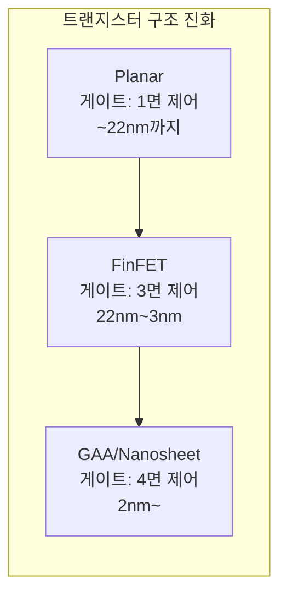

# 1.9 공정 노드와 무어의 법칙 — 7nm, 5nm, 3nm의 의미

## 이 챕터에서 배우는 것
- 무어의 법칙(Moore's Law)의 본질과 현재 상태
- 공정 노드(Process Node) 이름의 진짜 의미 — "7nm"가 7nm가 아닌 이유
- 데나드 스케일링(Dennard Scaling)과 그 종말
- FinFET에서 GAA(Gate-All-Around)로의 트랜지스터 구조 진화
- AI 엔지니어가 공정 노드를 이해해야 하는 이유

---

## 무어의 법칙: 50년간의 자기실현적 예언

1965년, 페어차일드 반도체(이후 인텔을 공동 창업하는)의 고든 무어(Gordon Moore)가 <Electronics> 매거진에 기고한 글에서 한 가지 관찰을 내놓았다. "집적회로의 부품 수가 매년 약 2배씩 증가해 왔으며, 이 추세가 최소 10년은 계속될 것이다." 1975년에 이 주기를 "약 2년마다 2배"로 수정한 것이 우리가 아는 **무어의 법칙(Moore's Law)**이다.

엄밀히 말하면 이것은 물리 법칙이 아니다. 열역학 법칙이나 맥스웰 방정식처럼 자연이 정한 규칙이 아니라, **산업 전체가 합의한 로드맵**이었다. 인텔, TSMC, 삼성, ASML, 그리고 수천 개의 재료·장비·설계 회사들이 이 목표에 맞춰 수십년간 R&D를 계획하고, 장비를 개발하고, 공정을 개선했다. "우리가 이 속도로 발전할 것이라고 믿었고, 그래서 실제로 그렇게 되었다" — 일종의 **자기실현적 예언(Self-fulfilling Prophecy)**이었다. 그리고 놀랍게도 약 50년간, 이 예언은 거의 정확하게 들어맞았다.

| 연도 | 대표 칩 | 트랜지스터 수 | 공정 노드 |
|:---|:---|:---|:---|
| 1971 | Intel 4004 | 2,300 | 10μm |
| 1989 | Intel 486 | 1.2M | 1μm |
| 2005 | Intel Pentium D | 230M | 90nm |
| 2015 | Apple A9 | 2B | 14/16nm |
| 2020 | Apple M1 | 16B | 5nm |
| 2024 | Apple M4 Max | 28B | 3nm |

2,300개에서 280억 개로 — 53년 만에 **1,200만 배**. 이 경이로운 궤적이 여러분이 들고 다니는 스마트폰의 성능을 1960년대 방 하나를 차지하던 메인프레임 수백만 대와 맞먹게 만들었다.

---

## "7nm"는 7nm가 아니다: 공정 노드라는 마케팅 용어

### 원래는 물리적 치수였다

1980~90년대까지 공정 노드 이름은 **실제 물리적 치수**를 의미했다. "1μm 공정"이라고 하면, 트랜지스터의 게이트 길이(Gate Length) — 소스와 드레인 사이에서 전류가 흐르는 채널의 길이 — 가 실제로 약 1μm이었다. 이 시절에는 노드 이름만 보면 트랜지스터의 크기를 직관적으로 알 수 있었다.

### 마케팅 라벨로의 전락

하지만 2000년대 이후, 노드 이름과 실제 물리적 치수 사이의 관계가 **완전히 무너졌다**. 각 파운드리가 경쟁적으로 더 작은 숫자를 붙이기 시작하면서, 노드 이름은 기술적 명칭에서 **마케팅 브랜드**로 변질되었다.

현실을 보자. TSMC의 "7nm" 공정에서 실제로 7nm인 부분은 **어디에도 없다**. 게이트 피치(인접 트랜지스터 간 거리)는 약 54nm이고, 가장 미세한 금속 배선의 피치도 36nm이다. "5nm"도, "3nm"도 마찬가지다.

| 공정 노드 (이름) | 실제 게이트 피치 | 실제 메탈 피치 |
|:---|:---|:---|
| "7nm" (TSMC N7) | ~54nm | ~36nm |
| "5nm" (TSMC N5) | ~48nm | ~28nm |
| "3nm" (TSMC N3) | ~48nm | ~23nm |
| "2nm" (TSMC N2, 예상) | ~44nm | ~20nm |

더 혼란스러운 것은, 같은 세대의 공정이라도 **파운드리마다 다른 이름**을 붙인다는 점이다. 인텔의 "Intel 7"(구 10nm)은 트랜지스터 밀도 면에서 TSMC의 "7nm"과 비슷한 수준이다. 숫자가 작을수록 더 앞선 기술이라는 직관은 더 이상 통하지 않는다.

여러분이 소프트웨어 버전 넘버링을 생각해 보면 이해가 빠르다. "Python 3.12"에서 3이나 12가 특정 물리적 의미를 갖지 않듯, "3nm"의 3도 실제 치수가 아닌 **세대 구분 라벨**이다. 기술적 비교를 하려면 노드 이름이 아니라 **실측 가능한 지표**를 봐야 한다.

### 진짜 지표: 트랜지스터 밀도

노드 이름 대신 의미 있는 비교 지표는 **트랜지스터 밀도(MTr/mm², 백만 트랜지스터/mm²)**다. 같은 면적에 트랜지스터를 얼마나 많이 넣을 수 있는지를 나타내며, 마케팅이 아닌 물리적 현실을 반영한다.

TSMC 기준으로 N7은 약 91 MTr/mm², N5는 약 173 MTr/mm²(~1.9배 향상), N3는 약 292 MTr/mm²(~1.7배 향상), N2는 400+ MTr/mm²(~1.4배 향상, 예상)이다. 세대가 내려갈수록 밀도 향상 폭이 줄어들고 있다는 것이 보일 것이다. 무어의 법칙이 "2배"를 약속했지만, 최근 세대에서는 1.4~1.7배로 **둔화**되고 있다. 법칙이 깨진 것은 아니지만, 같은 속도를 유지하는 것이 점점 어려워지고 있다.

---

## 데나드 스케일링의 종말: "공짜 성능 향상"의 끝

무어의 법칙과 함께 반도체의 황금기를 이끈 또 하나의 원리가 있었다. 1974년 IBM의 로버트 데나드(Robert Dennard)가 제안한 **데나드 스케일링(Dennard Scaling)**이다.

핵심 주장은 이것이다 — "트랜지스터를 작게 만들면, 같은 면적에서 **전력 밀도(Power Density)**가 일정하게 유지된다." 트랜지스터의 크기를 0.7배(면적 0.5배)로 줄이면, 전압과 전류가 각각 0.7배로 낮아져 전력(V×I)이 약 0.5배가 된다. 면적이 절반이 되고 전력도 절반이 되니, 단위 면적당 전력(전력 밀도)은 일정하게 유지된다.

이 스케일링이 성립하는 한, 칩은 세대가 내려갈 때마다 **더 작고, 더 빠르고, 전력은 같은** — 사실상 "공짜 성능 향상"을 누렸다. 소프트웨어 개발자가 코드를 바꾸지 않아도 새 하드웨어에서 더 빨리 돌아가는 축복의 시대였다.

그러나 **2006년경**, 이 축복이 끝났다. 트랜지스터가 너무 작아지면서 **누설 전류(Leakage Current)**가 급증했기 때문이다. 1.4장에서 게이트 산화막이 1~2nm까지 얇아졌다고 설명했다. 이 정도로 얇아지면, 전자가 고전적 물리학으로는 넘을 수 없는 에너지 장벽을 **양자역학적 터널링(Quantum Tunneling)**으로 관통한다. 스위치를 꺼도(OFF 상태) 전류가 흐르는 것이다. 결과적으로 전압을 더 이상 낮출 수 없게 되었고(낮추면 ON/OFF 구분이 불가능해지므로), 데나드 스케일링의 전제가 무너졌다.

그 영향은 극적이었다. 클럭 주파수의 상승이 **멈췄다**. 2005년 이전에는 세대마다 클럭이 올라갔지만(1GHz → 2GHz → 3GHz → ...), 2005년 이후 대부분의 프로세서는 3~5GHz에서 **20년째 정체**되어 있다. 업계는 단일 코어를 더 빠르게 만드는 것을 포기하고, **멀티코어** — 여러 코어를 병렬로 배치 — 로 전략을 전환했다. 절대적인 클럭 속도보다 **성능 대비 전력 효율(Performance per Watt)**이 칩 설계의 핵심 지표가 된 것이다. 여러분이 사용하는 클라우드 서버에서 ARM 기반 칩(AWS Graviton 등)이 x86을 밀어내고 있는 것도, 이 전력 효율 패러다임의 연장선이다.

---

## 트랜지스터 구조의 진화: 평면에서 3D로

데나드 스케일링이 끝났다고 미세화를 포기한 것은 아니다. 트랜지스터의 **구조 자체를 바꿔서** 누설 전류를 억제하면서도 미세화를 계속 밀어붙이는 전략이 채택되었다.

### 플레이너 MOSFET (~2011): 평면의 한계

1.1장에서 배운 전통적인 MOSFET 구조다. 게이트가 채널의 **윗면 한 면만** 제어한다. 채널이 수백 nm 이상으로 길 때는 이것으로 충분했지만, 채널이 짧아질수록 게이트의 제어력이 약해져 누설 전류가 급증한다 — 이것을 **단채널 효과(Short Channel Effect)**라 한다. 22nm 이하에서 플레이너 구조는 사실상 한계에 도달했다.

### FinFET (2012~현재, 22nm~3nm): 지느러미 위에 올라서다

2012년, 인텔이 22nm 공정에서 **FinFET(Fin Field-Effect Transistor)**을 세계 최초로 양산에 도입했다(인텔은 이것을 "Tri-Gate"라 불렀다). 채널을 수평으로 눕혀두는 대신, **지느러미(Fin) 형태로 수직으로 세우고** 게이트가 그 지느러미의 **세 면(양쪽 측면 + 윗면)**을 감싸는 구조다.

게이트가 채널을 3면에서 감싸니, 채널에 대한 **전기장 제어력(Gate Control)**이 플레이너 대비 극적으로 향상된다. 스위치를 끌 때 채널을 더 확실하게 차단할 수 있으므로 누설 전류가 줄어든다. 같은 전력 예산 안에서 더 높은 성능을 내거나, 같은 성능을 더 낮은 전력으로 달성할 수 있게 되었다. TSMC와 삼성은 16/14nm에서 FinFET을 도입했고, 이후 10nm, 7nm, 5nm, 3nm까지 FinFET 구조의 최적화로 미세화를 이어왔다.

### GAA/Nanosheet (2nm~): 사면에서 완전히 감싸다

FinFET에서도 3nm 이하로 내려가면 Fin이 너무 가늘어져 제어의 한계가 다시 나타난다. 다음 단계는 **GAA(Gate-All-Around)** — 게이트가 채널의 **네 면 전부를 감싸는** 구조다.

채널이 하나의 연속된 지느러미가 아니라, **여러 장의 나노시트(Nanosheet)** — 수 nm 두께의 얇은 실리콘 판 — 로 만들어진다. 이 나노시트 하나하나를 게이트가 사방에서 감싸므로, 전류 제어력이 FinFET보다 한 단계 더 향상된다. 나노시트의 폭을 조절하면 전류량을 세밀하게 튜닝할 수 있다는 설계 유연성도 장점이다.

삼성이 2022년 3nm에서 세계 최초로 GAA를 양산에 도입했고, TSMC와 인텔은 2nm에서 GAA를 도입할 예정이다(2025~2026년). 이 전환은 플레이너에서 FinFET으로의 전환만큼이나 — 어쩌면 그 이상으로 — 반도체 역사의 중요한 분기점이다.

[그림: Planar → FinFET → GAA 트랜지스터 단면 비교. 게이트(초록색)가 채널(파란색)을 감싸는 면적이 점점 넓어짐]

---

## 미세화를 가능하게 하는 기술 지도

공정 노드를 한 세대씩 내릴 때마다, 그것을 가능하게 한 핵심 기술이 있다. 아래 표는 주요 기술과 도입 시기를 정리한 것이다. 이 기술들 중 포토리소그래피 관련 항목(DUV, Immersion, Multi-Patterning, EUV)이 압도적으로 많다는 것에 주목하자 — 미세화의 역사는 곧 리소그래피 기술의 진화 역사이며, 이것이 이 핸드북이 Part 2 전체를 포토리소그래피에 할애하는 이유다.

| 기술 | 역할 | 도입 시기 |
|:---|:---|:---|
| **DUV (KrF/ArF)** | 248/193nm 광원 리소그래피 | 1990s~현재 |
| **Immersion (침수 리소)** | 물로 해상도 향상 | 45nm~ |
| **Multi-Patterning** | 여러 번 노광으로 미세 패턴 | 20nm~ |
| **FinFET** | 3D 트랜지스터 구조 | 22nm~ |
| **EUV** | 13.5nm 극자외선 리소그래피 | 7nm~ |
| **GAA Nanosheet** | 4면 게이트 제어 | 2nm~ |
| **BSPDN** | 후면 전력 배선 | 2nm~ |

---

## AI 엔지니어에게 이것이 의미하는 것

공정 노드가 미세해질수록, 여러분이 다루는 데이터와 문제의 성격이 근본적으로 변한다. 이 변화를 이해하는 것이 반도체 AI 엔지니어로서의 경쟁력이다.

첫째, **공정 변동(Process Variation)이 상대적으로 커진다.** 트랜지스터의 크기가 원자 수십 개 수준이 되면, 도핑 원자 하나의 위치 차이, 게이트 산화막의 원자 한 층 차이가 전기적 특성에 유의미한 영향을 미친다. 이것은 데이터의 **신호 대 잡음비(SNR)**가 나빠진다는 뜻이다. 같은 모델 아키텍처라도, 성숙한 28nm 공정 데이터에서 잘 작동하던 모델이 3nm 데이터에서는 노이즈에 묻혀 성능이 떨어질 수 있다.

둘째, **데이터의 복잡도가 폭증한다.** EUV 공정의 추가, 멀티 패터닝에 의한 리소 스텝 증가, FinFET/GAA의 3D 구조 파라미터 — 이 모든 것이 센서 변수와 계측 항목의 수를 늘린다. 차원의 저주(Curse of Dimensionality)가 현실적 문제가 되며, 효과적인 차원 축소와 피처 셀렉션의 중요성이 더 커진다.

셋째, **공정 간 상호작용이 강해진다.** 트랜지스터가 커서 여유가 있던 시절에는 각 공정이 비교적 독립적이었지만, 미세 공정에서는 한 공정의 미세한 변동이 여러 층 뒤의 결과에 영향을 미친다. 이온주입의 도즈 편차가 어닐링 후 확산 프로파일을 바꾸고, 그것이 CMP 후 단차에 영향을 주고, 그 단차가 리소그래피의 Focus에 영향을 주는 식이다. 단일 공정 모델보다 **시계열 종속성과 공정 간 인과 관계를 포착하는 모델**이 중요해진다.

넷째, 그리고 가장 중요한 것으로, **수율 개선의 경제적 가치가 극대화된다.** 3nm 팹의 건설 비용이 200억 달러, EUV 장비 한 대가 2억 달러인 세계에서, 수율 1%의 차이는 연간 수천만~수억 달러의 매출 차이로 직결된다. 여러분의 AI 모델이 수율을 0.5% 올릴 수 있다면, 그 모델의 ROI는 대부분의 소프트웨어 프로젝트를 압도한다. 문제가 어려워지는 만큼, **해결의 가치도 커지는** 것이다.

---

## 핵심 정리

무어의 법칙은 물리 법칙이 아니라 산업 전체가 50년간 따라온 자기실현적 로드맵이며, 현재 둔화 중이지만 완전히 끝나지는 않았다. 공정 노드 이름("7nm", "3nm")은 더 이상 실제 물리적 치수를 나타내지 않으며, 실질적 비교 지표는 **트랜지스터 밀도(MTr/mm²)**다. 2006년경 데나드 스케일링의 종말로 클럭 속도 향상이 멈추고 멀티코어/전력 효율 시대가 열렸으며, 이에 대응하여 트랜지스터 구조가 플레이너 → **FinFET**(3면 제어, 2012~) → **GAA/Nanosheet**(4면 제어, 2025~)로 진화해 왔다. AI 엔지니어에게 미세화의 진행은 데이터의 노이즈 증가, 복잡도 폭증, 공정 간 상호작용 강화를 의미하지만, 동시에 수율 개선의 경제적 가치가 극대화되어 AI의 존재 이유가 더욱 선명해지는 것이기도 하다.

---

*다음 챕터: 1.10 반도체 산업 구조 — 파운드리, 팹리스, IDM*
