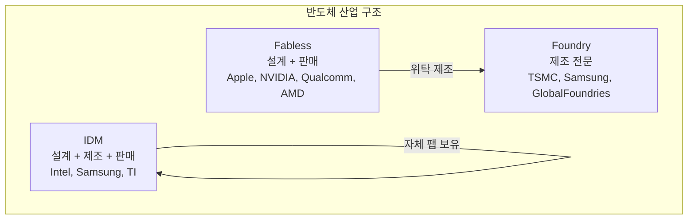
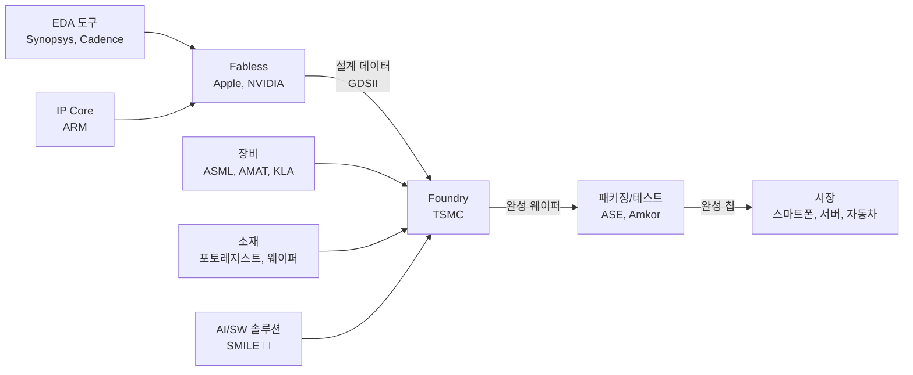

# 1.10 반도체 산업 구조 — 파운드리, 팹리스, IDM

## 이 챕터에서 배우는 것
- 반도체 산업의 주요 비즈니스 모델 — IDM, 팹리스, 파운드리
- 각 모델의 대표 기업과 역할
- 왜 파운드리 모델이 승리했는지
- 반도체 생태계의 핵심 플레이어 — EDA, IP, 장비, 소재
- SMILE 플랫폼이 이 생태계에서 어디에 위치하는지

---

## 누가 칩을 만드는가: 세 가지 비즈니스 모델

지금까지 9개 챕터에 걸쳐 반도체 칩이 **어떻게** 만들어지는지를 봤다. 이제 마지막으로 **누가** 만드는지를 살펴보겠다. 이것을 이해하지 못하면, "우리 AI 솔루션의 고객이 누구인가?", "우리가 다루는 데이터는 어디에서 오는가?"라는 가장 기본적인 질문에 답할 수 없다.

반도체 산업은 크게 세 가지 비즈니스 모델로 나뉜다.

### IDM (Integrated Device Manufacturer): 설계부터 제조까지 전부 자기가 한다

**IDM(종합 반도체 기업)**은 칩의 설계, 제조, 패키징, 판매를 모두 자체적으로 수행한다. 과거 반도체 산업의 원형이자 기본 모델이다. Intel, Samsung, Texas Instruments(TI), SK hynix, Micron 등이 대표적이다.

IDM의 강점은 **설계-공정 동시 최적화(Co-optimization)**가 가능하다는 점이다. 칩을 설계하는 팀과 공정을 개발하는 팀이 같은 회사에 있으니, 설계 단계에서부터 특정 공정의 특성에 맞춘 최적화가 가능하다. 또한 공정 기술이 핵심 경쟁력인 메모리 반도체에서는, 공정 비밀을 외부에 노출하지 않아도 된다는 보안상의 이점도 크다.

Samsung과 SK hynix가 **메모리 반도체(DRAM, NAND)**에서 IDM 모델을 고수하는 데는 합리적인 이유가 있다. 메모리는 제품 종류가 상대적으로 적고(DRAM은 사실상 범용품), 대량 생산에 최적화된 비즈니스이므로 자체 팹의 가동률을 안정적으로 높게 유지할 수 있다. 또한 메모리의 경쟁력이 공정 기술(더 작은 셀, 더 높은 적층)에 직접적으로 의존하므로, 설계-공정 통합이 필수적이다.

하지만 IDM의 약점은 명확하다. **팹 건설과 유지에 드는 천문학적 비용**이다. 최신 팹 하나에 200억 달러가 들고, 그 팹의 가동률을 항상 높게 유지해야 수지가 맞는다. 자체 제품만으로 팹을 가득 채우지 못하면 투자 대비 수익이 급격히 악화된다.

### 팹리스 (Fabless): 설계에 집중하고 제조는 맡긴다

**팹리스(Fabless)**는 말 그대로 "팹이 없는" 기업이다. 칩을 설계하고 판매하지만, 제조는 파운드리에 위탁한다. Apple, NVIDIA, AMD, Qualcomm, MediaTek, Broadcom 등이 여기에 속한다.

팹리스 모델의 핵심 장점은 두 가지다. 첫째, **막대한 팹 투자 부담에서 자유롭다.** 200억 달러를 팹에 투자하는 대신, 그 자원을 칩 설계와 소프트웨어 생태계 구축에 집중할 수 있다. 둘째, **각 제품에 최적의 공정을 선택할 수 있다.** 고성능 칩은 TSMC의 3nm로, 저전력 IoT 칩은 성숙한 28nm로 만드는 식이다. IDM이라면 자사 팹의 공정에 묶이지만, 팹리스는 시장에서 가장 좋은 공정을 자유롭게 고를 수 있다.

2020년대에 세계에서 가장 가치 있는 반도체 기업들 — NVIDIA(시가총액 3조 달러 이상), Apple(칩 설계 부문), AMD — 이 모두 팹리스라는 사실이 이 모델의 성공을 웅변한다. NVIDIA는 자체 팹을 한 번도 가져본 적이 없지만, AI 칩 시장을 지배하고 있다. 설계 역량(아키텍처 + CUDA 생태계)이 경쟁력의 원천이지, 제조 역량이 아닌 것이다.

다만 팹리스의 리스크도 존재한다. 파운드리의 생산 용량(Capacity)이 부족하면 원하는 시기에 칩을 생산하지 못할 수 있다. 2020~2021년의 글로벌 반도체 공급난은 이 리스크가 현실화된 대표적 사례로, 자동차 업계부터 게임 콘솔까지 수많은 산업이 TSMC의 생산 용량에 줄을 서야 했다.

### 파운드리 (Foundry): 제조만 전문으로, 모든 팹리스의 공장이 되다

**파운드리(Foundry)**는 자체 브랜드의 칩 제품을 갖지 않고, 팹리스 기업들의 설계를 받아 **위탁 제조만 수행하는** 모델이다. TSMC, Samsung Foundry, GlobalFoundries, UMC, SMIC 등이 있다.

**TSMC(Taiwan Semiconductor Manufacturing Company)**가 이 모델의 절대 강자다. 전 세계 파운드리 시장의 약 **67~70%**를 점유하고 있으며(2025년 기준), 최첨단 공정(3nm, 2nm)에서는 점유율이 **90% 이상**에 달한다. Apple의 모든 칩, NVIDIA의 모든 GPU, AMD의 모든 CPU/GPU, Qualcomm의 모든 스마트폰 AP가 TSMC 팹에서 만들어진다. 하나의 기업이 전 세계 최첨단 반도체의 거의 전부를 제조한다는 것은, 현대 기술 문명의 놀라운 집중도를 보여준다.

---

## 파운드리 모델이 승리한 이유: 온프레미스에서 클라우드로

1990년대까지만 해도 IDM이 반도체 산업의 주류였다. Intel, IBM, Motorola 등이 자체 팹에서 칩을 설계하고 만들었다. 하지만 **팹 건설 비용의 기하급수적 증가**가 산업의 판도를 완전히 바꿔놓았다.

| 시기 | 공정 노드 | 팹 건설 비용 |
|:---|:---|:---|
| 1990s | 350nm | ~10억 달러 |
| 2000s | 90nm | ~30억 달러 |
| 2010s | 14nm | ~100억 달러 |
| 2020s | 3nm | ~200억 달러 |

10억 달러는 많은 기업이 감당할 수 있었다. 하지만 200억 달러 — 이 금액을 자체 제품만으로 정당화할 수 있는 기업은 전 세계에 손가락으로 셀 수 있을 정도다. 대부분의 기업에게 자체 팹 유지는 **경제적으로 비합리적**이 되었다.

여러분에게 친숙한 비유를 쓰겠다. 이것은 IT 업계의 **온프레미스(On-premise) vs 클라우드** 전환과 **구조적으로 동일한 논리**다. IDM은 자체 데이터센터를 운영하는 것 — 높은 초기 투자, 유지보수 부담, 가동률 리스크를 모두 안는다. 팹리스 + 파운드리는 클라우드 컴퓨팅 — 인프라를 공유하고, 필요한 만큼 사용하고, 핵심 역량에 집중한다. TSMC의 창업자 모리스 창(Morris Chang)이 1987년에 세계 최초의 순수 파운드리 기업을 설립한 것은, 제프 베조스가 AWS로 클라우드를 대중화한 것과 같은 수준의 **산업 패러다임 전환**이었다. "반도체 제조라는 인프라를 공유 서비스로 전환한다"는 아이디어가, 이후 40년 가까이 산업 전체의 구조를 결정짓게 된 것이다.

---

## 반도체 생태계: 칩 뒤에 숨은 거대한 산업 그물

칩을 만드는 것은 IDM, 팹리스, 파운드리만의 일이 아니다. 이들 뒤에는 설계 도구, 설계 자산, 제조 장비, 정밀 소재, 소프트웨어 솔루션을 공급하는 거대한 **생태계(Ecosystem)**가 있다.

**EDA(Electronic Design Automation)** 기업들은 칩 설계에 사용하는 소프트웨어 도구를 제공한다. Synopsys, Cadence, Siemens EDA가 3강을 이루며, 회로 설계, 시뮬레이션, 검증, 물리적 레이아웃, DRC(Design Rule Check) 등 설계의 전 과정을 다룬다. 시장 규모 자체는 약 150억 달러로 반도체 산업 전체에 비하면 작지만, 이 도구 없이는 현대 칩 설계가 **문자 그대로 불가능하다**. 수십억 개의 트랜지스터를 손으로 배치할 수는 없지 않은가.

**IP(Intellectual Property) 벤더**는 재사용 가능한 설계 블록(IP Core)을 라이선싱한다. 가장 대표적인 것이 **ARM** — 전 세계 스마트폰 AP의 거의 모든 CPU 코어가 ARM 아키텍처 기반이다. Synopsys는 USB, PCIe 등 인터페이스 IP를, Imagination Technologies는 GPU IP를 제공한다. 팹리스 기업이 칩의 모든 블록을 처음부터 설계할 필요 없이, 검증된 IP를 라이선싱하여 통합하는 것이다. 소프트웨어 세계에서 모든 기능을 직접 구현하지 않고 **오픈소스 라이브러리를 가져다 쓰는 것**과 같은 논리다.

**장비(Equipment)** 기업들은 팹의 심장이라 할 제조 장비를 공급한다. **ASML**은 노광 장비의 독보적 1위이며, 전 세계에서 EUV 노광기를 만들 수 있는 유일한 회사다. 최신 High-NA EUV 장비 한 대의 가격은 **약 4억 달러**에 달한다. **Applied Materials(AMAT)**는 증착, 식각, CMP 장비에서 1위, **Lam Research**는 식각과 증착에 강하며, **Tokyo Electron(TEL)**은 코터/디벨로퍼(리소그래피 트랙)와 식각 장비를 공급한다. **KLA**는 검사/계측 장비 전문 기업으로, 결함 검사, CD/Overlay 측정 등 수율 관리의 핵심 데이터를 생성하는 장비를 만든다. SMILE 플랫폼이 다루는 데이터의 상당 부분이 KLA와 ASML의 장비에서 나온다.

**소재(Materials)** 기업들은 반도체 제조의 원료를 공급한다. 포토레지스트(JSR, TOK, 신에쓰화학), 특수 가스(Air Liquide, Linde), 웨이퍼(신에쓰반도체, SUMCO, SK Siltron), CMP 슬러리(Cabot, DuPont), High-K/Metal Gate 재료 등 수백 종의 정밀 화학 소재가 필요하다. 어느 하나라도 품질이 흔들리면 수율에 직격탄이다. 2019년 일본의 한국 수출 규제가 포토레지스트와 불화수소(HF)에 집중되었던 것은, 이 소재들이 반도체 제조에 얼마나 결정적인지를 단적으로 보여준다.

그리고 **소프트웨어/AI 솔루션** 기업들이 있다. 공정 제어(APC), 수율 분석(Yield Management), 결함 분류, 가상 계측(VM) 등의 소프트웨어를 파운드리와 IDM에 제공한다. PDF Solutions, Onto Innovation, BISTel 등이 대표적이며, **SMILE 플랫폼은 바로 여기에 위치한다** — 포토리소그래피 공정의 AI 기반 Overlay/CD 최적화 솔루션으로서.

---

## 밸류체인 전체 그림

이 밸류체인에서 SMILE은 **파운드리/IDM의 포토리소그래피 공정**에 AI 솔루션을 제공하는 위치에 있다. 고객은 TSMC, Samsung, Intel 등 팹을 운영하는 기업이고, 다루는 데이터는 ASML 노광기와 KLA 계측 장비에서 생성된다. AI 기반 공정 최적화를 통해 수율을 향상시키고 공정 비용을 절감하는 것이 핵심 가치 제안이다.

이 생태계를 이해하는 것이 왜 중요한가? 여러분의 AI 모델이 다루는 데이터가 **장비 벤더(ASML, KLA)**의 장비에서 생성되고, **파운드리(TSMC)**의 팹에서 수집되며, **EDA(Synopsys)**의 설계 데이터와 연결되기 때문이다. 각 플레이어의 역할, 데이터 형식, 비즈니스 인센티브를 이해해야 효과적인 솔루션을 만들 수 있다.

---

## 핵심 정리

반도체 산업은 IDM(설계+제조 통합), 팹리스(설계 전문), 파운드리(제조 전문)의 세 가지 비즈니스 모델로 구성되며, 팹 건설 비용의 기하급수적 증가(200억 달러+)로 인해 **팹리스 + 파운드리** 모델이 산업의 주류가 되었다. 이것은 IT 업계의 온프레미스에서 클라우드로의 전환과 구조적으로 동일한 논리다. TSMC가 파운드리 시장의 67~70%, 최첨단 공정의 90% 이상을 점유하는 독보적 위치에 있다. 칩 제조 뒤에는 EDA(설계 도구), IP(설계 블록), 장비(ASML, KLA 등), 소재(포토레지스트, 웨이퍼), 소프트웨어/AI 솔루션이라는 거대한 생태계가 있으며, SMILE 플랫폼은 이 생태계에서 파운드리의 포토리소그래피 공정에 AI 최적화를 제공하는 위치를 차지한다.

---

## 🎉 Part 1 완료!

Part 1 "반도체 제조 기초" 10개 챕터를 모두 마쳤다. 반도체가 무엇이고, 어떻게 만들어지고, 누가 만드는지에 대한 전체 그림이 잡혔을 것이다.

다음 **Part 2: 포토리소그래피 심화**에서는 이 핸드북의 핵심 주제 — 빛으로 회로를 새기는 기술 — 에 본격적으로 들어간다.

---

*다음 챕터: 2.1 포토리소그래피란 — 빛으로 회로를 새기는 원리*
