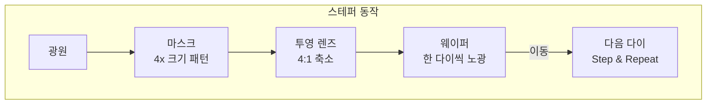

# 2.2 노광 시스템(Exposure System) — 스테퍼와 스캐너

## 이 챕터에서 배우는 것
- 노광 장비의 핵심 역할과 구성 요소
- 접촉식/근접식에서 투영식으로의 진화
- 스테퍼(Stepper)와 스캐너(Scanner)의 차이
- 스캐너의 핵심 성능 지표 — 해상도, Overlay, 처리량
- ASML의 독점적 위치와 그 의미

---

## 노광 장비: 팹에서 가장 비싸고 가장 중요한 기계

이전 챕터에서 포토리소그래피의 전체 흐름을 봤다. 그 흐름의 심장에 위치한 것이 **노광 장비(Exposure Tool)**다. 마스크에 새겨진 회로 패턴을 빛으로 웨이퍼 위에 전사하는 이 장비는, 반도체 팹에 존재하는 수천 대의 장비 중 **가장 비싸고, 가장 정밀하고, 가장 많은 데이터를 생성하는** 장비다.

여러분에게 익숙한 비유를 들자면, 노광 장비는 컴퓨터 시스템의 **CPU**와 같은 존재다. 전체 시스템(팹)에서 가장 비싸고, 성능의 병목(Bottleneck)이 되며, 이 장비의 스펙이 팹 전체의 능력 — 어떤 크기의 패턴을 얼마나 빨리, 얼마나 정밀하게 만들 수 있는지 — 을 결정한다. CPU를 업그레이드하면 시스템 전체가 빨라지듯, 노광 장비를 새 세대로 바꾸면 팹이 만들 수 있는 칩의 세대가 바뀐다.

---

## 노광 방식의 진화: 세 번의 패러다임 전환

### 1세대: 접촉식/근접식 — 마스크를 웨이퍼에 직접 댄다

반도체 산업 초기(1960~70년대)에는 마스크를 웨이퍼에 **직접 접촉(Contact)**시키거나 수 μm의 미세한 간격을 두고 **근접(Proximity)**시켜 노광했다. 원리는 도장 찍기와 같다. 마스크에 그려진 패턴이 1:1 크기로 그대로 웨이퍼에 전사된다.

구조가 단순하고 접촉식은 해상도도 나쁘지 않았지만, 치명적 문제가 있었다. 마스크와 웨이퍼가 물리적으로 닿으면 **양쪽 모두 손상**된다. 마스크 표면에 흠집이 생기면 이후 찍히는 모든 웨이퍼에 그 흠집이 복제된다. 마스크 하나가 수십~수백만 달러인 세계에서, 마스크 수명이 짧다는 것은 비용 면에서 재앙이다. 또한 1:1 전사이므로 마스크에 5nm 결함이 있으면 웨이퍼에도 5nm 결함이 그대로 나타난다. 이런 한계 때문에 접촉식/근접식은 양산에서 빠르게 사라졌다.

### 2세대: 투영식 스테퍼 — 렌즈가 패턴을 축소하다

1978년, GCA가 세계 최초의 상용 **스테퍼(Stepper)**를 출시하면서 노광 기술에 첫 번째 패러다임 전환이 일어났다. 핵심 혁신은 마스크와 웨이퍼 사이에 **투영 렌즈(Projection Optics)**를 놓은 것이다.

**4:1 축소 투영**이 이 혁신의 핵심이다. 마스크의 패턴을 웨이퍼에 찍히는 크기의 4배로 크게 제작하고, 렌즈 시스템이 이것을 1/4로 축소하여 웨이퍼에 투영한다. 이 간단한 아이디어가 두 가지 근본적 이점을 가져왔다. 첫째, 마스크 패턴이 4배 크니 **마스크 제작이 훨씬 쉬워진다.** 10nm 패턴을 직접 마스크에 새기는 것보다 40nm 패턴을 새기는 것이 기술적으로 달성 가능하다. 둘째, 마스크에 작은 결함이 있어도 웨이퍼에서는 **1/4 크기로 축소**되어 영향이 크게 줄어든다. 마스크 위의 20nm 파티클이 웨이퍼에서는 5nm로 줄어드는 것이다.

스테퍼라는 이름은 동작 방식에서 유래했다. 한 번에 웨이퍼 전체를 노광하는 것이 아니라, 한 다이(또는 몇 개 다이) 영역만 노광한 뒤 웨이퍼 스테이지를 다음 위치로 이동(Step)시키고 같은 노광을 반복(Repeat)한다. **"Step and Repeat"** — 이 방식 덕분에 렌즈가 커버해야 할 영역이 작아져, 작은 렌즈로도 높은 해상도를 달성할 수 있게 되었다.

### 3세대: 스캐너 — 슬릿으로 훑어가다

1990년대에 들어서면서, 스테퍼의 한계가 드러났다. 칩 크기가 커지면서 한 번에 노광해야 하는 영역(노광 필드)이 넓어졌는데, 넓은 영역을 한 번에 투영하려면 렌즈도 커져야 한다. 큰 렌즈는 **수차(Aberration)** — 빛이 렌즈를 통과하면서 생기는 왜곡 — 가 심해지고, 제조 비용과 난이도가 기하급수적으로 올라간다. 렌즈의 중심부는 성능이 좋지만 가장자리로 갈수록 수차가 커지는 것은 광학의 근본적 한계다.

**스캐너(Scanner)**는 이 문제를 우아하게 해결했다. 전체 노광 필드를 한 번에 투영하는 대신, 마스크와 웨이퍼를 **동시에 반대 방향으로 이동**시키면서 좁은 **슬릿(Slit)** 형태의 빛으로 패턴을 훑어간다(Scan). 마스크는 속도 v로, 웨이퍼는 v/4로 이동한다 — 4:1 축소비를 유지하기 위해서다. 슬릿이 좁으므로 렌즈의 **유효 사용 영역이 중심부 근처로 한정**되어 수차 제어가 훨씬 쉬워진다. 결과적으로 넓은 노광 필드(최대 26×33mm)를 확보하면서도 높은 해상도를 유지할 수 있게 되었다.

스캐너 방식은 프로그래밍에서 대용량 파일을 처리할 때 전체를 메모리에 올리지 않고 **스트리밍(Streaming)**으로 한 줄씩 읽어 처리하는 것과 같은 발상이다. 한 번에 전체를 보려 하지 않고, 작은 창(슬릿)으로 훑어가면서 처리하니 리소스(렌즈 크기)의 한계를 우회할 수 있다.

---

## 스캐너의 내부: 정밀 기계공학의 극한

현대 ArF 침수(Immersion) 스캐너는 인류가 만든 가장 정밀한 기계 중 하나다. 그 내부를 구성하는 핵심 서브시스템을 살펴보자.

**광원 시스템(Illumination System)**은 ArF 엑시머 레이저로 파장 193nm의 심자외선(DUV)을 생성한다. 단순히 빛을 쏘는 것이 아니라, 빛의 형태(Illumination Shape)를 Conventional(원형), Annular(고리형), Dipole(양극), Quadrupole(사극) 등으로 조절한다. 왜 조명 형태가 중요하냐면, 패턴의 방향과 밀도에 따라 최적의 조명 형태가 다르기 때문이다. 수평 라인 패턴에는 수직 Dipole이, 수직 라인에는 수평 Dipole이 해상도와 DOF를 극대화한다. 이것은 2.6장(해상도와 DOF)에서 깊이 다룰 주제다.

**마스크 스테이지(Reticle Stage)**는 무게 수백 g의 마스크를 최대 약 2m/s의 속도로 고속 이동시키면서도, **1nm 미만의 위치 정밀도**를 유지한다. 이 정밀도가 얼마나 극한적인지 체감하기 어렵다면 — 시속 7km로 달리는 물체의 위치를 원자 몇 개 수준의 정확도로 실시간 제어한다고 생각하면 된다.

**투영 렌즈(Projection Optics)**는 수십 장의 석영(Fused Silica) 및 형석(CaF₂) 렌즈로 구성된 총 무게 수백 kg의 광학계다. 각 렌즈 표면은 원자 수준으로 연마되어 있으며, 수차를 극한까지 보정한다. 렌즈의 집광 능력을 나타내는 **NA(Numerical Aperture)**는 건식 스캐너에서 약 0.93, 침수 스캐너에서 약 1.35에 달한다. NA가 높을수록 더 미세한 패턴을 만들 수 있는데, 침수 스캐너가 렌즈와 웨이퍼 사이에 물(굴절률 1.44)을 채워 NA 1.0의 공기 한계를 넘은 것이 혁신이었다. 이 이야기는 2.3장에서 자세히 다룬다.

**웨이퍼 스테이지(Wafer Stage)**는 300mm 웨이퍼를 **0.5nm 미만의 위치 정밀도**로 이동시킨다. 현대 스캐너는 **듀얼 스테이지(Dual Stage)** 구조를 사용한다 — 두 개의 독립된 스테이지가 있어, 하나에서 정렬 측정을 수행하는 동안 다른 하나에서는 노광을 수행한다. 측정과 노광이 병렬로 진행되니 처리량이 거의 2배로 올라간다. 프로그래밍에서 **더블 버퍼링(Double Buffering)**과 같은 발상이다 — 하나의 버퍼에 데이터를 채우는 동안 다른 버퍼에서 데이터를 소비한다.

**정렬 및 레벨링 시스템**은 노광의 정밀도를 최종적으로 결정하는 센서 시스템이다. 정렬 시스템은 웨이퍼에 미리 새겨진 Alignment Mark를 광학적으로 읽어 이전 층과 현재 마스크를 정렬하고, 레벨링 시스템(Air Gauge나 광학 센서)은 웨이퍼 표면의 높낮이를 실시간으로 측정하여 투영 렌즈의 초점면과 일치시킨다. 웨이퍼가 완벽히 평평하지 않으므로(1.2장에서 배운 Warp, 이전 공정에서 생긴 단차 등), 위치마다 Focus를 실시간으로 보정해야 한다.

---

## 스캐너의 핵심 성능 지표

스캐너의 성능은 세 가지 핵심 지표로 요약된다. 최신 ArF 침수 스캐너(ASML NXT:2100i)의 스펙을 기준으로 살펴보자.

| 지표 | 의미 | 최신 ArF-i 스캐너 |
|:---|:---|:---|
| **해상도 (Resolution)** | 만들 수 있는 최소 패턴 크기 | ~36nm (Single Patterning) |
| **Overlay** | 층간 정렬 정확도 | < 1.4nm (MMO) |
| **처리량 (Throughput)** | 시간당 처리 웨이퍼 수 | ~300 wph |
| **NA** | 렌즈 집광 능력 | 1.35 |
| **노광 필드** | 한 번에 노광하는 영역 | 26 × 33mm |

**처리량 300 wph(wafers per hour)**가 의미하는 것을 생각해 보자. 1시간에 300장, 즉 **12초에 웨이퍼 1장**이다. 300mm 웨이퍼 위의 수백 개 다이를 각각 나노미터 정밀도로 정렬하고, 슬릿으로 스캔하며 노광하는 것을 12초 안에 끝낸다. 이 속도와 정밀도의 동시 달성이 현대 스캐너의 진정한 경이로움이다.

---

## ASML: 노광 장비의 절대 지배자

노광 장비 시장을 이야기할 때 ASML을 빼놓을 수 없다. 사실상 ASML **자체가** 시장이다.

네덜란드 벨트호벤에 본사를 둔 ASML은 EUV 스캐너를 생산할 수 있는 **세계 유일의 기업**이다(점유율 100%). ArF 침수 스캐너에서도 약 90%를 점유한다(나머지는 일본 Nikon). 일본 Canon은 첨단 노광에서 사실상 철수했다. 장비 가격은 ArF-i 스캐너가 약 1억 달러, EUV 스캐너가 약 2~4억 달러, 차세대 **High-NA EUV**는 약 **3.5~5억 달러**에 달한다.

ASML이 이 독보적 위치에 올 수 있었던 것은 하루아침의 일이 아니다. **30년 이상의 기술 축적**과 전략적 파트너십의 결과다. 독일 Carl Zeiss(자이스)와의 독점 파트너십으로 세계 최고 수준의 EUV 반사 광학계를 확보했고, TSMC와의 긴밀한 협력으로 ArF 침수 기술에서 Nikon을 추월했으며, 미국 Cymer(EUV 광원 전문 기업)를 2013년에 인수하여 광원 기술까지 내재화했다. 이 각각의 기술 — 광원, 광학계, 스테이지, 소프트웨어 — 이 모두 극한의 정밀도를 요구하는 분야이고, 어느 하나라도 빠지면 장비가 작동하지 않는다. 경쟁사가 이 모든 것을 따라잡으려면 수십 년과 수백억 달러가 필요하다.

ASML의 독점이 반도체 산업에 주는 의미는 심각하다. 전 세계 최첨단 칩 생산이 단 하나의 장비 회사에 의존한다는 것은, 지정학적 리스크의 관점에서 상당한 취약점이다. 미국, 중국, 유럽이 반도체 공급망 독립을 추진하는 배경에는 항상 ASML과 TSMC라는 두 가지 **단일 장애점(Single Point of Failure)**이 있다.

---

## AI 엔지니어에게 이것이 의미하는 것

스캐너는 팹에서 가장 많은 데이터를 생성하는 장비 중 하나다. 매 노광 스텝마다 Dose, Focus, 조명 조건 같은 **노광 파라미터**, 각 다이의 정렬 오차(x, y, 회전, 배율 등)인 **정렬 데이터**, 웨이퍼 표면의 높낮이를 밀리미터 단위 격자로 측정한 **레벨링 데이터**, 그리고 렌즈 수차, 스테이지 진동, 광원 출력 변동 같은 **장비 상태 데이터**가 모두 기록된다.

스캐너 한 대가 하루에 처리하는 웨이퍼는 약 7,000장(300 wph × 24시간 기준)이다. 각 웨이퍼에서 수백 개 다이의 정렬/레벨링/노광 데이터가 생성되므로, **하루에 수백만 개의 데이터 포인트**가 쏟아진다. 팹 하나에 스캐너가 수십 대 있으니, 팹 전체에서는 하루에 수천만~수억 개의 데이터 포인트가 생성된다.

이 빅데이터를 **실시간으로** 분석하여 다음 웨이퍼의 노광 조건을 보정하는 것이 **APC(Advanced Process Control)** — 구체적으로는 **Run-to-Run(R2R) 제어**의 핵심이며, SMILE 플랫폼이 정확히 이 문제를 다룬다. 이전 웨이퍼(또는 이전 로트)의 정렬/CD 데이터를 분석하여, 다음 웨이퍼에서 발생할 오차를 사전에 예측하고 노광 파라미터를 조정하는 것이다. 이 피드백 루프의 정확도가 곧 수율이다.

---

## 핵심 정리

노광 장비는 반도체 팹의 심장으로, 접촉식 → 투영식 스테퍼(4:1 축소, Step & Repeat) → 스캔식 스캐너(슬릿 스캐닝)로 세 번의 패러다임 전환을 거쳐 진화해왔다. 현대 스캐너는 듀얼 스테이지로 측정과 노광을 병렬 수행하며, 12초에 웨이퍼 한 장씩 나노미터 정밀도의 노광을 달성한다. ASML이 EUV 100%, ArF-i 90%의 점유율로 사실상 시장을 독점하고 있으며, 이 독점은 30년 이상의 기술 축적과 전략적 파트너십(Zeiss, Cymer)의 결과다. AI 엔지니어에게 스캐너는 하루 수백만 데이터 포인트를 생성하는 핵심 데이터 소스이며, 이 데이터를 실시간으로 분석하여 노광 조건을 보정하는 APC/R2R 제어가 SMILE 플랫폼의 핵심 기능이다.

---

*다음 챕터: 2.3 광원의 진화 — g-line → i-line → KrF → ArF → EUV*
