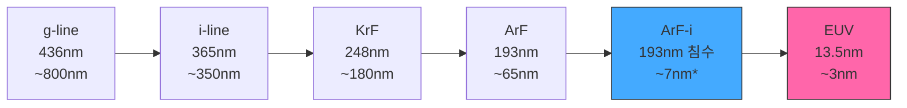

# 2.3 광원의 진화 — g-line → i-line → KrF → ArF → EUV

## 이 챕터에서 배우는 것
- 포토리소그래피 광원이 왜 계속 짧은 파장으로 진화했는지
- 각 광원 세대의 특성과 해당 공정 노드
- 침수 리소그래피(Immersion) — ArF의 수명을 연장한 혁신
- EUV(극자외선)의 등장과 그 의미
- 광원 선택이 AI 데이터에 미치는 영향

---

## 왜 파장이 짧아져야 하는가: Rayleigh 방정식

포토리소그래피의 역사를 관통하는 하나의 방정식이 있다. 이전 챕터에서 스캐너의 해상도를 언급했는데, 그 해상도가 어디서 결정되는지를 이제 정확히 이해해 보자.

```
R = k₁ × λ / NA
```

**Rayleigh 방정식**이다. R은 만들 수 있는 최소 패턴 크기(해상도), k₁은 공정 계수(이론적 최소 0.25, 실용 한계 약 0.28), λ는 광원의 파장, NA는 렌즈의 개구수(Numerical Aperture)다.

이 방정식이 말해주는 것은 단순하고 강력하다 — 더 미세한 패턴을 만들려면 세 가지 길밖에 없다. **파장(λ)을 줄이거나**, **NA를 높이거나**, **k₁을 줄이는 것**이다. 반도체 산업의 50년 역사는 이 세 가지를 동시에 밀어붙인 역사다. 이 챕터에서는 첫 번째 — 파장의 진화를 다루고, NA 확장은 침수 리소그래피에서, k₁ 축소는 2.7장의 OPC/RET에서 다룬다.

여러분이 소프트웨어 최적화를 할 때 "알고리즘을 바꾸거나, 하드웨어를 업그레이드하거나, 캐시를 최적화하거나" 세 가지 방법이 있듯이, 리소그래피의 해상도 개선도 정확히 세 가지 축을 따라 진행된다. 그리고 각 축의 개선이 한계에 도달할 때마다 다음 축으로 전환하는 패턴이 반복된다.

---

## 광원 세대별 역사: 빛의 색깔이 칩의 크기를 결정했다



*ArF-i는 멀티패터닝 병용 시

### g-line과 i-line: 수은 램프의 시대

포토리소그래피의 시작은 의외로 소박했다. **수은 램프(Mercury Lamp)** — 수은 증기에 전류를 흘려 빛을 내는, 가로등에도 쓰이던 광원 — 가 최초의 리소그래피 광원이었다. 수은 램프는 여러 파장의 빛을 동시에 방출하는데, 필터로 특정 파장만 골라 사용했다. 436nm의 **g-line**(1970~80년대, ~800nm 노드)과 365nm의 **i-line**(1980~90년대, ~350nm 노드)이 대표적이다.

i-line은 놀라운 장수 기술이다. 1980년대에 도입되었지만, 장비 가격이 저렴하고 기술이 완전히 성숙했기 때문에, **지금도** 패키징, MEMS(미세전자기계시스템), 파워 반도체 등 미세화가 덜 중요한 분야에서 현역으로 활약하고 있다. 소프트웨어에서 COBOL이 아직도 은행 시스템에서 돌아가는 것과 비슷한 현상이다.

### KrF (248nm): 레이저 시대의 개막

수은 램프의 파장으로는 200nm 이하의 패턴을 만들 수 없었다. 여기서 **엑시머 레이저(Excimer Laser)**라는 완전히 다른 종류의 광원이 등장한다. 엑시머 레이저는 비활성 기체(Kr, Ar)와 할로겐 기체(F₂, Cl₂)를 혼합한 후 고전압 방전으로 **단일 파장의 강한 펄스 자외선**을 생성한다.

**크립톤 플루오라이드(KrF)** 엑시머 레이저는 248nm의 빛을 내며, 1990년대부터 2000년대까지 ~180nm 공정 노드를 커버했다. "Deep Ultraviolet(DUV)"라는 용어가 여기서 시작된다 — 사람 눈에 보이는 가시광선(400~700nm)보다 훨씬 짧은 "깊은" 자외선이라는 뜻이다.

### ArF (193nm): 20년 넘게 현역인 워크호스

**아르곤 플루오라이드(ArF)** 엑시머 레이저는 193nm의 빛을 내며, **현재까지 양산의 주력 광원**이다. 건식으로는 ~65nm, 침수(Immersion)와 멀티패터닝을 병용하면 ~7nm까지 커버한다. 2000년대 초반에 도입되어 2025년 현재까지 20년 이상 현역 — 반도체 역사상 가장 오래 살아남은 광원 세대다.

193nm에서는 기존 석영(Fused Silica) 렌즈도 빛 흡수가 시작되므로, 렌즈 일부에 **형석(CaF₂, Calcium Fluoride)**이라는 특수 결정 재료가 필요하다. 형석은 자연 결정이 아닌 인공 결정을 수년에 걸쳐 성장시켜야 하는 고가의 소재다.

ArF가 이렇게 오래 살아남을 수 있었던 데는 두 가지 혁신이 있었다 — 하나는 바로 다음에 설명할 **침수 리소그래피**, 다른 하나는 2.13장에서 다룰 **멀티 패터닝**이다.

---

## 침수 리소그래피: 물 한 방울이 반도체 역사를 바꾸다

### 아이디어: 공기 대신 물을 넣자

Rayleigh 방정식으로 돌아가 보자. NA를 높이면 해상도가 좋아진다. NA의 정의는 다음과 같다.

```
NA = n × sin(θ)
```

여기서 n은 렌즈와 웨이퍼 사이 매질의 **굴절률**, θ는 렌즈가 받아들이는 빛의 최대 각도다. sin(θ)는 아무리 커도 1을 넘을 수 없으므로, 공기(n=1) 환경에서 NA의 이론적 상한은 약 0.93이었다.

그런데 **물의 굴절률은 1.44**다. 렌즈와 웨이퍼 사이의 좁은 간격에 초순수(Ultra-Pure Water)를 채우면, NA의 상한이 1.44×sin(θ)로 올라간다. 실용적으로 **NA ≈ 1.35**까지 달성할 수 있다. 공기 대비 45%의 NA 향상이며, 이것은 해상도를 ~65nm에서 ~38nm(싱글 패터닝)로 끌어올리는 것을 의미한다.

이 아이디어 자체는 1990년대에 이미 제안되었지만, 양산에 적용하기까지는 수많은 엔지니어링 도전을 넘어야 했다.

### 물을 넣으면 생기는 문제들

렌즈와 웨이퍼 사이에 물을 안정적으로 유지하는 것은 상식적으로 생각해도 쉽지 않다. 실제로 부딪힌 문제는 다양했다.

물속에 **기포(Bubble)**가 형성되면 빛이 산란되어 노광 불균일과 패턴 결함이 발생한다. 노광 후 웨이퍼 표면에 **물 자국(Watermark)**이 남아도 결함이 된다. 포토레지스트의 화학 성분이 물에 용출되어 **렌즈 표면을 오염**시키는 문제(Immersion Defect)도 심각했다. 물의 온도가 0.01°C만 변해도 굴절률이 바뀌어 **Overlay와 Focus 오차**가 발생하는 열 관리 이슈도 있었다. 그리고 웨이퍼가 고속으로 이동할 때(스캐닝) 물방울이 웨이퍼 뒤쪽에서 떨어져 나가지 않도록 **물막(Water Meniscus)**을 안정적으로 유지하는 유체역학적 도전도 있었다.

이 문제들을 하나씩 해결한 것은 ASML과 TSMC의 긴밀한 협력이었다. 특히 TSMC의 린 번 홍(Lin Burn J. Hong) 팀이 침수 리소의 양산 적용을 선도했고, 2004년경 45nm 공정에서 본격 도입이 시작되었다. 이 기술적 리더십이 TSMC가 Nikon 진영의 IBM/Intel 연합을 추월하고 파운드리 1위로 도약하는 결정적 계기가 되었다. 기술 전쟁에서 승리한 기업이 산업을 지배하게 된 교과서적 사례다.

---

## EUV (Extreme Ultraviolet, 13.5nm): 근본적으로 다른 물리

### 왜 193nm를 넘어서야 했는가

ArF 침수(193nm, NA=1.35)에 멀티 패터닝(2.13장에서 상세히)을 병용하면 7nm까지 도달할 수 있었다. 하지만 7nm 이하에서는 멀티 패터닝의 횟수가 3회, 4회로 늘어나면서 공정이 극도로 복잡해지고, 비용이 폭증하며, Overlay 오차가 누적되는 한계에 도달했다. 근본적으로 **파장 자체를 줄여야** 할 때가 온 것이다.

193nm에서 13.5nm로 — **파장을 14배 줄인** 혁명적 전환. 이것이 **EUV(Extreme Ultraviolet, 극자외선)**이다.

### EUV는 완전히 다른 세계다


EUV는 기존 DUV와 "더 짧은 파장을 쓴다"는 것 이상으로 **근본적으로 다른 물리**에 기반한다.

| 특성 | DUV (ArF 193nm) | EUV (13.5nm) |
|:---|:---|:---|
| 광원 | 엑시머 레이저 | 주석(Sn) 플라즈마 |
| 매질 | 공기/물 투과 가능 | **진공 필수** (공기가 흡수) |
| 렌즈 | 굴절 렌즈(투과) | **반사 거울** (모든 물질이 흡수) |
| 마스크 | 투과형 | **반사형** |
| NA | 1.35 (침수) | 0.33 (현재), 0.55 (High-NA) |

13.5nm 파장의 빛은 거의 모든 물질에 **흡수**된다. 공기조차 EUV를 흡수하므로 전체 광경로를 **진공 챔버** 안에 구축해야 한다. 유리 렌즈를 통과할 수 없으므로, 빛을 굴절시키는 대신 **반사**시키는 다층 거울(Mo/Si Multilayer Mirror — 몰리브덴과 실리콘을 수십 층 교대로 쌓아 특정 파장만 반사하는 구조)을 사용한다. 마스크도 빛이 통과하는 투과형이 아니라 빛이 반사되는 **반사형**이다.

### EUV 광원: SF 영화 같은 기술


EUV 광원 생성 과정은 현대 기술의 극한을 보여준다. 먼저 녹은 **주석(Sn)**을 직경 약 25μm의 미세 방울(Droplet)로 분사한다. 이 방울을 향해 출력 약 25kW의 CO₂ 레이저가 **두 번** 쏜다. 첫 번째 펄스(Pre-pulse)가 방울을 팬케이크처럼 평탄하게 펴뜨리고, 두 번째 펄스(Main pulse)가 이 평탄화된 주석을 약 50만°C의 플라즈마로 가열한다. 이 플라즈마가 13.5nm 파장의 EUV 광을 방출하고, 포물면 거울(Collector Mirror)이 이 빛을 모아 스캐너로 전달한다.

이 전체 과정이 **초당 50,000번** 반복된다. 주석 방울 50,000개가 매초 분사되고, 레이저가 50,000번 발사되며, 50,000번의 플라즈마가 만들어진다. 현재 광원 출력은 약 500W 수준인데, 이것이 EUV 스캐너의 처리량(~185 wph)을 결정하는 핵심 병목이다. 광원 출력이 올라가면 처리량이 비례적으로 올라가므로, 광원 출력 향상은 EUV 기술 개발에서 가장 치열한 엔지니어링 경쟁 영역이다.

### EUV 도입 현황

EUV는 TSMC가 2018년 7nm+(N7+)에서 처음 양산에 적용한 이후, 빠르게 사용 범위를 넓혀가고 있다. 5nm(N5)에서는 약 12~14개 레이어에, 3nm(N3)에서는 약 20~25개 레이어에 EUV가 사용된다. 2nm(N2) 이후에는 30개 이상의 레이어가 예상된다. EUV 레이어가 늘어날수록 EUV 스캐너가 더 많이 필요하므로, 팹 투자 비용이 기하급수적으로 증가한다.

---

## High-NA EUV: 다음 전장

현재 EUV 스캐너의 NA는 0.33이다. 다음 세대인 **High-NA EUV**는 NA를 **0.55**로 높여 해상도를 ~8nm까지 끌어올린다. ASML의 **EXE:5000** 시리즈로 명명된 이 장비는, 가격이 약 3.5~5억 달러, 크기가 3층 건물 높이, 무게가 약 150톤에 달한다. 인류가 만든 가장 크고, 가장 비싸고, 가장 정밀한 기계 중 하나다.

High-NA에서는 NA를 올리기 위해 렌즈 설계를 **아나모픽(Anamorphic)** — 수직과 수평 방향의 축소비가 다른(4:1 × 8:1) — 으로 변경했다. 이로 인해 노광 필드가 기존 26×33mm에서 26×16.5mm로 절반으로 줄어들어, 큰 칩은 두 번에 나눠 노광(Stitching)해야 한다. 2nm 이하 공정에서 양산 적용이 예상되며(2026~2027), 인텔이 최초의 High-NA EUV 양산 적용을 선언한 상태다.

---

## AI 엔지니어에게 이것이 의미하는 것

광원이 바뀌면 여러분이 다루는 **데이터의 성격**이 근본적으로 바뀐다.

DUV(ArF-i)는 20년 이상 사용된 성숙한 공정이다. 데이터 패턴이 안정적이고, 장비 거동이 잘 알려져 있으며, VM/APC 모델이 높은 정확도로 동작한다. 공정 엔지니어의 도메인 지식이 풍부하므로, 물리 기반 피처를 설계하기도 용이하다.

반면 EUV에서는 새로운 종류의 노이즈 소스가 등장한다. 가장 중요한 것이 **확률적 결함(Stochastic Defect)**이다. 파장이 짧아지면 광자(Photon) 1개의 에너지는 커지지만(E = hc/λ), 같은 Dose(에너지/면적)에서 광자의 **개수**는 줄어든다. 193nm에서 13.5nm로 바뀌면 광자 에너지가 약 14배 올라가므로, 같은 Dose에서 광자 수는 약 1/14로 줄어든다. 광자 수가 적으면 통계적 변동(**Shot Noise, Poisson 분포**)이 커지고, 이것이 레지스트에 도달하는 에너지의 공간적 요동으로 나타난다. 결과적으로 **랜덤한 선폭 거칠기(LER/LWR)**가 증가하고, 확률적으로 패턴이 끊어지거나(Missing Contact) 합쳐지는(Bridge) 결함이 발생한다.

이 확률적 현상을 모델링하는 것은 기존의 결정론적 AI 모델과는 다른 접근이 필요하다. 입력이 같아도 출력이 확률적으로 변하는 문제이므로, **베이지안 모델**, **확률적 시뮬레이션(Monte Carlo)**, **생성 모델**과의 결합이 활발히 연구되고 있다. DUV 시대에는 "이 조건이면 CD가 X nm"라고 결정론적으로 예측하면 충분했지만, EUV 시대에는 "이 조건이면 CD가 X ± σ nm이고, 결함 발생 확률이 Y%"라는 확률론적 예측이 필요해진다.

---

## 핵심 정리

포토리소그래피 광원은 Rayleigh 방정식(R = k₁λ/NA)에 따라 더 짧은 파장을 향해 진화해왔다. 수은 램프의 g-line(436nm)과 i-line(365nm)에서 시작하여, 엑시머 레이저의 KrF(248nm)와 ArF(193nm)를 거쳐, 현재 EUV(13.5nm)에 도달했다. 특히 **침수 리소그래피**는 렌즈와 웨이퍼 사이에 물(n=1.44)을 넣어 NA를 1.35까지 확장함으로써, ArF 193nm 광원의 수명을 10년 이상 연장한 혁신이었다. EUV는 파장을 14배 줄인 대신, 진공 환경, 반사 광학계, 주석 플라즈마 광원이라는 근본적으로 다른 물리 시스템을 요구한다. AI 엔지니어에게 가장 중요한 변화는 EUV에서 광자 수 감소로 인한 **확률적 결함(Stochastic Defect)**의 등장이며, 이는 결정론적 모델에서 확률론적 모델로의 패러다임 전환을 요구한다.

---

*다음 챕터: 2.4 마스크(Reticle)와 펠리클(Pellicle)*
