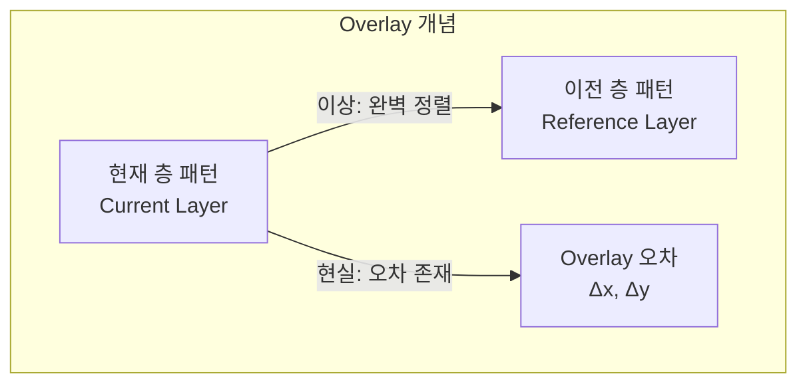
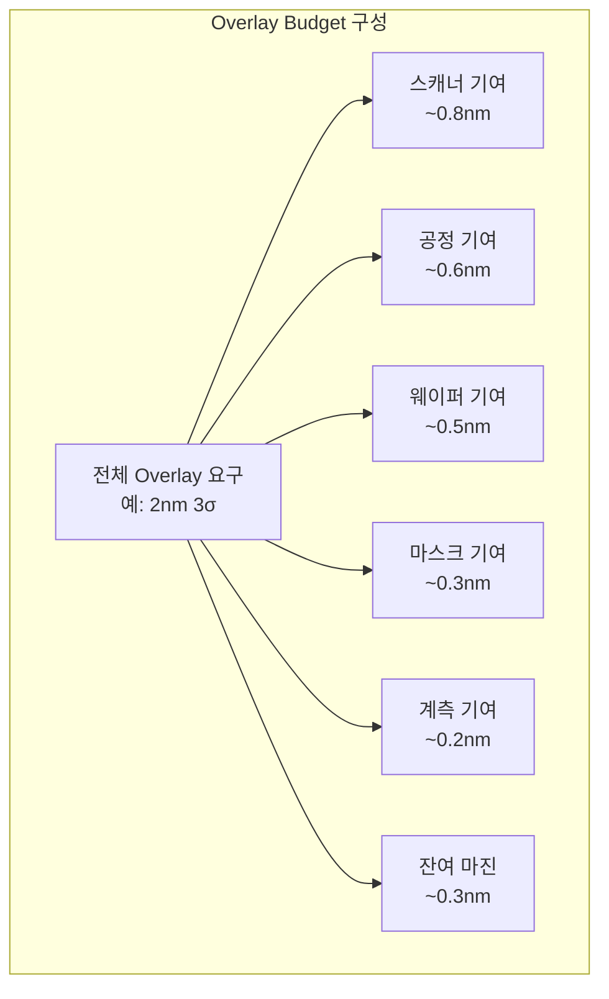

# 2.8 Overlay란 — 층간 정렬의 중요성

## 이 챕터에서 배우는 것
- Overlay의 정의 — 왜 "층간 정렬"이 핵심인지
- Overlay 오차가 칩에 미치는 영향
- Overlay 버짓(Budget)의 개념
- Overlay 오차의 원인 분류 — 장비, 공정, 웨이퍼
- SMILE 플랫폼에서 Overlay가 차지하는 위치

---

## Overlay란: 수십 층을 원자 수준으로 맞추는 기술

이전 챕터들에서 포토리소그래피의 광원, 마스크, 레지스트, 해상도, OPC를 순서대로 다뤘다. 이제 Part 2의 핵심 주제 중 하나인 **Overlay**에 진입한다. Overlay는 SMILE 플랫폼의 두 핵심 타겟(CD와 Overlay) 중 하나이며, 향후 3개 챕터(2.8~2.10)에 걸쳐 집중적으로 다룬다.

**Overlay**는 포토리소그래피에서 **현재 노광하는 층(Current Layer)**과 **이전에 이미 만들어진 층(Reference Layer)** 사이의 **정렬 오차(Registration Error)**를 말한다.

1.3장에서 반도체 칩이 수십 개의 층을 순차적으로 쌓아 올리는 구조라고 설명했다. 트랜지스터가 만들어지는 FEOL 층 위에 금속 배선 층이 쌓이고, 층과 층을 연결하는 비아(Via)가 뚫린다. 이때 각 층의 패턴이 이전 층의 패턴과 **정확히 맞물려야** 트랜지스터와 배선이 설계대로 연결된다. 비아가 하부 배선의 정중앙에 떨어져야 하는데, 1nm 옆으로 어긋나면? 접촉 면적이 줄어들어 저항이 올라가거나, 최악의 경우 아예 연결이 끊어진다.

Overlay는 이 "맞물림의 정밀도"를 나노미터 단위로 측정한 것이다.



Overlay는 **나노미터(nm)** 단위의 벡터량이다. x 방향 오차(OVLx)와 y 방향 오차(OVLy)를 따로 관리하며, 크기뿐 아니라 방향도 중요하다. 통계적으로는 Mean(평균 — 체계적 오차 성분), 3σ(3 표준편차 — 랜덤 오차 성분), Max(최대값)로 관리한다.

---

## 숫자가 말해주는 것: Overlay의 극한적 정밀도

최신 공정에서 요구되는 Overlay 정밀도를 보자.

| 공정 노드 | Overlay 요구 (3σ) | 맥락 |
|:---|:---|:---|
| 28nm | ~8nm | 비교적 여유 있음 |
| 7nm | ~3nm | 매우 엄격 |
| 5nm | ~2nm | 극한의 정밀도 |
| 3nm | ~1.5nm | 실리콘 원자 3~4개 거리 |
| 2nm | ~1.2nm (예상) | 물리적 한계에 근접 |

**1.5nm**가 어떤 수준인지 체감해 보자. 실리콘 원자의 격자 상수(원자 간 거리)는 약 0.54nm이다. 1.5nm는 실리콘 원자 **약 3개**를 일렬로 놓은 거리다. 이 오차를 300mm(=3억 nm) 웨이퍼 **전체에서**, 수백 개 다이에서, 수십 개 층에서 일관되게 유지해야 한다.

비율로 환산하면 1.5nm / 300,000,000nm = **50억분의 1**이다. 서울에서 뉴욕까지의 거리(약 11,000km)에서 오차가 **2.2mm 이내**여야 하는 것과 같다. 이것은 인류가 일상적으로(양산에서, 매일, 수만 장의 웨이퍼에서) 달성하는 정밀도 중 가장 극한적인 수준이다.

---

## Overlay 오차가 발생하면 무엇이 깨지는가


Overlay가 허용 범위를 벗어나면 칩에 치명적인 결과가 발생한다.

가장 직접적인 것은 **전기적 불량(Electrical Failure)**이다. 비아(Via)가 하부 금속 배선에서 벗어나면 전기적 연결이 끊어진다(**단선, Open**). 인접 배선 간격이 Overlay 오차만큼 좁아지면 전류가 의도치 않게 흐른다(**단락, Short**). 트랜지스터의 게이트와 소스/드레인의 정렬이 틀어지면 비대칭 동작으로 성능이 저하된다.

소프트웨어로 비유하면, Overlay 오차는 **API 인터페이스의 버전 불일치**와 같다. Layer N에서 정의한 인터페이스(비아 위치)와 Layer N+1에서 호출하는 인터페이스(배선 위치)가 어긋나면, 개별 컴포넌트(각 층)는 정상이더라도 **시스템 전체가 실패**한다. 각 층이 개별적으로 완벽해도, 층 간 정렬이 틀리면 칩은 동작하지 않는다.

수율에 미치는 영향은 직접적이고 거대하다. Overlay가 규격을 벗어난 다이는 불량으로 처리되어 수율이 곧바로 감소한다. 3nm 공정에서 Overlay가 **1nm만 악화**되어도 수율이 수 % 하락할 수 있으며, 이는 연간 매출 **수백억~수천억 원**의 손실을 의미한다. 반도체 산업에서 Overlay 엔지니어링이 "성배(Holy Grail)"로 불리는 이유가 여기에 있다.

---

## Overlay 버짓: 오차를 쪼개어 관리한다

Overlay 오차는 하나의 원인에서 나오지 않는다. 스캐너, 공정, 웨이퍼, 마스크, 계측 — **수십 가지 요인이 각각 기여하는 오차의 합**이다. 이 각 요인에 허용 오차를 배분하는 체계를 **Overlay 버짓(Overlay Budget)**이라 한다.



핵심은 합산 방식이다. 각 요인이 통계적으로 독립이라고 가정하면(대부분의 경우 합리적 가정), 전체 Overlay는 각 요인의 **제곱합의 제곱근(RSS, Root Sum of Squares)**으로 합산된다.

```
Total OVL = √(Scanner² + Process² + Wafer² + Mask² + Metrology² + ...)
```

RSS 합산의 의미를 이해하는 것이 중요하다. 만약 스캐너 기여분을 0.8nm에서 0.4nm로 **절반**으로 줄였다면, 전체 Overlay는 얼마나 줄어들까? 다른 항이 고정이라면, √(0.8² + 나머지) → √(0.4² + 나머지)로, 전체 감소 폭은 0.4nm의 절반보다 훨씬 적다. RSS에서는 **하나의 항만 줄여서는 전체 효과가 제한적**이다. 모든 항을 동시에 줄여야 의미 있는 전체 개선이 달성된다. 이것이 Overlay 개선이 어려운 근본적 이유다 — 어느 한 요인의 혁신만으로는 충분하지 않고, **모든 요인의 균형 잡힌 개선**이 필요하다.

---

## Overlay 오차의 원인: 다섯 가지 범주

### 1. 스캐너 기인 오차 (Scanner-Induced)

노광 장비 자체에서 발생하는 오차로, 장비 업체(ASML)의 역량에 크게 의존한다.

**스테이지 정밀도 한계** — 웨이퍼와 마스크 스테이지가 나노미터 이하의 위치 정밀도로 이동해야 하지만, 기계적/전자적 한계로 미세한 위치 오차가 발생한다. **렌즈 수차(Lens Aberration)** — 투영 렌즈의 광학적 불완전성이 패턴의 위치를 미세하게 이동시킨다. **렌즈 가열(Lens Heating)** — 노광 중 렌즈가 빛 에너지를 흡수하여 미세하게 팽창하면서, 배율(Magnification)이 변하고 패턴 위치가 드리프트한다. 특히 로트 시작 시와 연속 노광 시의 차이(웜업 효과)가 문제가 된다. **스캔 동기화 오차** — 스캐닝 방식에서 마스크와 웨이퍼 스테이지가 동시에 반대 방향으로 이동해야 하는데, 이 동기화의 미세한 어긋남이 Overlay 오차로 나타난다.

### 2. 공정 기인 오차 (Process-Induced)

리소그래피 이외의 공정 단계에서 발생하여 Overlay에 영향을 미치는 오차다.

**막 응력(Film Stress)** — 증착된 박막(산화막, 질화막, 금속막)에는 내부 응력이 존재한다. 이 응력이 웨이퍼를 구부리거나 늘리면서 이전 층의 패턴 위치가 이동한다. **열처리 변형** — 어닐링, 산화 등 고온 공정에서 웨이퍼가 미세하게 팽창/수축하며, 이 변형이 비균일하면 위치별로 다른 Overlay 오차가 발생한다. **CMP 영향** — CMP 후 정렬 마크의 높이나 형태가 변하면, 정렬 시스템이 마크를 읽는 정확도가 떨어진다. **식각 비대칭** — 식각 프로파일이 비대칭이면(예: 한쪽으로 기운 사이드월), 전사된 패턴의 중심이 원래 레지스트 패턴의 중심에서 이동한다.

### 3. 웨이퍼 기인 오차 (Wafer-Induced)


웨이퍼 자체의 물리적 특성에 의한 오차다.

**웨이퍼 변형(Distortion)** — 수십 개 층의 증착/식각/열처리를 거치면서, 웨이퍼가 **비선형적으로** 뒤틀린다. 이 변형은 단순한 팽창/수축이 아니라 고차(Higher-Order)의 복잡한 패턴을 보이며, 기존 선형 모델로는 포착할 수 없는 성분이 많다. **척 클램핑 오차** — 스캐너의 진공 척이 웨이퍼를 고정할 때, 척의 표면 상태나 진공 분포가 불균일하면 웨이퍼가 비균일하게 변형된다. **Edge 효과** — 웨이퍼 가장자리(Edge, 보통 바깥 3~5mm)에서는 변형이 특히 크고 불규칙하여, 가장자리 다이의 Overlay가 중심보다 나쁜 경향이 있다.

### 4. 마스크 기인 오차 (Mask-Induced)

**마스크 배치 오차(MPE, Mask Placement Error)** — 마스크 위 패턴의 실제 위치가 설계 위치에서 미세하게 어긋나 있는 것이다. E-beam 묘화의 정밀도 한계에서 비롯된다. **마스크 열변형** — 노광 중 마스크가 빛을 일부 흡수하여 팽창하면 패턴 위치가 이동한다. **펠리클 응력** — 2.4장에서 다룬 펠리클이 마스크에 장착될 때, 펠리클 프레임의 응력이 마스크를 미세하게 휘게 만들 수 있다.

### 5. 계측 기인 오차 (Metrology-Induced)


Overlay를 **측정하는 과정 자체**에서도 오차가 발생한다. 이 오차가 가장 교활한 유형이다 — 실제 Overlay 오차가 아닌데 오차가 있는 것처럼 보이게 만들 수 있기 때문이다.

**TMU(Total Measurement Uncertainty)** — 같은 포인트를 반복 측정했을 때의 변동. 측정 자체의 정밀도를 나타낸다. **TIS(Tool-Induced Shift)** — 계측 장비 자체가 가지고 있는 체계적 오프셋. 웨이퍼를 0°와 180° 회전시켜 두 번 측정하면 TIS를 추출하여 보정할 수 있다. **마크 비대칭(Mark Asymmetry)** — 가장 까다로운 문제다. 정렬/측정 마크가 CMP, 식각, 증착 등에 의해 비대칭적으로 변형되면, 측정 시스템이 마크의 "중심"을 잘못 판단하여 가짜 Overlay 오차를 보고한다. 실제 패턴 정렬은 정확한데 마크만 비대칭이면, 이 가짜 오차를 기반으로 보정을 적용했다가 오히려 Overlay를 악화시킬 수 있다. 이것이 2.9장에서 다룰 측정 방법론의 핵심 도전이다.

---

## SMILE과 Overlay: 비선형의 벽을 AI로 넘다

기존의 Overlay 보정은 Translation(평행 이동), Rotation(회전), Magnification(배율) 같은 **선형 모델**에 기반한다. 웨이퍼 전체의 Overlay를 몇 개의 수학적 항(Term)으로 분해하고, 각 항의 계수를 계측 데이터에서 추출하여 스캐너에 보정값으로 입력하는 방식이다.

하지만 실제 웨이퍼의 변형은 **비선형**이다. 선형 모델로 보정한 후에도 남는 잔차(Residual)에는 고차(Higher-Order) 패턴, 국부적 변동(Intra-field), 웨이퍼 간 변동(Wafer-to-Wafer variation)이 포함되어 있다. 이 잔차가 3nm 이하 공정에서 Overlay 규격을 위협하는 주범이다.

SMILE 플랫폼의 핵심 가치 제안 중 하나가 바로 이 **비선형 Overlay 잔차를 AI로 줄이는 것**이다. 웨이퍼 변형 데이터, 스캐너 상태, 이전 층 계측 데이터, 공정 이력(증착 막 두께, 열처리 온도 등)을 입력으로 받아, 다이별/필드별 Overlay 보정값을 출력한다. AI/ML 모델이 선형 모델이 놓치는 비선형 성분을 학습하여, 보정 후 잔차를 추가로 0.3~0.5nm 줄이는 것이 목표다. 0.3nm은 작은 숫자 같지만, 전체 Overlay 버짓이 1.5nm인 세계에서는 20%에 해당하는 — 사업적으로 거대한 가치를 가진 — 개선이다.

---

## 핵심 정리

Overlay는 현재 층과 이전 층의 정렬 오차를 나노미터 단위로 측정한 벡터량이며, 3nm 공정에서 요구 정밀도는 약 1.5nm(3σ) — 실리콘 원자 3~4개 거리 — 에 달한다. Overlay 오차는 비아의 단선/단락, 트랜지스터 성능 저하를 유발하여 **수율에 직결**되며, 1nm의 악화가 연간 수백억 원의 손실을 의미한다. **Overlay 버짓**은 스캐너, 공정, 웨이퍼, 마스크, 계측 등 다섯 범주의 오차를 RSS로 합산하여 관리하며, 전체를 줄이려면 모든 요인을 동시에 개선해야 한다. 특히 **계측의 마크 비대칭** 문제는 가짜 오차를 유발하는 교활한 적이다. SMILE 플랫폼은 기존 선형 모델이 놓치는 **비선형 Overlay 잔차를 AI로 학습**하여 보정 정밀도를 높이는 것을 핵심 가치로 삼는다.

---

*다음 챕터: 2.9 Overlay 측정 방법 — DBO, IBO*
