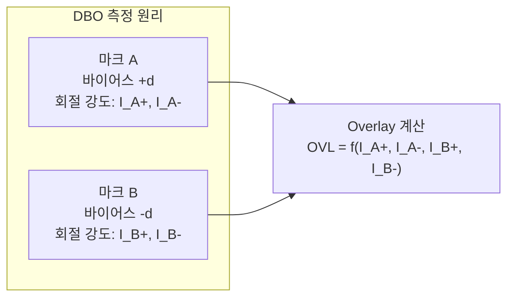

# 2.9 Overlay 측정 방법 — DBO, IBO

## 이 챕터에서 배우는 것
- Overlay를 실제로 어떻게 측정하는지
- IBO(Image-Based Overlay)의 원리와 한계
- DBO(Diffraction-Based Overlay)의 원리와 장점
- 측정 정밀도와 정확도의 차이 — TMU, TIS
- 샘플링 전략 — 어디를, 몇 개를 측정할 것인가
- AI 관점에서의 Overlay 계측 데이터 활용

---

## Overlay를 어떻게 측정하는가: 보이지 않는 것을 재는 기술

이전 챕터에서 Overlay의 정의, 중요성, 원인을 다뤘다. 이제 실전 질문이다 — 1.5nm의 정렬 오차를, 300mm 웨이퍼 위에서, 실제로 **어떻게 측정**하는가?

답은 **전용 마크(Mark)**에 있다. 칩의 회로 패턴 자체에서 Overlay를 직접 측정하는 것은 어렵기 때문에(패턴이 너무 작고 복잡하므로), 설계 단계에서 웨이퍼의 특정 위치에 Overlay 측정 전용 **마크 패턴**을 배치한다. 이 마크는 두 층에 걸쳐 있어서 — 이전 층에 마크의 한 부분을, 현재 층에 다른 부분을 형성하여 — 두 부분의 **상대적 위치 차이**를 측정함으로써 Overlay를 추출한다.

마크는 보통 다이와 다이 사이의 **스크라이브 레인(Scribe Lane)** — 나중에 웨이퍼를 다이싱할 때 잘려나가는 빈 영역 — 에 배치된다. 마크가 칩 면적을 차지하면 다이 수가 줄어들어 경제적 손실이 되기 때문이다.

측정 장비는 **KLA**(Archer 시리즈), **ASML**(YieldStar), **Onto Innovation** 등이 주요 공급자다.

---

## IBO (Image-Based Overlay): 눈으로 보고 재는 전통 방식

### Box-in-Box: 가장 직관적인 마크


IBO의 원리는 본질적으로 **광학 현미경으로 사진을 찍어 위치를 읽는 것**이다. 가장 대표적인 마크 형태는 **Box-in-Box** — 큰 박스 안에 작은 박스가 있는 구조다.

```
┌─────────────────┐  ← 이전 층 (외곽 박스)
│                 │
│   ┌─────────┐   │
│   │         │   │  ← 현재 층 (내부 박스)
│   │         │   │
│   └─────────┘   │
│                 │
└─────────────────┘
```

외곽 박스는 이전 층(Reference Layer)에서, 내부 박스는 현재 층(Current Layer)에서 제작된다. 두 층이 완벽히 정렬되었다면 내부 박스가 외곽 박스의 정중앙에 위치한다. 정렬 오차가 있으면 내부 박스가 중심에서 벗어나고, 이 벗어남의 크기가 Overlay다.

측정은 단순한 산술이다. 외곽 박스의 좌변과 내부 박스의 좌변 사이 간격을 L, 우변 사이 간격을 R이라 하면, x 방향 Overlay는 (L - R) / 2이다. 마찬가지로 상하 간격 T와 B로 y 방향 Overlay를 구한다. L과 R이 같으면 Overlay는 0(완벽 정렬)이고, 다르면 그 차이의 절반이 Overlay 오차다.

### IBO의 장점과 한계

IBO는 직관적이고 이해하기 쉬우며, 마크 크기가 비교적 작아(~10μm 이내) 스크라이브 레인에 배치하기 유리하다. 또한 마크의 에지(Edge)를 이미지로 직접 관찰하므로, 어느 정도의 마크 비대칭에 대해서도 로버스트하다.

하지만 광학 현미경의 분해능에 의존하므로 **측정 정밀도(Precision)에 한계**가 있다 — 약 0.3~0.5nm 수준이다. 3nm 공정에서 Overlay 요구가 1.5nm인데 측정 정밀도가 0.5nm이면, 측정 자체의 노이즈가 총 버짓의 1/3을 차지하는 셈이다. 또한 CMP나 식각에 의해 마크의 형상이 변형되면 에지 검출의 정확도가 떨어진다.

---

## DBO (Diffraction-Based Overlay): 빛의 회절로 재는 현대 방식

### 이미지를 보지 않는다

DBO는 마크의 **이미지를 직접 보지 않는다**. 대신, 마크에서 **회절(Diffraction)된 빛의 강도**를 분석하여 Overlay를 추출한다. 이것은 패러다임의 전환이다 — 공간적 정보(위치)를 직접 읽는 대신, 빛의 물리적 성질(회절 강도)을 통해 간접적으로 추출하는 것이다.

### 격자 마크와 바이어스 트릭


DBO에서는 Box-in-Box 대신 **주기적 격자(Grating) 패턴**을 사용한다. 이전 층과 현재 층에 각각 같은 피치(Pitch, P)의 격자를 형성하면, 두 격자가 겹쳐 합성 격자가 된다. 이 합성 격자에 빛을 쏘면 회절이 일어나는데, **+1차 회절광**과 **-1차 회절광**의 강도 차이가 두 격자의 상대적 오프셋 — 즉 Overlay — 에 의존한다.

여기서 천재적인 트릭이 등장한다. 마크를 **한 쌍이 아니라 두 쌍** 만든다.
- **마크 A**: 현재 층 격자를 이전 층 대비 **+d**만큼 의도적으로 오프셋
- **마크 B**: 현재 층 격자를 이전 층 대비 **-d**만큼 의도적으로 오프셋

이 의도적 오프셋(d)을 **바이어스(Bias)**라 한다.



마크 A와 B 각각에서 +1차와 -1차 회절 강도를 측정하면 4개의 값(I_A+, I_A-, I_B+, I_B-)을 얻는다. 이 4개의 값을 조합하면 Overlay를 계산할 수 있다.

**μDBO 공식:**
```
OVL = (d / 2) × (ΔI_A - ΔI_B) / (ΔI_A + ΔI_B)
```
여기서 ΔI = I₊₁ - I₋₁ (±1차 회절 강도 차이)

바이어스 ±d를 사용하는 이유는, 알려진 오프셋을 기준으로 미지의 Overlay를 상대적으로 계산하기 위해서다. 바이어스가 일종의 **내부 눈금자(Internal Ruler)** 역할을 하여, 절대적인 위치 측정 없이도 상대적 오차를 정밀하게 추출할 수 있게 한다.

### DBO의 장점

DBO의 최대 강점은 **정밀도(Precision)**다. 약 0.1~0.2nm — IBO보다 2~5배 우수하다. 이미지 처리 없이 광 강도(Intensity)만 측정하므로 처리 속도도 빠르고, 격자 마크가 작고 컴팩트하여 스크라이브 레인에 효율적으로 배치할 수 있다. 이런 이유로 DBO는 현재 첨단 공정에서 Overlay 측정의 **주류**가 되었다. ASML의 YieldStar가 대표적인 DBO 계측 장비다.

---

## 마크 비대칭: DBO의 아킬레스건

DBO가 아무리 정밀해도, **마크 비대칭(Mark Asymmetry)**이라는 근본적 취약점을 안고 있다. 이것은 이전 챕터에서 예고한 "가짜 오차"의 실체다.

### 비대칭은 왜 생기는가

Overlay 마크도 칩의 다른 패턴과 마찬가지로 수십 개 공정을 거친다. 그 과정에서 격자의 프로파일이 **비대칭적으로** 변형될 수 있다. **CMP**에서 연마 방향이나 압력 불균일로 격자의 한쪽이 더 깎이거나, **식각**에서 이온의 입사 각도에 의해 한쪽 사이드월이 더 깊게 식각되거나, **증착**에서 막이 격자의 한쪽 면에 더 두껍게 쌓이는 등의 원인이 있다.

### 왜 문제가 심각한가

격자가 비대칭이면, 실제 Overlay가 0(두 층이 완벽히 정렬)인데도 +1차와 -1차 회절 강도가 달라진다. DBO 시스템은 이 강도 차이를 **Overlay 오차로 오인**한다. 만약 이 오인된 값을 기반으로 스캐너 보정을 적용하면, **없던 Overlay를 만들어내는** 역효과가 발생한다. 측정이 정밀할수록(노이즈가 적을수록) 이 체계적 오류가 더 확실하게 보정에 반영되어, 역설적으로 **정밀한 측정이 더 큰 해를 끼치는** 상황이 된다.

이것은 머신러닝에서 **라벨 노이즈(Label Noise)**의 문제와 구조적으로 같다. 학습 데이터의 라벨(여기서는 Overlay 측정값)에 체계적 오류가 있으면, 모델이 더 정확하게 학습할수록(과적합할수록) 실제 성능은 오히려 나빠진다.

### 대응 전략

산업계에서 마크 비대칭에 대응하는 전략은 여러 갈래다.

**다중 파장/편광 측정** — 여러 파장(가시광~근적외선)과 편광(TE, TM)으로 DBO를 측정하면, 비대칭의 효과가 파장과 편광에 따라 다르게 나타난다. 이 차이를 분석하여 비대칭 성분과 실제 Overlay 성분을 분리한다.

**레시피 최적화** — 비대칭에 가장 덜 민감한 측정 조건(파장, 편광, 포커스, 아파쳐)의 조합을 찾아 사용한다. 이 최적 레시피를 찾는 것 자체가 복잡한 탐색 문제이며, AI로 자동화할 수 있는 영역이다.

**ACA (Asymmetry Corrected Alignment)** — ASML이 도입한 기법으로, 비대칭에 의한 오류를 수학적으로 모델링하여 측정값에서 제거한다.

**e-beam Overlay** — CD-SEM으로 실제 디바이스 패턴(전용 마크가 아닌 실제 회로)의 Overlay를 직접 측정한다. 마크 비대칭 문제가 원천적으로 없지만, 전자빔 스캔이므로 광학 측정보다 **수십~수백 배 느려** 전수 검사에는 적합하지 않다. 대신 DBO 측정의 **기준점(Ground Truth)**으로 사용하여 DBO의 비대칭 오류를 보정하는 데 활용된다.

---

## 정밀도 vs 정확도: 계측 엔지니어의 영원한 과제

Overlay 계측에서 **정밀도(Precision)**와 **정확도(Accuracy)**는 다른 개념이다.

**정밀도**는 같은 포인트를 반복 측정했을 때 결과가 얼마나 일관되는가 — 분산의 크기다. DBO가 0.1nm 정밀도라 함은, 같은 마크를 100번 측정하면 결과가 ±0.1nm 안에 모인다는 뜻이다. **정확도**는 측정값이 **실제 Overlay**에 얼마나 가까운가다. 정밀도가 높아도 체계적 오프셋(TIS)이나 비대칭 오류가 있으면 정확도는 낮을 수 있다.

**TIS(Tool-Induced Shift)**는 측정 장비 자체의 고유 오프셋이다. 흥미로운 보정 방법이 있는데, 웨이퍼를 **0°와 180° 회전**시켜 같은 마크를 두 번 측정하면, TIS는 두 측정의 차이로 추출되고 제거할 수 있다. 이것은 TIS가 웨이퍼가 아니라 장비에 고정된 오차이기 때문에, 웨이퍼를 돌리면 방향이 반전되는 성질을 이용한 것이다.

**TMU(Total Measurement Uncertainty)**는 정밀도, TIS, 기타 모든 측정 불확실성을 합산한 **계측의 총 품질 지표**다. 3nm 공정에서 Overlay 요구가 1.5nm인데 TMU가 0.5nm이면, 실제로 보정에 활용할 수 있는 "정보"는 1.5nm 중 0.5nm가 노이즈에 묻혀 있다는 뜻이다. TMU를 줄이는 것이 Overlay 보정 정확도의 상한을 높이는 **필수 전제**다.

---

## 샘플링 전략: 모든 것을 측정할 수 없다

### 현실의 제약

300mm 웨이퍼에 수백 개 다이, 각 다이에 여러 측정 포인트, 웨이퍼가 로트당 25장, 하루에 수십 로트... 모든 포인트를 측정하면 **계측 장비가 병목**이 되어 생산이 멈춘다.

일반적인 샘플링은 웨이퍼당 20~40개 필드(다이)를 선택하고, 각 필드당 1~4개 측정 포인트를 두어 **총 40~160포인트**를 측정한다. 로트당 3~5장의 웨이퍼만 측정하는 것이 보통이다. 300개 다이 × 웨이퍼당 4포인트 = 1,200개 가능 포인트 중 **40~160개만 측정**하는 것이니, 전체의 3~13%만 직접 관측하고 나머지는 측정 없이 넘어가거나 모델로 추론한다.

### AI 기반 샘플링 최적화


기존에는 웨이퍼에 고정된 격자형 패턴으로 균일하게 포인트를 배치했다. 하지만 Overlay 변동은 웨이퍼 위치에 따라 다르다 — 가장자리(Edge)에서 변동이 크고 중심에서 작다면, 중심에 포인트를 많이 두는 것은 정보적으로 비효율적이다.

AI 접근은 **어디를 측정하면 정보량(Information Gain)이 최대인지**를 학습하여 최적 측정 위치를 동적으로 결정한다. 변동이 큰 영역(Edge, 특정 필드)에 더 많은 포인트를 배치하고, 변동이 작아 예측 가능한 영역은 포인트를 줄인다. 결과적으로 **같은 측정 수로 더 정확한 Overlay 모델을 구축**하거나, **같은 정확도를 더 적은 측정으로 달성**하여 계측 장비의 병목을 완화할 수 있다. 이것은 능동 학습(Active Learning)과 실험 설계(DoE, Design of Experiments)의 원리와 연결되는 영역이다.

---

## AI 엔지니어에게 이것이 의미하는 것

Overlay 계측 데이터의 구조는 다음과 같다.

```
(Wafer_ID, Field_X, Field_Y, Site_X, Site_Y, OVL_X, OVL_Y, ...)
```

Field는 스캐너의 노광 필드(다이) 좌표, Site는 필드 내 측정 위치, OVL_X/OVL_Y는 x, y 방향 Overlay 측정값(nm)이다. 이 데이터는 **공간적 구조**를 가진다 — 웨이퍼 좌표계(Field_X, Field_Y)와 필드 내 좌표계(Site_X, Site_Y)의 2단계 공간 계층이 있으며, 이 계층 구조를 모델에 적절히 반영하는 것이 중요하다.

AI 활용의 핵심 사례를 정리하면 — **Overlay 공간 보간/외삽**: 측정되지 않은 포인트의 Overlay를 가우시안 프로세스(GP)나 공간 회귀 모델로 예측한다. **마크 비대칭 보정**: 다중 파장/편광 측정 데이터에서 비대칭 성분을 ML로 학습하여 제거한다. DBO의 정밀도를 살리면서 정확도를 높이는 핵심 기술이다. **동적 샘플링**: 이전 웨이퍼의 Overlay 패턴을 학습하여, 다음 웨이퍼에서 가장 유용한 측정 위치를 실시간으로 결정한다. **계측 장비 매칭**: 여러 계측 장비 간의 측정 차이를 ML로 보정하여, 어떤 장비에서 측정하든 결과가 일관되도록 한다.

---

## 핵심 정리

Overlay 측정은 전용 마크(Box-in-Box, Grating)를 이용하여 두 층의 상대적 위치 차이를 추출하는 것이다. **IBO(Image-Based)**는 광학 현미경으로 마크를 촬영하여 위치를 읽는 전통 방식으로 직관적이나 정밀도가 ~0.3-0.5nm에 한정된다. **DBO(Diffraction-Based)**는 격자 마크의 ±1차 회절 강도를 분석하여 Overlay를 추출하며, 정밀도 ~0.1nm으로 현재 주류다. DBO의 최대 취약점은 **마크 비대칭** — 공정에 의한 격자 변형이 가짜 Overlay를 만들어내는 것 — 으로, 다중 파장/편광 측정, 레시피 최적화, e-beam 기준점 등으로 대응한다. **TMU(총 측정 불확실성)**는 Overlay 버짓의 중요한 구성 요소이며, 샘플링 전략은 정보량 기반 AI 최적화로 효율을 극대화할 수 있다.

---

*다음 챕터: 2.10 Overlay 에러 모델 — Translation, Rotation, Magnification*
