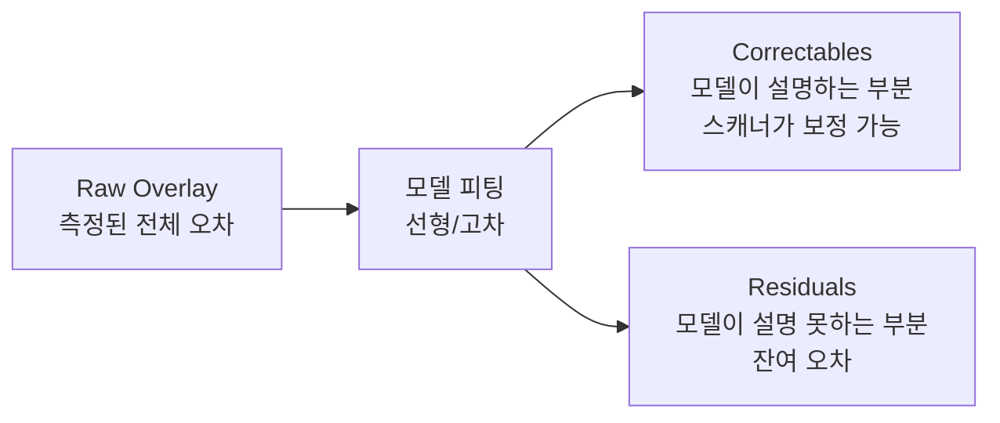
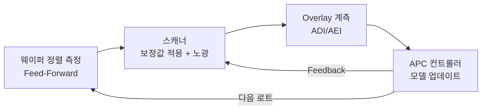

# 2.10 Overlay 에러 모델 — Translation, Rotation, Magnification

## 이 챕터에서 배우는 것
- Overlay 에러를 수학적으로 분해하는 방법
- 선형 모델의 6대 성분 — Translation, Rotation, Magnification 등
- Inter-Field vs Intra-Field 오차의 구분
- 고차 모델(Higher-Order Model)의 필요성
- 보정 가능 성분(Correctables)과 잔차(Residuals)
- AI가 잔차를 줄이는 방법 — SMILE의 핵심

---

## 왜 에러 모델이 필요한가: 수만 개의 오차를 다루는 전략

이전 두 챕터에서 Overlay의 정의(2.8장)와 측정 방법(2.9장)을 다뤘다. 이제 Overlay 3부작의 마지막 — 측정된 오차를 **어떻게 분석하고 보정하는가**에 들어간다. 이것이 SMILE 플랫폼의 기술적 핵심과 직접 연결되는 챕터다.

300mm 웨이퍼에 200개 다이가 있고, 각 다이에서 4개 포인트를 측정하면 800개의 Overlay 값이 나온다. 각 값은 크기와 방향이 다르다. 이 800개의 벡터를 개별적으로 — 포인트 하나하나에 대해 — 보정하는 것은 현실적으로 불가능하다. 측정하지 않은 나머지 수천 개 포인트는 어떻게 하겠는가?

대신 오차의 **공간적 패턴**을 수학적 모델로 기술하고, 모델의 **소수 파라미터**를 보정하는 전략을 사용한다. 이것은 본질적으로 **회귀 분석(Regression)**이다. 수만 개의 측정점을 소수의 파라미터(계수)로 피팅하여, 보정 가능한 체계적 오차(Systematic Error)를 분리하고, 모델이 설명하지 못하는 나머지 — 잔차(Residual) — 를 최소화한다. 여러분이 sklearn의 `LinearRegression.fit()`을 호출하는 것과 수학적으로 동일한 작업이 반도체 팹에서 매일 수만 번 수행되고 있다.

---

## Inter-Field vs Intra-Field: 두 가지 공간 스케일

Overlay 오차를 모델링하려면 먼저 **두 가지 공간 스케일**을 구분해야 한다. 이 구분이 모델 구조의 기초가 된다.

### Inter-Field (필드 간, 웨이퍼 레벨)

웨이퍼 **전체**에 걸친 Overlay 오차의 공간적 패턴이다. 웨이퍼 좌표계(X, Y)에서 각 필드(다이)의 중심 좌표에서의 Overlay를 모델링한다. 주요 원인은 웨이퍼 스테이지의 이동 오차, 웨이퍼 자체의 변형(팽창, 수축, 뒤틀림), 척 클램핑의 불균일 등이다. 웨이퍼 전체를 관통하는 **거시적 패턴**이다.

### Intra-Field (필드 내, 다이 레벨)

하나의 **필드(노광 영역, 26×33mm) 내부**에서의 Overlay 오차 변동이다. 필드 내 상대 좌표(x, y)에서의 Overlay를 모델링한다. 주요 원인은 투영 렌즈의 수차, 마스크 패턴의 배치 오차, 스캔 동기화의 미세한 어긋남 등이다. 모든 필드에서 **반복적으로 나타나는** 미시적 패턴이다.

실제 Overlay는 이 둘의 **합(Superposition)**이다.

```
실제 Overlay(X, Y, x, y) = Inter-Field(X, Y) + Intra-Field(x, y)
```

이 분리가 중요한 이유는, Inter-Field와 Intra-Field의 원인이 다르고, 보정 방법도 다르기 때문이다. Inter-Field는 웨이퍼 스테이지의 위치/회전/배율을 조정하여 보정하고, Intra-Field는 투영 렌즈의 광학 파라미터를 조정하여 보정한다.

---

## 선형 모델: 6대 성분으로 세상을 설명하다

가장 기본적인 Overlay 모델은 **1차 선형 모델**이다. 각 방향(x, y)의 Overlay를 위치 좌표의 1차 함수로 표현한다.

### Inter-Field 선형 모델


```
OVL_x(X, Y) = Tx + Rx·Y + Mx·X
OVL_y(X, Y) = Ty - Rx·X + My·Y
```

여기서 (X, Y)는 웨이퍼 상 필드 중심 좌표다. 이 모델은 **6개의 파라미터**로 웨이퍼 전체의 Overlay 패턴을 기술한다.

각 파라미터의 물리적 의미를 하나씩 보자.

**Translation (Tx, Ty)** — 웨이퍼 위의 모든 패턴이 x 또는 y 방향으로 **균일하게 이동**한 것이다. 원인은 웨이퍼 스테이지의 위치 오프셋이나 정렬 시스템의 체계적 오차다. 모든 다이에서 같은 크기, 같은 방향의 오차가 나타난다. 가장 단순하고 보정도 가장 쉽다 — 스테이지를 반대 방향으로 같은 양만큼 옮기면 된다.

**Rotation (Rx)** — 웨이퍼의 패턴 전체가 웨이퍼 중심을 기준으로 **회전**한 것이다. 웨이퍼가 척에 약간 틀어진 채 올라갔거나, 마스크가 미세하게 회전되어 장착된 경우에 발생한다. 중심에서는 오차가 작고, 가장자리로 갈수록 커지며, x 방향 오차는 Y 좌표에, y 방향 오차는 -X 좌표에 비례한다.

**Magnification (Mx, My)** — 패턴이 x 또는 y 방향으로 **확대 또는 축소**된 것이다. 웨이퍼가 열에 의해 팽창하면 Magnification이 양수(패턴 간격이 넓어짐), 수축하면 음수가 된다. 반도체 공정에서 수백 °C의 열처리를 거치면 웨이퍼의 크기가 미세하게 변하고, 이것이 Magnification 오차로 나타난다. Mx ≠ My인 경우를 **비대칭 배율(Asymmetric Magnification)**이라 하며, 열처리의 방향성이나 막 응력의 비등방성이 원인이다.

### Intra-Field 선형 모델

필드 내부에도 동일한 형태의 선형 모델이 적용된다.

```
ovl_x(x, y) = tx + rx·y + mx·x
ovl_y(x, y) = ty - rx·x + my·y
```

여기서 (x, y)는 필드 내 상대 좌표다. tx, ty는 렌즈 디센터(Decenter, 렌즈 광축이 필드 중심에서 벗어남)에 의한 필드 내 이동, rx는 스캔 동기화 오차에 의한 필드 내 회전, mx, my는 렌즈 배율 오차에 의한 필드 내 배율 변화를 나타낸다.

### 보정 가능 파라미터 (Correctables)

이 선형 모델의 파라미터들은 스캐너가 **실시간으로 보정**할 수 있다. Translation은 스테이지 위치를 nm 단위로 조정하고, Rotation은 웨이퍼 스테이지 또는 마스크 스테이지의 회전을 조정하며, Magnification은 투영 렌즈의 배율을 미세 조정한다(렌즈 엘리먼트의 위치를 기계적으로 움직이거나, 렌즈를 의도적으로 가열/냉각하여 굴절률을 변화시킨다). 이렇게 스캐너가 보정할 수 있는 파라미터를 통칭하여 **Correctables** 또는 **CPE(Corrections Per Exposure)**라 한다.

---

## 고차 모델: 선형이 설명하지 못하는 세계

### 왜 6개 파라미터로는 충분하지 않은가

선형 모델은 우아하고 물리적으로 직관적이다. 하지만 현실은 선형이 아니다. 선형 모델로 보정한 후에도 남는 잔차(Residual)를 시각화해 보면, 거기에 분명한 **공간적 패턴**이 보인다. 웨이퍼 가장자리에서 급격히 커지는 변형, 특정 영역의 국부적 팽창, 이전 공정의 비균일한 열처리 흔적 — 이런 것들은 Translation, Rotation, Magnification의 조합으로는 기술할 수 없다.

비유를 들자면, 선형 모델은 이미지를 **아핀 변환(Affine Transformation)**으로만 보정하는 것이다 — 평행 이동, 회전, 스케일링. 하지만 실제 이미지 왜곡에는 렌즈 왜곡(Barrel/Pincushion Distortion)이나 국부적 변형이 포함되어 있어, 아핀 변환만으로는 완벽히 보정할 수 없다. 고차 다항식이나 비선형 변환이 필요한 것이다.

### 고차 다항식 모델

Inter-Field 2차 모델은 다음과 같다.

```
OVL_x(X, Y) = Tx + Rx·Y + Mx·X + a·X² + b·XY + c·Y²
OVL_y(X, Y) = Ty - Rx·X + My·Y + d·X² + e·XY + f·Y²
```

파라미터 수가 6개에서 12개로 늘어난다. 3차로 확장하면 20개, 4차는 30개... 차수가 올라갈수록 더 복잡한 공간 패턴을 포착할 수 있지만, 동시에 **과적합(Overfitting)** 위험이 증가하고, 안정적 피팅을 위해 더 많은 측정 포인트가 필요하다.

### ASML의 고차 정렬 지원


ASML 스캐너는 이 개념을 단계적으로 구현하여 제공한다. **6par**는 기본 선형 모델(Translation + Rotation + Magnification)이고, **10par**는 6par에 비대칭 배율과 추가 항을 더한 것이다. **HOWA(Higher-Order Wafer Alignment)**는 최대 5차까지의 고차 다항식을 사용하여 웨이퍼 레벨의 복잡한 변형을 포착한다. **CPE(Corrections Per Exposure)**는 각 노광 필드에 **독립적인 보정값**을 적용하는 가장 유연한 방식이다 — 개념적으로 다항식 피팅이 아니라 **룩업 테이블(Lookup Table)**에 가깝다. 필드 위치마다 별도의 보정값을 저장하는 것이다.

CPE가 이상적으로 보일 수 있지만, 각 필드에 독립 보정값을 적용하려면 **모든 필드의 Overlay를 알아야** 한다. 측정하지 않은 필드는 보간(Interpolation)으로 추정해야 하며, 이 추정의 정확도가 CPE의 실효성을 결정한다. 여기서 AI의 역할이 등장한다.

---

## Correctables과 Residuals: 반도체 엔지니어링의 핵심 구분



**핵심 등식:**
```
Raw Overlay = Correctables + Residuals
```

이 분리가 Overlay 엔지니어링의 가장 중요한 개념이다.

**Correctables**은 모델의 파라미터로 설명되는 체계적 오차다. Translation, Rotation, Magnification 같은 알려진 물리적 메커니즘으로 기술되며, 스캐너에 피드백하여 **즉시 보정**할 수 있다. 이 부분은 아무리 크더라도 보정으로 상쇄할 수 있으므로, Correctables의 크기 자체는 문제가 되지 않는다.

**Residuals**은 모델이 포착하지 못하는 나머지 오차다. 이것이 보정 후에도 남아 있는 **실질적 Overlay 오차**이며, **수율을 직접 결정하는 것은 Residuals**이다. 아무리 좋은 스캐너를 써도 Residuals가 크면 수율이 떨어진다.

따라서 Overlay 개선의 목표는 명확하다 — **Residuals를 최소화**하는 것. 접근법은 두 가지다. 첫째, 더 좋은 모델(고차 다항식, CPE, AI 모델)로 더 많은 변동을 Correctables로 흡수한다. 둘째, 더 정확한 데이터(더 많은 측정점, 더 정밀한 계측, 마크 비대칭 보정)로 모델 피팅의 품질을 높인다.

---

## APC: 보정의 자동화 루프

실제 팹에서 이 모든 것이 자동으로 돌아가는 시스템이 **APC(Advanced Process Control)**다.



**Feed-Forward(전방 보정)**는 노광 **전에** 웨이퍼의 상태를 측정하여 보정값을 선제적으로 결정하는 방식이다. 스캐너의 정렬 스테이지에서 웨이퍼의 정렬 마크를 다수 읽어 Inter-Field 모델을 피팅하고, 그 결과를 보정값으로 즉시 적용한다. 각 웨이퍼의 개별적 변형에 대응할 수 있으므로 **웨이퍼 간 변동(Wafer-to-Wafer variation)**을 줄이는 데 효과적이다.

**Feedback(피드백 보정)**은 이미 노광된 웨이퍼의 Overlay 측정 결과를 **다음 로트의 보정에 반영**하는 방식이다. 로트 N의 Overlay를 측정하여 체계적 드리프트(Drift)를 파악하고, 로트 N+1에서 이 드리프트를 상쇄하도록 보정값을 업데이트한다. 장비의 느린 변화(렌즈 가열 효과의 장기 드리프트, 스테이지 마모 등)를 추적하는 데 효과적이다.

APC 컨트롤러는 이 둘을 결합하여, 웨이퍼별(Feed-Forward)과 로트별(Feedback) 보정을 자동으로 수행한다. 이것은 제어 이론에서 **EWMA(Exponentially Weighted Moving Average) 컨트롤러**나 **PID 컨트롤러**와 유사한 구조다.

---

## SMILE과 Overlay 모델: AI가 넘는 벽

기존 APC 시스템의 모델은 **파라메트릭(Parametric)**이다. 다항식의 함수 형태를 미리 정하고, 측정 데이터에서 계수만 추정한다. 이 접근의 한계는 명확하다 — 실제 웨이퍼 변형에는 다항식으로 완벽히 기술되지 않는 **비정형 패턴**이 존재하며, 이것이 Residuals로 남는다.

SMILE 플랫폼의 AI 접근은 이 한계를 넘는다.

**비선형 Overlay 모델** — Random Forest, Gradient Boosting, Neural Network 같은 비파라메트릭 모델로 다항식이 포착 못하는 비정형 공간 패턴을 학습한다. 특히 웨이퍼 가장자리의 급격한 변형이나 국부적 이상치에 강하다.

**다층 연계 모델** — 현재 층의 Overlay만 보는 것이 아니라, 이전 층들의 계측 데이터(CD, Overlay, 막 두께), 공정 파라미터(증착 온도, 식각 시간, CMP 압력), 장비 센서 데이터를 모두 피처로 활용한다. Overlay의 원인이 이전 공정에 있는 경우(막 응력, 열변형 등), 이전 공정 데이터를 입력으로 포함하면 예측 정확도가 비약적으로 올라간다.

**웨이퍼별 맞춤 보정** — 기존 Feedback 보정은 로트 평균에 기반하여 로트 내 모든 웨이퍼에 같은 보정을 적용한다. AI 모델은 각 웨이퍼의 개별 특성(정렬 마크 데이터, 이전 층 결과)을 반영하여 **웨이퍼마다 다른 보정**을 산출할 수 있다.

**Residual 패턴 분류** — 보정 후 남는 Residuals에 반복적인 공간 패턴이 있다면, 그것은 아직 모델이 포착하지 못한 체계적 원인이 있다는 신호다. CNN이나 클러스터링으로 Residual 맵을 분류하여 근본 원인(Root Cause)을 추정하는 것도 중요한 AI 활용이다.

SMILE의 핵심 가치를 한 줄로 요약하면:

```
기존 다항식 Residual → SMILE AI 모델 → 줄어든 Residual → 수율 향상
```

기존에 "보정 불가능"으로 여겨지던 Residual의 일부를 AI가 학습하여 추가로 보정함으로써, Overlay를 한 단계 더 줄이는 것. 0.3~0.5nm의 Residual 감소가 3nm 공정에서 수율 수 %의 차이를 만들고, 그것이 연간 수백억 원의 가치를 창출한다.

---

## 핵심 정리

Overlay 에러 모델은 수만 개의 측정 데이터를 소수의 파라미터로 피팅하여 보정 가능 성분(Correctables)과 잔차(Residuals)를 분리하는 **회귀 분석**이다. 오차는 **Inter-Field(웨이퍼 레벨)**와 **Intra-Field(필드 레벨)**의 이중 구조로 분해되며, 선형 모델의 **6대 성분**(Translation, Rotation, Magnification)이 기본이다. 고차 다항식(HOWA)과 필드별 독립 보정(CPE)으로 더 많은 변동을 흡수할 수 있으나, 비정형 패턴은 여전히 Residuals로 남는다. APC(Advanced Process Control)는 Feed-Forward와 Feedback을 결합한 자동 보정 루프이다. **SMILE 플랫폼은 AI/ML로 다항식이 포착 못하는 비선형 Residual을 학습하여 추가 보정**함으로써, 수율을 한 단계 더 높이는 것을 핵심 가치로 삼는다.

---

*다음 챕터: 2.11 CD(Critical Dimension) — 선폭 제어의 핵심*
