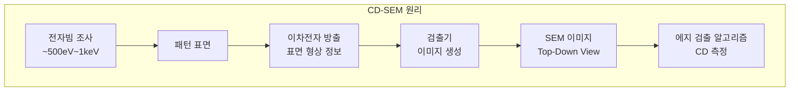
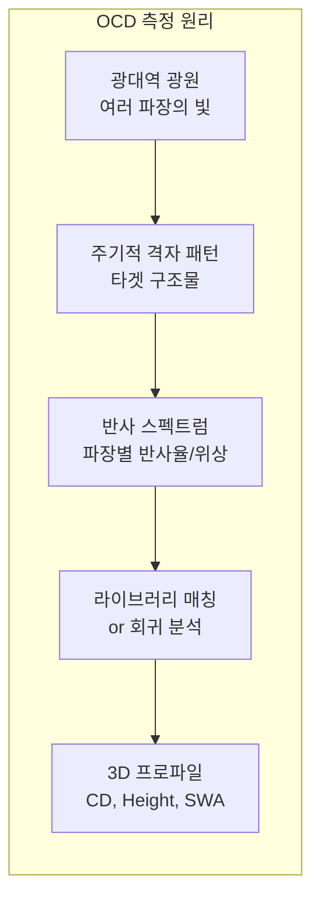

# 2.12 CD 측정 — CD-SEM, Scatterometry(OCD)

## 이 챕터에서 배우는 것
- CD를 측정하는 두 가지 주요 방법 — CD-SEM과 OCD
- CD-SEM의 원리, 장단점, 한계
- OCD(Scatterometry)의 원리 — 빛의 산란으로 형상을 역추정
- 두 방법의 비교와 상호 보완
- 새로운 계측 기술의 등장
- AI 관점에서의 CD 계측 데이터 활용

---

## CD 측정이 어려운 이유: 보이지 않는 것을 재야 한다

이전 챕터에서 CD의 정의와 중요성을 다뤘다. 이제 실전 질문이다 — 20nm 선폭의 패턴을, nm 정밀도로, 양산 속도에 맞춰 **실제로 어떻게 측정하는가?**

여기서 근본적인 물리적 장벽에 부딪힌다. 가시광선의 파장은 약 400~700nm이다. 20nm 패턴은 가시광선 파장의 **1/20~1/35** 크기다. 2.6장의 Rayleigh 해상도에서 배웠듯이, 빛으로는 파장보다 훨씬 작은 것을 직접 "볼" 수 없다. 일반 광학 현미경으로 20nm 패턴을 관찰하는 것은 물리적으로 불가능하다.

이 한계를 넘는 두 가지 완전히 다른 접근이 양산에서 사용된다. **CD-SEM**은 빛 대신 **전자빔**으로 패턴을 직접 관찰하는 방법이고, **OCD(Scatterometry)**는 빛을 사용하되 패턴을 "보는" 것이 아니라 빛의 **산란 패턴을 수학적으로 분석**하여 간접적으로 형상을 추정하는 방법이다.

이 두 방법의 철학적 차이는 여러분에게 익숙한 프로그래밍 패러다임의 차이와 비슷하다. CD-SEM은 **디버거로 코드를 한 줄씩 따라가며 직접 관찰**하는 것이고, OCD는 **입출력 로그를 분석하여 내부 상태를 역추정**하는 것이다. 전자는 직접적이고 직관적이지만 느리고, 후자는 간접적이지만 빠르다.

---

## CD-SEM: 전자빔으로 직접 보다

### 원리

**CD-SEM(Critical Dimension - Scanning Electron Microscope)**은 전자빔을 패턴 표면에 주사(Scanning)하고, 표면에서 방출되는 **이차전자(Secondary Electron)**를 검출하여 이미지를 만든다.

왜 전자를 쓰는가? 전자의 드브로이 파장은 가속 전압에 따라 수 pm(피코미터)으로, 가시광선보다 **수만 배** 짧다. 따라서 nm 수준의 해상도가 가능하다. 전자빔이 패턴 표면을 좌우로 스캔하면, 패턴의 에지(측벽) 부분에서 이차전자 방출이 급증한다 — 에지에서는 전자가 탈출하기 쉬운 기하학적 조건이 형성되기 때문이다. 이 이차전자 강도의 변화를 이미지로 변환하면, 패턴의 에지가 **밝은 선**으로 나타나는 SEM 이미지가 만들어진다.

### 에지 검출에서 CD로

SEM 이미지에서 실제 CD 값을 추출하는 과정은 **에지 검출 알고리즘**에 의존한다. 이미지의 밝기 프로파일(Line Scan)에서 좌측 에지와 우측 에지의 위치를 결정하고, 두 에지 사이 거리가 곧 CD다.

하지만 "에지 위치"를 정하는 것은 생각만큼 단순하지 않다. 이차전자 프로파일은 계단 함수가 아니라 완만한 봉우리(Peak)이므로, 봉우리의 어느 지점을 "에지"로 정의하느냐에 따라 CD 값이 달라진다. 최대값? 절반 높이(Half-Maximum)? 기울기 최대점? 이 선택에 따라 nm 단위의 차이가 발생하며, 이것이 CD-SEM 측정의 **주관성(Subjectivity)** 문제다. 같은 SEM 이미지를 다른 알고리즘으로 분석하면 다른 CD 값이 나올 수 있다.

### CD-SEM의 장점과 한계

CD-SEM의 최대 강점은 **직접성**이다. 패턴을 실제로 "보는" 방법이므로, 어떤 형태의 패턴이든 — 주기적이든 비주기적이든, 라인이든 홀이든 — 측정할 수 있다. 전용 마크가 필요 없이 실제 디바이스 패턴에서 바로 측정 가능하고, CD뿐 아니라 LER/LWR, 패턴 프로파일 이상(T-topping, Footing 등), 결함까지 한 번에 관찰할 수 있다.

하지만 치명적 약점이 세 가지 있다. 첫째, **느리다**. 전자빔으로 한 점씩 스캔하므로 1사이트 측정에 수 초~수십 초가 걸리며, 양산 속도의 전수 검사에는 적합하지 않다. 둘째, **패턴을 손상시킨다**. 전자빔이 레지스트를 수축(Shrinkage)시키는 현상이 있어, 측정 행위 자체가 CD를 변화시킨다. 특히 EUV의 극도로 얇은 레지스트(30~50nm)에서 이 문제가 심각하다. 셋째, **Top-Down 이미지만** 제공한다. 패턴을 위에서 내려다본 2D 이미지이므로, 측벽 각도(Sidewall Angle, SWA)나 높이(Height) 같은 3D 프로파일 정보를 직접 얻을 수 없다.

---

## OCD (Scatterometry): 빛의 산란 패턴에서 형상을 역추정하다

### 완전히 다른 철학

OCD는 CD-SEM과 **근본적으로 다른 접근**이다. 패턴을 직접 보지 않는다. 대신, **빛을 주기적 격자 패턴에 조사하고, 반사/회절된 빛의 스펙트럼을 분석**하여 패턴의 3D 형상을 **역추정(Inverse Problem)**한다.

핵심 물리: 주기적 격자에 빛을 쏘면, 격자의 기하학적 구조(CD, 높이, 측벽 각도, 프로파일 형태)에 따라 **반사된 빛의 스펙트럼(파장별 강도 및 편광 상태)**이 고유하게 달라진다. 마치 사람마다 지문이 다르듯, 격자의 형상마다 반사 스펙트럼이 다르다. 이 "광학적 지문"을 읽어 원래 형상을 추정하는 것이 OCD다.

### 측정 과정: 시뮬레이션과 매칭

OCD의 실제 측정 과정은 세 단계로 이루어진다.

**1단계: 스펙트럼 수집** — 광대역 빛(DUV~근적외선, 190~850nm)을 격자 타겟에 조사하고, 반사된 빛의 엘립소메트리 데이터를 수집한다. 엘립소메트리는 반사된 빛의 편광 상태 변화(Ψ: 진폭비, Δ: 위상차)를 파장별로 측정하는 기법이다. 최신 장비는 Mueller Matrix 전체를 측정하여 더 풍부한 정보를 추출한다.

**2단계: 라이브러리 구축** — **RCWA(Rigorous Coupled-Wave Analysis)** 등의 전자기 시뮬레이션으로, 다양한 형상 파라미터 조합(CD 18~22nm, Height 50~60nm, SWA 85~90° 등)에 대한 이론적 반사 스펙트럼을 사전 계산한다. 이것이 **라이브러리(Library)** — 수만~수십만 개의 "형상-스펙트럼" 쌍으로 구성된 룩업 테이블이다.

**3단계: 매칭** — 실제 측정 스펙트럼과 라이브러리의 이론적 스펙트럼을 비교하여, **가장 일치하는 형상 파라미터**를 추출한다. 최소 자승법(Least Squares Fitting)이나 비선형 최적화가 사용된다.

이 과정은 머신러닝의 **K-Nearest Neighbors** 또는 **역모델(Inverse Model)**과 구조적으로 동일하다. 피처 공간(스펙트럼)에서 라벨(형상 파라미터)을 추정하는 회귀 문제인 것이다.

### OCD의 장점과 한계

OCD의 가장 큰 강점은 **속도**다. 1포인트 측정에 약 1초 — CD-SEM의 10~100배 빠르다. 빛을 사용하므로 패턴 손상이 전혀 없고(비파괴), CD뿐 아니라 높이(Height), 측벽 각도(SWA), Footing, T-topping 같은 **3D 프로파일 정보**까지 한 번에 추출할 수 있다. 반복 측정 정밀도가 ~0.05~0.1nm으로 극도로 높아 미세한 변동도 포착한다. 이런 이유로 OCD가 **양산 라인의 일상적 CD 모니터링의 주력**이 되었다.

한편 OCD의 근본적 한계는 **모델 의존성**이다. 격자의 형상 모델(어떤 파라미터가 있는지, 각 파라미터의 범위는 어떠한지)을 사전에 정의해야 하며, 이 모델이 실제 구조와 다르면 결과도 틀린다. 예를 들어 실제 패턴에 Footing이 있는데 모델에서 Footing 파라미터를 포함하지 않으면, 그 영향이 다른 파라미터(CD, SWA)에 **흡수**되어 잘못된 값이 나온다. 또한 전용 **격자 타겟**이 필요하여 임의 형상의 디바이스 패턴은 측정할 수 없고, 빛의 스팟 크기(~50μm)가 격자 수만 개를 포함하므로 개별 패턴이 아닌 **평균값**만 제공한다.

격자 타겟의 CD와 실제 디바이스 패턴의 CD가 미세하게 다른 **Target-Device Offset** 문제도 간과할 수 없다. 같은 웨이퍼에서 같은 Dose/Focus로 노광했더라도, 격자 패턴과 디바이스 패턴은 OPC 보정, 주변 패턴 밀도, 로딩 효과 등의 차이로 인해 CD가 약간 다를 수 있다.

---

## CD-SEM vs OCD: 경쟁이 아니라 협업

두 방법은 경쟁 관계가 아니라 **상호 보완** 관계다.

| 특성 | CD-SEM | OCD (Scatterometry) |
|:---|:---|:---|
| **원리** | 전자빔 직접 관찰 | 광학 스펙트럼 역추정 |
| **처리량** | 느림 (~수 초/사이트) | 빠름 (~1초/사이트) |
| **정밀도** | ~0.3~0.5nm | ~0.05~0.1nm |
| **3D 정보** | 제한적 (Top-Down) | 풍부 (CD, Height, SWA) |
| **타겟** | 디바이스 패턴 직접 | 전용 격자 타겟 |
| **패턴 손상** | 있음 (Shrinkage) | 없음 |
| **모델 의존** | 낮음 | 높음 |

양산에서의 실전 사용 패턴은 이렇다. **OCD**가 로트마다 CD를 빠르게 모니터링하는 **주력 계측**을 담당한다 — 빠르고, 비파괴이며, 3D 정보까지 제공하므로 APC의 실시간 피드백 루프에 이상적이다. **CD-SEM**은 OCD 결과의 **검증(Calibration)**, 새 공정 개발 시 패턴 프로파일의 직접 확인, 문제 발생 시 정밀 분석(Root Cause Investigation)에 사용된다.

이 관계는 소프트웨어에서 **자동 테스트(OCD)**와 **수동 디버깅(CD-SEM)**의 관계와 유사하다. 자동 테스트가 일상적 품질 관리를 빠르게 수행하고, 문제가 발견되면 수동 디버깅으로 깊이 파고드는 것이다.

---

## 차세대 계측 기술

패턴이 더 미세해지고 구조가 3D로 복잡해지면서(FinFET, GAA Nanosheet), 기존 CD-SEM과 OCD만으로는 부족한 영역이 생기고 있다.

**Hybrid Metrology**는 CD-SEM과 OCD의 결과를 통계적으로 결합하여, OCD의 높은 정밀도와 CD-SEM의 직접성을 동시에 활용한다. OCD 모델의 캘리브레이션에 CD-SEM 데이터를 사용하거나, CD-SEM의 에지 검출 오차를 OCD 결과로 보정하는 방식이다.

**CD-SAXS(Small-Angle X-ray Scattering)**는 X선의 산란 패턴을 분석하여 3D 패턴 형상을 측정한다. X선은 물질 투과력이 높으므로, 표면에서 보이지 않는 **매몰(Buried) 구조** — 예를 들어 GAA 나노시트의 내부 채널 형상 — 까지 측정할 수 있다. 아직 양산 도입 초기이지만, GAA 시대의 핵심 계측 기술로 주목받고 있다.

---

## AI 엔지니어에게 이것이 의미하는 것

CD 계측에서 AI가 가치를 만드는 영역은 넓다.

**OCD 모델링 가속** — RCWA 시뮬레이션으로 라이브러리를 구축하는 데 수일이 걸린다. Neural Network로 RCWA를 **대체(Surrogate Model)**하면 라이브러리 생성을 수 시간으로 단축할 수 있다. 새 공정이나 새 타겟으로 전환할 때 OCD 셋업 시간을 극적으로 줄이는 실용적 가치가 크다.

**SEM 이미지 분석 자동화** — CD-SEM 이미지에서 에지 검출을 CNN으로 자동화하면, 인간 오퍼레이터의 주관성을 제거하고 재현성을 높일 수 있다. 또한 SEM 이미지에서 결함, 프로파일 이상, LER/LWR을 자동 분류하는 것도 이미지 기반 딥러닝의 자연스러운 응용이다.

**Virtual Metrology (가상 계측)** — OCD나 CD-SEM 없이, 스캐너/트랙의 장비 센서 데이터만으로 CD를 예측한다. 이것이 2.11장에서 언급한 VM의 핵심이며, 모든 다이에 대해 CD를 "측정"하는 효과를 내어 전수 품질 관리에 접근한다. 3~4장에서 깊이 다룬다.

**Target-Device Offset 보정** — 격자 타겟 CD와 실제 디바이스 CD의 차이를 ML로 학습한다. 양산 초기에 CD-SEM(디바이스 직접 측정)과 OCD(타겟 측정)의 데이터를 쌍으로 수집하여 오프셋 모델을 훈련하고, 이후 OCD 측정값을 디바이스 CD로 보정한다.

---

## 핵심 정리

CD 측정은 **CD-SEM(전자빔 직접 관찰)**과 **OCD/Scatterometry(빛의 산란 분석 역추정)**의 두 가지 방법이 상호 보완적으로 사용된다. CD-SEM은 디바이스 패턴을 직접 관찰할 수 있어 유연하지만 느리고 패턴을 손상시킨다. OCD는 전용 격자 타겟의 반사 스펙트럼을 RCWA 시뮬레이션 라이브러리와 매칭하여 CD, 높이, 측벽 각도 등 3D 프로파일을 빠르고 비파괴적으로 추출하며, 정밀도 ~0.1nm으로 양산 모니터링의 주력이다. 양산에서는 OCD로 일상적 모니터링, CD-SEM으로 검증과 정밀 분석을 수행하며, 차세대 기술로 Hybrid Metrology와 CD-SAXS가 GAA 시대의 3D 구조 계측을 준비하고 있다. AI는 OCD 모델링 가속(Surrogate Model), SEM 이미지 자동 분석, Virtual Metrology, Target-Device Offset 보정에서 핵심 역할을 한다.

---

*다음 챕터: 2.13 멀티 패터닝(Multi-Patterning) — 단일 노광의 한계를 넘어서*
