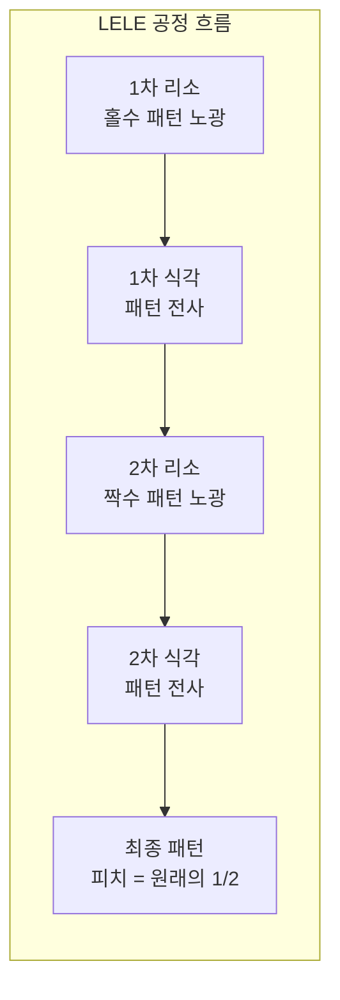
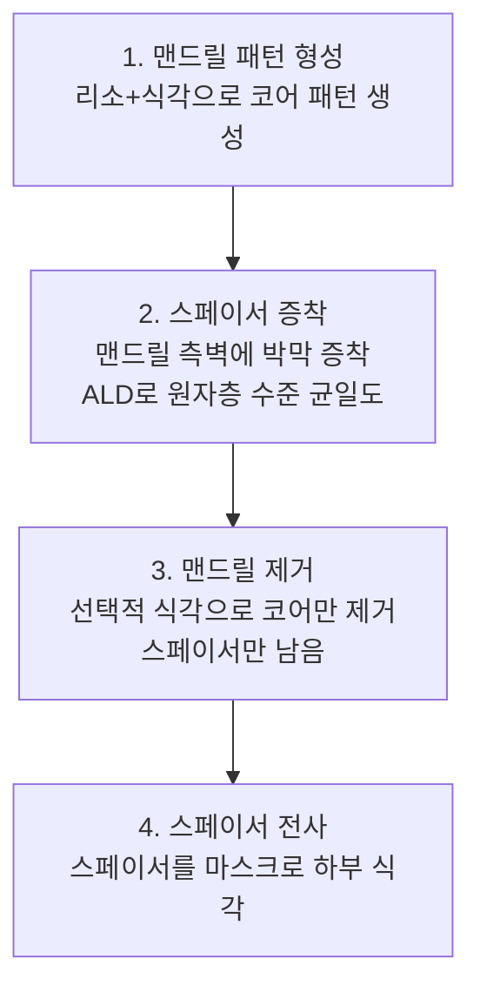

# 2.13 멀티 패터닝(Multi-Patterning) — 단일 노광의 한계를 넘어서

## 이 챕터에서 배우는 것
- 왜 멀티 패터닝이 필요한지 — k₁ = 0.25 벽
- LELE (Litho-Etch-Litho-Etch) 이중 패터닝
- SADP (Self-Aligned Double Patterning) — 자기정렬 이중 패터닝
- SAQP (Self-Aligned Quadruple Patterning)
- 멀티 패터닝이 Overlay와 CD에 미치는 영향
- EUV가 멀티 패터닝을 줄이는 방법

---

## 단일 노광의 물리적 한계: 벽에 부딪히다

2.6장에서 배운 Rayleigh 방정식을 다시 떠올려 보자.

```
R = k₁ × λ / NA
```

ArF 침수 스캐너(λ=193nm, NA=1.35)에서 k₁의 이론적 최소값은 **0.25**였다. 이것이 단일 노광(Single Exposure)으로 달성할 수 있는 **물리적 해상도의 절대 한계**다.

```
R_min = 0.25 × 193 / 1.35 ≈ 36nm (Half-Pitch)
```

36nm Half-Pitch. 이것이 ArF 침수 스캐너가 한 번의 노광으로 찍을 수 있는 가장 미세한 패턴이다. 하지만 7nm 공정의 메탈 피치는 ~36nm — Half-Pitch로 약 18nm다. 물리적 한계의 **절반**이다. 5nm는 더 미세하고, 3nm는 더 미세하다. 한 번의 노광으로는 물리적으로 불가능하다.

이 벽에 부딪혔을 때, 반도체 업계가 찾은 답은 의외로 단순하다 — **여러 번 나눠서 찍자**. 한 번에 36nm가 한계라면, 두 번에 나눠서 18nm를 만들고, 네 번에 나눠서 9nm를 만드는 것이다. 이것이 **멀티 패터닝(Multi-Patterning)**이다.

소프트웨어에 비유하면, 하나의 프로세스로는 메모리가 부족할 때 **여러 프로세스로 분할하여 처리하는 분산 컴퓨팅**과 같다. 단일 노광의 "해상도 메모리"가 부족하니, 여러 노광으로 작업을 분할하는 것이다. 효과적이지만 오버헤드(공정 횟수, 비용, Overlay 관리)가 증가한다.

---

## LELE: 두 번 찍어서 반으로 줄인다

### 가장 직관적인 접근

**LELE(Litho-Etch-Litho-Etch)**는 가장 직관적인 이중 패터닝 방법이다. 밀집 패턴을 **두 개의 느슨한 패턴**으로 분해하여, 각각 별도로 노광+식각한 뒤 합치는 것이다.

```
목표 패턴:    |  |  |  |  |  |  |  (피치 P)

1차 리소+식각: |     |     |     |  (피치 2P, 홀수 라인)
2차 리소+식각:    |     |     |    (피치 2P, 짝수 라인)

합성 결과:    |  |  |  |  |  |  |  (피치 P, 원래 목표)
```

홀수 라인과 짝수 라인을 각각 따로 노광하면, 각 노광에서 다루는 피치는 원래의 2배(2P)이므로 k₁ 한계 내에 들어온다. 두 결과가 합쳐지면 원래의 미세 피치 P가 달성된다.



### LELE의 치명적 약점: Overlay


LELE의 원리는 단순하지만, 치명적 약점이 있다 — **두 번째 노광이 첫 번째 노광과 정확히 맞아야 한다**. 두 패턴 사이의 Overlay 오차가 곧 **피치 변동**으로 직결된다.

구체적으로 보자. 목표 피치가 36nm(Half-Pitch 18nm)이고, 라인 간 목표 간격이 18nm라 하자. 1차와 2차 사이의 Overlay 오차가 2nm이면? 홀수 라인과 짝수 라인 사이의 간격이 한쪽은 16nm, 반대쪽은 20nm가 된다. 이 불균일한 간격은 배선의 저항과 커패시턴스 변동을 유발하고, 신호 타이밍의 불일치로 이어진다.

LELE에서 Overlay 요구는 **피치의 수 % 이내**다. 36nm 피치에서 2nm 이내 — 이것은 Overlay 챕터(2.8~2.10)에서 다룬 극한적 정밀도와 동일한 도전이며, LELE에서는 Overlay가 하나의 층이 아니라 **같은 층의 두 노광 사이**에서도 관리되어야 하므로 부담이 배가된다.

또한 리소+식각을 두 번 수행하므로 **공정 횟수가 2배**, 마스크도 2장이 필요하여 **비용도 거의 2배**가 된다.

---

## SADP: 자기정렬으로 Overlay를 원천 차단하다

### LELE의 Overlay 문제를 물리적으로 해결하다

**SADP(Self-Aligned Double Patterning, 자기정렬 이중 패터닝)**는 LELE의 Overlay 문제를 **근본적으로 해결**하는 우아한 방법이다. 핵심 아이디어 — 두 번째 패턴의 위치를 **두 번째 노광**이 아니라 **물리 법칙(증착의 등방성)**이 결정하게 하는 것이다.

### 네 단계의 마법



**1단계 — 맨드릴(Mandrel) 형성**: 일반적인 리소+식각으로 라인 패턴을 만든다. 이 라인을 "맨드릴(심봉)"이라 부른다. 피치는 목표의 2배(느슨한 피치)이므로 단일 노광으로 충분하다.

**2단계 — 스페이서(Spacer) 증착**: 맨드릴 위에 **ALD(Atomic Layer Deposition)**로 얇고 균일한 박막(SiO₂, SiN 등)을 증착한다. 이 박막은 맨드릴의 **양 측벽(Sidewall)**에 균일한 두께로 형성된다. 핵심은 이 스페이서의 두께가 곧 **최종 패턴의 CD**가 된다는 것이다.

**3단계 — 맨드릴 제거**: 맨드릴 재료만 선택적으로 식각하여 제거한다(스페이서 재료는 남긴다). 맨드릴이 빠지고 나면, 양쪽 측벽에 있던 스페이서만 남는다. 이 스페이서들은 원래 맨드릴 피치의 **절반** 간격으로 배열된다.

**4단계 — 패턴 전사**: 남은 스페이서를 식각 마스크로 사용하여 하부 층에 패턴을 전사한다.

### "Self-Aligned"의 의미


SADP에서 "자기정렬(Self-Aligned)"이 의미하는 바를 정확히 이해하는 것이 중요하다. 두 번째 패턴(스페이서)의 위치는 첫 번째 패턴(맨드릴)의 측벽에 의해 **물리적으로 결정**된다. 증착은 등방적(모든 방향으로 균일)으로 이루어지므로, 스페이서는 맨드릴의 측벽에 자동으로 밀착하여 형성된다. 두 번째 노광이 필요 없고, 따라서 두 번째 정렬도 필요 없다. **Overlay 오차가 원천적으로 발생하지 않는 구조**인 것이다.

이것은 소프트웨어에서 **인터페이스 의존성 주입(Dependency Injection)**과 비유할 수 있다. LELE에서는 두 패턴이 각각 독립적으로 "정렬"을 시도하여 불일치 위험이 있지만, SADP에서는 두 번째 패턴이 첫 번째 패턴에서 자동으로 "파생"되므로 불일치가 구조적으로 불가능하다.

### CD 제어의 패러다임 전환

SADP에서 최종 패턴의 CD는 **스페이서 막의 두께**에 의해 결정된다. 리소그래피의 Dose/Focus가 아니라, **ALD(Atomic Layer Deposition)의 증착 두께 균일도**가 CD를 좌우한다.

이것은 CD 제어의 패러다임이 바뀌는 것이다. 2.11장에서 배운 Dose/Focus 기반 CD 제어가 여전히 맨드릴 CD에 적용되지만, 최종 CD의 결정적 인자는 ALD 공정이다. AI 관점에서는 리소 장비 데이터뿐 아니라 **증착 장비(ALD 챔버)의 센서 데이터**가 CD 예측 모델의 핵심 입력이 되어야 한다는 의미다.

### SADP의 제약

SADP도 만능은 아니다. 모든 패턴이 맨드릴 측벽에서 파생되므로 **등간격 라인/스페이스**만 자연스럽게 형성된다. 임의의 패턴 — 예를 들어 라인이 끊어지는 곳, 방향이 바뀌는 곳 — 을 만들려면 불필요한 스페이서를 제거하기 위한 추가 노광(**컷 마스크, Cut Mask**)이 필요하다. 이 컷 마스크의 Overlay는 여전히 중요하다 — 잘못된 위치를 자르면 패턴이 단선된다.

---

## SAQP: 네 번 나누어 1/4로

SADP를 **두 번 연속 반복**하면 피치를 원래의 1/4로 줄일 수 있다. 이것이 **SAQP(Self-Aligned Quadruple Patterning)**다.

1. 1차 맨드릴(피치 4P) → 스페이서 형성 → 맨드릴 제거 → 피치 2P의 스페이서 패턴
2. 이 스페이서를 새로운 맨드릴로 사용 → 2차 스페이서 형성 → 제거 → 피치 P의 최종 패턴

7nm DUV 공정에서 메탈 피치 ~36nm(Half-Pitch ~18nm)를 달성하기 위해 SAQP가 실제로 사용되었다. ArF 침수 스캐너의 단일 노광 한계(36nm)를 네 배 넘어선 것이다.

하지만 대가가 크다. 하나의 패턴 층에 **수십 단계**의 리소/증착/식각/세정이 필요하다. 공정 시간과 비용이 폭증하고, 각 단계의 미세한 변동이 누적되어 최종 CD와 패턴 충실도에 영향을 미친다. 수율 관리의 복잡도가 기하급수적으로 증가하며, Root Cause 분석이 극도로 어려워진다 — 최종 CD 이상의 원인이 수십 단계 중 어디에 있는지 찾아야 하기 때문이다.

---

## 멀티 패터닝이 Overlay와 CD에 미치는 영향

멀티 패터닝은 Overlay와 CD 관리의 복잡도를 근본적으로 높인다.

**Overlay 측면**: LELE에서는 두 노광 사이의 Overlay가 피치 변동에 직결되므로 **가장 민감**하다. SADP/SAQP에서는 자기정렬으로 노광 간 Overlay 문제가 크게 완화되지만, **컷 마스크의 Overlay**는 여전히 중요하다 — 잘못된 위치를 자르면 패턴이 단선(Open)되고, 자르지 않으면 단락(Short)이 된다.

**CD 측면**: SADP/SAQP에서 최종 CD 균일도는 세 가지 요인의 합성이다 — 맨드릴 CD(리소 공정이 결정), 스페이서 두께(ALD 공정이 결정), 식각 균일도(식각 공정이 결정). 오차 원인이 **여러 공정 단계에 걸쳐 분산**되므로, 단일 노광 공정에서의 CD 관리(Dose/Focus 조정)보다 훨씬 복잡해진다. AI 모델에서는 리소, 증착, 식각의 **전 단계 데이터를 통합**하여 최종 CD를 예측해야 하며, 이것이 멀티 패터닝 시대의 Virtual Metrology의 핵심 도전이다.

---

## EUV가 멀티 패터닝을 줄인다: 비용의 역설


EUV(λ=13.5nm, NA=0.33)의 해상도는:
```
R = 0.3 × 13.5 / 0.33 ≈ 12nm (Half-Pitch)
```

ArF-i에서 SAQP(4회 패터닝)가 필요했던 36nm 피치 패턴을 EUV에서는 **단일 노광(Single Patterning)**으로 달성할 수 있다.

| 패턴 | ArF-i 방식 | EUV 방식 |
|:---|:---|:---|
| 36nm 피치 | SAQP (4회) | Single Patterning (1회) |
| 28nm 피치 | 불가능 | SADP (2회) 또는 SP |
| 20nm 피치 | 불가능 | SADP/LELE (2회) |

EUV 스캐너 1대의 가격은 약 4억 달러(~5,000억 원)다. 반도체 역사상 가장 비싼 단일 장비다. 하지만 EUV의 진정한 가치는 단순히 "더 작은 패턴"이 아니라, **멀티 패터닝 단계를 극적으로 줄여 공정 복잡도와 총 비용을 감소시키는 것**이다. SAQP의 수십 단계 공정(추가 리소+마스크+식각+증착+검사)을 단일 노광으로 대체하면, 장비 가격이 비싸도 **총 소유 비용(Total Cost of Ownership)**은 오히려 감소할 수 있다. 이것이 TSMC, 삼성, 인텔이 천문학적 EUV 투자를 결정한 경제적 논리다.

---

## AI 엔지니어에게 이것이 의미하는 것

멀티 패터닝은 AI/ML 모델에 독특한 도전을 제시한다.

**데이터 복잡도 폭증** — 하나의 패턴 층에 다수의 공정 단계(리소, 증착, 식각, 세정)가 관여하므로 입력 변수(피처)의 수가 단일 노광 대비 수배로 늘어난다. 공정 간 상호작용(Interaction)이 강하여 단순 선형 모델로는 부족하고, 비선형 모델이나 시계열 모델이 필요하다.

**엔드투엔드 CD 예측** — 리소→증착→식각→세정의 **전 단계 센서 데이터를 통합**하여 최종 CD를 예측하는 것이 핵심 과제다. LELE에서는 두 노광의 Dose/Focus 데이터가, SADP에서는 ALD 두께 데이터가 각각 핵심 입력이 된다.

**공정 단계 간 인과관계 분석** — 최종 CD 이상이 발생했을 때, 수십 단계 중 어느 단계의 어떤 변수가 원인인지를 Feature Importance 분석이나 인과 추론(Causal Inference)으로 자동 추정하는 것이 실용적 가치가 크다.

**컷 마스크 Overlay 최적화** — SADP/SAQP에서 컷 위치의 Overlay 마진을 최대화하는 보정값을 계산하는 것은, 2.10장의 Overlay 모델링과 직접 연결되는 과제다.

---

## 핵심 정리

멀티 패터닝은 ArF 침수 스캐너의 해상도 한계(k₁=0.25, Half-Pitch ~36nm)를 넘어 더 미세한 패턴을 형성하기 위해, **하나의 패턴 층을 여러 번의 노광/증착/식각으로 분할하여 형성**하는 기술이다. **LELE**는 두 번의 독립 노광으로 직관적이나 Overlay에 극도로 민감하다. **SADP**는 맨드릴 측벽에 스페이서를 증착하는 자기정렬 방식으로 Overlay 문제를 원천 차단하며, CD는 ALD 두께가 결정한다. **SAQP**는 SADP를 두 번 반복하여 피치를 1/4로 줄이지만 공정이 극도로 복잡하다. **EUV**는 멀티 패터닝 단계를 극적으로 줄여 총 비용을 절감하는 것이 핵심 가치이며, 이것이 천문학적 EUV 투자의 경제적 논리다.

---

*다음 챕터: 2.14 EUV 리소그래피 심화 — 양산 현실과 도전*
