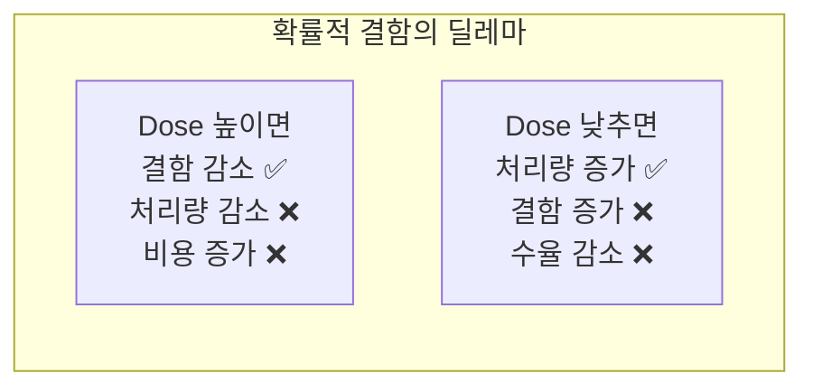

# 2.14 EUV 리소그래피 심화 — 양산 현실과 도전

## 이 챕터에서 배우는 것
- EUV 양산의 현재 상태 — 어디까지 왔는가
- EUV 특유의 도전 과제 — 확률적 결함, 광원 출력, 가동률
- High-NA EUV의 전망과 새로운 과제
- EUV가 만들어내는 새로운 데이터 패턴
- AI/ML이 EUV 공정에서 어떤 역할을 하는지

---

## EUV 양산의 현재: 30년의 꿈이 현실이 되다

2.3장에서 EUV의 기본 원리 — 13.5nm 극자외선, 주석 플라즈마 광원, 반사형 광학계 — 를 다뤘다. 이 챕터에서는 원리가 아니라 **양산 현실**에 초점을 맞춘다. EUV가 실제 팹에서 어떻게 사용되고, 어떤 도전에 직면하고, 어디로 향하는지.

### 양산 적용: 레이어 수가 말해주는 것

EUV의 양산 도입은 점진적이었다. TSMC가 2019년에 N7+ 공정에서 처음 ~5~6개 크리티컬 레이어에 EUV를 적용한 것이 시작이다. 이후 N5(2020)에서 ~12~14개, N3(2022)에서 ~20~25개로 빠르게 확대되었다. 2025~2026년 예정인 N2에서는 ~30개 이상의 EUV 레이어가 예상된다. 삼성도 5nm(2020)에서 ~7~8개, 3nm GAA(2022)에서 ~20개 이상의 EUV 레이어를 적용했다.

레이어 수의 증가가 의미하는 바를 이해해야 한다. EUV 레이어가 25개라는 것은, 하나의 칩을 만들기 위해 그 웨이퍼가 EUV 스캐너를 **25번 통과**해야 한다는 뜻이다. 스캐너 1대의 처리량이 시간당 ~180장(wph)이므로, 25레이어 전체를 처리하는 데 필요한 **유효 처리량**은 180 / 25 ≈ 7 wph에 불과하다. 대규모 양산(월 수만 장)을 위해 **수십 대의 EUV 스캐너**가 필요한 이유가 여기에 있다.

### EUV 스캐너: 인류 역사상 가장 비싼 기계


2024년 말 기준 전 세계에 약 200대 이상의 EUV 스캐너(ASML NXE 시리즈)가 설치되어 있다. TSMC가 약 90대 이상으로 압도적 최다, 삼성이 약 30대, 인텔이 약 20대, SK hynix와 Micron 등이 소수를 보유한다.

1대당 약 4억 달러(~5,000억 원). 200대면 약 **800억 달러(~100조 원)**가 EUV 스캐너 하나의 장비 종류에만 투자된 것이다. 이것은 하나의 장비 카테고리에 대한 투자로는 인류 역사상 전례가 없는 규모이며, ASML이라는 단일 기업이 독점 공급한다는 점에서 반도체 산업의 독특한 구조적 특성을 보여준다.

---

## EUV 양산의 핵심 도전: 네 가지 전선

### 1. 확률적 결함 (Stochastic Defects): EUV의 근본적 아킬레스건


EUV의 가장 근본적인 도전이다. 2.5장과 2.6장에서 다뤘던 **광자 통계(Shot Noise)**가 여기서 본격적으로 문제를 일으킨다.

수치로 비교하자. ArF(193nm) 광자의 에너지는 약 6.4eV이고, EUV(13.5nm) 광자의 에너지는 약 91.5eV — **약 14배** 높다. 같은 에너지(Dose)를 웨이퍼에 전달할 때, EUV에서는 광자 수가 14배 적다. 광자가 적으면 통계적 변동(Shot Noise)이 커진다 — 포아송 분포에서 N개 광자의 상대 변동은 1/√N이므로, 광자가 14배 적으면 변동은 √14 ≈ **3.7배** 커진다.

이 통계적 변동이 만들어내는 결함이 **확률적 결함(Stochastic Defects)**이다. 인접 라인 사이에 비정상적으로 레지스트가 남아 연결되는 **Micro-Bridge**, 라인이 중간에 끊어지는 **Line Break**, 홀 패턴이 완전히 열리지 않는 **Missing Contact** — 이 결함들의 공통점은 **위치가 랜덤**이라는 것이다.

기존 DUV 공정의 결함은 대부분 **체계적(Systematic)**이었다. 마스크 결함, OPC 오류, 특정 패턴 취약점 등 원인이 특정되고 위치가 예측 가능했다. 하지만 EUV의 확률적 결함은 **같은 마스크, 같은 Dose, 같은 Focus에서도** 웨이퍼마다, 다이마다, 심지어 같은 패턴 내에서도 무작위로 발생한다. 이것은 결함 검사와 예측의 패러다임을 근본적으로 바꾼다.



Dose를 높이면 광자 수가 늘어 확률적 결함이 줄지만, 노광 시간이 늘어 처리량(=매출)이 감소한다. Dose를 낮추면 처리량은 올라가지만 결함이 늘어 수율이 떨어진다. 이 트레이드오프의 **최적점**을 찾는 것이 EUV 양산 최적화의 핵심이며, AI가 가장 직접적으로 기여할 수 있는 영역이다.

### 2. 광원 출력과 가동률: 극한 환경의 엔지니어링

2.3장에서 EUV 광원이 얼마나 극한적인 기술인지 다뤘다. 양산에서의 현실은 이렇다.

광원 출력은 현재 약 500W 수준으로, 시간당 약 180장(wph)의 처리량을 달성한다. **가동률(Availability)**은 초기(2019~2020년) 70% 미만에서 현재 약 90% 수준으로 크게 개선되었지만, 성숙한 DUV 스캐너(~95%)에는 아직 미치지 못한다. 가동률 5%의 차이가 의미하는 바 — 연간 8,760시간 중 5%는 438시간이고, 시간당 180장이면 약 **7만 8천 장**의 웨이퍼 처리량 차이다. 3nm 칩의 웨이퍼당 가치를 고려하면 천문학적 금액이다.

광원의 핵심 소모품도 도전이다. Collector Mirror는 주석 플라즈마에서 나오는 잔해(Debris)에 의해 반사율이 서서히 저하되어 주기적 교체가 필요하다. Droplet Generator는 초당 약 50,000개의 주석 방울을 **수천 시간** 동안 안정적으로 생성해야 하는데, 이것은 초당 50,000발의 총알을 수개월간 쉬지 않고 발사하는 것과 같은 극한의 요구 조건이다.

### 3. 마스크 인프라: EUV 고유의 도전

EUV의 반사형 마스크(2.4장 참조)는 투과형 DUV 마스크와 질적으로 다른 도전을 안고 있다.

**마스크 결함 검사의 어려움** — Mo/Si 다층 반사경 아래에 숨은 결함(**Phase Defect**)은 표면에서 보이지 않으므로 검출이 극도로 어렵다. 이 결함이 반사 파면의 위상을 교란하여 웨이퍼에 프린트 가능한 결함을 만들지만, 기존 광학 검사로는 잡기 어렵다. **마스크 비용** — EUV 마스크 1장이 $30만~$50만, 하나의 칩 설계에 필요한 마스크 세트 전체가 **$2,000만(~260억 원) 이상**이다. 이것은 EUV 공정의 진입 장벽을 극적으로 높이며, 소량 생산 칩에서는 마스크 비용만으로 경제성이 성립하지 않을 수 있다. **마스크 3D 효과** — 2.4장에서 설명했듯이, EUV의 경사 입사(~6°)와 흡수체의 유한한 두께 때문에 패턴 위치와 방향에 따라 CD와 위치가 달라지는 3D 효과가 나타나며, 이것이 OPC 복잡도를 크게 높인다.

### 4. Overlay와 CD 제어: 열과의 싸움

EUV는 DUV에 비해 **열 문제**가 심각하다. 91.5eV의 높은 광자 에너지가 마스크, 렌즈(반사경), 웨이퍼 모두에서 흡수되어 온도를 상승시킨다.

**레티클 가열(Reticle Heating)** — 마스크의 흡수체와 다층 반사경이 EUV를 흡수하여 마스크 온도가 상승하고, 열팽창에 의해 패턴 위치가 이동한다. 이것이 시간에 따라 변하는 Overlay 오차를 유발한다. **렌즈(반사경) 가열** — 6장의 반사 거울이 EUV의 약 30%를 흡수(반사율 ~67~70%)하여 가열되고, 거울의 곡률이 미세하게 변하면서 결상 특성이 바뀐다. **Wafer Heating** — 높은 광자 에너지가 웨이퍼/레지스트 온도를 국부적으로 상승시켜, PEB 전의 레지스트 화학 반응에 영향을 미친다. **Flare** — 반사 거울 표면의 미세 거칠기(Mid-Spatial Frequency Roughness)로 빛이 넓은 각도로 산란되어, 패턴 주변의 배경 빛(Flare)이 증가하고 CD가 변동한다.

이 열 효과들의 공통적 특성은 **시간 의존성**이다. 노광이 진행될수록 열이 축적되므로, 웨이퍼의 첫 번째 필드와 마지막 필드, 로트의 첫 번째 웨이퍼와 마지막 웨이퍼에서 Overlay와 CD가 체계적으로 달라진다. 이것은 DUV에서는 미미하여 무시할 수 있었지만, EUV에서는 nm 수준의 영향을 미쳐 반드시 보정해야 한다.

---

## High-NA EUV: 해상도의 다음 도약

### NA 0.33에서 0.55로

현재 EUV 스캐너(ASML NXE 시리즈)의 NA는 0.33이다. 차세대 **High-NA EUV**(ASML EXE:5000 시리즈)는 NA를 **0.55**로 높인다.

```
해상도: R = k₁ × 13.5 / 0.55 = k₁ × 24.5nm
```

k₁=0.3일 때 R ≈ 7.4nm(Half-Pitch). 현재 EUV(~12nm)의 해상도가 **약 1.7배 향상**된다. 이것은 2nm 이하 공정에서 멀티 패터닝을 다시 줄이거나 제거할 수 있는 해상도다.

### High-NA가 가져오는 새로운 과제


NA를 높이는 것은 공짜가 아니다. 2.6장에서 배웠듯이, NA가 올라가면 **DOF(피사계 심도)가 NA²에 비례하여 감소**한다. NA 0.33에서 0.55로 올리면 DOF는 (0.33/0.55)² ≈ **0.36배** — 약 1/3로 줄어든다. 이미 극도로 좁은 DOF가 더 좁아지므로, 웨이퍼 평탄도와 Focus 제어의 정밀도 요구가 한 단계 더 올라간다.

더 근본적인 변화는 **Anamorphic 광학계**의 도입이다. NA를 높이면서 광학 설계의 물리적 한계를 극복하기 위해, High-NA EUV는 x방향과 y방향의 축소비를 다르게 한다 — x방향은 기존과 같이 4:1, y방향은 **8:1**. 결과적으로 노광 필드가 y방향으로 절반으로 줄어든다(26×33mm → 26×16.5mm).

이 절반 필드의 실전적 의미는 크다. 현재 첨단 칩(GPU, AI 가속기)의 다이 크기는 노광 필드 전체를 사용하는 경우가 많다. 필드가 절반이면 큰 칩은 **두 번의 노광을 이어붙이는(Stitching)** 방식이 필요하다. 이 이음새의 Overlay 정밀도 — **Stitch Overlay** — 가 완전히 새로운 기술적 도전이 된다.

High-NA EUV 스캐너는 2024년 인텔의 Albany 연구팹에 최초로 설치되었으며, 양산 적용은 2025~2026년에 시작될 전망이다. 장비 가격은 약 **3.5~5억 달러** — 현재 EUV보다도 더 비싸다.

---

## EUV가 만드는 새로운 데이터 패턴: AI 모델의 전환점

AI 엔지니어에게 가장 중요한 메시지가 여기에 있다. EUV 공정의 데이터는 DUV와 **질적으로 다르며**, 이 차이가 AI 모델의 아키텍처와 접근법을 바꿔야 한다.

**확률적 성격의 지배** — DUV에서 결함은 대부분 체계적이어서 결정론적 모델(원인 → 결과)로 예측 가능했다. EUV에서는 확률적 결함이 지배적이므로, 결정론적 모델에서 **확률론적 모델**로 전환이 필요하다. "이 패턴에서 결함이 발생할 것인가?"가 아니라 "이 패턴에서 결함이 발생할 **확률**은 얼마인가?"를 예측해야 한다. 포아송 분포, 베이지안 추론, 확률적 그래프 모델이 자연스럽게 등장하는 영역이다.

**시간 의존성의 부상** — DUV에서는 웨이퍼 내 Overlay/CD 변동이 주로 **공간적 패턴**(위치 의존)이었다. EUV에서는 열 효과 때문에 **시간적 패턴**(노광 순서 의존)이 추가된다. 웨이퍼의 첫 번째 필드와 마지막 필드의 Overlay 차이, 로트 내 웨이퍼 순서에 따른 CD 드리프트 — 이런 시간 의존적 변동을 모델링하려면 LSTM, Transformer 같은 **시계열 모델**이 필수적이다. 2.10장의 Overlay 에러 모델(순수 공간 모델)에 시간 축이 추가되는 것이다.

**광자 통계의 직접 모델링** — EUV에서 광자 도착은 포아송 과정(Poisson Process)을 따른다. 패턴 밀도에 따라 단위 면적당 광자 수가 달라지고(밀집 패턴은 흡수체가 많아 광자가 적게 도달), 이 광자 수의 통계적 변동이 LER/LWR과 확률적 결함에 직접 연결된다. Dose와 결함 확률의 관계는 비선형이며, 이 비선형 매핑을 정확히 학습하는 것이 EUV VM의 핵심이다.

---

## AI/ML의 EUV 공정 적용: 네 가지 최전선

**확률적 결함 예측** — Dose, Focus, 패턴 밀도, 패턴 형태, 레지스트 종류, 공정 조건(PEB 온도, 현상 시간)을 입력으로 각 패턴 유형별 **결함 발생 확률**을 예측한다. 학습 데이터는 대량의 결함 검사(Defect Inspection) 결과와 공정 조건의 매핑이며, 결함의 희소성(대부분의 패턴은 정상)이 클래스 불균형 문제를 만든다.

**EUV 광원 안정화 및 예측 정비** — 드롭릿 생성기 데이터(드롭릿 속도, 크기, 간격), CO₂ 레이저 출력, Collector Mirror의 반사율 추이를 실시간 모니터링하여 광원 출력을 예측하고, 부품 교체 시점을 사전에 결정한다(**Predictive Maintenance**). 계획에 없는 장비 정지(Unplanned Down)를 1시간 줄이면 ~180장 × 웨이퍼당 가치 = 수십억 원의 기회비용을 절약한다.

**열 변형 보정** — 노광 이력(필드 순서, 각 필드의 Dose), 웨이퍼 위치, 시간 경과를 입력으로, 레티클/렌즈/웨이퍼의 열변형에 의한 **Overlay/CD 보정값을 시간 의존적으로 산출**한다. 이것은 2.10장의 정적(Static) Overlay 모델에 시간 축을 추가한 **동적(Dynamic) 모델**이며, LSTM이나 Transformer 아키텍처가 자연스럽다.

**마스크 3D 효과 보정** — 마스크의 구조 파라미터(흡수체 두께, 다층 반사경 구조)와 패턴의 위치/방향/밀도를 입력으로, 마스크 3D 효과에 의한 CD/Overlay 보정값을 계산한다. 이것은 2.7장의 OPC와 연결되며, 물리 모델(FDTD 시뮬레이션)과 ML 모델을 결합한 Physics-Informed ML이 유효한 영역이다.

---

## Part 2를 마치며

Part 2에서는 포토리소그래피의 **핵심 기술과 개념** 14개 챕터를 다뤘다.

**기초(2.1~2.5)**: 포토리소그래피의 전체 구조, 노광 시스템, 광원(DUV/EUV), 마스크와 펠리클, 포토레지스트.
**물리(2.6~2.7)**: Rayleigh 해상도와 DOF, OPC와 RET.
**핵심 지표(2.8~2.12)**: Overlay 3부작(정의, 측정, 모델링), CD 2부작(제어, 측정).
**첨단(2.13~2.14)**: 멀티 패터닝, EUV 심화.

여기까지가 "**리소그래피가 만들어내는 데이터의 물리적 배경**"이다. 다음 Part 3에서는 이 데이터를 **어떻게 분석하고 제어하는지** — 수율, SPC, FDC, APC, VM 등 — AI 엔지니어의 실전 영역에 본격적으로 들어간다.

---

## 핵심 정리

EUV는 2019년 양산 도입 이후 급속히 확산되어, TSMC N3에서 약 25개 EUV 레이어가 사용되며 전 세계에 약 200대(총 ~800억 달러)의 스캐너가 배치되어 있다. EUV의 핵심 도전은 **확률적 결함**(광자 통계에 의한 랜덤 결함 — Micro-Bridge, Line Break, Missing Contact), **광원 가동률**(~90%, DUV 대비 열세), **마스크 인프라**(Phase Defect 검출, 세트당 $2,000만+), **열 효과**(레티클/렌즈/웨이퍼 가열에 의한 시간 의존적 Overlay/CD 변동)이다. **High-NA EUV**(NA=0.55)는 해상도를 ~8nm로 향상하지만, Anamorphic 광학계로 필드가 절반이 되어 Stitching이 필요하다. AI 관점에서 EUV 데이터는 **확률적·시간 의존적** 특성이 지배하므로, 결정론적·정적 모델에서 **확률론적·시계열 모델**로의 전환이 필수적이다.

---

## 🎉 Part 2 완료!

Part 2 "포토리소그래피 심화" 14개 챕터를 모두 마쳤습니다.

*다음 챕터: 3.1 수율(Yield)의 이해 — 반도체 경제학의 핵심*
