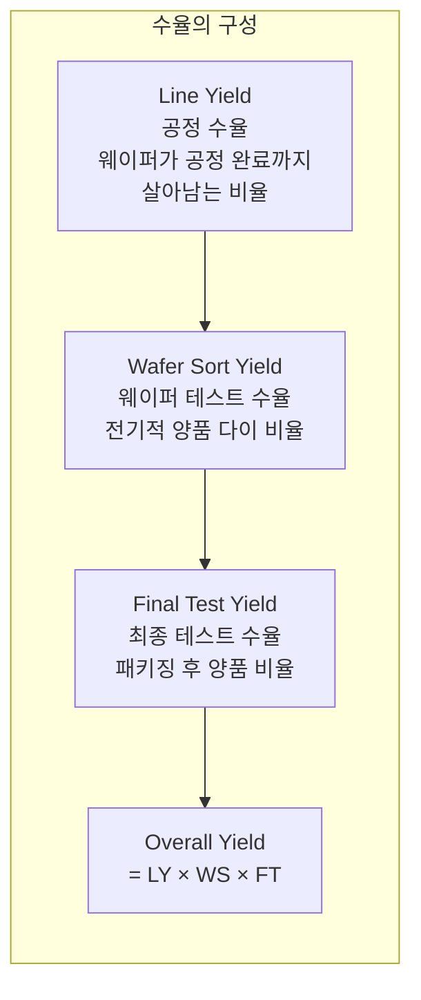
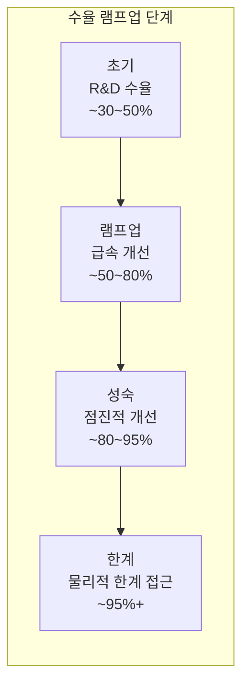

# 3.1 수율(Yield)의 이해 — 반도체 경제학의 핵심

## 이 챕터에서 배우는 것
- 수율(Yield)의 정의와 종류
- 수율이 반도체 비즈니스에 미치는 경제적 영향
- 수율 모델 — Poisson, Murphy, Negative Binomial
- 결함 밀도(Defect Density)와 수율의 관계
- 수율 램프업(Ramp-up) 곡선
- AI 엔지니어에게 수율이 중요한 이유

---

## 수율이란: 왜 이 숫자가 전부를 결정하는가

Part 3에 진입한다. Part 1에서 반도체 공정의 전체 흐름을, Part 2에서 포토리소그래피의 핵심 기술을 배웠다. 이제부터는 이 기술들이 만들어내는 데이터를 **어떻게 분석하고 제어하여 돈으로 바꾸는지** — AI 엔지니어의 실전 영역이다.

그 출발점이 **수율(Yield)**이다.

수율은 제조된 전체 다이(Die) 중 **양품(Good Die)의 비율**이다.

```
Yield = 양품 다이 수 / 전체 다이 수 × 100%
```

300mm 웨이퍼에 약 500개의 다이가 있고, 그 중 450개가 양품이면 수율은 90%다. 50개는 무언가의 결함 — 파티클, 패턴 불량, 전기적 단락 — 으로 인해 사용할 수 없다. 이 50개에 들어간 공정 비용(수백 공정 단계, 수천만 원)은 전부 **낭비**다.

이 단순한 비율이 반도체 비즈니스의 **생사를 결정**한다. 수율이 높으면 돈을 벌고, 낮으면 돈을 잃는다. 그 사이에 다른 것은 별로 없다.

---

## 수율의 종류: 네 단계의 필터

수율은 하나가 아니다. 칩이 만들어지는 과정의 각 단계에서 필터가 작동하며, 각 필터를 통과한 비율이 각 단계의 수율이다.



**Line Yield (공정 수율)** — 전공정(Fab)에서 웨이퍼가 파손되거나, 심각한 오염이 발생하거나, 공정 파라미터가 한계를 벗어나 더 이상 진행할 수 없게 되는 경우를 제외한 "생존율"이다. 성숙 공정에서는 98~99%로 높지만, 신규 공정 초기에는 80~90%까지 떨어질 수 있다. 여기서의 손실은 **웨이퍼 전체**가 사라지는 것이므로 영향이 크다.

**Die Yield / Wafer Sort Yield** — 공정이 완료된 웨이퍼에서, 각 다이에 프로브(탐침)를 대고 전기적 테스트(EDS, Electrical Die Sort)를 수행하여 양품과 불량을 분류한 비율이다. 보통 "수율"이라 하면 이 값을 가리킨다. 성숙 공정에서 90~95%, 첨단 공정 초기에는 **30~50%까지** 떨어질 수 있다. 이 수율이 SMILE 플랫폼의 Overlay/CD 최적화가 직접적으로 영향을 미치는 지점이다.

**Final Test Yield** — 다이를 패키지에 넣고 최종 기능 테스트를 수행한 후의 양품 비율이다. 패키징 과정의 결함이나 와이어 본딩 불량 등이 원인이며, 보통 95~99%로 비교적 높다.

**Overall Yield** — 전체 수율은 이 세 단계의 곱이다. Line Yield 98% × Die Yield 90% × Final Test 97% = Overall **85.6%**. 각 단계가 곱으로 작용하므로, 어느 한 단계의 하락이 전체에 미치는 영향이 크다.

---

## 수율의 경제적 영향: 1%의 가치

수율의 경제적 임팩트를 구체적 숫자로 보자.

가정: 300mm 웨이퍼 1장에 약 500개 다이, 웨이퍼 가공비 약 $15,000~$20,000(첨단 공정), 칩 판매가 $50/개(모바일 AP 기준).

| 수율 | 양품 다이 | 매출/웨이퍼 | 다이당 원가 |
|:---|:---|:---|:---|
| 50% | 250개 | $12,500 | $80 ❌ |
| 70% | 350개 | $17,500 | $57 |
| 90% | 450개 | $22,500 | $44 |
| 95% | 475개 | $23,750 | $42 ✅ |

핵심을 보자. 수율이 50%에서 90%로 올라가면 **같은 웨이퍼에서 매출이 80% 증가**한다. 웨이퍼 가공비는 수율이 50%이든 90%이든 **동일하게** $20,000이 든다 — 불량 다이에도 양품 다이와 똑같은 비용이 투입된다. 따라서 수율 향상분은 **거의 순수한 이익**이다. 변동비가 거의 없는 구조이기 때문이다.

이것을 팹 전체 규모로 확장하면 그림이 더 선명해진다. TSMC의 월 생산량이 약 10만 장(300mm 환산)이라 가정하면, 수율 1% 향상은 웨이퍼당 약 5개 추가 양품을 의미한다. 10만 장 × 5개 × $50 = **월 $25M(약 330억 원)**, 연간 약 **$300M(약 4,000억 원)**의 추가 매출이다. 수율 **1%**의 가치가 연간 수천억 원인 것이다.

이것이 AI 기반 수율 분석에 천문학적 투자가 이뤄지는 근본적 이유다. AI 시스템이 수율을 0.5% 올릴 수 있다면, 그 시스템의 개발·운영 비용이 수십억 원이더라도 ROI가 압도적으로 양수다.

---

## 결함 밀도와 수율 모델: D₀ × A가 전부를 지배한다

### 결함 밀도 (D₀)

수율을 결정하는 가장 근본적인 변수는 **결함 밀도(Defect Density, D₀)**다. 단위 면적당 **Killer Defect**(치명적 결함 — 다이를 불량으로 만드는 결함)의 수를 나타내며, 단위는 defects/cm²다. 파티클, 스크래치, 패턴 결함, 전기적 단락/단선 등이 모두 Killer Defect에 해당한다.

D₀가 낮을수록 수율이 높다. D₀를 줄이는 것이 팹 운영의 가장 근본적인 목표이며, 클린룸 관리, 장비 유지보수, 공정 최적화 모두 궁극적으로는 D₀ 감소를 위한 것이다.

### Poisson 수율 모델

가장 단순한 모델이다. 결함이 웨이퍼 위에 **균일하게 랜덤 분포**(포아송 과정)한다고 가정하면:

```
Y = e^(-D₀ × A)
```

Y는 수율, D₀는 결함 밀도, A는 다이 면적이다. 핵심 통찰 — 수율은 **D₀ × A**(결함 밀도 × 다이 면적)라는 **하나의 곱**에 의해 지수적으로 결정된다.

이것의 의미를 구체적으로 보자. D₀ = 0.1 defects/cm²일 때:

| 다이 면적 | D₀ × A | 수율 |
|:---|:---|:---|
| 50mm² (0.5cm²) | 0.05 | 95.1% |
| 100mm² (1.0cm²) | 0.10 | 90.5% |
| 200mm² (2.0cm²) | 0.20 | 81.9% |
| 400mm² (4.0cm²) | 0.40 | 67.0% |
| 800mm² (8.0cm²) | 0.80 | 44.9% |

다이 면적이 커질수록 수율이 **지수적으로** 하락한다. NVIDIA H100의 다이 면적이 약 814mm²(~8.1cm²)인 것을 생각하면, D₀=0.1이라도 이론적 수율이 45% 미만이 되는 이유가 이 공식에서 바로 보인다. 이것이 대형 칩이 비싼 근본적 이유다 — 단순히 실리콘을 많이 쓰기 때문이 아니라, 수율이 지수적으로 떨어져 양품 하나당 원가가 폭증하기 때문이다.

### Murphy 모델과 Negative Binomial 모델


실제 팹에서 결함은 균일하게 분포하지 않는다. **클러스터링(Clustering)** — 특정 영역에 결함이 몰리는 현상 — 이 일반적이다. 장비 오염, 국부적 파티클, 공정 이상 등이 원인이다.

**Murphy 모델**은 결함의 클러스터링을 반영한다:

```
Y = ((1 - e^(-D₀ × A)) / (D₀ × A))²
```

클러스터링이 있으면, 일부 다이에 결함이 집중되고 나머지 다이는 깨끗하므로, 전체 수율은 Poisson 모델보다 **높게** 나온다. 직관적으로 — 결함이 고르게 퍼지면 많은 다이가 하나씩 결함을 갖지만, 한 곳에 몰리면 그 다이만 불량이고 나머지는 무사하다.

가장 실용적이고 업계에서 가장 널리 사용되는 모델은 **Negative Binomial 모델**이다:

```
Y = (1 + D₀ × A / α)^(-α)
```

여기서 α는 **클러스터링 파라미터**다. α → ∞이면 클러스터링이 없어 Poisson과 동일하고, α가 작을수록 클러스터링이 심하다. 실무에서는 α ≈ 1~5 범위가 흔하며, 결함 유형과 공정에 따라 달라진다. α는 실측 데이터에서 피팅으로 추정하며, 이 α 자체가 공정의 "건강 상태"를 나타내는 지표가 된다.

---

## 수율 램프업: S-커브의 여정

### 새 공정은 낮은 수율에서 시작한다


새로운 공정 노드나 제품의 수율은 시간에 따라 **S-커브** 형태로 개선된다. 이 S-커브를 이해하는 것이 AI 투자 시점과 방향을 결정하는 데 중요하다.



**초기 단계(0~3개월)** — 수율이 30~50%로 낮다. 다양한 결함 모드가 혼재하며, 어떤 결함이 지배적인지조차 파악하기 어려운 "카오스" 상태다. 결함 원인의 파레토 분석(상위 20% 원인이 80% 불량을 만든다)과 장비 셋업 최적화가 주요 활동이다.

**램프업 단계(3~12개월)** — 수율이 급속히 개선되는 핵심 구간이다. 파레토 상위의 주요 결함 모드를 하나씩 해결하면서, 해결할 때마다 수율이 계단식으로 올라간다. **이 구간에서 AI의 가치가 가장 크다.** 결함 원인을 인간 엔지니어가 찾는 데 수 주가 걸리는 것을 AI가 수 시간 안에 찾아주면, 램프업 속도가 가속되고, 1개월 먼저 수율 목표를 달성하면 그 1개월 동안의 추가 매출이 수백억 원이다.

**성숙 단계(12개월~)** — 수율이 85~95%에 도달하고 개선 속도가 둔화된다. 남은 결함은 여러 요인이 복합된 것이거나, Random Defect처럼 근본적으로 제거가 어려운 것들이다. 미세 조정, 엣지 케이스 해결, 장기 안정성 확보가 주요 활동이며, 여기서 AI는 미세한 변동 패턴 탐지와 이상 조기 경보에 활용된다.

---

## 수율 손실의 세 가지 범주

수율 손실의 원인을 체계적으로 분류하면 세 가지 범주로 나뉜다.

**Random Defect (랜덤 결함)** — 파티클, 스크래치, 장비 잔해 등 예측 불가능한 결함이다. 위치가 랜덤이고, 웨이퍼마다 다르며, D₀로 모델링한다. 클린룸 청정도 관리, 장비 세정, 필터 교체 등이 핵심 대책이다.

**Systematic Defect (체계적 결함)** — 공정이나 설계의 마진 부족으로 **반복적으로** 발생하는 결함이다. 특정 패턴, 특정 위치에서 웨이퍼마다 동일하게 나타나므로 예측 가능하다. OPC 최적화, 설계 규칙(DRC) 강화, 공정 윈도우 확보가 해결책이다.

**Parametric Yield Loss (파라미터 수율 손실)** — 다이가 동작하지만 **성능 규격(속도, 전력, 누설 전류 등)**을 만족하지 못하여 상위 Bin에 들어가지 못하는 것이다. CD, Overlay, 도핑 농도 등의 **변동**에 의해 발생한다. 이것이 SMILE 플랫폼의 Overlay/CD 최적화가 직접적으로 공략하는 수율 손실 유형이며, APC와 VM으로 공정 변동을 최소화하는 것이 대책이다.

---

## 웨이퍼맵: 수율 엔지니어의 눈


**웨이퍼맵(Wafer Map)**은 웨이퍼의 각 다이를 양품(Pass)/불량(Fail)으로 표시한 2D 지도다. 수율 분석의 가장 기본적인 시각화 도구이며, 불량 다이의 **공간 패턴**에서 원인을 추정할 수 있다.

```
   ○ ○ ● ○ ○
  ○ ○ ○ ○ ○ ○
 ○ ● ○ ○ ○ ○ ○
○ ○ ○ ○ ● ○ ○ ○
 ○ ○ ○ ○ ○ ○ ○
  ○ ○ ○ ○ ● ○
   ○ ○ ○ ○ ○

○ = 양품(Pass)  ● = 불량(Fail)
```

불량이 웨이퍼 전체에 흩어져 있으면 파티클 등 **랜덤 결함**, 가장자리에 집중되면 코팅/식각/CMP 등 **에지 공정 문제**, 특정 영역에 몰린 **클러스터**는 장비 이상이나 오염, 줄무늬나 링 패턴은 스캐너나 척의 기계적 문제, 동일 위치의 반복 패턴은 **마스크 결함**을 시사한다. 이 패턴 인식이 수율 엔지니어의 핵심 역량이며, CNN으로 자동화하는 것이 AI의 대표적 활용이다.

---

## AI 엔지니어에게 이것이 의미하는 것

수율은 SMILE 플랫폼을 포함한 모든 반도체 AI의 **궁극적 목표 함수(Objective Function)**다. Overlay를 줄이는 것도, CD 균일도를 높이는 것도, 결함을 줄이는 것도, 모두 궁극적으로는 **수율 향상**을 위해서다.

AI 활용의 핵심 사례를 정리하면 — **웨이퍼맵 패턴 인식**: CNN으로 불량 패턴(Edge, Cluster, Ring, Scratch 등)을 자동 분류하여 원인 추정을 자동화한다. **수율 예측 모델**: 인라인 계측과 장비 센서 데이터로 최종 수율을 공정 초기에 예측하여, 문제 로트를 조기에 발견하고 후속 조치를 선제적으로 취한다. **Root Cause 분석**: 수율 이상 발생 시 다변량 데이터에서 원인 변수를 자동 추정하여, 인간 엔지니어의 주 단위 분석을 시간 단위로 단축한다. **수율-파라미터 최적화**: CD, Overlay 등 공정 파라미터와 수율의 상관관계를 학습하여, 수율을 최대화하는 공정 조건을 Multi-Objective Optimization으로 탐색한다.

SMILE의 맥락에서 — Overlay 잔차를 0.3nm 줄이면 Parametric Yield이 개선되고, CD 균일도를 높이면 고성능 Bin 비율이 올라간다. 이 개선이 수율 1% 향상으로 이어지면 연간 수천억 원의 가치다. **모든 기술적 노력의 ROI는 결국 수율이라는 하나의 숫자로 환산된다.**

---

## 핵심 정리

**수율(Yield)**은 양품 다이의 비율이며 반도체 비즈니스의 핵심 KPI다. 수율 1% 향상이 연간 수천억 원의 가치를 만들며, 이것이 AI 투자의 경제적 근거다. 수율은 **D₀ × A**(결함 밀도 × 다이 면적)에 의해 지수적으로 결정되어, 큰 칩일수록 수율이 급격히 떨어진다. **Negative Binomial 모델**이 결함의 클러스터링을 반영하는 가장 실용적인 수율 모델이며, 수율 램프업은 S-커브를 따르는데 **램프업 구간에서 AI의 가치가 가장 크다**. 수율 손실은 Random Defect, Systematic Defect, Parametric Yield Loss의 세 범주로 나뉘며, SMILE 플랫폼은 Overlay/CD 최적화를 통해 Parametric Yield을 직접 공략한다.

---

*다음 챕터: 3.2 결함 검사(Defect Inspection)와 분류*
