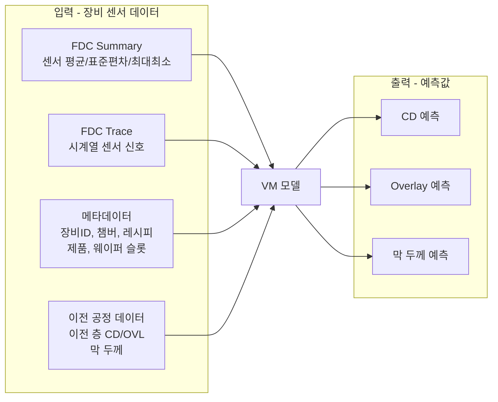
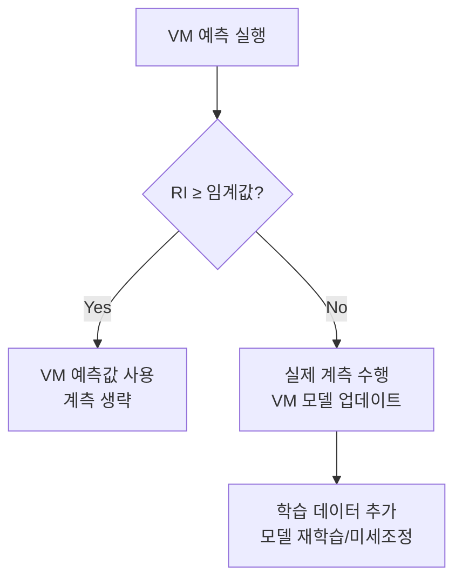

# 3.6 VM(Virtual Metrology) — 측정 없이 예측하기

## 이 챕터에서 배우는 것
- Virtual Metrology(가상 계측)의 개념과 동기
- VM의 입력과 출력 — 어떤 데이터로 무엇을 예측하는가
- VM 모델의 종류 — 선형, 비선형, 딥러닝
- VM의 신뢰도 관리 — RI(Reliance Index)와 GSI(Global Similarity Index)
- VM의 실전 적용 시나리오
- VM의 한계와 주의사항

---

## VM이란: 보지 않고 아는 기술

이전 세 챕터에서 **감시**(SPC) → **탐지**(FDC) → **제어**(APC)의 체계를 배웠다. 이 세 가지 모두 **계측 데이터**(실제 CD, Overlay 측정값)에 의존한다. 하지만 2.9장과 2.12장에서 배웠듯이, 실제 계측은 느리고 비싸다 — 전체 웨이퍼의 약 5~10%만 계측하고, 나머지 90~95%는 **측정 없이** 다음 공정으로 보내진다.

여기서 불편한 질문이 떠오른다. 측정하지 않은 90%의 웨이퍼는 괜찮은 것인가? 혹시 그 안에 불량 웨이퍼가 숨어 있는 것은 아닌가?

**Virtual Metrology(VM, 가상 계측)**는 이 질문에 답한다. 실제 계측(CD-SEM, OCD, Overlay 측정) 없이, **장비 센서 데이터(FDC)만으로 공정 결과를 예측**하는 기술이다. 장비가 웨이퍼를 처리하는 동안 수집한 센서 데이터(압력, 온도, 가스 유량, RF 전력 등)에는 그 웨이퍼의 공정 결과에 대한 정보가 **이미 담겨 있다**. 이 정보를 ML 모델로 추출하면, 실제 계측 없이도 CD나 Overlay를 "측정"할 수 있다.

여러분에게 익숙한 비유를 들자면, VM은 **APM(Application Performance Monitoring)의 로그 기반 성능 추정**과 같다. 실제 사용자 경험(Response Time)을 측정하는 Real User Monitoring(RUM) 없이, 서버 내부 로그(CPU, 메모리, 쿼리 시간, 큐 길이)만으로 사용자 경험을 **추정**하는 것이다. 서버 로그가 FDC 데이터, 사용자 경험이 CD/Overlay에 대응한다.

---

## VM이 해결하는 현실의 문제

실제 계측의 현실적 제약은 심각하다.

**비용** — 계측 장비 1대에 수백만~수천만 달러. 팹에는 수십 대의 계측 장비가 필요하지만, 여전히 모든 웨이퍼를 측정하기에는 부족하다. **시간** — 웨이퍼 1장의 CD 측정에 수 분~수십 분 소요. 측정 대기열이 길어지면 APC의 Feedback 지연이 증가한다. **커버리지** — 전체 웨이퍼의 약 5~10%만 계측. 측정하지 않은 90%에 숨어 있는 불량은 최종 전기적 테스트에서야 발견된다 — 그때는 이미 모든 공정이 완료된 후이므로, 투입된 비용을 회수할 수 없다.

VM의 약속은 이 세 가지 제약을 동시에 완화하는 것이다. **모든 웨이퍼**에 대해 공정 결과를 예측하여 **전수 검사 효과**를 달성하고(커버리지), 공정 직후 **즉시** 예측하여 계측 대기를 제거하며(시간), 실제 계측 빈도를 감소시켜 **비용을 절감**한다(비용). 이것이 SMILE 플랫폼의 중요한 가치 제안 중 하나다.

---

## VM의 입력과 출력: 무엇으로 무엇을 예측하는가

### 입력 피처

**FDC Summary 피처**가 가장 보편적이다. 3.4장에서 배운 각 센서 × 각 공정 스텝의 통계값(평균, σ, min, max, 기울기 등)을 사용한다. 센서 100개 × 스텝 5개 × 통계량 5종 = **2,500개** 피처가 전형적이다.

**Trace 피처**는 시계열 데이터를 직접 사용하거나, FFT, Wavelet, PCA 등으로 특징을 추출한 후 사용한다. 정보가 풍부하지만 차원이 수만~수십만으로 높아 차원 축소가 필수적이다.

**메타데이터 피처**도 예측에 중요한 기여를 한다. 장비/챔버 ID는 장비 간 차이(Chamber Matching 문제)를 포착하고, PM 이후 경과 웨이퍼 수는 장비 상태의 대리 변수(Proxy)가 되며, 웨이퍼 슬롯 번호는 카세트 내 위치에 따른 온도/가스 흐름 차이를 반영한다.

**이전 공정 데이터**는 강력하지만 자주 간과되는 입력이다. 이전 층의 CD, Overlay, 막 두께 측정값(또는 VM 예측값)이 현재 층의 공정 결과에 영향을 미치므로, 이를 입력에 포함하면 예측 정확도가 유의미하게 올라간다. 2.10장에서 Overlay의 원인 중 하나가 이전 공정의 변형이라고 했는데, 이전 층 데이터를 VM 입력에 포함하면 이 영향을 직접 학습할 수 있다.

---

## VM 모델의 선택: 상황에 맞는 도구

### PLS (Partial Least Squares) — 전통의 표준

반도체 VM의 **원조**로 1990~2000년대부터 사용되었다. PLS는 입력 변수가 많고 상관관계가 높을 때(반도체 FDC 데이터의 전형적 특성) 효과적인 선형 차원 축소 + 회귀 모델이다. 어떤 센서가 예측에 기여하는지 VIP(Variable Importance in Projection) 점수로 파악할 수 있어 **해석 가능성(Interpretability)**이 우수하다. 하지만 선형 모델이므로 비선형 관계는 포착하지 못하며, 복잡한 상호작용 효과를 놓친다.

### XGBoost / LightGBM — 실전의 강자

PLS보다 **비선형 관계** 포착에 강하고, Feature Importance로 변수 중요도를 파악할 수 있다. 특히 **XGBoost**와 **LightGBM**은 반도체 VM 대회와 실전에서 일관되게 높은 성능을 보이는 "안전한 선택"이다. PLS에 비해 하이퍼파라미터 튜닝이 필요하고 오버피팅에 주의해야 하지만, 적절한 Cross-Validation으로 관리 가능하다.

### Neural Network — 데이터가 풍부할 때

충분한 데이터(수천~수만 웨이퍼의 FDC-계측 쌍)가 있으면 **가장 높은 예측 성능**이 가능하다. 특히 Trace 데이터를 직접 입력으로 사용하는 **1D-CNN + LSTM** 구조는 Summary에서 손실되는 시간적 패턴(Transient)을 포착할 수 있어, Summary 기반 모델 대비 추가적인 정확도 향상을 달성한다. 하지만 **해석 가능성 부족**이 반도체 현장 도입의 가장 큰 장벽이다 — 엔지니어가 "왜 이 예측이 나왔는가?"를 이해하지 못하면 예측을 신뢰하기 어렵다. SHAP, LIME 등의 설명 기법이 이 갭을 부분적으로 메운다.

### 모델 선택 가이드

| 상황 | 추천 모델 |
|:---|:---|
| 데이터 적음, 해석성 중요 | PLS |
| 데이터 중간, 비선형 관계 | XGBoost / LightGBM |
| 데이터 풍부, 최고 성능 목표 | Neural Network |
| Trace 직접 사용 | 1D-CNN + LSTM |

실전에서는 종종 **앙상블** — PLS의 해석성과 XGBoost의 비선형성을 결합 — 하거나, **스태킹(Stacking)** — 여러 모델의 예측을 메타 모델로 결합 — 하는 접근도 효과적이다.

---

## VM 신뢰도 관리: 가장 중요한 것은 "이 예측을 믿어도 되는가?"

VM의 가장 큰 도전은 예측 정확도가 아니라 **신뢰도 관리**다. 실제 계측을 VM 예측으로 대체하려면, **각 개별 예측**이 얼마나 믿을 수 있는지를 정량화해야 한다. 평균적으로 정확한 모델이라도, 특정 상황(PM 직후, 새 소재 로트, 극단적 공정 조건)에서는 예측이 틀릴 수 있기 때문이다.

### RI (Reliance Index) — 이 예측을 믿어도 되는가?

개별 예측의 **신뢰도**를 0~1로 점수화한 것이다. RI가 높으면(≈ 1) VM 예측을 신뢰하여 실제 계측을 생략하고, RI가 낮으면(< 임계값) VM 예측을 불신하여 **실제 계측을 수행**한다.

RI의 계산 원리는 — 현재 입력 데이터가 **학습 데이터의 분포 안에 있는가?**를 측정하는 것이다. 학습 데이터와 비슷한 입력이면 모델이 잘 학습한 영역이므로 예측이 신뢰할 수 있고, 학습 데이터에서 벗어난 입력이면 모델이 외삽(Extrapolation)하는 영역이므로 예측이 불안정하다. Mahalanobis Distance, K-Nearest Neighbor Distance, 또는 Autoencoder의 Reconstruction Error 등이 RI 계산에 사용된다.

### GSI (Global Similarity Index) — 지금 이 상황이 학습 때와 같은가?

RI가 개별 예측의 신뢰도라면, GSI는 **현재 전체 공정 상태**가 학습 시점과 유사한지를 평가한다. PM 직후, 소재 로트 변경, 계절 변동 등으로 공정 전체가 학습 시점과 달라지면 GSI가 낮아지고, 이때는 VM 모델 자체의 유효성을 의심하여 실제 계측 비율을 높이거나 모델을 재학습한다.

### 신뢰도 기반 하이브리드 전략

이 전략의 핵심 가치 — RI가 높은(예측이 확실한) 웨이퍼는 계측을 생략하고, RI가 낮은(예측이 불확실한) 웨이퍼만 실제 계측한다. 동시에 RI가 낮아서 실제 계측한 결과를 학습 데이터에 추가하여 모델을 **지속적으로 업데이트**한다. 이 전략으로 **실제 계측을 50~80% 감소**시키면서도 품질 관리 수준을 유지할 수 있다. 이것은 **Active Learning**의 원리와 정확히 일치한다 — 모델이 불확실한 샘플만 선택적으로 라벨링(측정)하여 학습 효율을 극대화하는 것이다.

---

## VM의 실전 적용 시나리오

**W2W(Wafer-to-Wafer) 전수 모니터링** — 모든 웨이퍼에 대해 VM으로 CD/Overlay를 예측한다. 5~10%만 실제 계측하던 것을 **100% 가상 계측**으로 확장하여, 샘플링에 빠진 불량 웨이퍼를 조기에 발견한다.

**APC Feed-Forward 즉시 보정** — 3.5장의 APC에서 Feedback의 시간 지연이 핵심 한계였다. VM 예측값을 APC의 Feed-Forward 입력으로 사용하면, 계측 대기 없이 **즉시** 다음 공정을 보정할 수 있다. 예를 들어 식각 VM이 예측한 CD를 다음 층 리소의 Dose 보정에 즉시 반영하면, Feedback 지연(로트 N → N+3)이 없어진다.

**적응적 샘플링** — VM의 RI가 낮은 웨이퍼만 선택적으로 실제 계측하여, 계측 장비 사용률을 최적화한다. 고위험 웨이퍼에 계측 리소스를 집중하고, 저위험 웨이퍼는 VM으로 커버한다.

**이상 탐지 보조** — VM 예측값과 실제 계측값의 차이(Residual)를 모니터링한다. Residual이 갑자기 커지면 — VM 예측은 정상인데 실측이 비정상이면 — 공정에 **VM 모델이 학습하지 못한 새로운 변화**가 발생했다는 신호다. FDC와 상호 보완적으로 작동하여 이상 탐지의 커버리지를 넓힌다.

---

## VM의 한계: 만능이 아닌 이유

### 모델 열화 (Model Degradation)

VM 모델은 학습 시점의 공정 상태에 최적화되어 있다. 공정이 시간에 따라 변하면(**Concept Drift**) 예측 성능이 서서히 저하된다. PM 후 장비 특성 변화, 소재(레지스트, 가스) 로트 변경, 계절 변동(클린룸 온습도) 등이 원인이다. 주기적 모델 재학습이나 Online Learning으로 지속 적응하는 것이 필수적이며, GSI가 이 열화를 감지하는 역할을 한다.

### 공간 정보의 부족

VM은 보통 웨이퍼 **평균값**을 예측한다. 2.11장에서 CD 균일도가 웨이퍼 내 위치에 따라 크게 다르다(Center-Edge 차이)고 배웠는데, FDC Summary만으로는 이 **공간적 분포**를 예측하기 어렵다. 위치별 FDC 피처가 존재하는 경우(예: 다점 온도 센서)에는 공간 모델을 구축할 수 있지만, 범용적이지는 않다.

### 랜덤 결함은 예측 불가

파티클에 의한 랜덤 결함은 장비 센서에 거의 반영되지 않는다. VM은 **체계적(Systematic) 변동** — Dose/Focus/온도 변화에 의한 CD 변동 등 — 만 예측할 수 있고, 랜덤 결함은 원천적으로 예측 불가능하다. 이것이 VM이 결함 검사(3.2장)를 대체할 수 없는 이유다.

### 규제와 인증

일부 반도체 고객(자동차, 항공우주, 의료기기)은 VM 예측이 아닌 **실제 계측 기록**을 요구한다. 이 산업에서 VM은 실제 계측을 완전히 대체하기 어렵고, **보조 수단**으로 사용된다.

---

## 핵심 정리

VM(Virtual Metrology)는 FDC 데이터로 공정 결과(CD, Overlay, 막 두께)를 **실제 계측 없이 예측**하는 기술이며, 전수 검사 효과, APC 즉시 Feed-Forward, 계측 비용 절감을 약속한다. 모델은 PLS(전통, 해석적) → XGBoost/LightGBM(비선형, 실전 강자) → Neural Network(Trace 직접 활용, 최고 성능)으로 상황에 맞게 선택한다. VM의 가장 중요한 요소는 **신뢰도 관리** — RI/GSI로 각 예측의 신뢰도를 정량화하고, 신뢰도가 낮으면 실제 계측으로 전환하는 하이브리드 전략(실제 계측 50~80% 감소)이 핵심이다. 한계로는 모델 열화(Concept Drift), 공간 정보 부족, 랜덤 결함 미예측, 규제 요구가 있으며, **주기적 재학습과 GSI 모니터링**이 필수적이다.

---

*다음 챕터: 3.7 웨이퍼맵 분석 — 공간 패턴에서 원인을 읽다*
