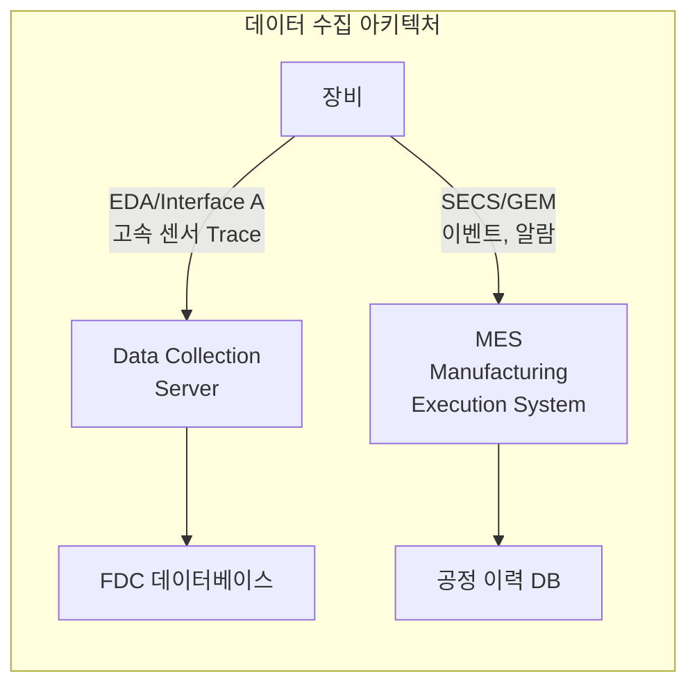
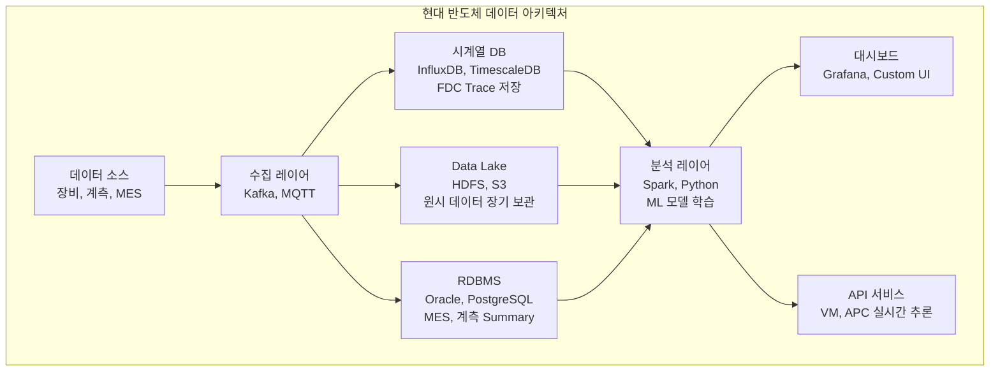

# 3.8 데이터 인프라 — 반도체 빅데이터 시스템

## 이 챕터에서 배우는 것
- 반도체 팹의 데이터 생성 규모와 종류
- 데이터 수집 표준 — SECS/GEM, EDA(Interface A)
- 데이터 저장 아키텍처 — 시계열 DB, 데이터 레이크
- 데이터 통합의 도전 — 이기종 데이터 매칭
- 반도체 데이터 파이프라인 설계
- SMILE 플랫폼의 데이터 아키텍처 고려사항

---

## 반도체 팹: 세계에서 가장 데이터 집약적인 공장


Part 3의 앞 일곱 챕터에서 수율, 결함, SPC, FDC, APC, VM, 웨이퍼맵 — 반도체 공정 제어와 분석의 핵심 기술들을 다뤘다. 이 기술들은 모두 하나의 공통 전제 위에 서 있다 — **데이터가 있어야 한다**는 것이다. 이 챕터에서는 그 데이터가 어디서 오고, 어떻게 흐르며, 어디에 저장되고, 왜 합치기 어려운지를 다룬다.

현대 반도체 팹은 세계에서 가장 데이터 집약적인 제조 환경 중 하나다. 하나의 대형 팹에서 생성되는 데이터의 규모를 보자.

| 데이터 소스 | 일일 규모 (대형 팹 기준) |
|:---|:---|
| 장비 센서 (FDC Trace) | **수십 TB** |
| 결함 검사 (이미지 포함) | 수 TB |
| 계측 데이터 (CD, OVL 등) | 수십 GB |
| 공정 이력 (MES) | 수 GB |
| 전기적 테스트 결과 | 수 GB |
| **합계** | **일당 약 50~100 TB** |

월간으로 환산하면 **페타바이트(PB)** 급이다. 3.4장에서 FDC 데이터가 팹 최대 데이터 소스라고 했는데, 이 표에서도 센서 Trace 데이터가 압도적이다. 이 방대한 데이터를 수집, 저장, 조회, 분석하는 **데이터 인프라**가 AI 적용의 기초 체력이다. 인프라가 없으면, 아무리 정교한 ML 모델도 학습할 데이터를 구할 수 없다.

---

## 데이터 수집 표준: 장비와 어떻게 대화하는가

### SECS/GEM — 30년의 업계 표준

반도체 장비와 호스트 시스템(MES) 간 통신의 표준 프로토콜이 **SECS/GEM**이다. SEMI(반도체 장비 및 재료 국제 협회)가 정의한 이 표준은 1980년대부터 사용되어, 장비 제조사가 다르더라도 동일한 프로토콜로 통신할 수 있게 한다.

**SECS-I/HSMS**가 물리적/논리적 통신 레이어를, **SECS-II**가 메시지 형식을, **GEM(Generic Equipment Model)**이 장비의 표준 동작 모델(상태 머신, 이벤트, 알람 등)을 정의한다. 장비가 호스트에게 공정 시작/종료 이벤트, 알람 발생, 레시피 파라미터, 센서 데이터 Summary 등을 보고한다.

여러분에게 익숙한 비유로 — SECS/GEM은 장비 세계의 **REST API + Event Webhook**이다. 장비가 이벤트 발생 시 호스트에 Webhook을 보내고(공정 시작/끝), 호스트가 장비에 명령을 보낸다(레시피 전송, 공정 시작). 표준화되어 있어 장비 제조사가 달라도 동일한 인터페이스로 통합할 수 있다.

### EDA / Interface A — 고속 스트리밍의 시대

SECS/GEM은 **이벤트 기반** — 공정 시작/끝 시점에 Summary 데이터를 보고한다. 하지만 3.4장에서 배웠듯이, Summary에는 없고 Trace에만 있는 순간적 이상(Transient)이 중요하다. 이 Trace 데이터를 실시간으로 수집하기 위해 **EDA(Equipment Data Acquisition)** 또는 **Interface A** 표준이 등장했다.



SECS/GEM이 REST API + Webhook이라면, EDA는 **WebSocket / gRPC 스트리밍**이다. 연결을 유지한 채 공정 중 고속으로 센서 데이터를 연속 전송한다. EDA의 도입으로 Trace 데이터의 실시간 수집이 가능해졌고, 이것이 3.4장의 FDC와 3.6장의 VM을 가능하게 만든 기반 인프라다.

---

## 반도체 팹의 주요 데이터 시스템: 네 개의 기둥

### MES (Manufacturing Execution System) — 팹의 중추 신경계

**MES**는 팹의 모든 물리적 흐름을 관리하는 중추 시스템이다. 어느 웨이퍼가 어느 장비에서 어떤 공정을 거쳤는지 추적하는 **로트 추적(Lot Tracking)**, 각 공정의 설정값을 관리하는 **레시피 관리**, 다음에 어느 장비로 보낼지 결정하는 **디스패칭(Dispatching)**, 이상 로트의 정지/해제를 수행하는 **Hold/Release** 기능을 담당한다.

MES가 없으면 팹은 작동할 수 없다. 수천 개의 로트가 수백 대의 장비를 거쳐 수백 단계의 공정을 순서대로 진행하는데, 이 복잡한 물류를 관리하는 것이 MES다. 소프트웨어 세계의 **Kubernetes 스케줄러**(워크로드를 노드에 배치하고 상태를 추적)에 해당한다.

### FDC 시스템 — 장비 센서의 뇌

3.4장에서 깊이 다룬 FDC의 데이터를 수집, 저장, 분석하는 전문 시스템이다. Summary와 Trace 데이터의 대용량 저장, 실시간 이상 탐지(한계 검사, PCA), 챔버 간 성능 비교(Chamber Matching)를 수행한다. BISTel, PDF Solutions, Onto Innovation 등이 대표적이다.

### YMS (Yield Management System) — 수율의 컨트롤 타워

3.1장의 수율 분석과 3.7장의 웨이퍼맵 분석을 수행하는 전문 시스템이다. 웨이퍼맵의 수집/저장/시각화, 결함 데이터 관리, 수율 추이 모니터링, Pareto 분석, Root Cause 분석 도구를 제공한다. KLA의 KLARITY, PDF Solutions의 Exensio가 대표적이다.

### SPC 시스템 — 관리도의 엔진

3.3장의 SPC를 구현하는 시스템으로, 관리 한계 설정/관리, OOC 알람 발생, WECO Rules 적용, Cp/Cpk 계산을 담당한다. 많은 경우 FDC나 YMS에 통합되어 있다.

---

## 데이터 통합의 도전: 왜 합치기가 이토록 어려운가

### 이기종 데이터 매칭의 현실


AI 모델을 만들려면 여러 시스템의 데이터를 **하나의 테이블로 합쳐야(Join)** 한다. 예를 들어 VM 모델(3.6장)을 학습하려면:

```
FDC 데이터 (장비 센서) + MES 데이터 (공정 이력) + 계측 데이터 (CD, OVL)
→ (Wafer_ID, 센서_피처들, 장비_이력, CD_실측값) 형태의 통합 테이블
```

매칭 키는 **Lot_ID, Wafer_ID, Equipment_ID, Timestamp**다. 단순해 보이지만, 현실의 매칭은 **반도체 AI 프로젝트에서 가장 시간을 많이 잡아먹는 작업**이다. 경험적으로, 데이터 과학자의 시간 중 60~80%가 데이터 수집과 정제에 소비된다는 통계가 반도체에서는 더욱 심하다.

다섯 가지 구조적 어려움이 있다.

**시간 동기화** — 장비마다 내부 시계가 미세하게 다를 수 있다. NTP(Network Time Protocol)로 동기화하더라도 수 초의 오차가 남을 수 있고, 이 오차가 웨이퍼 ID 매칭을 깨뜨릴 수 있다. 장비 A에서 웨이퍼를 처리한 시간과 계측 장비에서 측정한 시간이 수 초 차이나면, 자동 매칭이 실패하거나 잘못된 웨이퍼를 연결할 수 있다.

**ID 체계 불일치** — MES에서는 Lot ID를 "L123456"으로 표기하고, FDC 시스템에서는 "LOT-123456"으로 표기하며, 계측 시스템에서는 "123456"만 저장하는 식이다. 웨이퍼 번호도 1-기반(MES)인 장비와 0-기반(FDC)인 장비가 혼재한다.

**샘플링에 의한 데이터 누락** — 3.6장에서 전체 웨이퍼의 5~10%만 계측한다고 했다. 나머지 90%의 웨이퍼에는 FDC 데이터는 있지만 계측 데이터(타겟 변수)가 없다. VM을 학습하려면 FDC와 계측이 **모두** 있는 웨이퍼만 사용해야 하므로, 학습 데이터가 전체의 5~10%로 제한된다.

**공간 스케일 불일치** — FDC 데이터는 **웨이퍼 단위**(하나의 웨이퍼에 하나의 Trace), 계측 데이터는 **사이트 단위**(웨이퍼당 5~50개 측정 포인트), 결함 데이터는 **결함 단위**(X, Y 좌표), 테스트 데이터는 **다이 단위**다. 이 다른 공간 스케일의 데이터를 어떻게 매핑할 것인가?

**이력 추적의 복잡성** — 하나의 웨이퍼는 수십~수백 개의 공정 단계를 거치며, 각 단계에서 다른 장비를 사용한다. Cross-Layer APC(3.5장)나 이전 층 데이터를 VM 입력으로 사용하려면(3.6장), 이 **전체 이력(Process Genealogy)**을 연결해야 한다.

여러분이 마이크로서비스 아키텍처에서 **분산 트레이싱(Distributed Tracing, Jaeger/Zipkin)**으로 여러 서비스의 로그를 Trace ID로 연결하는 경험이 있다면, 반도체의 데이터 통합이 바로 그것의 물리적 제조 버전이다. 각 장비(서비스)가 독립적으로 로그(센서 데이터)를 남기고, 이것을 Lot/Wafer ID(Trace ID)로 연결한다.

---

## 데이터 저장 아키텍처: 하이브리드가 답이다


전통적으로 반도체 팹은 Oracle, SQL Server 등 **관계형 DB(RDBMS)**에 모든 데이터를 저장했다. 구조화된 쿼리에는 강하지만, 일당 수십 TB의 시계열 Trace 데이터를 저장하고 조회하는 데는 근본적으로 부적합하다.

현대 팹의 데이터 아키텍처는 **하이브리드**다 — 데이터의 특성에 맞는 여러 저장소를 결합한다.



**수집 레이어**에서 Kafka나 MQTT가 실시간 스트리밍을 담당한다. **시계열 DB**(InfluxDB, TimescaleDB)가 FDC Trace의 고속 쓰기와 시간 범위 조회를 담당한다. **Data Lake**(HDFS, S3, Parquet 포맷)가 원시 데이터의 장기 보관을 담당하고, **RDBMS**(PostgreSQL, Oracle)가 MES 메타데이터와 계측 Summary의 구조화된 저장/조회를 담당한다. **분석 레이어**에서 Spark나 Dask가 대규모 데이터 처리와 ML 학습을 수행하고, **서빙 레이어**에서 FastAPI나 TensorRT가 VM/APC 모델의 실시간 추론을 제공한다.

이 아키텍처는 여러분이 익숙한 **Modern Data Stack**(Kafka → Data Lake → Spark → 서빙)과 본질적으로 동일하다. 반도체의 특수성은 데이터의 **극단적 볼륨**(일당 수십 TB)과 **실시간 요구**(수 초 이내 추론)가 동시에 요구된다는 점이다.

---

## 데이터 거버넌스: 팹 데이터는 극도로 민감하다

반도체 데이터의 보안 요구는 일반 IT 기업과 차원이 다르다. **공정 레시피**는 수십 년간 수조 원을 투자하여 개발한 핵심 영업 비밀이다. **수율 데이터**는 경쟁력을 직접 나타내는 지표다. **고객 제품 데이터**는 엄격한 NDA(비밀유지계약) 대상이다.

따라서 역할 기반 접근 제어(RBAC), 데이터 마스킹(민감 정보 비식별화), 감사 로그(접근 기록)가 필수적이며, **On-Premise 배포**(팹 내부 서버에 설치, 데이터가 팹 밖으로 나가지 않음)가 기본이다. 클라우드 기반 분석이 일부 채택되고 있지만, 핵심 공정 데이터는 여전히 팹 내부에 머문다.

데이터 품질 관리도 중요하다. "Garbage In, Garbage Out" — 센서 고장이나 통신 오류로 인한 **결측값**, 장비 이상 시 발생하는 **이상값(Outlier)**, 장비 간 **타임스탬프 정합성**, ID 체계와 단위의 **메타데이터 일관성**이 지속적으로 관리되어야 한다. 데이터 품질이 나쁘면 아무리 정교한 모델도 쓸모없다.

---

## SMILE 플랫폼의 데이터 아키텍처 고려사항

SMILE이 파운드리 팹에 배포될 때 고려해야 할 핵심 사항을 정리한다.

**배포 모델** — 보안 최우선이므로 On-Premise 배포가 기본이다. 팹 내 서버에 설치하여 데이터가 팹 밖으로 나가지 않는다. 스캐너 근처에서 실시간 추론이 필요하면 Edge 배포(경량 추론 서버를 장비 근처에 배치)도 고려한다.

**데이터 수집 범위** — 스캐너 로그(Dose, Focus, 정렬, 레벨링), 트랙 로그(PEB 온도, 레지스트 두께, 현상 시간), 계측 데이터(CD, Overlay), 이전 층 이력(Cross-Layer)을 통합해야 한다. 이 네 소스의 데이터를 Wafer ID로 매칭하는 것이 SMILE 배포의 첫 번째 관문이다.

**실시간 파이프라인** — APC Feed-Forward에 VM 예측값을 사용하려면, 스캐너 EDA → Kafka → SMILE 엔진 → 보정값 → 스캐너 APC의 파이프라인이 **수 초 이내**에 완료되어야 한다. 이 레이턴시 요구가 아키텍처의 핵심 제약이다.

**모델 라이프사이클** — 새 제품/레시피 도입 시 모델 재학습, PM 후 모델 파라미터 조정, 점진적 학습(Incremental Learning) 지원이 필요하다. MLOps 파이프라인(학습 → 검증 → 배포 → 모니터링 → 재학습)이 자동화되어야 현장 운영이 지속 가능하다.

---

## 핵심 정리

현대 반도체 팹은 일당 약 **50~100TB**, 월간 PB급의 데이터를 생성하며, FDC Trace가 최대 데이터 소스다. 장비 통신 표준 **SECS/GEM**(이벤트 기반)과 **EDA/Interface A**(스트리밍)가 데이터 수집의 두 축이며, **MES**(공정 관리), **FDC**(센서 감시), **YMS**(수율 분석), **SPC**(관리도)의 네 시스템이 팹 데이터의 기둥이다. **데이터 통합**이 AI 프로젝트의 최대 병목이며, 시간 동기화, ID 불일치, 샘플링 누락, 공간 스케일 불일치, 이력 추적의 다섯 가지 어려움이 있다. 현대 아키텍처는 **Kafka + 시계열DB + Data Lake + Spark의 하이브리드**이며, SMILE 배포 시 On-Premise 배포, 수 초 이내 실시간 파이프라인, 자동화된 모델 라이프사이클이 핵심 요구사항이다.

---

*다음 챕터: 3.9 반도체 데이터의 특성 — 시계열, 공간, 계층 구조*
