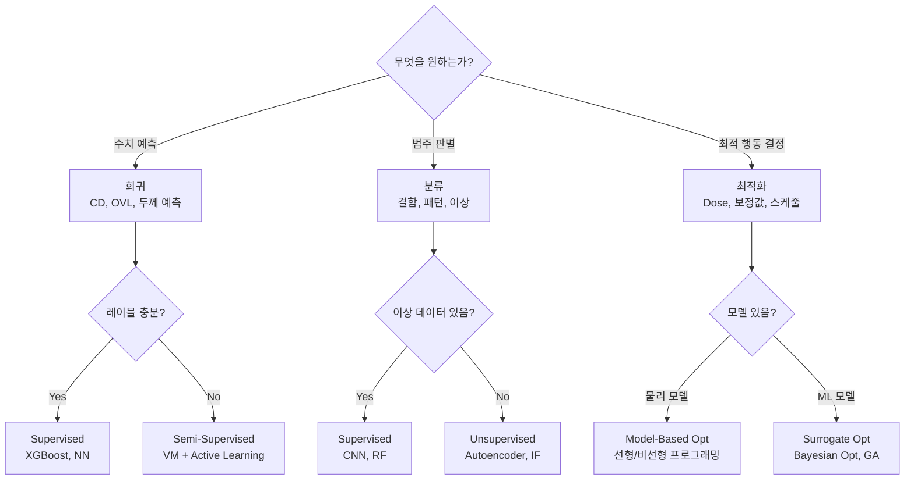

# 4.1 반도체 AI의 문제 정의 — 회귀, 분류, 최적화

## 이 챕터에서 배우는 것
- 반도체 공정에서 AI가 풀어야 할 문제의 유형
- 회귀(Regression) 문제 — CD 예측, Overlay 예측, VM
- 분류(Classification) 문제 — 결함 분류, 웨이퍼맵, 이상 탐지
- 최적화(Optimization) 문제 — APC, 레시피 최적화, 스케줄링
- 문제 정의가 성패를 결정하는 이유
- 반도체 AI 프로젝트의 실패 패턴과 성공 패턴

---

## Part 4에 진입한다: 기술에서 실전으로

Part 1에서 반도체 공정의 전체 흐름을, Part 2에서 포토리소그래피의 심화 기술을, Part 3에서 수율과 공정 제어의 체계를 배웠다. 이제 Part 4에서는 이 모든 지식을 기반으로 **실제로 AI 모델을 만들고, 검증하고, 배포하는 방법**을 다룬다.

그 출발점은 **문제 정의(Problem Definition)**다. 반도체 AI 프로젝트의 가장 흔한 실패 원인은 모델이 나빠서가 아니라 **문제를 잘못 정의해서**다.

"AI로 수율을 높여라" — 이것은 문제가 아니라 **소원(Wish)**이다. 소원은 ML 파이프라인에 넣을 수 없다. 실행 가능한 문제로 번역해야 한다.

```
❌ "수율을 높여라"
✅ "식각 장비 센서 데이터(FDC Summary)로 식각 후 CD를 ±0.5nm 이내로 예측하라"
```

좋은 문제 정의에는 네 가지 요소가 있다. 어떤 데이터를 사용하는지 **입력(X)**이 명확해야 하고, 무엇을 예측/분류/최적화하는지 **출력(Y)**이 명확해야 하며, 성공을 어떻게 측정하는지 **평가 기준(Metric)**이 명확해야 하고, 예측 결과로 무엇을 하는지 **행동(Action)**과 연결되어야 한다.

이 네 요소 중 하나라도 모호하면 프로젝트는 방향을 잃는다. 특히 **행동과의 연결**이 누락되는 경우가 많다 — "CD를 잘 예측하는 모델을 만들었다!"고 해도, 그 예측으로 **무엇을 할 것인지**(APC에 넣을 것인가? 이상 알람을 울릴 것인가? 레시피를 바꿀 것인가?)가 정의되지 않으면 비즈니스 가치가 0이다.

---

## 회귀(Regression): 반도체 AI의 가장 보편적인 문제

**연속적인 수치를 예측**하는 문제다. Part 3에서 다룬 VM(3.6장), APC(3.5장)의 핵심이 모두 회귀 문제다.

### 반도체의 대표적 회귀 문제

| 문제         | 입력 (X)             | 출력 (Y)            | 평가 기준        | 행동 연결       |
| :--------- | :----------------- | :---------------- | :----------- | :---------- |
| CD 예측 (VM) | FDC Summary, 메타데이터 | CD (nm)           | RMSE < 0.5nm | APC Dose 보정 |
| Overlay 예측 | 정렬 데이터, 이전 층 OVL   | OVL_x, OVL_y (nm) | 3σ 감소율       | 스캐너 보정값     |
| 막 두께 예측    | 증착 장비 센서           | 두께 (Å)            | MAPE < 1%    | 증착 레시피 조정   |
| 수율 예측      | 인라인 계측 전체          | 수율 (%)            | R² > 0.7     | 고위험 로트 Hold |

### 회귀에서 놓치기 쉬운 미묘함


**타겟 정의의 모호성** — "CD를 예측하라"고 했을 때, 웨이퍼 평균 CD인가? 필드별 CD인가? 사이트별 CD인가? 답에 따라 입력 피처, 모델 구조, 평가 기준이 완전히 달라진다. 더 나아가, 평균 CD와 CD의 3σ(균일도)는 둘 다 중요하지만 서로 다른 문제다. 평균이 목표에 정확해도 균일도가 나쁘면(3σ가 크면) 수율이 떨어진다. 이 둘을 동시에 예측/최적화하려면 Multi-Task Learning이 필요하다.

**오차의 비대칭성** — CD가 목표보다 1nm **큰** 것과 1nm **작은** 것의 영향이 다를 수 있다. 예를 들어 게이트 CD가 작으면 트랜지스터 누설 전류가 증가하여 전력 소모가 커지고, 크면 스위칭 속도가 느려진다. 어느 쪽이 더 치명적인지에 따라, 대칭 손실(MSE)이 아닌 **비대칭 손실 함수**가 필요할 수 있다. 이것은 비즈니스 맥락을 이해해야 설계할 수 있는 부분이다.

**다중 출력(Multi-Output)** — CD와 Overlay를 동시에 예측/최적화할 때, Dose를 올리면 CD는 목표에 가까워지지만 다른 파라미터에 영향을 줄 수 있다. 이런 트레이드오프는 Multi-Objective Optimization으로 접근하여 **Pareto Front** — 하나를 개선하면 다른 하나가 악화되는 최적 경계선 — 에서 엔지니어가 최종 결정을 한다.

---

## 분류(Classification): 범주를 판별한다

**범주형 레이블을 예측**하는 문제다. 3.2장의 ADC(결함 분류), 3.7장의 웨이퍼맵 패턴 분류가 대표적이다.

### 반도체의 대표적 분류 문제

| 문제 | 입력 (X) | 출력 (Y) | 평가 기준 |
|:---|:---|:---|:---|
| 결함 분류 (ADC) | SEM 이미지 | 결함 유형 (10~50개 클래스) | F1-Score > 0.95 |
| 웨이퍼맵 패턴 | Bin Map 이미지 | 패턴 유형 (8개 클래스) | Accuracy > 95% |
| 장비 이상 탐지 | FDC Trace | 정상/이상 (이진) | Recall > 99% |
| Killer 결함 판별 | 결함 위치/크기/유형 | Killer/Non-Killer | AUC > 0.9 |

### 분류에서 반드시 이해해야 할 것

**클래스 불균형의 심각성** — 장비 이상 탐지에서 이상은 전체의 약 1%다. 정상만 예측해도("모든 웨이퍼는 정상이다!") 정확도 99%가 나온다. 이 99%는 **완전히 무의미**하다 — 이상을 하나도 잡지 못하기 때문이다. **Accuracy를 절대 사용하지 않는다.** Precision-Recall 커브, F1-Score, AUPRC가 올바른 평가 기준이다.

**비용 비대칭(Cost-Sensitive)** — False Negative(불량 웨이퍼를 정상으로 판정하여 고객에게 출하)는 **치명적**이다. 고객 클레임, 리콜, 신뢰 상실로 이어진다. False Positive(정상 웨이퍼를 불량으로 판정하여 폐기)는 비용이 들지만 FN보다는 낫다. 따라서 **Recall(재현율)을 우선**하되 False Positive Rate을 관리 가능한 수준으로 유지하는 것이 실전 전략이다.

이것은 의료 진단과 같은 구조다 — 암이 있는데 없다고 하면(FN) 치명적이고, 없는데 있다고 하면(FP) 불필요한 추가 검사 비용이 들지만 목숨에는 지장이 없다. 반도체의 "암"이 Killer Defect이다.

**이상 탐지의 접근법** — 이상 데이터에 레이블이 충분하면 Supervised Classification(CNN, RF)으로, 레이블이 없으면 Unsupervised Anomaly Detection(Autoencoder, Isolation Forest)으로 접근한다. 실무에서는 **대부분 레이블이 부족**하므로 Semi-Supervised — 정상 데이터만으로 "정상의 경계"를 학습하고, 경계 밖을 이상으로 판단 — 가 가장 현실적이다.

---

## 최적화(Optimization): 예측을 넘어 처방으로

**최적의 행동(Action)을 결정**하는 문제다. 예측(Prediction)이 "무엇이 일어날 것인가?"에 답한다면, 최적화는 "**무엇을 해야 하는가?**"에 답한다. 3.5장의 APC가 대표적인 최적화 문제다.

### 반도체의 대표적 최적화 문제

| 문제 | 결정 변수 | 목적 함수 | 제약 조건 |
|:---|:---|:---|:---|
| Dose 최적화 | 필드별 Dose | CD 오차 최소화 | Dose 범위, 처리량 |
| Overlay 보정 | 보정 파라미터 (T, R, M, ...) | Overlay 잔차 최소화 | 스캐너 보정 범위 |
| PM 스케줄링 | PM 시점 | 가동률 최대화 | 수율 하한 제약 |
| 디스패칭 | 로트-장비 배정 | 사이클 타임 최소화 | 장비 가용성, 우선순위 |

### 예측 → 최적화 파이프라인

최적화는 보통 **예측 모델 위에** 구축된다.

```
1단계 (예측): 입력 X → 모델 → 출력 Ŷ(Action)
2단계 (최적화): argmin_Action ||Ŷ(Action) - Target||²  s.t. 제약조건
```

먼저 "Action(Dose, 보정값 등)을 바꾸면 결과(CD, Overlay)가 어떻게 변하는가?"를 예측하는 모델이 있어야 하고, 그 모델 위에서 "결과가 목표에 가장 가까워지는 Action은 무엇인가?"를 탐색하는 최적화 레이어를 올린다. **예측 모델의 정확도가 최적화 품질의 상한**을 결정하므로, 예측이 부정확하면 아무리 정교한 최적화 알고리즘을 써도 결과가 나쁘다.

**안전 제약(Safety Constraints)**이 최적화에서 절대 빠지면 안 된다. 3.5장에서 강조했듯이, 최적화 결과가 물리적으로 불가능하거나 위험한 범위에 빠지면 대규모 불량이 발생한다. **하드 제약**(절대 넘지 못하는 범위 — Dose의 물리적 한계)과 **소프트 제약**(넘으면 페널티 — 선호 범위)을 구분하여 적용한다.

---

## 시계열 예측: 미래를 보는 문제

회귀의 특수한 형태이지만, 반도체에서 충분히 중요하므로 별도로 다룬다. 3.3장의 SPC 추세 모니터링, 3.4장의 Predictive Maintenance, 3.5장의 APC Drift 추적이 모두 시계열 예측 문제다.

장비 Drift 예측(수 시간~수 일 범위), PM 시점 예측(수 일~수 주), 소재 교체 시점 예측(수 일), 생산량 수요 예측(수 주~수 개월) 등이 대표적이다. 3.9장에서 다룬 **비정상성(Non-Stationarity)**이 반도체 시계열 예측의 핵심 도전이며, 적응형 모델과 Change Point Detection이 필수적이다.

---

## 문제 유형 선택 가이드



---

## 반도체 AI 프로젝트의 실패 패턴과 성공 패턴

### 실패하는 프로젝트의 공통점

**"만능 모델" 추구** — "하나의 모델로 모든 제품, 모든 장비를 커버하겠다"는 접근이다. 제품마다 패턴이 다르고, 장비마다 센서 구성이 다르고, 공정 조건이 다른 현실에서, 만능 모델은 **모든 곳에서 평범한** 모델이 된다. 좁고 구체적인 문제(특정 제품 × 특정 장비 × 특정 레이어)에서 시작하여 점진적으로 확장하는 것이 현실적이다.

**오프라인에서만 검증** — "테스트 데이터에서 R²=0.95!" 하지만 이 테스트 데이터가 학습 데이터와 같은 시기, 같은 조건에서 수집되었다면, 시간에 따른 Drift나 새 조건에서의 성능 저하를 전혀 반영하지 못한다. **시간 기반 분할(Temporal Split)** — 학습: 1~3월, 테스트: 4월 — 이 필수적이다.

**행동과 연결 안 됨** — 예측 모델만 만들고, 그 예측으로 누가 무엇을 하는지가 정의되지 않은 경우. 모델이 아무리 정확해도 **사용되지 않으면** 가치가 0이다.

**엔지니어 신뢰 부재** — 블랙박스 모델이 "Dose를 3% 올려라"고 추천하는데, **왜** 3%인지 설명할 수 없으면 현장 엔지니어는 신뢰하지 않고 사용하지 않는다. 이것이 3.9장에서 "해석 가능성 우선"을 강조한 이유다.

### 성공하는 프로젝트의 공통점

좁고 구체적인 문제에서 시작한다. 수율 몇 %, 계측 시간 몇 % 감소 같은 **명확한 비즈니스 메트릭**을 설정한다. 예측→행동→결과의 **Closed Loop**를 구축한다. 해석 가능한 모델에 안전 가드를 장착한다. 그리고 무엇보다 — **현장 엔지니어와 긴밀하게 협업**한다. 모델을 만드는 것은 데이터 과학자의 일이지만, 그 모델이 현장에서 사용되게 만드는 것은 **엔지니어의 신뢰**가 결정한다.

---

## 핵심 정리

반도체 AI의 문제 유형은 크게 세 가지다. **회귀**(CD, Overlay, 막 두께 등 연속값 예측)가 가장 보편적이며 타겟 정의의 미묘함과 오차 비대칭성에 주의해야 한다. **분류**(결함, 패턴, 이상 판별)에서는 클래스 불균형과 비용 비대칭이 핵심이며 Accuracy 대신 F1/AUPRC를, Recall을 우선하되 FP를 관리한다. **최적화**(Dose, 보정값, 스케줄)는 예측 모델 위에 구축되며 안전 제약이 필수다. 좋은 문제 정의에는 **입력/출력/평가/행동**이 모두 명확해야 하며, 성공 패턴은 좁은 문제, 명확한 메트릭, Closed Loop, 해석성, 현장 협업이다.

---

*다음 챕터: 4.2 피처 엔지니어링 — 반도체 도메인 지식의 활용*
