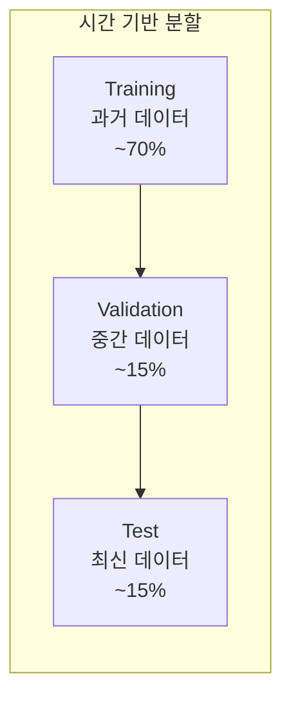
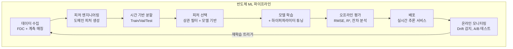

# 4.3 모델 학습과 검증 — 반도체 특화 전략

## 이 챕터에서 배우는 것
- 반도체 데이터에서 Train/Validation/Test 분할의 올바른 방법
- 시간 기반 분할(Time-Based Split)의 필수성
- 계층적 데이터의 Cross-Validation 전략
- 반도체 특유의 데이터 누수(Data Leakage) 함정
- 모델 성능 평가 — 오프라인 vs 온라인
- 하이퍼파라미터 튜닝 실전

---

## 랜덤 분할은 치명적이다: 반도체 ML의 가장 흔한 실수


이전 두 챕터에서 문제를 정의하고(4.1), 피처를 설계했다(4.2). 이제 모델을 학습하고 검증할 차례다. 여기서 반도체 AI의 **가장 흔하고 가장 치명적인 실수**가 발생한다 — **랜덤 분할(Random Split)**.

일반적인 ML 튜토리얼에서는 데이터를 랜덤으로 셔플한 후 80/20으로 Train/Test를 나눈다. 이미지 분류나 NLP에서는 이것이 적절하다 — 고양이 사진의 시간 순서는 중요하지 않으니까. 하지만 반도체 데이터에서 이렇게 하면 **심각한 데이터 누수(Data Leakage)**가 발생한다.

```
시간 순서: 로트1 → 로트2 → 로트3 → 로트4 → 로트5 → 로트6

랜덤 분할 (❌):
  Train: 로트1, 로트3, 로트5
  Test:  로트2, 로트4, 로트6
  → 로트3(미래)의 데이터로 학습한 모델이 로트2(과거)를 예측
  → 미래 정보가 과거 예측에 누수!

시간 기반 분할 (✅):
  Train: 로트1 ~ 로트4 (과거)
  Test:  로트5 ~ 로트6 (미래)
  → 항상 과거로 학습하고 미래를 예측
```

왜 이것이 문제인가? 반도체 공정에는 **시간적 상관(Temporal Correlation)**이 강하게 존재한다. 같은 시간대에 가공된 웨이퍼들은 같은 장비 상태, 같은 소재 배치, 같은 환경 조건을 공유한다. 로트3과 로트2가 같은 시간대라면, 로트3의 정보로 로트2를 예측하는 것은 **답을 미리 본 것**과 같다.

누수가 만드는 환상은 파괴적이다. 랜덤 분할에서 R² = 0.95가 나와 "모델이 훌륭하다!"고 판단하여 배포하면, 실전(항상 미래를 예측해야 하는)에서 R² = 0.70으로 급락한다. **0.25의 갭**이 기대와 현실의 차이가 되어, 프로젝트 신뢰가 무너진다.

---

## 시간 기반 분할: 올바른 방법

### 기본 구조



**Training**은 가장 오래된 데이터(예: 1월~3월)로 모델 파라미터를 학습한다. **Validation**은 Training 직후 기간(4월)으로 하이퍼파라미터 튜닝과 Early Stopping에 사용한다. **Test**는 가장 최신 데이터(5월)로 최종 성능을 평가하며, 튜닝에 절대 사용하지 않고 **한 번만** 사용한다. Test 성능으로 튜닝을 반복하면 Test에도 오버피팅되어 진짜 미래 성능을 과대평가한다.

### Expanding Window vs Sliding Window


모델을 주기적으로 재학습할 때, 학습 데이터의 범위를 어떻게 설정하느냐에 두 가지 접근이 있다.

**Expanding Window(확장형)**는 학습 데이터를 점점 늘려간다 — 1회차: 1~3월, 2회차: 1~4월, 3회차: 1~5월... 과거의 모든 데이터를 활용하므로 데이터 양이 풍부하지만, 오래된 데이터가 현재 공정과 달라지면(PM, 레시피 변경 후) 오히려 모델을 오염시킨다.

**Sliding Window(이동형)**는 최근 N일(또는 N로트)만 사용한다 — 1회차: 1~3월, 2회차: 2~4월, 3회차: 3~5월... 유효하지 않은 오래된 데이터를 자연스럽게 버리지만, 데이터 양이 제한된다.

반도체에서는 **Sliding Window를 권장**한다. 3.9장에서 비정상성(Non-Stationarity)이 근본 문제라고 했는데, 오래된 데이터가 현재의 "정상"을 반영하지 못하면 오히려 해가 된다. 실무에서 **최근 2~4주**의 데이터가 적절한 윈도우인 경우가 많다.

---

## 계층적 Cross-Validation: 그룹을 존중한다

### Group K-Fold

3.9장에서 반도체 데이터의 계층 구조(로트 → 웨이퍼)를 배웠다. 같은 로트의 웨이퍼들은 같은 장비, 같은 조건을 공유하므로 서로 매우 유사하다. 같은 로트의 웨이퍼가 Train과 Test에 **동시에** 들어가면, 모델이 로트의 고유 특성을 암기하여 같은 로트의 다른 웨이퍼를 쉽게 맞춘다 — 이것은 누수다.

```
❌ 일반 K-Fold:
  Train: 로트A-웨이퍼1,3,5 + 로트B-웨이퍼2,4
  Test:  로트A-웨이퍼2,4 + 로트B-웨이퍼1,3,5
  → 같은 로트의 웨이퍼가 양쪽에! 누수!

✅ Group K-Fold (그룹=로트):
  Train: 로트A 전체 + 로트B 전체
  Test:  로트C 전체 + 로트D 전체
  → 로트 단위로 완전 분리
```

sklearn의 `GroupKFold(groups=lot_id)`로 간단히 구현할 수 있다.

### Time-Series Group K-Fold

시간 순서와 그룹 분리를 **동시에** 적용하는 가장 엄격한 방법이다.

```
Fold 1: Train = 로트1~3,  Test = 로트4
Fold 2: Train = 로트1~4,  Test = 로트5
Fold 3: Train = 로트1~5,  Test = 로트6
```

각 Fold에서 Test는 항상 Train보다 **미래**이고, 로트 단위로 완전 분리된다. 이것이 반도체 데이터에서 가장 신뢰할 수 있는 Cross-Validation 전략이다.

---

## 반도체 데이터 누수의 세 가지 함정

### 함정 1: 장비 ID 누수

같은 장비에서 가공된 웨이퍼가 Train과 Test에 모두 포함되면, 모델이 **장비 고유 특성(장비 A는 CD가 0.3nm 높다)**을 암기한다. 학습/테스트 데이터에 포함된 장비에서는 잘 맞지만, **새로운 장비**에서 성능이 급락한다. 대응 — 장비별 성능을 별도로 평가하고, 필요시 장비를 Leave-One-Out으로 분리한다.

### 함정 2: 계측 샘플링 편향

3.6장에서 전체 웨이퍼의 5~10%만 계측한다고 했다. 여기서 **어떤 웨이퍼가** 계측되는지가 랜덤이 아닐 수 있다. 이상이 의심되는 웨이퍼를 추가 계측하면 이상 데이터가 과대 표현되고, 특정 제품만 계측 빈도가 높으면 제품 편향이 발생한다. 학습 데이터가 양산 전체를 대표하지 않으면 모델도 편향된다. 대응 — 샘플링 방법을 파악하고, 편향이 있으면 Inverse Probability Weighting 등으로 보정한다.

### 함정 3: 타겟 누수 (Target Leakage)

피처에 타겟(Y) 정보가 **간접적으로** 포함되는 경우다. "후속 공정의 CD"를 피처로 사용하면 현재 CD 정보가 이미 반영되어 있고, "최종 Bin 코드"를 피처로 사용하면 예측하려는 수율 정보가 이미 포함되어 있다. 근본 원칙 — **시간적으로 타겟보다 앞서 존재하는 데이터만** 피처로 사용한다. "이 피처는 예측 시점에 실제로 사용 가능한가?"를 항상 질문한다.

---

## 모델 성능 평가: 오프라인과 온라인은 다른 세계다

### 오프라인 평가 메트릭

**회귀 문제**에서는 RMSE(절대 오차), MAE(이상값에 로버스트), R²(설명력), MAPE(상대 오차율)를 사용한다. 반도체에서는 RMSE의 **절대값**이 특히 중요하다 — "R²=0.85"보다 "RMSE=0.3nm"가 엔지니어에게 의미 있다. 0.3nm가 공정 규격 대비 충분한지가 실전적 판단 기준이기 때문이다.

**분류 문제**에서는 Precision(알람 시 실제 이상 비율), Recall(실제 이상 중 탐지 비율), F1-Score(Precision-Recall 조화평균), AUC-ROC(임계값 독립적 종합 성능)를 사용한다. 4.1장에서 강조했듯이, **Accuracy는 불균형 데이터에서 무의미**하므로 사용하지 않는다.

### 온라인 평가: 배포 후의 현실

오프라인에서 아무리 좋은 성능이어도, 배포 후에는 모니터링이 필수다. 핵심 모니터링 대상은 세 가지다.

**예측 오차 추이** — 시간에 따라 오차가 증가하면 3.6장에서 다룬 모델 열화(Model Degradation)가 진행 중이다. 오차가 임계값을 넘으면 재학습을 트리거한다.

**잔차 분포** — 잔차가 정규분포에서 벗어나면(편향, 비대칭, 이분산) 모델의 가정이 위반된 것이다. 특히 잔차에 시간적 패턴이 남아 있으면 모델이 Drift를 충분히 추적하지 못하고 있다는 뜻이다.

**비즈니스 메트릭** — 궁극적으로 수율 변화, 계측 절감량, APC 보정 효율 등 **비즈니스 영향**으로 평가한다. RMSE가 0.1nm 개선되어도 수율이 변하지 않으면 비즈니스 가치가 없다.

### A/B 테스트: 새 모델 도입의 안전한 방법

새 모델을 도입할 때 전체에 즉시 적용하는 것은 위험하다. 기존 모델/방법을 **A 그룹**(Control), 새 모델을 **B 그룹**(Treatment)으로 설정하고, 동일 기간 동일 조건에서 운영하여 성능을 통계적으로 비교한 후 전면 전환한다. 3.5장에서 APC의 A/B 테스트를 언급했는데, 모든 반도체 AI 모델의 배포에 동일한 원칙이 적용된다.

---

## 하이퍼파라미터 튜닝: 실전 접근

### 모델별 핵심 하이퍼파라미터

| 모델 | 핵심 파라미터 | 튜닝 전략 |
|:---|:---|:---|
| XGBoost | max_depth, learning_rate, n_estimators, reg_alpha/lambda | Optuna + Time-Based CV |
| Random Forest | n_estimators, max_depth, min_samples_leaf | Grid Search |
| Neural Network | 레이어 수/크기, lr, dropout, batch_size | Optuna + Early Stopping |
| PLS | n_components | CV로 최적 컴포넌트 수 |

핵심 원칙 — **반드시 Time-Based CV로 평가**한다. 랜덤 CV로 튜닝하면, 누수된 성능에 최적화된(= 실전에서 나쁜) 하이퍼파라미터가 선택된다. Optuna의 Bayesian Optimization과 Time-Series Group K-Fold를 결합하는 것이 가장 권장되는 접근이다.

---

## 전체 파이프라인



이 파이프라인의 마지막 화살표 — 모니터링에서 재학습으로의 피드백 루프 — 가 가장 중요하다. 반도체 공정은 끊임없이 변하므로, 모델도 끊임없이 적응해야 한다. 한 번 배포하고 방치하는 모델은 수 주 내에 열화한다.

---

## 핵심 정리

반도체 ML에서 **시간 기반 분할(Time-Based Split)은 필수**이며, 랜덤 분할은 데이터 누수로 인해 오프라인 성능을 비현실적으로 높여 실전에서의 급락을 초래한다. **Group K-Fold**로 로트/장비 단위 그룹을 분리하고, **Time-Series Group K-Fold**로 시간 순서와 그룹 분리를 동시에 적용한다. **데이터 누수의 세 가지 함정**(장비 ID 암기, 계측 샘플링 편향, 타겟 누수)에 주의하며, "이 피처는 예측 시점에 실제로 사용 가능한가?"를 항상 확인한다. 오프라인 성능과 온라인 성능은 **다른 세계**이므로 배포 후 모니터링(오차 추이, 잔차 분포, 비즈니스 메트릭)이 필수이며, 새 모델 도입은 **A/B 테스트**로 안전하게 진행한다.

---

*다음 챕터: 4.4 모델 해석과 신뢰 — SHAP, 물리 정합성*
