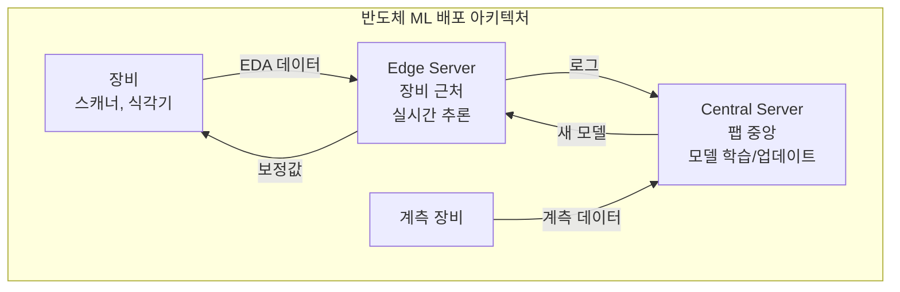
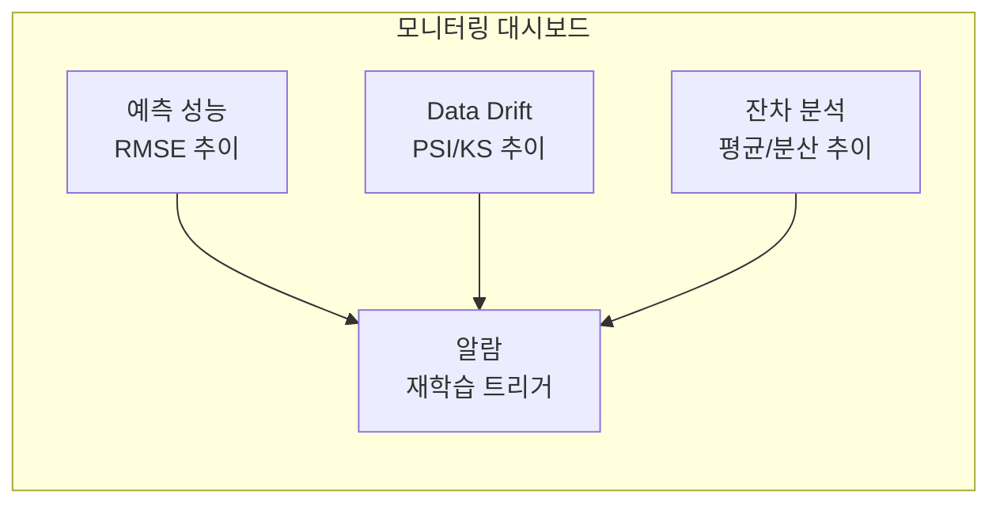

# 4.5 MLOps — 반도체 AI의 배포와 운영

## 이 챕터에서 배우는 것
- MLOps의 개념과 반도체에서의 중요성
- 모델 배포 아키텍처 — On-Premise, Edge
- 모델 모니터링 — Drift 감지, 성능 추적
- 모델 재학습 전략 — 언제, 어떻게 재학습하는가
- 모델 버전 관리와 롤백
- 반도체 MLOps의 특수 요구사항

---

## MLOps란: 모델을 만드는 것은 시작에 불과하다

이전 세 챕터에서 문제를 정의하고(4.1), 피처를 설계하고(4.2), 모델을 학습·검증하고(4.3), 해석과 신뢰를 확보했다(4.4). 모델이 완성되었다. 이제 배포하면 끝인가?

아니다. **배포는 시작**이다.

반도체 공정은 끊임없이 변한다 — PM, 부품 교체, 소재 변경, 새 제품 도입, 계절 변동. 한 번 배포한 모델은 **수 주 내에 열화**한다(3.6장의 Model Degradation). 모델을 개발하고 배포하는 것보다, 배포 후 **운영하고 적응시키는 것**이 더 어렵고 더 중요하다.

**MLOps(Machine Learning Operations)**는 ML 모델의 **개발 → 배포 → 운영 → 재학습**의 전체 생명주기를 관리하는 실천 방법이다. 여러분에게 익숙한 비유를 들자면, MLOps는 소프트웨어의 **DevOps/CI-CD**에 해당한다. 코드처럼 모델도 버전 관리, 자동 테스트, 배포 파이프라인, 프로덕션 모니터링이 필요하다. 차이점은 — 코드는 배포 후 변하지 않지만, 모델은 배포 후 **데이터가 변하면 성능이 변한다**는 것이다.

반도체에서 MLOps가 특히 중요한 이유는 네 가지다. 공정이 끊임없이 변하므로 모델도 끊임없이 **적응**해야 하고, VM/APC는 수 초 내에 예측해야 하는 **실시간 요구**가 있으며, 잘못된 예측이 수천만 달러의 불량을 유발하는 **안전성** 문제가 있고, 자동차/항공 반도체는 모델 변경 이력 추적이 필요한 **규제** 환경에 놓여 있다.

---

## 모델 배포 아키텍처: 팹은 클라우드가 아니다

### 팹 환경의 근본적 제약

3.8장에서 팹 데이터가 극도로 민감하다고 했다. 이것이 배포 아키텍처를 결정한다. 팹 네트워크는 외부 인터넷에서 **완전히 차단**되어 있으므로, AWS/GCP/Azure 같은 퍼블릭 클라우드는 사용할 수 없다. 모든 인프라가 팹 내부에 위치하는 **On-Premise가 필수**다.

### Edge + Central 2계층 아키텍처



**Edge 레이어** — 장비 근처에 배치된 서버에서 실시간 추론(VM 예측, APC 보정값 계산)을 수행한다. 레이턴시 요구가 1초 미만이므로, 네트워크 홉을 최소화하기 위해 장비에 가까이 배치한다. 경량화된 모델(ONNX Runtime, TensorRT)을 사용하여 CPU만으로도 밀리초 단위 추론이 가능하다.

**Central 레이어** — 팹 데이터센터의 GPU 클러스터에서 모델 학습, 재학습, 모니터링을 수행한다. FDC와 계측 데이터를 통합하여 모델을 학습하고, 학습된 모델을 Edge로 배포한다. 재학습은 수 시간~수 일 단위이므로 레이턴시 요구가 느슨하다.

이 2계층 구조는 **추론은 빠르게(Edge), 학습은 강력하게(Central)**의 분리 원칙이며, CDN(Content Delivery Network)에서 엣지 서버가 사용자에 가까이 컨텐츠를 서빙하고 원본 서버가 컨텐츠를 관리하는 구조와 같다.

---

## 모델 모니터링: 배포 순간부터 열화가 시작된다

### Data Drift — 입력 분포가 변한다


입력 데이터의 통계적 분포가 학습 시와 **달라지는** 현상이다. PM 후 센서 값의 범위가 변하거나, 새 레지스트 로트가 투입되면 레지스트 두께의 분포가 시프트하거나, 여름 → 겨울 전환으로 클린룸 온습도가 변한다.

탐지 방법 — **PSI(Population Stability Index)**는 학습 데이터와 최근 데이터의 분포 차이를 정량화하며, PSI > 0.2이면 유의미한 변화로 판단한다. **KS Test(Kolmogorov-Smirnov)**는 두 분포가 같은지를 통계적으로 검정한다. 각 피처의 **평균/분산 추이 차트**를 SPC 관리도처럼 모니터링하는 것도 효과적이다.

### Concept Drift — 입출력 관계가 변한다

Data Drift보다 위험한 것은 **Concept Drift** — 입력-출력 관계 **자체**가 변하는 것이다. 장비 부품을 교체하면 같은 Dose에서도 다른 CD가 나올 수 있고, 레시피가 미세 조정되면 Dose-CD 관계의 기울기가 변할 수 있다. 입력 데이터의 분포는 변하지 않았는데 예측이 틀려지는 경우가 Concept Drift다.

탐지 방법 — **예측 잔차(Residual)의 평균/분산 추이**를 모니터링한다. 잔차의 평균이 0에서 벗어나면 모델에 **편향(Bias)**이 발생한 것이고, 분산이 커지면 모델의 **정밀도**가 떨어진 것이다. **슬라이딩 윈도우 RMSE** — 최근 N개 예측의 RMSE를 실시간으로 추적 — 가 가장 직관적이다.



---

## 모델 재학습: 언제, 어떻게

### 재학습 트리거 — 네 가지 유형

**성능 기반** — 온라인 RMSE가 임계값을 초과하면 즉시 재학습한다. 가장 직접적인 트리거다.

**Drift 기반** — PSI가 0.2를 초과하는 등 입력 분포의 유의미한 변화가 감지되면 재학습을 검토한다. 아직 성능이 떨어지지 않았지만 곧 떨어질 것이라는 선행 지표다.

**이벤트 기반** — PM, 부품 교체, 새 제품 도입 등 공정 변화 이벤트가 발생하면 예정된 재학습을 수행한다. MES에서 PM 이벤트를 받아 자동으로 트리거할 수 있다.

**주기 기반** — 매주 또는 매월 정기적으로 재학습한다. 가장 단순하지만, 불필요한 재학습(변화가 없을 때)과 늦은 재학습(변화가 빨리 왔을 때)의 위험이 있다.

### 재학습 방법 — 세 가지 접근

**Full Retrain(전체 재학습)** — 최근 N주 데이터로 모델을 처음부터 재학습한다. 하이퍼파라미터도 재튜닝한다. 가장 안전하고 깨끗하지만 수 시간~수 일이 소요된다. **기본 권장 방법**이다.

**Incremental Update(점진적 업데이트)** — 새 데이터만으로 기존 모델을 미세 조정(Fine-Tuning)한다. 빠르지만, 오래된 데이터의 패턴이 점차 희석되거나, 반대로 새 데이터에 과적합될 위험이 있다.

**Warm Start** — 이전 모델의 파라미터를 초기값으로 사용하여 전체 데이터(최근 N주)로 학습한다. Full Retrain의 안전성과 Incremental의 속도를 절충한다.

### 재학습 파이프라인의 안전 장치

재학습된 모델을 즉시 프로덕션에 배포하면 위험하다. 반드시 다음 순서를 따른다.

```
새 데이터 축적 → 재학습 트리거 감지 →
새 모델 학습 → 오프라인 검증 (성능 + 물리 정합성) →
Shadow 테스트 (병렬 실행, 실 적용 없이 비교) →
성능 확인 OK → 모델 교체
성능 확인 NG → 롤백, 원인 분석
```

4.4장의 물리 정합성 검증이 재학습 후에도 반복되어야 한다 — 재학습된 모델이 Dose↑→CD↓ 관계를 여전히 올바르게 반영하는지 확인한다.

---

## 모델 버전 관리와 롤백

### Model Registry


모든 모델의 버전, 성능, 학습 데이터 기간, 파라미터를 체계적으로 관리한다.

```
Model: CD_Prediction_Scanner_A
├── v1.0 (2026-01-15): R²=0.82, Train=Jan W1-2
├── v1.1 (2026-01-29): R²=0.85, Train=Jan W1-4
├── v2.0 (2026-02-12): R²=0.88, Train=Jan W3 - Feb W2
│   └── 현재 Production ✅
└── v2.1 (2026-02-14): R²=0.87, Train=Feb W1-2
    └── Staging (검증 중)
```

Git이 코드의 버전을 관리하듯, Model Registry가 모델의 버전을 관리한다. MLflow가 가장 널리 사용되는 도구이며, DVC(Data Version Control)로 학습 데이터의 버전도 함께 관리하면 "어떤 데이터로 학습한 어떤 모델이 어떤 성능을 냈는지"를 완벽히 추적할 수 있다.

### 롤백의 원칙

새 모델의 실전 성능이 기대에 못 미치면 **이전 버전으로 즉시 복귀**한다. 이 롤백은 **수 분 이내**에 완료되어야 한다. 롤백이 불가능한 배포는 **금지**된다 — 이전 모델을 항상 보관하고, 한 번의 명령으로 되돌릴 수 있어야 한다. Kubernetes의 Rolling Update와 Rollback, 또는 Blue-Green Deployment와 같은 개념이다.

---

## 반도체 MLOps의 특수 요구사항

### 멀티 모델 관리의 스케일

팹에는 수십~수백 개의 ML 모델이 동시에 운영된다. 장비 10대 × 공정 5종 × 제품 3종 = **150개** 모델이 각각 다른 학습 주기, 다른 성능 상태, 다른 재학습 필요성을 갖는다. 150개 모델을 개별적으로 관리하는 것은 불가능하므로, 모델 상태를 한눈에 보는 대시보드, 자동 재학습 트리거, 일괄 배포 등 **대규모 모델 관리 시스템**이 필수적이다.

### Safety Guard — 자동화의 안전장치

3.5장에서 강조한 Safety Guard가 MLOps에서 구현된다.

```python
if abs(correction) > Safety_Limit:
    correction = clamp(correction, -Limit, +Limit)
    alert("보정값 클램핑 발생")

if model_confidence < Threshold:  # RI(3.6장) 활용
    use_default_recipe()  # EWMA 등 기존 방식으로 Fallback
    alert("모델 신뢰도 낮음, 기본 레시피 사용")
```

### Audit Trail — 규제 요구

자동차, 항공우주, 의료 반도체는 **어떤 모델의 어떤 버전이 어떤 웨이퍼에 적용되었는지** 완벽한 추적이 필요하다(IATF 16949 등). 문제 발생 시 원인 모델을 역추적하고, 해당 모델이 적용된 모든 웨이퍼를 식별할 수 있어야 한다.

---

## 핵심 정리

MLOps는 ML 모델의 **개발→배포→운영→재학습** 전체 생명주기를 관리하며, 반도체에서는 공정의 지속적 변화, 실시간 요구, 안전성, 규제 때문에 특히 중요하다. 팹의 보안 제약으로 **On-Premise 배포가 필수**이며, **Edge(실시간 추론) + Central(학습)의 2계층** 구조를 따른다. 배포 즉시 **Data Drift**(PSI/KS)와 **Concept Drift**(잔차 추세) 모니터링을 시작하며, 재학습은 성능/Drift/이벤트/주기 기반으로 트리거하되 **Full Retrain이 가장 안전**하다. **Model Registry**로 전 버전을 추적하고 수 분 내 **롤백이 항상 가능**해야 하며, **Safety Guard**(보정값 클램핑, 신뢰도 기반 Fallback)가 자동화의 안전장치다.

---

*다음 챕터: 4.6 딥러닝 in 반도체 — CNN, LSTM, Transformer 적용 사례*
