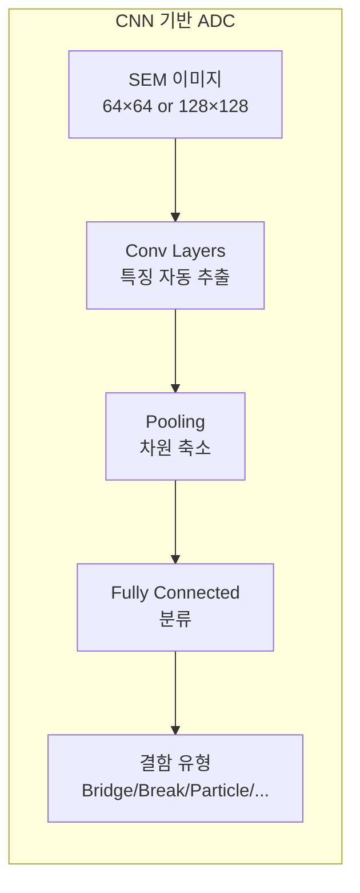

# 4.6 딥러닝 in 반도체 — CNN, LSTM, Transformer 적용 사례

## 이 챕터에서 배우는 것
- 반도체 공정에서 딥러닝이 효과적인 영역
- CNN — 이미지/웨이퍼맵/Trace 분석
- LSTM/GRU — 시계열 FDC 데이터 분석
- Transformer — 긴 시퀀스와 Cross-Attention
- GAN/VAE — 데이터 증강과 생성
- 딥러닝 vs 전통 ML — 언제 딥러닝을 쓸 것인가

---

## 딥러닝이 빛나는 영역과 빛나지 않는 영역

4.4장에서 "XGBoost + SHAP이 실전 최강"이라고 했다. 그렇다면 딥러닝은 반도체에서 불필요한가? 아니다 — 딥러닝이 **확실히 우위**인 영역이 존재하며, 그 영역을 정확히 아는 것이 중요하다.

딥러닝이 빛나는 영역은 명확하다. **이미지 데이터** — SEM 결함 이미지, 웨이퍼맵 패턴에 CNN. **원시 Trace** — 수만 포인트의 시계열 신호에 1D-CNN/LSTM. **대규모 비정형 데이터** — 피처 엔지니어링 없이 End-to-End로 학습. **희귀 데이터 증강** — GAN/VAE로 부족한 이상 데이터를 생성.

반면 전통 ML이 **여전히 강한** 영역도 명확하다. Summary 피처 기반의 정형 데이터(XGBoost가 더 빠르고 해석 가능), 데이터가 적은 신규 공정/제품(딥러닝은 데이터가 부족하면 오버피팅), 해석이 필수인 APC 보정(SHAP으로 물리 정합성 검증).

핵심 원칙 — **전통 ML로 시작하고, 딥러닝이 명확한 우위를 보일 때만 도입한다.** 딥러닝의 복잡성 증가(학습 시간, 하이퍼파라미터, 해석 어려움)를 정당화할 만큼의 성능 향상이 있을 때만 가치가 있다.

---

## CNN: 반도체 딥러닝의 가장 성공적인 사례

### SEM 이미지 결함 분류 (ADC)


3.2장에서 ADC의 진화를 Rule-Based → 전통 ML → CNN으로 다뤘다. CNN 기반 ADC는 반도체 딥러닝에서 **가장 성숙하고 가장 널리 배포된** 사례다.



성능의 도약은 극적이다 — Rule-Based의 약 80%에서 전통 ML+수동 피처의 약 88%를 거쳐 **CNN의 약 96%**에 이르렀다. 특히 형태가 유사한 결함(Bridge vs. Residue)의 구분에서 CNN이 인간 전문가와 동등하거나 우수한 성능을 보인다. 실전에서는 **ResNet-18/34**가 가장 보편적이다 — SEM 이미지가 64×64 또는 128×128 정도로 작아서 깊은 네트워크가 불필요하고, 오히려 오버피팅 위험이 있다.

### 웨이퍼맵 패턴 분류

3.7장에서 상세히 다뤘다. Bin Map을 정사각형 그리드 이미지로 변환하여 CNN에 입력하면, WM-811K 벤치마크에서 **약 97% 정확도**를 달성한다. CNN이 Edge의 곡률, Ring의 반경, Cluster의 밀도 같은 공간적 특징을 자동으로 학습하므로 수동 피처 설계가 불필요하다.

### 1D-CNN for Trace

FDC Trace를 **1D 이미지**로 취급하는 창의적인 접근이다.

```
입력: Trace 시계열 (시간 × 센서 수) → 2D 행렬
      예: 600 time steps × 50 sensors = 600×50 행렬

1D-CNN: 시간축 방향으로 Convolution
        → 국부적 패턴(스파이크, 변곡점, 과도 응답) 자동 추출
```

4.2장에서 Summary 피처를 수동으로 설계하는 것이 피처 엔지니어링의 핵심이라고 했는데, 1D-CNN은 이 과정을 **End-to-End로 대체**한다. 수동 설계에서 놓치는 미묘한 Trace 형상 — 두 센서 간의 시간 지연, 순간적 이상(Transient)의 형태 — 을 CNN이 자동으로 포착한다. 다만 4.2장의 도메인 피처(Focus², PM 이후 시간 등)의 정보는 Trace에 포함되지 않으므로, 1D-CNN + 도메인 피처의 **앙상블**이 실전에서 최적인 경우가 많다.

### OPC/ILT 가속: cuLitho의 혁신

2.7장의 계산 리소그래피에서 CNN이 시뮬레이션을 가속한다. 마스크 패턴(이미지)을 입력으로, 웨이퍼 전사 패턴(이미지)을 출력으로 하는 Pixel-to-Pixel 변환에 **U-Net** 아키텍처가 효과적이다. NVIDIA의 **cuLitho**는 GPU + CNN으로 OPC 계산을 **40배 가속**한 대표적 사례로, 기존에 수 시간 걸리던 풀칩 OPC를 수 분으로 단축하여 EUV 시대의 계산 병목을 해소하고 있다.

---

## LSTM/GRU: 시간의 흐름을 학습한다

### 왜 RNN 계열인가

CNN이 **공간적/국부적 패턴**에 강하다면, LSTM(Long Short-Term Memory)과 GRU(Gated Recurrent Unit)는 **시간적 의존성**에 강하다. 공정 초기 상태가 후반부 결과에 영향을 미치거나, 센서 간 시간 지연(Lag) 효과가 있거나, 수백 스텝 이전의 상태가 현재에 영향을 미치는 장기 의존성이 존재할 때 LSTM/GRU가 효과적이다.

### Predictive Maintenance

3.4장에서 다룬 장비 상태 예측에 LSTM이 활용된다. 최근 100 웨이퍼의 센서 Summary 시퀀스를 입력으로, 다음 PM까지 예상 웨이퍼 수(회귀) 또는 PM 필요 여부(분류)를 출력한다. LSTM이 센서값의 **점진적 변화 추세**(챔버 벽면의 오염 축적, RF Generator의 출력 저하)를 학습하여, 단순 추세 외삽보다 정확한 예측이 가능하다.

### 동적 APC

3.5장의 EWMA 기반 APC를 LSTM으로 대체하는 접근이다. 최근 N 웨이퍼의 (센서 데이터, 계측 결과) 시퀀스를 입력으로, 다음 웨이퍼의 최적 보정값을 출력한다. EWMA는 **선형 Drift**만 추적하지만, LSTM은 **비선형 Drift**(PM 직후의 급격한 변화 후 서서히 안정화되는 패턴)도 학습할 수 있다.

GRU는 LSTM보다 파라미터가 적고 학습이 빠르면서 성능은 비슷한 경우가 많아, 실전에서 선호되기도 한다.

---

## Transformer: 모든 위치 간 관계를 직접 학습한다

### 반도체에서의 Transformer

NLP에서 혁명을 일으킨 Transformer의 **Self-Attention** 메커니즘은 시퀀스 내 **모든 위치 간 관계**를 직접 학습한다. LSTM이 시퀀스를 순서대로 처리하며 먼 위치의 정보가 희석되는 한계(장기 의존성 문제)를 근본적으로 해결한다.

### Cross-Layer Attention

여러 공정 층(Layer)의 데이터를 시퀀스로 배열하여 Transformer에 입력하면, **Cross-Attention**이 어떤 이전 층이 현재 층의 CD/Overlay에 가장 큰 영향을 미치는지를 자동으로 학습한다. 3.5장의 Cross-Layer APC와 3.9장의 계층 구조를 Transformer가 데이터 드리븐으로 모델링하는 것이다. Attention Weight를 시각화하면 "Layer 3의 Overlay가 Layer 7의 CD에 큰 영향"이라는 해석이 가능하여, 4.4장의 해석성 요구에도 부분적으로 부응한다.

### 긴 Trace 분석

수천 타임스텝의 긴 Trace에서 LSTM은 장기 의존성을 놓칠 수 있지만, Transformer의 Self-Attention은 Trace의 **아무 위치 간**에도 직접 관계를 학습한다 — 공정 초기(안정화 구간)와 후기(엔드포인트 구간)의 관계, 여러 센서 간의 시간 지연 관계 등.

### 데이터 양에 대한 주의

Transformer는 Self-Attention의 파라미터가 많아 **대량의 데이터**가 필요하다. 장비 1대에서 수 개월간 축적된 수만 웨이퍼 규모면 충분할 수 있지만, 새 제품/장비에서 수백 웨이퍼밖에 없다면 오버피팅 위험이 높다. 이때는 전통 ML이나 LSTM이 더 안전한 선택이다.

---

## GAN/VAE: 없는 데이터를 만든다

### 희귀 데이터 부족 문제

4.1장에서 클래스 불균형을 다뤘다. 결함 SEM 이미지의 희귀 유형은 수십 장에 불과하고, 이상 웨이퍼맵의 Scratch나 Zone 패턴은 매우 드물며, 장비 고장 데이터는 수집 자체가 어렵다. 데이터가 적으면 분류기가 희귀 클래스를 학습하지 못한다.

### GAN으로 희귀 데이터 증강


**GAN(Generative Adversarial Network)**의 Generator가 실제와 유사한 희귀 결함 이미지를 생성하여 학습 데이터를 증강한다. **Conditional GAN(cGAN)**을 사용하면 "Bridge 결함 이미지를 10장 생성"처럼 특정 유형을 지정하여 생성할 수 있다.

### VAE로 이상 탐지와 증강

**VAE(Variational Autoencoder)**는 잠재 공간(Latent Space)에서 데이터를 생성하며, GAN보다 학습이 안정적이다. 잠재 공간에서 보간하여 중간 상태의 데이터를 생성할 수 있고, 복원 오차(Reconstruction Error)를 이상 점수로 활용하는 **이상 탐지**에도 효과적이다 — 3.4장의 Autoencoder 기반 FDC 이상 탐지와 같은 원리다.

### 생성 데이터의 품질 검증

생성된 데이터를 무조건 신뢰하면 위험하다. 생성 이미지가 **물리적으로 타당한지**(실제로 존재할 수 있는 결함 형태인지) 도메인 전문가가 확인해야 하고, 생성 데이터로 학습한 모델이 **실제 데이터에서도 동작하는지** 반드시 실제 테스트 데이터로 검증해야 한다. 생성 데이터의 비율이 너무 높으면 모델이 생성 데이터의 아티팩트를 학습하는 **편향**이 발생할 수 있으므로, 실제:생성 비율을 1:1~1:3 정도로 제한하는 것이 경험적 가이드다.

---

## 딥러닝 vs 전통 ML: 언제 딥러닝을 쓸 것인가


| 기준 | 전통 ML (XGBoost) | 딥러닝 (CNN/LSTM/Transformer) |
|:---|:---|:---|
| **데이터 형태** | 정형 (Summary 피처) | 비정형 (이미지, Trace) |
| **데이터 양** | 수백~수천 | 수천~수만+ |
| **해석 필요** | ✅ SHAP으로 완전 해석 | △ Attention/Grad-CAM으로 부분 해석 |
| **학습 시간** | 분~시간 | 시간~일 |
| **추론 속도** | 매우 빠름 | 빠름 (ONNX/TensorRT 최적화 시) |
| **피처 엔지니어링** | 필요 (도메인 지식 투입) | 불필요 (End-to-End) |
| **성능 상한** | 높음 | **더 높음** (데이터 충분 시) |

실전 권장 전략은 명확하다. XGBoost + 도메인 피처로 **베이스라인을 먼저 확립**한다. 그 다음 딥러닝이 필요한 영역(이미지 분류, 긴 Trace, OPC 가속)을 식별하여 딥러닝 모델을 개발하고, 베이스라인과 성능을 비교한다. 복잡성 증가(학습 시간, 운영 부담, 해석 어려움) 대비 성능 향상이 **충분히 클 때만** 딥러닝을 배포한다.

---

## 핵심 정리

딥러닝은 반도체의 **특정 영역**에서 확실한 우위를 보인다. **CNN**은 SEM 이미지 결함 분류(~96%), 웨이퍼맵 패턴(~97%), 1D-Trace 분석, OPC 가속(cuLitho 40배)에서 성공적이며, **LSTM/GRU**는 Predictive Maintenance와 동적 APC의 시계열 의존성 학습에 효과적이다. **Transformer**는 Cross-Layer Attention, 긴 Trace 분석, 이상 탐지에서 강점을 보이지만 데이터 양이 충분해야 한다. **GAN/VAE**는 희귀 데이터 증강에 유용하되 생성 데이터의 품질 검증이 필수다. 핵심 원칙은 **전통 ML로 시작하고, 딥러닝이 명확한 우위를 보일 때만 도입**하는 것이다.

---

*다음 챕터: 4.7 전이 학습과 도메인 적응 — 공정/장비 간 모델 이식*
