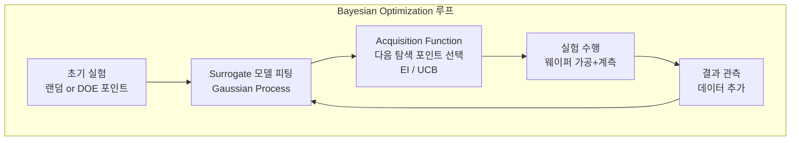

# 4.8 강화 학습과 최적화 — 스마트 레시피 탐색

## 이 챕터에서 배우는 것
- 반도체 공정 최적화의 전통적 방법과 한계
- Bayesian Optimization — 적은 실험으로 최적 조건 탐색
- 강화 학습(RL)의 반도체 적용 — APC의 궁극적 형태
- Multi-Objective Optimization — CD와 Overlay 동시 최적화
- 안전한 탐색(Safe Exploration) — 실험 비용이 큰 환경에서의 제약
- 실전 적용 사례와 한계

---

## 전통적 공정 최적화: DOE의 한계

지금까지 다룬 ML 기법들 — 회귀, 분류, 시계열 — 은 모두 **예측(Prediction)**이 핵심이었다. 이 챕터에서는 한 단계 더 나아가 **최적화(Optimization)**를 다룬다. 4.1장에서 "예측이 '무엇이 일어날 것인가?'에 답한다면, 최적화는 '**무엇을 해야 하는가?**'에 답한다"고 했다.

반도체 공정 최적화의 전통적 방법은 **DOE(Design of Experiments, 실험 계획법)**이다. 핵심 변수(Dose, Focus, PEB 온도, 식각 시간 등)를 선정하고, 각 변수의 수준(Low/Center/High)을 설정한 뒤, 실험 매트릭스에 따라 웨이퍼를 가공하고 결과를 분석하여 최적 조건을 결정한다. 수십 년간 검증된 방법이며, 통계적으로 견고하다.

하지만 DOE에는 근본적 한계가 있다. 실험 웨이퍼 1장이 수만 달러이므로 30개 실험에 수십만 달러가 소요되는 **비용** 문제. 웨이퍼 가공부터 계측까지 수 일~수 주가 걸리는 **시간** 문제. 변수 10개에 각 3수준이면 3¹⁰ = 59,049 조합으로 전수 실험이 불가능한 **차원의 저주**. 그리고 한 번 최적화하면 끝이어서 공정 변동에 실시간 적응이 불가능한 **정적** 특성.

AI 기반 최적화는 이 한계를 극복한다 — 적은 실험으로 더 좋은 해를 찾고, 실시간으로 적응한다.

---

## Bayesian Optimization: 적은 실험으로 최적을 찾는다

### 핵심 아이디어

**Bayesian Optimization(BO)**은 두 가지 핵심 구성 요소로 작동한다. **Surrogate Model(대리 모델)**이 목적 함수(예: Dose→CD 관계)를 소수의 데이터로 근사하고, **Acquisition Function**이 "다음에 어디를 실험해야 가장 정보를 많이 얻을 수 있는가?"를 결정한다.



이 루프가 **반복될 때마다** Surrogate의 근사가 정교해지고, 최적 조건에 점점 수렴한다.

### Surrogate Model: Gaussian Process

**Gaussian Process(GP)**가 가장 보편적인 Surrogate이다. GP의 핵심 강점은 예측값뿐 아니라 **불확실성(Uncertainty)**도 제공한다는 것이다. "이 Dose에서 CD는 약 20nm이고, 불확실성은 ±0.3nm" vs "이 Dose에서 CD는 약 20nm이고, 불확실성은 ±3nm" — 후자는 데이터가 없어서 잘 모른다는 뜻이다. 이 불확실성 정보가 Acquisition Function의 핵심 입력이 된다.

### Acquisition Function: 탐색과 활용의 균형


다음 실험 위치를 결정하는 전략이며, **탐색(Exploration)**과 **활용(Exploitation)**의 균형이 핵심이다. **탐색**은 불확실성이 높은 영역(잘 모르는 곳)을 실험하는 것이고, **활용**은 현재까지 최적인 영역 근처를 더 자세히 실험하는 것이다.

**EI(Expected Improvement)** — 현재 최적값 대비 개선 기대량을 최대화한다. 탐색과 활용의 균형이 자연스럽게 잡혀 가장 널리 사용된다. **UCB(Upper Confidence Bound)** — 예측값 + β×불확실성을 최대화한다. β를 조절하여 탐색-활용 비율을 직접 제어할 수 있다.

### 반도체 적용: 레시피 최적화

Dose(20~30 mJ/cm²), Focus(-50~50nm), PEB(95~105°C) 등 3개 변수의 최적 조합을 찾는 문제라면, 초기 10개 DOE 실험으로 Surrogate를 피팅한 후 BO로 20~30회 추가 실험하면 최적 조건을 도출할 수 있다. 기존 DOE에서 50~100회 필요하던 것을 **실험 횟수 50% 이상 절감**하면서 더 좋은 최적점을 찾는 경우가 많다.

---

## 강화 학습: APC의 궁극적 형태

### RL이 반도체에 적합한 이유

3.5장에서 APC가 웨이퍼마다 보정값을 결정하는 **순차적 의사결정**이라고 했다. 강화 학습(RL)은 정확히 이 구조의 문제를 풀기 위해 설계된 프레임워크다.

```
상태(s₁) → 행동(a₁: Dose 보정) → 결과(r₁: CD 오차) →
상태(s₂) → 행동(a₂: Dose 보정) → 결과(r₂: CD 오차) → ...
```

매 웨이퍼/로트마다 현재 상태(장비 센서, 이전 CD/OVL, PM 이후 시간)를 **관찰**하고, 보정값(Dose 오프셋, Focus 오프셋)을 **행동으로 선택**하고, CD/Overlay 오차를 **보상으로 받는** 루프다.

### RL vs EWMA APC

| 특성 | EWMA APC | RL APC |
|:---|:---|:---|
| 모델 | 단변량 선형 | 다변량 비선형 |
| 적응성 | λ 고정 (수동 튜닝) | 자동 적응 |
| 장기 계획 | 없음 (한 스텝만 보정) | 있음 (미래 영향 고려) |
| 다목적 | 어려움 | 자연스러움 (보상 함수 설계) |
| 안전성 | 높음 (단순) | 주의 필요 (복잡) |
| 해석성 | 높음 | 낮음 |

RL의 가장 큰 장점은 **장기 계획(Long-Term Planning)**이다. EWMA는 "지금 이 웨이퍼의 CD 오차를 줄이자"만 보지만, RL은 "지금 약간 손해 보더라도(탐색) 미래에 더 좋은 보정 전략을 발견하자"는 트레이드오프를 다룰 수 있다.

### 실전의 네 가지 어려움

RL이 이론적으로 완벽해 보이지만, 반도체 현장에 직접 적용하기 어려운 이유가 있다.

**탐색 비용** — RL은 시행착오로 학습하는데, 반도체에서 시행착오는 불량 웨이퍼 = 수만 달러 손실이다. 게임에서 캐릭터가 죽는 것과는 차원이 다르다.

**시뮬레이터 부재** — 게임/로봇 RL은 시뮬레이터에서 수백만 번 시행착오를 반복한 후 실전에 배포한다. 반도체 공정의 정확한 시뮬레이터는 존재하지 않는다.

**느린 피드백** — 보정값을 적용하고 결과(계측)를 확인하기까지 수 시간~수 일이 걸린다. 게임 RL이 초당 수천 스텝을 경험하는 것과 비교하면 극도로 느리다.

**안전 제약** — "어떤 행동이든 시도해 보자"가 아니라, 안전 범위 내에서만 탐색해야 한다.

### 현실적 접근: Offline RL + Surrogate Simulator

이 어려움을 우회하는 현실적 전략이 있다. 과거 APC 데이터(상태, 행동, 결과)로 **Surrogate 시뮬레이터**를 구축한다 — 4.2장의 피처 엔지니어링과 4.3장의 모델 학습을 적용하여 "이 상태에서 이 보정을 적용하면 결과가 어떨까?"를 예측하는 모델이다. 이 시뮬레이터 위에서 RL을 학습하여 실제 웨이퍼 소모 없이 정책을 개발한다. 학습된 정책을 **Safety Guard**(4.5장)와 함께 실전에 배포하고, 실전 데이터로 시뮬레이터와 정책을 점진적으로 업데이트한다.

---

## Multi-Objective Optimization: 트레이드오프를 다룬다

### 반도체의 다목적 최적화

현실의 공정 최적화에서는 **하나의 목적만 최적화하면 다른 목적이 나빠지는** 트레이드오프가 빈번하다. 4.1장에서 Multi-Output 문제를 언급했는데, 여기서 구체적으로 다룬다.

Dose를 높이면 CD는 목표에 가까워지지만 처리량(Throughput)이 감소한다. Overlay 보정을 강화하면 Overlay는 줄지만 CD 변동이 커질 수 있다. Focus를 특정 패턴에 최적화하면 다른 패턴이 악화될 수 있다.

### Pareto Front: 최적의 경계선


두 목적이 상충할 때, **어느 한쪽을 악화시키지 않고는 다른 쪽을 개선할 수 없는 해의 집합**이 Pareto Front(파레토 전선)이다.

```
CD 오차 ↑
   |  ·
   |    ·  ← Pareto Front
   |      ·    (이 선 위의 해는 모두 "최적")
   |        ·
   |──────────── OVL 오차 →
```

Pareto Front 위의 해 중 **어느 것을 선택할지**는 알고리즘이 아니라 **비즈니스/엔지니어링 판단**이다. CD가 더 중요한 제품이면 CD 쪽 해를, Overlay가 더 중요한 레이어이면 Overlay 쪽 해를 선택한다. AI의 역할은 Pareto Front를 찾는 것이고, 그 위에서의 **최종 선택은 인간**의 몫이다.

### 다목적 Bayesian Optimization

**EHVI(Expected Hypervolume Improvement)** — Pareto Front의 "면적(Hypervolume)"을 최대화하는 다음 실험 포인트를 선택하는 기법으로, 단일 목적 EI를 다목적으로 자연스럽게 확장한다. BoTorch(PyTorch 기반) 라이브러리에서 지원하며, 반도체의 레시피 최적화에 적합하다.

---

## Safe Exploration: 실험은 비싸다

### 안전 탐색의 네 가지 방법


공정 최적화에서 "탐색"은 새로운 조건을 시도하는 것이다. 하지만 극단적 조건은 웨이퍼 전체를 불량으로 만들 수 있고, 규격을 벗어나면 고객 유출로 이어진다. **안전한 범위 내에서만 탐색**해야 한다.

**Hard Bounds** — 탐색 범위를 물리적/규격 한계로 제한한다(Dose ∈ [20, 30] mJ/cm², Focus ∈ [-30, 30] nm). 가장 단순하고 확실한 방법이다.

**Constrained Bayesian Optimization** — 목적 함수 외에 제약 함수(CD가 Spec 내인지)도 GP로 모델링하여, 제약 만족 확률이 높은 영역에서만 탐색한다.

**Safety Critic** — RL에서 별도의 안전 평가 네트워크가 제안된 행동의 위험도를 평가하여, 위험한 행동을 사전에 차단한다.

**점진적 확대** — 처음에 현재 조건 ±1% 범위에서 시작하여, 안전을 확인한 후 ±2%, ±5%로 점진적으로 탐색 범위를 넓힌다. 4.4장의 신뢰 구축 로드맵(Shadow → Full Auto)과 같은 철학이다.

---

## 실전 적용의 현재 위치

솔직하게 말하면, 강화 학습과 고급 최적화는 반도체 AI에서 아직 **연구 단계에 가깝다**. 현재 양산에서 실제로 사용되는 것은 대부분 EWMA 기반 APC와 Bayesian Optimization 기반 레시피 최적화 수준이다.

하지만 방향은 명확하다. Surrogate 시뮬레이터의 정확도가 향상되고, Offline RL의 이론이 성숙하며, Safety Guard 기법이 발전하면서, RL 기반 APC는 **점진적으로** 실전에 진입할 것이다. SMILE 플랫폼도 이 방향을 염두에 두고 설계되고 있다.

---

## 핵심 정리

반도체 공정 최적화에서 **Bayesian Optimization**은 GP + Acquisition Function으로 적은 실험에서 최적 조건을 탐색하며, DOE 대비 실험 횟수를 50% 이상 절감한다. **강화 학습**은 순차적 APC 의사결정의 궁극적 형태이지만, 탐색 비용·시뮬레이터 부재·느린 피드백·안전 제약으로 직접 적용이 어려우며, **Offline RL + Surrogate Simulator + Safety Guard**가 현실적 접근이다. **Multi-Objective Optimization**은 CD-Overlay 트레이드오프를 Pareto Front로 시각화하여 엔지니어가 비즈니스 판단으로 최종 해를 선택하게 한다. **Safe Exploration**(Hard Bounds, Constrained BO, Safety Critic, 점진적 확대)은 실험 비용이 큰 반도체 환경의 필수 요소다.

---

*다음 챕터: 4.9 LLM과 생성 AI — 반도체 산업의 새로운 도구*
