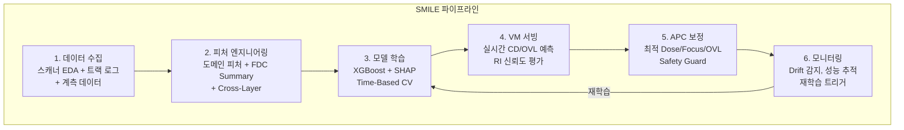
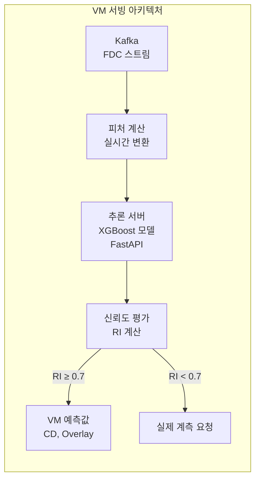

# 4.10 Part 4 종합 실습 — SMILE 파이프라인 설계

## 이 챕터에서 배우는 것
- Part 4에서 배운 AI/ML 기법을 SMILE 플랫폼에 통합하는 방법
- 리소그래피 AI 파이프라인의 End-to-End 설계
- 구체적 유스케이스: CD 예측 → 보정 → 모니터링
- 시스템 아키텍처 설계
- 팀 구성과 개발 로드맵
- Part 4 전체 복습

---

## SMILE 플랫폼: Part 1~4의 모든 것이 수렴하는 곳

**SMILE (Smart Metrology & Intelligent Lithography Engine)**은 SemiAI가 개발하는 포토리소그래피 AI 최적화 플랫폼이다. 이 책의 Part 1~4에서 배운 모든 지식이 이 플랫폼에 수렴한다.

Part 1의 반도체 공정 이해, Part 2의 리소그래피 심화 기술, Part 3의 수율과 공정 제어 체계, Part 4의 AI/ML 실전 기법 — 이것들이 **하나의 시스템**으로 통합될 때 비로소 "스캐너/트랙의 센서 데이터를 기반으로 CD와 Overlay를 예측하고, 실시간으로 공정을 보정하여 수율을 극대화한다"는 SMILE의 핵심 미션이 실현된다.

이 챕터에서는 Part 4의 10개 챕터를 **하나의 End-to-End 파이프라인**으로 엮어, 개별 기법이 실제 시스템에서 어떻게 조합되는지를 구체적으로 보여준다.

---

## End-to-End 파이프라인: 6단계



이 파이프라인의 마지막 화살표 — 모니터링에서 재학습으로의 피드백 루프 — 가 시스템을 **살아 있게** 만든다. 한 번 배포하고 방치하는 것이 아니라, 공정 변화에 끊임없이 적응하는 자율 시스템이다.

---

## 단계 1: 데이터 수집 — 3.8장의 구현

### 데이터 소스와 프로토콜

| 소스 | 데이터 | 프로토콜 |
|:---|:---|:---|
| 스캐너 (ASML 등) | Dose, Focus, 정렬, 레벨링, 렌즈 가열 | EDA/Interface A |
| 트랙 (TEL 등) | PEB 온도, 레지스트 두께, 현상 시간 | SECS/GEM |
| 계측 (KLA 등) | CD, Overlay | 계측 DB API |
| MES | 로트/웨이퍼 이력, 레시피, 장비 배정 | MES API |

3.8장에서 SECS/GEM을 REST API + Webhook에, EDA를 WebSocket에, MES를 Kubernetes 스케줄러에 비유했다. SMILE의 데이터 수집 레이어는 이 세 가지 프로토콜에서 데이터를 **실시간으로** 수집하여 Kafka에 적재한다.

### 데이터 매칭: 가장 어려운 부분

3.8장에서 "데이터 통합의 5가지 어려움"을 다뤘다. SMILE에서 가장 중요한 매칭은 **Lot_ID + Wafer_ID** 기반이다. 스캐너 FDC, 트랙 FDC, 계측 데이터를 이 키로 조인하되, 계측은 샘플링(5~10%)이므로 **left join**으로 처리하여 계측값이 없는 웨이퍼는 VM 타겟이 없는 것으로 표시한다.

---

## 단계 2: 피처 엔지니어링 — 4.2장의 구현

4.2장에서 설계한 네 가지 범주의 피처를 SMILE에 구체적으로 적용한다.

**스캐너 피처** — Dose 실측값, Focus 실측값, 정렬 잔차(X/Y), 렌즈 가열 보정값, 레벨링 기울기(X/Y), 스캔 속도, 슬릿 위치.

**트랙 피처** — PEB 온도 평균과 균일도, 레지스트 두께, 현상 시간, 코팅 회전수.

**도메인 파생 피처** — Dose × 레지스트_두께(총 흡수 에너지), Focus_오차²(디포커스 CD 영향의 2차 관계), PEB_온도 × PEB_시간(총 열 예산), PM_이후_웨이퍼_수(장비 상태), 이전_층_CD(Cross-Layer).

**공간 피처** — Field_X, Field_Y(필드 좌표), Wafer_Radius(중심 거리).

4.2장에서 "도메인 피처가 가장 가치가 높다"고 했는데, SMILE에서 Focus_오차²과 Dose × 레지스트_두께가 Feature Importance 상위 5에 항상 포함되는 것이 이를 증명한다.

---

## 단계 3: 모델 학습 — 4.3~4.4장의 구현

### 왜 XGBoost + SHAP인가

4.4장에서 "실전 최강: XGBoost + SHAP"이라고 결론 내렸다. SMILE이 이 조합을 선택한 이유는 명확하다. 정형 데이터(Summary 피처)에서 **최고 성능**. SHAP으로 **엔지니어 신뢰** 확보. 학습/추론이 빨라 **실시간 APC 호환**. **물리 정합성 검증**이 SHAP Dependence Plot으로 직관적.

### 학습과 검증의 원칙

4.3장의 원칙을 엄격히 따른다. **시간 기반 분할**(Time-Based Split) — 과거 3주 학습, 최근 1주 테스트. **Group K-Fold** — 로트 단위 분리. **데이터 누수 방지** — 예측 시점에 사용 가능한 데이터만 피처로 사용. **Optuna + Time-Based CV** — 하이퍼파라미터 튜닝.

### 물리 정합성 검증

4.4장의 체크리스트를 적용한다. SHAP Dependence Plot으로 Dose↑ → CD↓(포지티브 레지스트) 확인, Focus 오차와 CD의 2차 관계(포물선) 확인, PEB 온도↑ → CD↓ 확인, 이전 층 CD의 영향 방향 확인. 하나라도 물리와 불일치하면 모델을 배포하지 않는다.

---

## 단계 4: VM 서빙 — 3.6장 + 4.5장의 구현

### 실시간 예측 아키텍처



3.6장의 **Reliance Index(RI)**가 여기서 구현된다. 입력 데이터가 학습 데이터의 분포에서 얼마나 벗어났는지를 계산하여, RI가 0.7 이상이면 VM 예측을 신뢰하고 실제 계측을 생략하며, RI가 0.7 미만이면 "이 예측은 신뢰할 수 없다"고 판단하여 실제 계측을 요청한다. **계측 절감과 안전성의 균형**이다.

---

## 단계 5: APC 보정 — 3.5장 + 4.8장의 구현

### EWMA + VM 하이브리드

3.5장의 EWMA와 SMILE의 VM을 **혼합**하는 것이 가장 안전한 접근이다.

```
보정값 = α × VM_기반_보정 + (1-α) × EWMA_기반_보정
```

α는 VM 신뢰도(RI)에 따라 동적으로 조절된다. RI가 높으면 α↑(VM 가중), RI가 낮으면 α↓(EWMA 가중). 4.4장의 "Shadow → Advisory → Semi-Auto → Full Auto" 로드맵에서 α를 점진적으로 높이며 VM의 기여를 늘려가는 것이다.

### Safety Guard의 구현

4.5장의 Safety Guard가 APC에 구체적으로 구현된다. 보정값이 물리적 한계를 넘으면 **클램핑**(Hard Limit 적용)하고 알림을 발생시킨다. 모델 신뢰도가 임계값 미만이면 **EWMA Fallback**으로 전환한다. 하루 클램핑 횟수가 10회를 넘으면 모델/공정 점검을 트리거한다.

---

## 단계 6: 모니터링 — 4.5장의 구현

### 대시보드와 알림


```
[SMILE 모니터링 대시보드]

┌─ 실시간 VM 성능 ──────────────────┐
│ RMSE 추이 (최근 7일): 0.42nm ✅    │
│ R² 추이: 0.86                      │
│ RI 분포: 평균 0.82                 │
└────────────────────────────────────┘

┌─ Data Drift 감시 ─────────────────┐
│ PSI (FDC 피처): 0.08 ✅ (< 0.2)   │
│ 이상 센서: 없음                    │
└────────────────────────────────────┘

┌─ APC 보정 현황 ───────────────────┐
│ 보정 적용률: 94%                   │
│ 클램핑 발생: 2회/일 (정상 범위)    │
│ CD 3σ: 1.2nm (목표 1.5nm 이내) ✅ │
└────────────────────────────────────┘
```

4.5장의 Data Drift(PSI/KS)와 Concept Drift(잔차 추세) 모니터링이 실시간으로 작동하며, 임계값 초과 시 재학습을 자동 트리거한다.

---

## 시스템 아키텍처 종합


```
[장비 레이어]
  스캐너 ──EDA──┐
  트랙 ──SECS──┤──→ Kafka ──→ [피처 엔진] ──→ [VM 서버] ──→ [APC 서버] ──→ 스캐너
  계측기 ──API──┘                                               │
                                                          [모니터링]
[학습 레이어]                                                  │
  Spark + GPU 서버 ←── 재학습 트리거 ←─────────────────────────┘
  ↓
  Model Registry (MLflow)
  ↓
  새 모델 배포 → VM 서버
```

이 아키텍처는 4.5장의 **Edge + Central 2계층**을 구현한다. VM/APC 서버(Edge)가 실시간 추론과 보정을 수행하고, Spark/GPU 서버(Central)가 재학습과 모델 관리를 수행한다.

---

## 개발 로드맵: 점진적 확장


```
Phase 1 (3개월): CD VM 단일 장비 PoC
  - 데이터 수집 파이프라인 구축
  - XGBoost VM 모델 개발, 오프라인 검증
  - 목표: R² > 0.8, RMSE < 0.5nm

Phase 2 (3개월): VM 실전 배포 + APC 연동
  - 실시간 추론 서비스 배포 (Shadow Mode 시작)
  - EWMA + VM 하이브리드 APC
  - 모니터링 대시보드, 재학습 파이프라인
  - 목표: 계측 절감 30%, CD 3σ 10% 개선

Phase 3 (6개월): 다장비/다제품 확장
  - 전이 학습(4.7장)으로 다장비 확장
  - Overlay VM 추가
  - 멀티 팹 배포 준비
  - 목표: 3개 장비 × 2개 제품 커버

Phase 4 (지속): 고도화
  - 딥러닝 모델 (Trace 직접 활용, 4.6장)
  - 강화 학습 APC (4.8장)
  - LLM 기반 엔지니어 인터페이스 (4.9장)
```

4.4장의 "Shadow → Advisory → Semi-Auto → Full Auto" 로드맵이 Phase 2에서 시작되어 Phase 3~4에 걸쳐 진행된다. **점진적 확장**이 핵심이다 — 단일 장비에서 성공을 증명한 후에야 다장비로 확장한다.

---

## Part 4를 마치며: AI/ML 실전의 전체 그림

Part 4 "AI/ML 실전" 10개 챕터는 반도체 AI 프로젝트의 **전체 생명주기**를 다뤘다.

**문제 정의**(4.1)에서 입력/출력/평가/행동을 명확히 하는 것이 출발점이고, **피처 엔지니어링**(4.2)에서 도메인 지식을 데이터에 인코딩하는 것이 성능의 핵심이다. **학습과 검증**(4.3)에서 시간 기반 분할과 누수 방지가 정직한 평가의 전제이고, **해석과 신뢰**(4.4)에서 SHAP + 물리 정합성이 현장 채택의 전제 조건이다. **MLOps**(4.5)에서 배포-모니터링-재학습의 완전한 생명주기를 관리하고, **딥러닝**(4.6)은 이미지와 Trace에서 강점을 보이되 전통 ML로 시작하는 것이 원칙이다. **전이 학습**(4.7)으로 새 장비/제품/팹으로 스케일하고, **강화 학습**(4.8)은 APC의 궁극적 형태이되 현재는 Offline RL + Surrogate가 현실적이다. **LLM**(4.9)은 엔지니어의 생산성 도구이자 시스템 인터페이스로 포지셔닝되며, 이 모든 것이 **SMILE 파이프라인**(4.10)으로 통합된다.

Part 5에서는 미래를 본다 — 차세대 리소그래피 기술, 양자 컴퓨팅, 그리고 반도체와 AI의 공진화.

---

## 핵심 정리

SMILE 파이프라인은 **데이터 수집 → 피처 엔지니어링 → 모델 학습 → VM 서빙 → APC 보정 → 모니터링**의 6단계 루프이며, 마지막 단계에서 첫 단계로의 피드백이 시스템을 살아 있게 한다. 기술 스택은 **Kafka + Spark + XGBoost + FastAPI + MLflow + Grafana**이고, 핵심 원칙은 **도메인 피처, 시간 기반 검증, SHAP 해석, Safety Guard, Drift 모니터링**이다. 개발은 **단일 장비 PoC → 실전 배포 → 다장비 확장 → 고도화**의 점진적 경로를 따르며, 각 단계에서 성공을 증명한 후 다음 단계로 진행한다.

---

*다음 챕터: 5.1 차세대 리소그래피 기술 — High-NA EUV, DSA, NIL*
